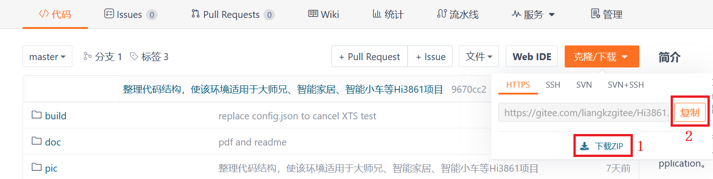
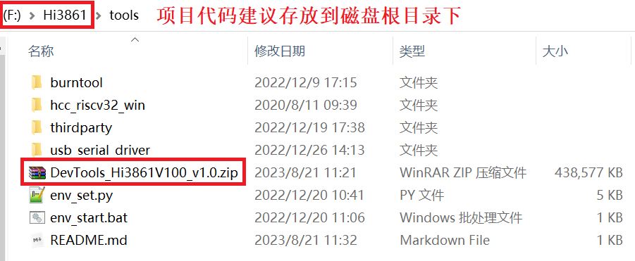
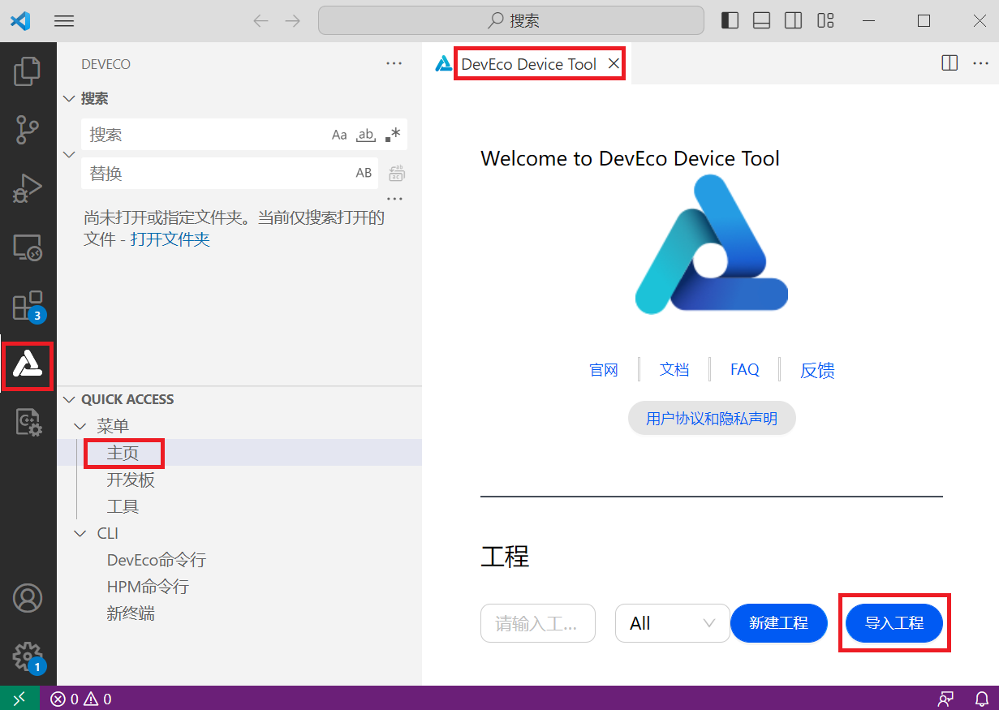
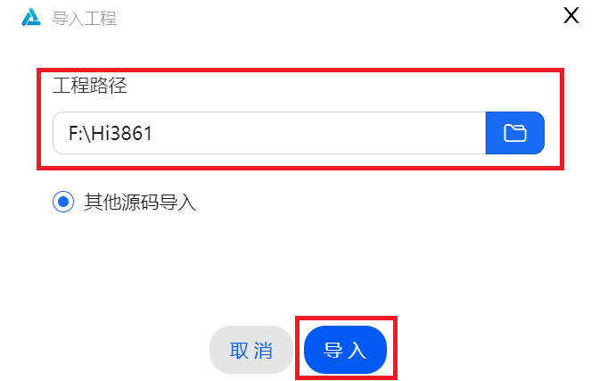
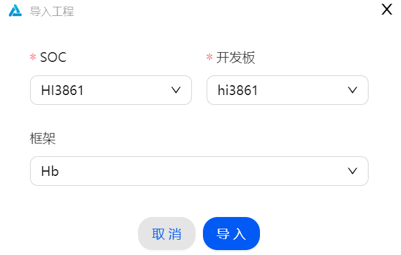
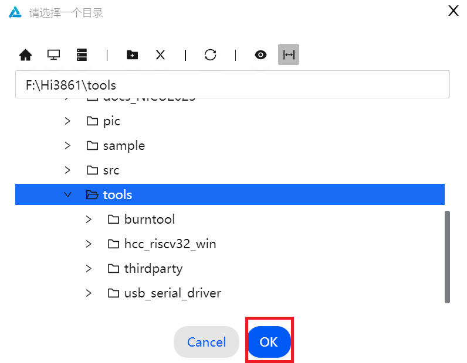
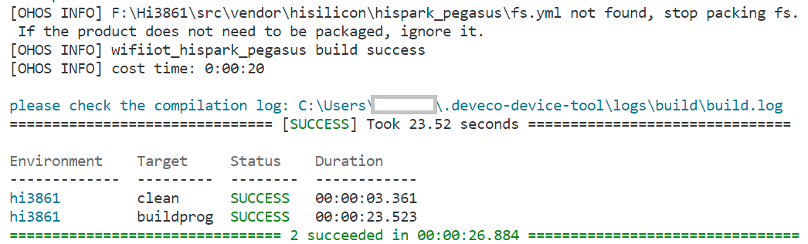
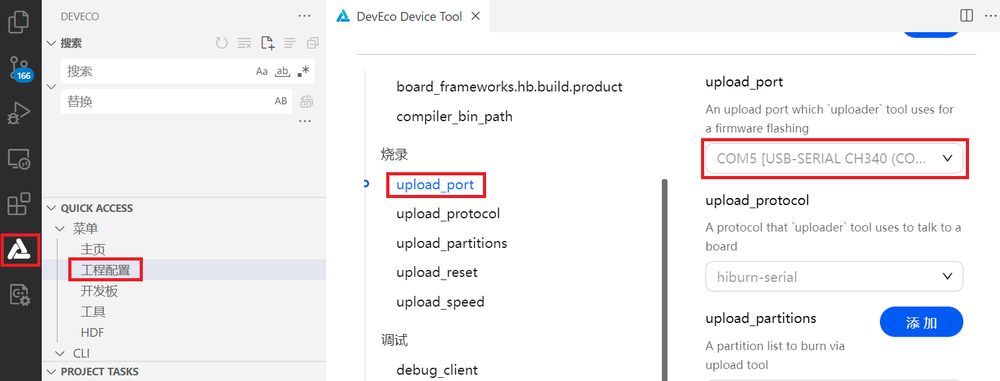
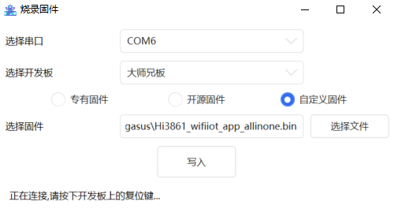

# OpenHarmony Mini System Projects(Hi3861)

## 项目简介

[OpenHarmony](https://gitee.com/openharmony)是由[开放原子开源基金会](https://www.openatom.cn/)（OpenAtom Foundation）孵化及运营的[开源项目](https://gitee.com/openharmony)，目标是面向全场景、全连接、全智能时代，基于开源的方式，搭建一个智能终端设备操作系统的框架和平台，促进万物互联产业的繁荣发展。

目前，OpenHarmony从系统复杂程度的维度（由简单到复杂）可以分成三类系统：**轻量系统（Mini System）**、小型系统（Small System）和标准系统（Standard System）。其中，**轻量系统**面向基于**MCU类处理器**（如Arm Cortex-M、RISC-V 32等）的设备，硬件资源极其有限，支持设备最小内存为128KB，提供多种轻量级的网络协议、轻量级的图形框架，以及丰富的IOT总线读写组件等。轻量系统可支撑的产品包括智能家居领域的连接类模组、传感器设备、穿戴类设备等。（本仓库不涉及小型系统和标准系统的相关内容，与其相关的资料请查阅OpenHarmony官网进行了解。）

OpenHarmony轻量系统已经适配到多款不同架构的芯片上，其中，海思Hi3861V100芯片平台结合OpenHarmony轻量系统的相关产品（包含开发板），是OpenHarmony社区中比较典型的实践例子，相关的学习资源和开发资料也非常丰富，非常适合新手入门学习和了解OpenHarmony系统的开发技术，例如润和软件基于Hi3861和OpenHarmony轻量系统推出的[几个开源项目](https://gitee.com/hihope_iot)（[开源大师兄套件](https://gitee.com/Open-Brother)、[智能家居套件](https://gitee.com/hihope_iot/HiHope_Pegasus_Doc)、[智能小车套件](https://gitee.com/hihope_iot/hispark-pegasus-smart-car)）。

基于海思Hi3861V100芯片平台的OpenHarmony轻量系统项目，支持Linux环境下和Windows环境下的开发（包括代码编辑和固件编译），但仅支持Windows环境下的固件烧录。本仓库代码以及文档，基于[<物联网技术及应用>课程代码仓库](https://gitee.com/HiSpark/hi3861_hdu_iot_application)，针对开源大师兄、智能家居、智能小车等项目做针对性地适配和说明，是在Windows环境下实现OpenHarmony轻量系统相关学习和开发的比较合适的环境。


## 搭建基础开发环境

### 1. 获取OpenHarmony基础代码

这是必需的OpenHarmony轻量系统的基础代码（基于OpenHarmony的v3.0.x-LTS分支代码），可以通过以下两种方法获取：

#### **方法一：直接获取代码压缩包到本地解压**

登录到Gitee的以下主页（即Hi3861BaseCode仓库）：

https://gitee.com/liangkzgitee/Hi3861

在如下图的“**克隆/下载**”下拉菜单中选择“**下载ZIP**”，下载源代码压缩包“**Hi3861-master.zip**”到本地。



将压缩包 “**Hi3861-master.zip**” 解压到Windows系统下某磁盘的根目录下，并将文件夹改名为”**Hi3861**“。

**注意**：因为windows自身的限制，文件路径不能超过260个字符，路径过长有可能会导致编译失败：**会提示`account_related_group_manager_mock.c: No such file or directory`之类报错信息**。所以建议将这份基础代码放在磁盘根目录下并将文件夹改名为较短的“Hi3861”即可。

#### **方法二：通过Git工具获取代码到本地**

> 注意：这种方法获取代码，需要先在Windows系统中安装git工具，并配置好码云开发者账号信息、设置码云SSH公钥，具体操作步骤请参考码云的帮助文档信息进行操作。
>

登录到Gitee的以下主页（即Hi3861BaseCode仓库）：

https://gitee.com/liangkzgitee/Hi3861

在如上图的“**克隆/下载**”下拉菜单中选择“**复制**”，复制代码仓库的地址（https://gitee.com/liangkzgitee/Hi3861.git），然后：

1. 在Windows中打开命令行工具，切换路径到某个磁盘根目录下（如 X:\\>）。

   **注意**：请尽量在磁盘根目录下获取该基础代码，因为windows自身的限制，路径不能超过260个字符，路径过长有可能会导致编译失败：**会提示`account_related_group_manager_mock.c: No such file or directory`之类报错信息**，如果出现这个编译失败的提示信息，请减短基础代码存放的路径长度后再试。

2. 在磁盘根目录下执行以下命令获取OpenHarmony基础代码：

   > git clone https://gitee.com/liangkzgitee/Hi3861.git


下载代码后，可在当前磁盘下获得“Hi3861”目录，其中便是完整的基础代码。

### 2. 获取编译工具链

下载Hi3861V100编译工具链：

 [https://hispark-obs.obs.cn-east-3.myhuaweicloud.com/DevTools_Hi3861V100_v1.0.zip](https://hispark-obs.obs.cn-east-3.myhuaweicloud.com/DevTools_Hi3861V100_v1.0.zip)

将该压缩包复制到上面一步下载的OpenHarmony基础代码的 “Hi3861\tools\” 目录下，直接解压出来，结果如下图所示：



解压完成后即可删除或移除“DevTools_Hi3861V100_v1.0.zip”压缩包，以节省磁盘存储空间。

### 3. 命令行下编译OpenHarmony基础代码生成固件

在“Hi3861\”目录下双击运行“Hi3861_BuildEntry.bat”脚本，首次运行该脚本时会先执行env_set.py脚本检查并自动安装必需的依赖工具，如pip、ohos-build、SCons等，自动安装完成后会进入如下的命令行提示符，此时可以输入“**hb set**” 命令：


在 “Input code path:” 处**输入英文状态下的句点 “.”**，接下来会默认选中 “wifiiot_hispark_pegasus”，**此时敲入回车键即可**。

执行完“hb set”命令后，会在 src\目录下生成一个“ohos_config.json”文件，该文件记录了当前编译的“wifiiot_hispark_pegasus”项目的基本信息。

再在新出现的命令行提示符中输入 “**hb build -f**” 命令，即可开始全编译OpenHarmony系统固件。


如果编译中出现异常，则请根据提示排查异常后，再次执行“**hb build -f**”命令进行编译。

编译成功会提示：

> [OHOS INFO] wifiiot_hispark_pegasus build success
>         [OHOS INFO] cost time: 0:00:28

最终编译生成的可烧录固件就是：

> Hi3861\src\out\hispark_pegasus\wifiiot_hispark_pegasus\Hi3861_wifiiot_app_allinone.bin

该固件可烧录到基于Hi3861V100芯片方案的OpenHarmony产品。

### 4. 使用 IDE 编译OpenHarmony基础代码生成固件

OpenHarmony提供了一个IDE（**DevEco Device Tool** 当前最新为4.0 Release版本）可以方便开发者阅读和编辑代码、编译和烧录固件。请参考以下步骤在 IDE 中导入工程后进行编译固件和烧录固件等操作。

   1. 下载并安装Windows版本的HUAWEI DevEco Device Tool(devicetool-windows-tool-x.x.x.xxx.zip)：https://device.harmonyos.com/cn/develop/ide#download

      安装过程中，会自动检测Windows环境中是否有符合版本需要的Python（建议自动安装即可，若手动安装，则建议安装3.7~3.9版本即可，3.10或更高版本会有兼容性问题）和VS Code软件（建议自动安装即可）。

   2. 导入SDK:  如下图所示，先打开已安装DevEco Decive Tool插件的VS Code, 在DevEco Device Tool标签的“主页”中，点击"**导入工程**", 在弹窗中选择SDK代码目录（X:\Hi3861）, 点击“导入”.

      

      

   3. 后续弹窗"SOC"选择"HI3861", 开发板选择"hi3861", 点击"导入".

      

      成功导入工程后，会在Hi3861目录下自动生成  .deveco 和 .vscode 两个文件夹， .deveco 文件夹中有关于工程的配置信息。

   4. 配置编译工具链路径: 点击左侧的“工程配置”, 在右侧窗口找到“compiler_bin_path”, 选择到前面步骤下载的开发工具路径, 选择`env_set.py`文件所在的目录层级，如下图所示，点击OK即可.

      

   5. 编译: 点击左侧“Build”或“Rebuild”，开始一建编译系统固件.

      

   6. 烧录:  如电脑未安装CH340G驱动, 先安装 Hi3861\tools\usb_serial_driver 路径下的CH341SER.EXE串口驱动. 开发板连接电脑后，电脑自动识别到对应的串口设备（如下图中的COM5）, 点击IDE左侧的“工程配置”, 找到“upload_port”选项, 选择开发板对应的串口. 

      

   7. 点击左侧的“Uploade”按键，然后根据终端的提示按一下开发板的复位键, IDE的右下角的终端会显示烧录进入。

   8. 烧录完成后，再按一下开发板的复位键，OpenHarmony系统就在开发板上运行起来了，IDE的右下角的终端会显示. :thumbsup:

具体的IDE使用详情，请参考本文档同目录下的 “README_hdu_origin.md” 文档的 “Windows IDE环境搭建”部分的说明进行操作即可。

## 获取具体项目的源代码

**注意：以下几步是获取具体项目的相关源代码。**

### 大师兄项目可选的PZstudio代码

获取OpenHarmony基础代码之后，命令行切换路径到 Hi3861\src\applications\sample\OpenBrother\ 目录下，再执行如下命令获取pzstudio代码：

> git clone https://gitee.com/Open-Brother/pzstudio.git

### 大师兄项目可选的工厂测试代码

获取OpenHarmony基础代码之后，命令行切换路径到 Hi3861\src\applications\sample\OpenBrother\ 目录下，再执行如下命令获取开源大师兄工厂测试代码：

> git clone https://gitee.com/liangkzgitee/TestFwk.git

### 大师兄项目可选的PzCar项目代码

获取OpenHarmony基础代码之后，命令行切换路径到 Hi3861\src\applications\sample\OpenBrother\ 目录下，再执行如下命令获取开源大师兄PzCar项目代码：

> git clone https://gitee.com/liangkzgitee/PzCar.git

### 智能家居项目的示例代码

智能家居套件的示例代码已经默认下载到 Hi3861\src\vendor\hihope\hispark_pegasus\demo 目录下，而以下路径下的示例程序，也可参考着使用：

> Hi3861\src\vendor\bearpi\bearpi_hm_nano\demo
>
> Hi3861\src\vendor\hisilicon\hispark_M1\demo
>
> Hi3861\src\vendor\hisilicon\hispark_pegasus\demo\
>
> Hi3861\src\vendor\hqyj\fs_hi3861\demo

在编译智能家居项目相关的示例程序时，只需要修改 Hi3861\src\applications\sample\WiFi_IOT\BUILD.gn文件，增加新的编译目标，指向具体的示例程序即可。

> **注意：**
>
> 本仓库的 src\applications\sample\BUILD.gn 文件已经默认打开了 "wifi-iot:app" 编译目标，同时src\applications\sample\wifi-iot\BUILD.gn 文件已经默认打开了：
>
>     "app:app",
>     "//vendor/hihope/hispark_pegasus/demo:demo",
>  这两个编译目标，这意味着 src\vendor\hisilicon\hispark_pegasus\demo\ 目录下的demo已经纳入编译系统中，这时候你需要编译哪个demo，就修改一下 src\vendor\hisilicon\hispark_pegasus\demo\BUILD.gn 文件，打开对应 demo（删除该demo前面的 # ），再去重新编译（执行 hb build -f）出镜像即可。

### 智能小车项目的控制代码

获取OpenHarmony基础代码之后，命令行切换路径到 Hi3861\src\applications\sample\SmartCar\ 目录下，再执行如下命令获取智能小车项目的控制代码：

> git clone https://gitee.com/hihope_iot/hispark-pegasus-smart-car.git


## 修改编译脚本

在获取上述的必需代码和可选代码之后，用文本编辑器打开 Hi3861\src\applications\sample\BUILD.gn 文件，根据当前实际需要编译的项目来打开对应的编译目标，如下：

```
lite_component("app") {
#    "OpenBrother:app",  # 编译开源大师兄的固件，打开这个编译目标
#    "SmartCar:app",     # 编译智能小车套件固件，打开这个编译目标
#    "WiFi_IOT:app",     # 编译智能家居套件固件，打开这个编译目标
  ]
}
```

比如打开编译开源大师兄的固件的编译目标后，可以再进入 OpenBrother 子目录，打开其中的BUILD.gn文件，进一步打开要编译的目标，如下：

```
lite_component("app") {
  features = [       # 注意：下面两个编译目标同时打开会提示编译异常
#   "TestFwk:app",   # 编译开源大师兄的工厂测试固件，打开这个编译目标
    "pzstudio:app",  # 编译开源大师兄的出厂固件(带Python功能)，打开这个编译目标
#   "PzCar:pzcar_demo",  # 编译开源大师兄的PzCar项目固件，打开这个编译目标
  ]
}
```

如果当前编译的是智能家居或者智能小车的固件，则可以分别进入WiFi_IOT子目录或SmartCar子目录去编辑对应的BUILD.gn文件，实现对更细粒度的编译目标的开关。

> **注意：**
>
> 本仓库的 src\applications\sample\BUILD.gn 文件已经默认打开了 "wifi-iot:app" 编译目标，同时src\applications\sample\wifi-iot\BUILD.gn 文件已经默认打开了：
>
>     "app:app",
>     "//vendor/hihope/hispark_pegasus/demo:demo",
>
>  这两个编译目标，这意味着 src\vendor\hisilicon\hispark_pegasus\demo\ 目录下的demo已经纳入编译系统中，这时候你需要编译哪个demo，就修改一下 src\vendor\hisilicon\hispark_pegasus\demo\BUILD.gn 文件，打开对应 demo（删除该demo前面的 # ），再去重新编译（执行 hb build -f）出镜像即可。

## 修改功能模块的开关

基于海思Hi3861V100芯片平台的OpenHarmony轻量系统项目，会根据实际项目的需要打开或者关闭系统提供的一些功能模块，比如I2C功能、SPI功能、UART功能等，这时候需要根据实际需要来修改如下文件：

> Hi3861\src\device\hisilicon\hispark_pegasus\sdk_liteos\build\config\usr_config.mk

**注意**：同路径下的sdk.mk文件的配置，也可以根据实际需要来修改配置，但无特别需要一般不改。

对usr_config.mk文件经常用到功能模块的修改如下：

```
#
# BSP Settings
#
CONFIG_I2C_SUPPORT=y
# CONFIG_I2S_SUPPORT is not set
CONFIG_SPI_SUPPORT=y
# CONFIG_DMA_SUPPORT is not set
# CONFIG_SDIO_SUPPORT is not set
# CONFIG_SPI_DMA_SUPPORT is not set
# CONFIG_UART_DMA_SUPPORT is not set
CONFIG_PWM_SUPPORT=y
# CONFIG_PWM_HOLD_AFTER_REBOOT is not set
CONFIG_AT_SUPPORT=y
CONFIG_FILE_SYSTEM_SUPPORT=y
CONFIG_UART0_SUPPORT=y
CONFIG_UART1_SUPPORT=y
CONFIG_UART2_SUPPORT=y
# end of BSP Settings
```

如果未打开对应模块的支持开关，编译时可能会报一些接口未定义的异常。

## 编译具体项目的固件

 在前面提到的 Hi3861\src\applications\sample\BUILD.gn 编译脚本中，如果三个项目都注释掉的话，默认编译OpenHarmony轻量系统的基础代码；如果打开任意项目，则在编译基础代码的基础上，再增加编译对应项目的目标。

不管是否编译具体项目，它们的编译步骤、生成的可烧录固件的路径和名字，都是一样的。

编译烧录固件，支持命令行编译固件和IDE中的一建编译。

### 方法一：命令行编译烧录固件

完成上面的工具链配置和代码获取后，即可开始直接在命令行下编译烧录固件。

请参考 “搭建基础开发环境”小节中的 “命令行下编译OpenHarmony基础代码生成固件” 的说明进行操作和编译即可。

### 方法二：IDE一键编译烧录固件

请参考 “搭建基础开发环境”小节中的 “使用IDE编译OpenHarmony基础代码生成固件” 的说明进行操作和编译即可。

## 开源大师兄项目

开源大师兄项目提供了图形化的PZstudio开发工具。

### PZstudio工具的下载、安装和使用

PZstudio下载链接 [http://www.polygonzone.com/PZStudioInstaller.zip](https://gitee.com/link?target=http%3A%2F%2Fwww.polygonzone.com%2FPZStudioInstaller.zip)

PZstudio包含了大师兄开发板的API文档、例程、图形化编程、脚本下载、固件烧写功能。

下载并安装PZstudio后，上述所有功能都可在PZstudio界面中使用。

### PZstudio或HiBurn烧录固件

用PZstudio烧录开源大师兄固件，可以在PZstudio界面的“文件”中选择“烧写固件”，在弹出的对话框中选中连接到大师兄开发板上的COM口，开发板选择“大师兄板”，选择“自定义固件”，固件选择上面编译出来的固件：

> src\out\hispark_pegasus\wifiiot_hispark_pegasus\Hi3861_wifiiot_app_allinone.bin

然后点击“写入”，根据提示复位大师兄开发板即可烧写固件。



如果想要烧写回出厂固件，则请选择“专有固件”，选择默认的固件进行烧写即可。

在PZStudio的安装路径下的 ...\PZStudio\firmware\dsx\ 目录下，有出厂固件以及HiBurn.exe烧录工具，也可以使用这个HiBurn.exe工具来烧录大师兄开发板的固件，请按该目录下的Readme.docx文档进行操作和烧录即可。


## 智能家居项目

智能家居项目提供了大量的示例程序，方便开发者入门学习和验证OpenHarmony的技术架构以及设备开发相关技术。

## 智能小车项目

智能小车项目与智能家居项目类似，增加了一些新的传感器和外围设备的驱动开发和控制能力。