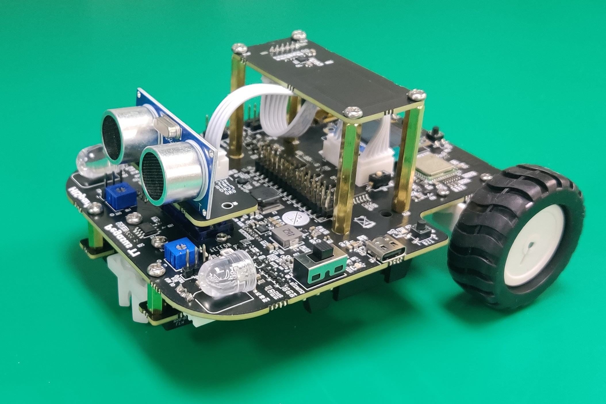
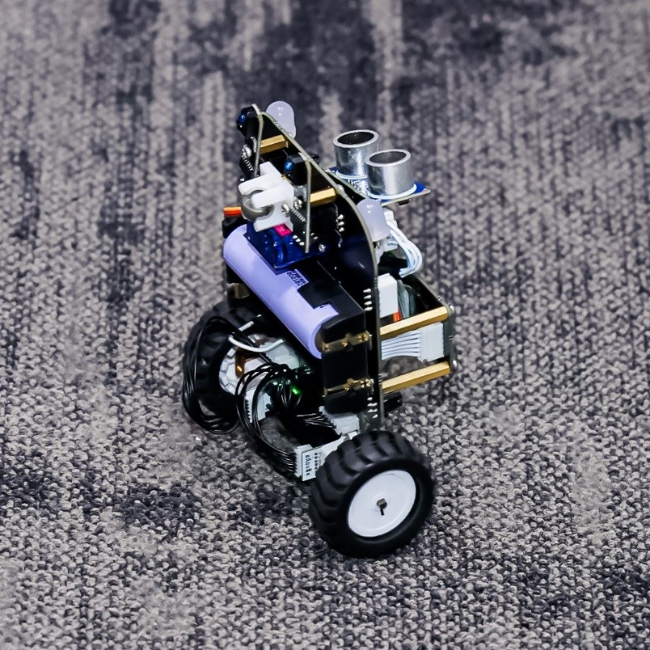
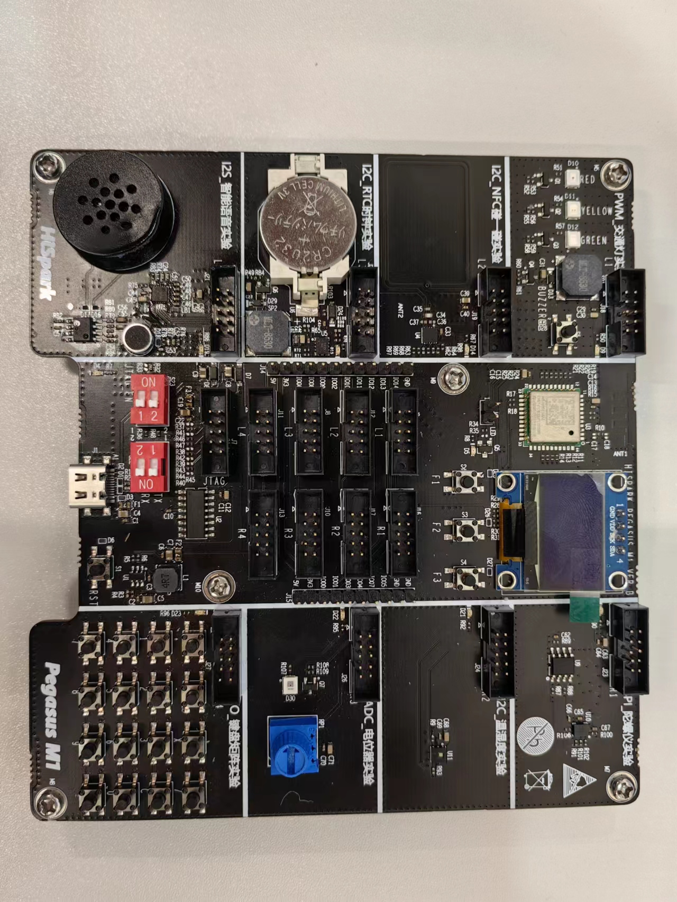
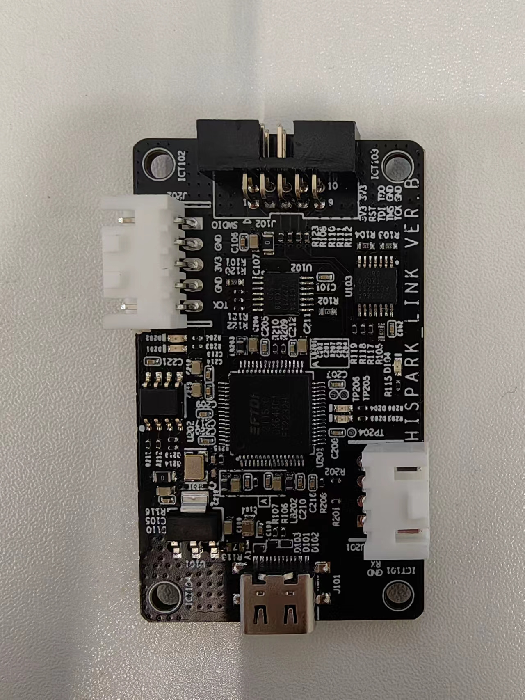
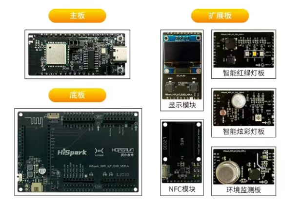
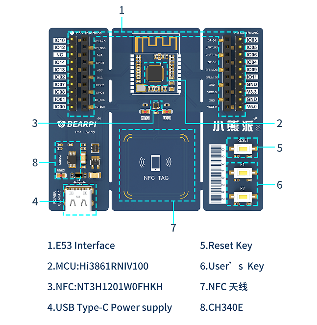
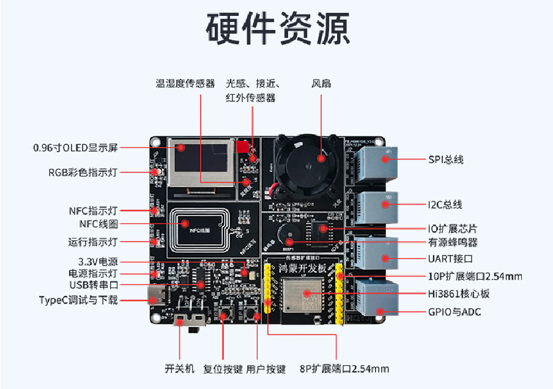

# Hi3861 OpenHarmony 嵌入式技术及应用

     


## 介绍

欢迎使用Hi3861V100开发OpenHarmony嵌入式应用.

**注意**：本开发环境源代码基于OpenHarmony-v3.0.x-LTS

## 硬件说明

这是一个嵌入式软件项目,你需要有一块Hi3861V100的开发板. 
如果你只是想使用这个项目的SDK开发应用,那么基本上任何一块基于Hi3861V100的开发板都是可以的. 
如果你需要运行Vendor目录下的Demo, 目前支持5种类型的开发板: 

- 上海海思 HiSpark T1
<div align=center>       </div>

- 上海海思 HiSpark M1
  
<div align=center>       </div>
  
- [润和 HiHope Pegasus](src/vendor/hihope/hispark_pegasus/Hihope-hispark_pegasus-十分钟上手.md)
<div align=center> </div>


- [小熊派 BearPI Nano](src/vendor/bearpi/bearpi_hm_nano/doc/BearPi-HM_Nano开发指导.md)
<div align=center> </div>

- [华清远见 FS-Hi3861](<src/vendor/hqyj/fs_hi3861/doc/华清远见 FS_Hi3861开发指导.md>)
<div align=center> </div>


## 快速上手

可以在Windows环境或"Windows+Linux虚拟机"环境下使用本项目的代码.

### Windows IDE环境搭建

如果在Windows下搭建编译开发环境（目前提供两种编译方式，第一种新建工程，第二种导入工程，任选其一即可实现Hi3861V100编译）, 我们推荐Windows 10 64位系统或以上版本, 简要步骤如下(详细内容参考doc目录下<物联网技术及应用实验指导手册>):
#### 新建工程
1. 下载并安装Windows版本的HUAWEI DevEco Device Tool(devicetool-windows-tool-3.1.0.500.zip)：https://device.harmonyos.com/cn/develop/ide#download

2. 新建工程: 打开已安装DevEco Decive Tool插件的VSCode, 在DevEco Device Tool主页点击"导入工程", 弹窗中选择SDK代码目录, 点击“新建工程”.

3. 后续弹窗"SOC"选择"HI3861", 开发板选择"hi3861", 工程名选择"用户自定义"，工程路径选择”用户自定义“，SDK显示”hi3861_hdu_iot@1.0.0(uninstalled)“,点击"下载".
> **注意：由于windows自身限制，路径不能超过260个字符，在git下载和解压Hi3861 SDK代码时尽量放在磁盘根目录下，防止导致的编译错误问题**
4. 编译: 点击左侧“build”.

5. 烧录: 硬件连接电脑, 如电脑未安装CH340G驱动, 先安装DevTools_Hi3861V100_v1.0/usb_serial_driver路径下的CH341SER.EXE串口驱动. 然后点击左侧“工程配置”, 找到“upload_port”选项, 选择开发板对应的烧录串口进行烧录. 

6. 按一下复位键, 现在, 你的第一个OpenHarmony程序已经在你的开发板上运行起来了. :thumbsup:
#### 导入工程
   1. 下载并解压Hi3861V100编译工具链：
      https://hispark.obs.cn-east-3.myhuaweicloud.com/DevTools_Hi3861V100_v1.0.zip

   2. 拉取本项目的SDK代码到本地：

      ```bash
      git clone https://gitee.com/HiSpark/hi3861_hdu_iot_application.git
      ```

      > **注意：由于windows自身限制，路径不能超过260个字符，在git下载和解压Hi3861 SDK代码时尽量放在磁盘根目录下，防止导致的编译错误问题**

   3. 下载并安装Windows版本的HUAWEI DevEco Device Tool(devicetool-windows-tool-3.1.0.500.zip)：https://device.harmonyos.com/cn/develop/ide#download

   4. 导入SDK: 打开已安装DevEco Decive Tool插件的VSCode, 在DevEco Device Tool主页点击"导入工程", 弹窗中选择SDK代码目录, 点击“导入”.

   5. 后续弹窗"SOC"选择"HI3861", 开发板选择"hi3861", 点击"导入".

   6. 配置编译工具链路径: 点击左侧的“工程配置”, 在右侧窗口找到“compiler_bin_path”, 选择到之前下载的开发工具路径, 选择`env_set.py`文件所在的目录层级.

   7. 编译: 点击左侧“build”.

   8. 烧录: 硬件连接电脑, 如电脑未安装CH340G驱动, 先安装DevTools_Hi3861V100_v1.0/usb_serial_driver路径下的CH341SER.EXE串口驱动. 然后点击左侧“工程配置”, 找到“upload_port”选项, 选择开发板对应的烧录串口进行烧录. 

   9. 按一下复位键, 现在, 你的第一个OpenHarmony程序已经在你的开发板上运行起来了. :thumbsup:

### Windows命令行编译环境搭建

为了方便习惯命令行编译的开发者使用, 我们同时也支持在Windows命令行环境编译方式:
前两步操作与IDE环境搭建方式相同, 即下载并解压Hi3861V100编译工具链和拉取SDK代码到本地. 然后:
1. 进入DevTools_Hi3861V100_v1.0.zip解压后目录, 双击运行`env_start.bat`, 则将在完成首次配置后, 进入一个转为编译Hi3861V100而配置的命令行环境;
2. 在命令行窗口中切换到SDK所在的src目录:
    ```
    [DevTools] D:\DevTools_Hi3861V100_v1.0>cd d:\hi3861_hdu_iot_application\src
    ```
3. 执行命令 `hb set`, 直接回车选择当前缺省选项, 执行命令`hb build`:
    ```
    [DevTools] D:\hi3861_hdu_iot_application\src>hb set
    [DevTools] D:\hi3861_hdu_iot_application\src>hb build
    ```
    即完成编译. 
    
    > **如有提示`account_related_group_manager_mock.c: No such file or directory`之类报错信息, 是Windows系统文件路径不能超过260字符的限制所致, 请尝试将SDK代码仓放置于较浅层的磁盘目录下重新尝试**
4. 编译后镜像文件位于 out/hispark_pegasus/wifiiot_hispark_pegasus/Hi3861_wifiiot_app_allinone.bin, 使用DevTools_Hi3861V100_v1.0/burntool/BurnTool.exe完成烧录. (如果缺少USB转串口驱动, 则执行usb_serial_driver\CH341SER.EXE安装)

### Linux环境搭建

如果在Linux下搭建编译开发环境, 我们推荐的虚拟机系统配置为VirtualBox 6.0 + Ubuntu20.04, 推荐虚拟机内存2G以上, 虚拟机硬盘20G以上. 你可以通过搜索学习相关的网络文章实现安装虚拟机Linux.

我们推荐使用两块虚拟机网卡, 一块设置成NAT方式, 用于虚拟机连接外部网络, 一块使用Host Only模式, 用于宿主机连接虚拟机, 这样你会遇到最少的问题.

装好虚拟机Linux后, 你可以参考doc目录下的教程手动安装所需的Linux软件, 搭建所有的软件编译环境. 如果你觉得自己从头搭建环境对你来说太复杂, 或者担心新装软件会与原本系统里的一些软件冲突, 又或者你只是想小试一下OpenHarmony的开发体验, 或者你单纯就是懒的话!😶, 我们推荐你使用我们已经封装好的Docker, 因为它是如此的方便! 你只要按照以下的指导一步一步输入命令就可以:

1. 安装docker(如果你的Ubuntu系统没有docker的话)

   ```bash
   sudo apt install docker.io -y
   ```

   或者

   ```bash
   curl -fsSL https://get.docker.com | bash -s docker --mirror Aliyun
   ```

2. 拉取我们封装好的Docker镜像到本地

   ```bash
   docker pull hispark/hi3861_hdu_iot_application:1.0
   ```

3. 新建一个容器命名为openharmony, 映射你的用户目录~到容器内目录/home/hispark, 同时把容器端口22映射为外部端口2222

   ```bash
   docker run -itd -p 2222:22 -v ~/code:/home/hispark --name openharmony hispark/hi3861_hdu_iot_application:1.0
   ```

4. 进入容器

   ```bash
   docker exec -it openharmony /bin/bash
   ```
   >  现在你已经有了一个专门用来编译代码的Docker容器环境了. 你每次可以在虚拟机linux中执行命令行`docker exec -it openharmony /bin/bash`进入这个Docker容器环境, 也可以在Windows中通过ssh软件(推荐MobaXTerm)连接虚拟机的2222端口进入(账户名root, 密码123456)

5. 进入目录拉取代码
    通过命令行或ssh进入容器内部环境中, 执行
    ```
    cd /home/hispark
    git clone https://gitee.com/HiSpark/hi3861_hdu_iot_application.git
    ```
    > **我们建议你把所有代码工作都保存在/home/hispark这个映射目录中, 这是因为Docker的容器环境是临时性的, 当Docker容器销毁时, 内部所有数据信息都会被删除而且无法恢复, 这就是为什么我们强烈建议你把代码工作保存在映射的用户目录中, 因为这里是你真实的用户存储空间, 不会随Docker容器销毁而消失.**

6. 编译: 进入src目录, 执行命令`hb set`, 回车两次, 配置OpenHarmony信息
    ```bash
    cd hi3861_hdu_iot_application/src
    hb set
    hb build -f
    ```

    > 编译完成后的固件镜像在src/out目录中. 编译后的镜像名为Hi3861_loader_signed.bin和Hi3861_wifiiot_app_burn.bin

7. 烧录: 编译后的镜像文件copy到Windows中(通过samba或ssh), 然后运行HiBurn([下载](https://ost.51cto.com/resource/29)), 将镜像下载到板上运行. 这里我还是推荐你用命令行的方式运行: 在Windows中建立这样一个脚本, 并命名为例如fast_burn.bat之类的名字, 复制以下内容, 并将大括号{}部分替换为你的实际信息, 修改并保存.

    ```bat
    @ fast_burn.bat
    copy
    \\{samba路径}\hi3861_hdu_iot_application\src\out\hispark_pegasus\wifiiot_hispark_
    pegasus\Hi3861_loader_signed.bin .
    copy
    \\{samba路径}\hi3861_hdu_iot_application\src\out\hispark_pegasus\wifiiot_hispark_
    pegasus\Hi3861_wifiiot_app_burn.bin .
    {HiBurn路径} -com:{串口端口号} -bin:Hi3861_wifiiot_app_burn.bin -signalbaud:2000000 -2ms -
    loader:Hi3861_loader_signed.bin
    ```
    
    比如, 我这里的虚拟机网卡IP是192.168.101.56, 我在Win10中通过samba去访问我的代码路径是\\192.168.101.56\share\code, hiburn存放在我电脑的d:\hispark\util目录下, 开发板接入我的电脑, 设备管理器里查看串口号为4, 所以我这里的fast_burn.bat是这样的

    ```bat
    @ fast_burn.bat
    copy
    \\192.168.101.56\share\code\hi3861_hdu_iot_application\src\out\hispark_pegasus\wifiiot_hispark_
    pegasus\Hi3861_loader_signed.bin .
    copy
    \\192.168.101.56\share\code\hi3861_hdu_iot_application\src\out\hispark_pegasus\wifiiot_hispark_
    pegasus\Hi3861_wifiiot_app_burn.bin .
    d:\hispark\util\hiburn.exe -com:4 -bin:Hi3861_wifiiot_app_burn.bin -signalbaud:2000000 -2ms -
    loader:Hi3861_loader_signed.bin
    ```
    假设上述一切顺利的话, 现在双击这个fast_burn.bat, 将会跳出一个命令行窗口, 并提示你按一下板子的复位按键. 按开发板的复位键后将会自动进入固件烧录过程, 烧录完毕后窗口会自动关闭.

1. 再按一下复位键, 现在, 你的第一个OpenHarmony程序已经在你的开发板上运行起来了. :thumbsup:


## Demo

### Hispark T1 
HiSpark T1提供了以下Demo供开发参考 ([下载pdf版本指导文档](doc/%E7%89%A9%E8%81%94%E7%BD%91%E6%8A%80%E6%9C%AF%E5%8F%8A%E5%BA%94%E7%94%A8%E5%AE%9E%E9%AA%8C%E6%8C%87%E5%AF%BC%E6%89%8B%E5%86%8C.pdf)) ：

| 例程名 | 功能  | 文档章节 |
| ---- | ---- | ---- |
| led_demo            | 红色LED闪亮                        | 3.1  |
| encoder_demo        | 编码器                             | 3.2  |
| tricolor_lamp_demo  | 小车大灯实现红、绿、蓝、白循环闪亮 | 3.3  |
| button_demo         | IO扩展芯片实现按键功能             | 3.4  |
| hcsr04_demo         | 超声波                             | 3.5  |
| motor_demo          | PWM马达转动                        | 3.6  |
| sg92r_demo          | 舵机90°、0°、-90°                  | 3.7  |
| cw2015_demo         | 电源管理芯片                       | 3.8  |
| rtc_demo            | 万年历                             | 3.8  |
| nfc_demo            | 手机与NFC通信                      | 3.9  |
| i2c_bus_demo        | I2C总线实验                        | 3.10 |
| lth1550_demo        | ADC实验模拟信号转为数字信号        | 3.11 |
| uart_demo           | 串口通信                           | 3.12 |
| wifi_demo           | WiFi热点创建和WiFi联网             | 3.13 |
| thread_demo         | 线程                               | 4.1  |
| semaphore_demo      | 信号量                             | 4.2  |
| timer_demo          | 定时器                             |4.3  |
| interrupt_demo      | 中断实验                           | 4.4  |
| ultrasonic_car_demo | 超声波避障小车                     | 5.1  |
| trace_demo          | 循迹小车                           |5.2  |
| trace_ex_demo       | IO扩展芯片实现循迹小车             | 5.2  |
| imu_square_demo     | 基于陀螺仪YAW角控制小车走正方形    | 5.3  |
| balance_car_demo    | 平衡车                             | 5.4  |
| histreaming_demo    | 手机控制小车                       | 5.5  |
| oc_demo             | 基于华为IoT云平台的智能小车实验    | 5.6  |

### Hispark M1 

HiSpark M1提供了以下Demo供开发参考 ([下载pdf版本指导文档)](src/vendor/hisilicon/hispark_M1/doc/微处理器实验指导手册.pdf) ：

| 例程名              | 功能                             | 文档章节 |
| ------------------- | -------------------------------- | -------- |
| helloworld_demo     | 屏幕显示helloword字样，LED灯闪烁 | 2.9      |
| interrupt_demo      | 中断实验                         | 4.1      |
| rotation_demo       | 无级调光                         | 4.2      |
| matrixkeyboard_demo | 矩阵键盘                         | 4.3      |
| rtc_demo            | 万年历                           | 4.4      |
| traffic_light_demo  | 交通灯                           | 4.5      |
| i2s_voice_demo      | 录音播放                         | 4.6      |
| nfc_demo            | 手机与NFC通信                    | 4.7      |
| spi_gyro_demo       | 显示航向角，俯仰角，滚动角       | 4.9      |
| environment_demo    | 监测温湿度                       | 4.8      |
| histreaming_demo    | 手机控制LED灯                    | 4.10     |

### HiHope Pegesus, BearPI Nano和华清远见FS-Hi3861

HiHope Pegesus, BearPI Nano, 华清远见Fs-Hi3861等Vendor的Demo, 请分别参阅
+ [Hihope Pegesus的参考文档](src/vendor/hihope/hispark_pegasus/Hihope-hispark_pegasus-十分钟上手.md)
+ [BearPI Nano的参考文档](src/vendor/bearpi/bearpi_hm_nano/doc/BearPi-HM_Nano开发指导.md)
+ [华清远见FS-Hi3861的参考文档](<src/vendor/hqyj/fs_hi3861/doc/华清远见 FS_Hi3861开发指导.md>)


## 问题与解答

如果你对项目中的代码或者文档存在疑问, 欢迎在Issues中提出你的问题(别忘了先在FAQ中看一看是否已经有答案了😎). 如果你自己解决了一个了不起的问题, 非常欢迎你把问题和解决方法发到Issues里, 如果你看到别人的问题而你正好有答案, 也欢迎你帮助解答其他人的问题, 所谓"授人玫瑰手有余香"嘛.


## 参与贡献

我们非常欢迎你能对这个项目提出代码上的改进或扩展, 方法是:
1.  Fork 本仓库
2.  下载到本地, 修改, 提交
3.  推送代码
4.  在页面点击 Pull Request

这样我们就能接到你的推送申请.


## 最后的话

OpenHarmony还是一个相当年轻的系统, 还在快速的发展中, 所以在这个过程中, 不可避免的你会遇到不少问题, 有些可能还是相当让人下头的那种:confounded:, 不过不要担心, 你可以多尝试几种方法去研究去解决, 也可以用搜索引擎搜索答案, 你当然也可以回到这里提出你的问题, 我们和其他小伙伴会尽力帮助你. 但最重要的是要记得: 所有那些让人仰望的技术大神, 其实都是从这样的阶段磨砺成长起来的. :rainbow:

最后的最后, 欢迎来到OpenHarmony的世界探险!


## 参考

- [HarmonyOS物联网开发课程](https://developer.huawei.com/consumer/cn/training/course/mooc/C101641968823265204?refresh=1669428623989)

