# 										物联网技术及应用实验指导手册

[TOC]


# 1、开发环境搭建

## 1.1 Windows下 IDE工具搭建（☆☆☆推荐使用）

### 1.1.1 工具介绍

HUAWEI DevEco Device Tool（以下简称DevEco Device Tool）是OpenHarmony面向智能设备开发者提供的一站式集成开发环境，支持OpenHarmony的组件按需定制，支持代码编辑、编译、烧录和调试等功能，支持C/C++语言，以插件的形式部署在Visual Studio Code上。

DevEco Device Tool采用Windows+Ubuntu混合开发环境，在Windows上主要进行代码开发、代码调试、镜像烧录等操作，在Ubuntu环境实现源码编译。其具有以下特点：

- 支持代码查找、代码高亮、代码自动补齐、代码输入提示、代码检查等，开发者可以轻松、高效编码。
- 支持丰富的芯片和开发板，包括基于华为海思芯片的Hi3516DV300/Hi3861V100/Hi3751V350/BearPi-HM Nano开发板，以及三方厂商的Neptune/RK3568/Bearpi-HM Micro开发板。
- 支持自动检测各芯片/开发板依赖的工具链是否完备，并提供一键下载和安装缺失工具链。
- 支持多人共享开发模式，采用基于Remote-SSH模式实现多人共享远程开发，实现一个团队公用一台服务器进行编译、烧录。
- 支持源码级调试能力，提供查看内存、变量、调用栈、寄存器、反汇编等调试信息。

DevEco Device Tool工具主要分为如下4个功能区域。

：基本功能区 ：DevEco Device Tool菜单栏，提供基本的工程创建、源码导入、工程配置等功能。

：开发板任务区：在工程界面，提供开发板相关操作任务，如源码的编译、镜像的烧录、Monitor串口工具等。

：代码编辑器：提供代码的查看、编写和调试等开发功能。

：输出控制区：提供日志打印、调试指令输入、命令行指令输入等。


### 1.1.2 DecEco Device Tool下载和安装
* 步骤一：下载devicetool-windows-tool-3.1.0.500.zip版，下载网址：https://device.harmonyos.com/cn/develop/ide#download

* 步骤二：解压DevEco Device Tool压缩包，双击安装包程序，点击"下一步"进行安装（如果之前有安装过，会弹出先卸载之前版本在安装，请按照要求先卸载）；

  

* 步骤三：设置DevEco Device Tool的安装路径，请注意安路径不能包含中文字符，同时建议不要安装到C盘目录，点击"下一步"。

  

* 步骤四：根据安装向导提示，安装依赖软件python以及vscode，显示OK后，点击安装。

  

* 步骤五：等待DevEco Device Tool安装向导自动安装DevEco Device Tool插件，直至安装完成，点击"完成",关闭DevEco Device Tool安装向导。

  

* 步骤六：打开Visual Studio Code，进入DevEco Decive Tool工具界面。

  

* 步骤七：下载简体中文语言包，用户可以在VSCode工具商店安装"chinese(Simplified)(简体中文)Language Pack for Visual Studio Code"插件，将VSCode设置为中文模式。

  
  

<font color='RedOrange'>**说明：Hi3861V100编译目前提供两种编译方式，分别为第1.1.3节“新建工程”和第1.1.4节“导入工程”，这两节只需要看其中一节学习Hi3861V100编译，编译成功后，可以学习第1.1.5节“代码烧录”完成开发板烧录。**</font>

### 1.1.3 新建工程

  •步骤一：打开VSCode，打开DevEco Device Tool主页，点击“新建工程”


  •步骤二：在新建弹窗中，**工程名**：“Hi3861_demo”（用户自定义），**SOC**：选择“HI3861”，**工程路**径：“D:\3861_workspace”（用户自定义）。**SDK栏**如果显示“hi3861_hdu_iot@1.0.0（Uninstalled）”，则点击“**下载**”按钮，SDK会自动下载。

> **注意：由于windows自身限制，路径不能超过260个字符，在下载时尽量放在磁盘根目录下，防止导致的编译错误问题**

  

  •步骤三：下载中如下所示。


  •步骤四：下载完成如下所示。


  •步骤五：点击“**确定**”按钮，会自动打开工程。

  

  •步骤六：点击“**build**”或者“**rebuild**”按钮进行编译。


  •步骤七：编译完成后，编译成功如下所示。


  •步骤八：编译成功后，**开发板烧录可以参考第1.1.5节“代码烧录”**。

### 1.1.4 导入工程

#### 1.1.4.1 SDK下载

* 步骤一：下载Hi3861 Openharmony SDK下载网址：https://gitee.com/HiSpark/hi3861_hdu_iot_application

  

  下载方式2种：

  * 方式一：直接在web页面上下载zip压缩包

    

  * 方式二：如果用户已经安装git工具（git工具安装和使用请自行百度），可以通过git clone命令下载，命令如下：
  
    ```
    git clone https://gitee.com/HiSpark/hi3861_hdu_iot_application.git
    ```

​               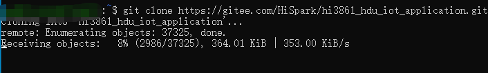

<font color='RedOrange'>**注意：由于windows自身限制，路径不能超过260个字符，在git下载和解压Hi3861 SDK代码时尽量放在D盘或者其他盘根目录下，防止导致的编译错误问题。**</font>

#### 1.1.4.2 开发工具下载

* 开发工具下载网址：https://hispark.obs.cn-east-3.myhuaweicloud.com/DevTools_Hi3861V100_v1.0.zip

  

* 下载完成后解压，解压完成后的文件目录结构如下所示：

  

#### 1.1.4.3 工程管理

* 步骤一：打开VSCode，打开DevEco Device Tool主页，点击“导入工程”

  

* 步骤二：在导入工程弹窗中选择Hi3861 SDK目录，点击“导入”。（如果采用zip包下载，SDK名称为hi3861_hdu_iot_application-master，如果采用git下载SDK名称为hi3861_hdu_iot_application，此处以采用zip下载为例）

  

* 步骤三：在后续导入工程弹窗，SOC栏选择Hi3861，开发板栏选择hi3861，框架栏选择hb，之后点击“导入”，等待导入成功即可。

  

  <font color='RedOrange'>**注意：如果待打开目录之前已成功导入，则再次导入时会导入失败，并提示“当前工程已经创建过，请直接导入”。**</font>

* 步骤四：代码导入成功后，即工程创建成功，之后可使用该IDE 实现代码开发、一键编译、一键烧写等功能。

  

* 步骤五：代码导入成功后，后续可在DevEco Device Tool工具主页直接打开已导入成功的工程。

  

#### 1.1.4.4 编译运行

* 步骤一：配置开发工具路径，点击左侧的“工程配置”，在右侧窗口找到“compiler_bin_path”，选择到之前下载的开发工具。

  

  <font color='RedOrange'>**注意工具目录层级，选择到最内层，例如下图”。**</font>

  

* 步骤二：配置完成后，点击左侧“build”，开始编译。

  
  
  初次编译会解压编译工具，时间较长。等待编译完成即可。
  
  

- 步骤三：编译成功后，**开发板烧录可以参考第1.1.5节“代码烧录”**。

### 1.1.5 代码烧录

#### 1.1.5.1 串口驱动安装

* 硬件如下图所示。

  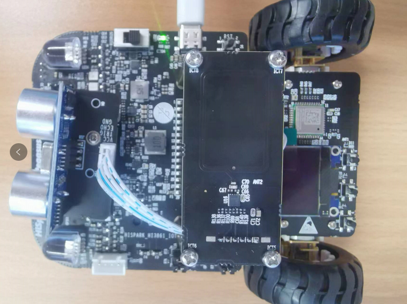

* 步骤一：先使用配套的Type-C数据线，将开发板与电脑的USB口进行直连，并且接开关拨到右侧，使开发板能够正常工作。如下图所示。

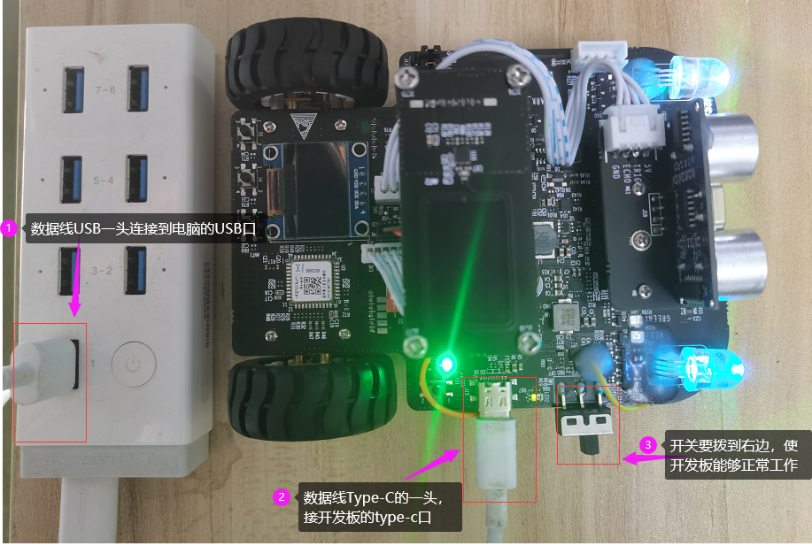

* 步骤二：安装CH340G驱动，打开DevTools_Hi3861V100_v1.0/usb_serial_driver文件夹。如果选择“**新建工程**”，则路径应该为：“D:\DevEco\resources\toolset\DevTools_Hi3861V100\1.0.0”；如果选择“导入工程”，则路径为：“F:\DevTools_Hi3861V100_v1.0”（具体路径用户在第1.1.4.2节“**开发工具下载**”自己自定义下载的路径）。


* 步骤三：双击CH341SER.EXE驱动，进入安装界面，点击安装按钮即可，驱动安装成功后，再点击确定按钮。

  

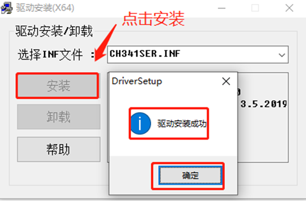

* 步骤四：打开Windows的设备管理器，查看串口设备，若未出现CH340串口设备，请检查驱动是否安装正常。

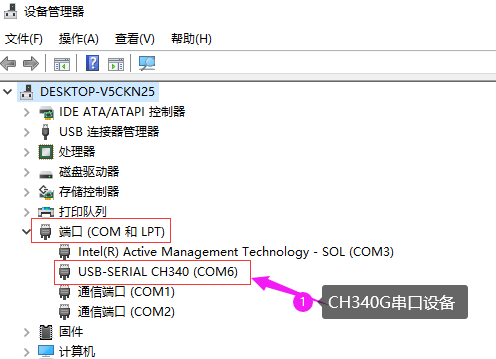

#### 1.1.5.2 串口烧录
* 步骤一：当前DevEco Device Tool工具支持Hi3861单板一键烧录功能。需要连接开发板，配置开发板对应的串口，在编译结束后，进行烧录。点击左侧“工程配置”，找到“upload_port”选项，选择开发板对应的烧录串口（<font color='RedOrange'>**注意：如果正在使用Monitor功能，请先“ctrl+c”关闭Monitor，才能正常烧，否则串口占用无法烧录成功**</font>）。

  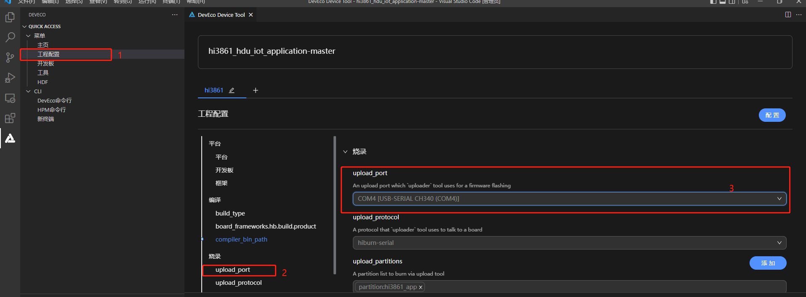

* 步骤二：点击左下角“upload”按键，等待提示（出现Connecting，please reset device...），手动进行开发板复位（按下开发板reset键）。

  

* 步骤三：等待烧录完成，大约30s左右，烧录成功。

  

#### 1.1.5.3 Monitor 串口打印

* 步骤一：烧录完成后，可以通过Monitor界面查看串口打印，配置Monitor串口，如下图所示。（<font color='RedOrange'>**注意：如果正在使用Monitor功能，请先“ctrl+c”关闭Monitor，才能正常烧录，否则串口占用无法烧录成功**</font>）

  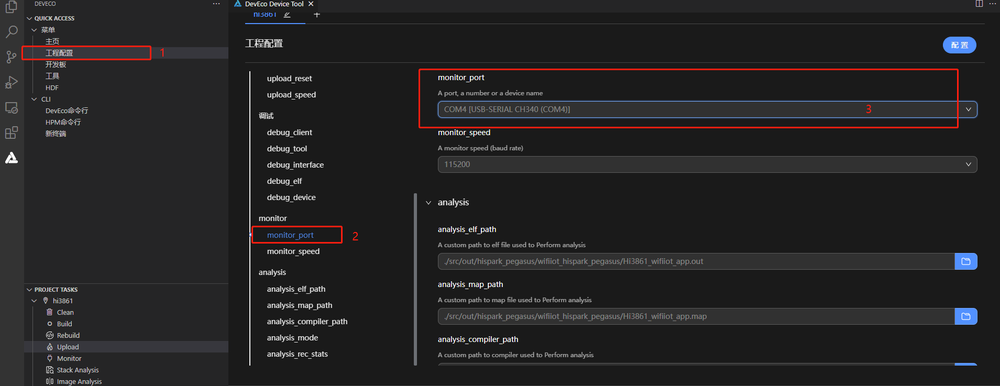

* 步骤二：配置完Monitor串口后，直接点击monitor按钮，复位开发板，查看板端打印信，可以看到“sdk ver:Hi3861V100R001C00SPC025 2020-09-03 18:10:00”等字样。

  

### 1.1.6 栈分析、镜像分析

​		DevEco Device Tool通过集成stack Analysis栈分析工具和Image Analysis镜像分析工具，用于开发过程中的内存不足、内存溢出等问题进行分析，帮助开发者更加精确的分析、分析问题。

* Stack Analysis栈分析工具是基于静态二进制分析手段，提供任务栈开销估算值和函数调用关系图示，为栈内存使用、分析、优化、问题定位等开发场景提供较为准确的静态内存分析数据参考。

  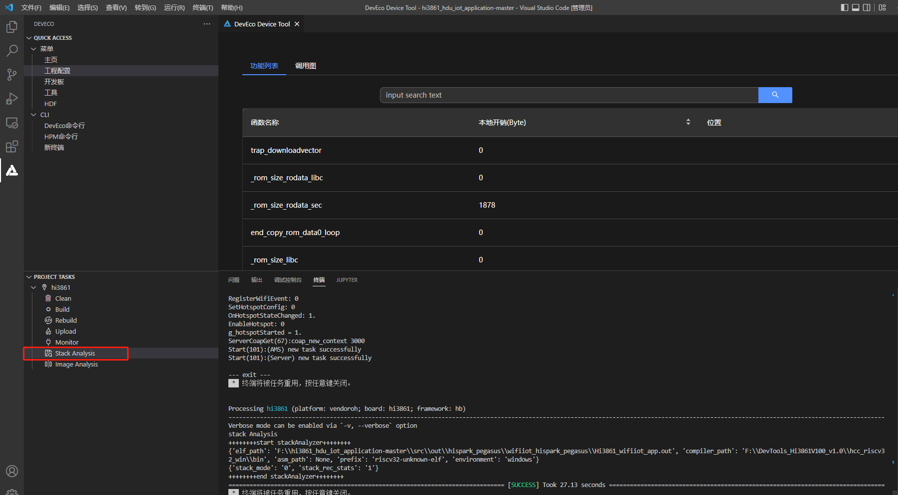

* Image Analysis镜像分析工具对工程构建出的elf文件进行内存占用分析，支持开发者快速评估内存段、符号表使用情况。

​	工程编译完成后，点击左下角“stack Analysis”，进行栈分析。

​    点击左下角“Image Analysis”，进行镜像分析。


## 1.2 Windows下命令行编译环境搭建

### 1.2.1 SDK下载

* 步骤一：下载Hi3861 Openharmony SDK下载网址：https://gitee.com/HiSpark/hi3861_hdu_iot_application

  

  下载方式2种：

  * 方式一：直接在web页面上下载zip压缩包

    

  * 方式二：如果用户已经安装git工具（git工具安装和使用请自行百度），可以通过git clone命令下载，命令如下：
  
    ```
    git clone https://gitee.com/HiSpark/hi3861_hdu_iot_application.git
    ```

​               

<font color='RedOrange'>**注意：由于windows自身限制，路径不能超过260个字符，在git下载和解压Hi3861 SDK代码时尽量放在D盘或者其他盘根目录下，防止导致的编译错误问题。**</font>

### 1.2.2 开发工具下载

* 开发工具下载网址：https://hispark.obs.cn-east-3.myhuaweicloud.com/DevTools_Hi3861V100_v1.0.zip

  

* 下载完成后解压，解压完成后的文件目录结构如下所示：

  
  

### 1.2.3 编译运行

* .步骤一：打开开发工具，进入如下目录，右键env_start.bat “以管理员身份运行”。

  

* 步骤二：等待运行完成，运行成功截图如下（<font color='RedOrange'>**注意：请不要关闭该命令行窗口，后续步骤都在此窗口下进行**</font>）。

  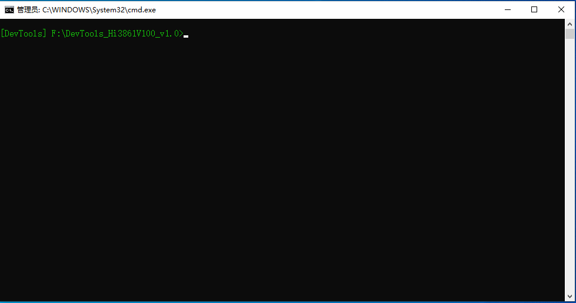

* 步骤三：通过命令行进入到../hi3861_hdu_iot_application-master/src目录（如果采用zip包下载，SDK名称为hi3861_hdu_iot_application-master，如果采用git下载SDK名称为hi3861_hdu_iot_application，此处以采用zip下载为例，命令行进入目录操作请自行百度；<font color='RedOrange'>**注意：请不要关闭该命令行窗口，后续步骤都在此窗口下进行**</font>）

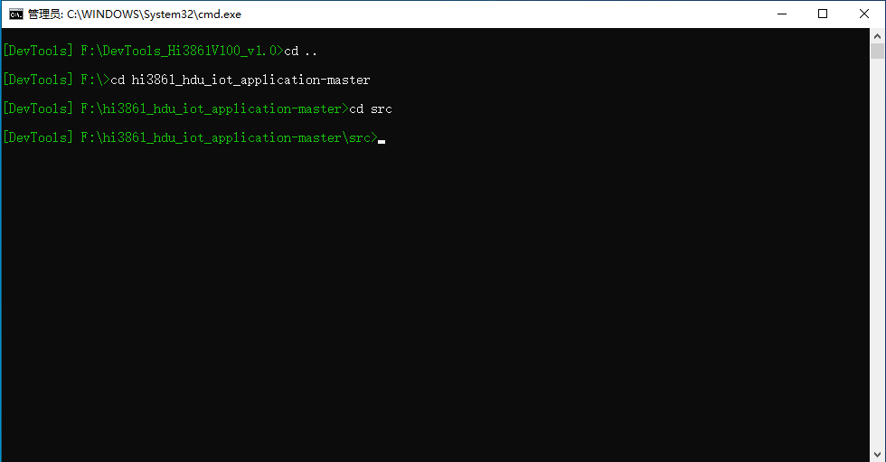

* 步骤四：进入src目录下后，输入指令“hb set”，连续敲两次“Enter”，input code path选择“wifiiot_hispark_pegasus”。


* 步骤五：input code path选择完成后，输入指令“hb build”：编译工程，“hb clean”:清除编译文件。

  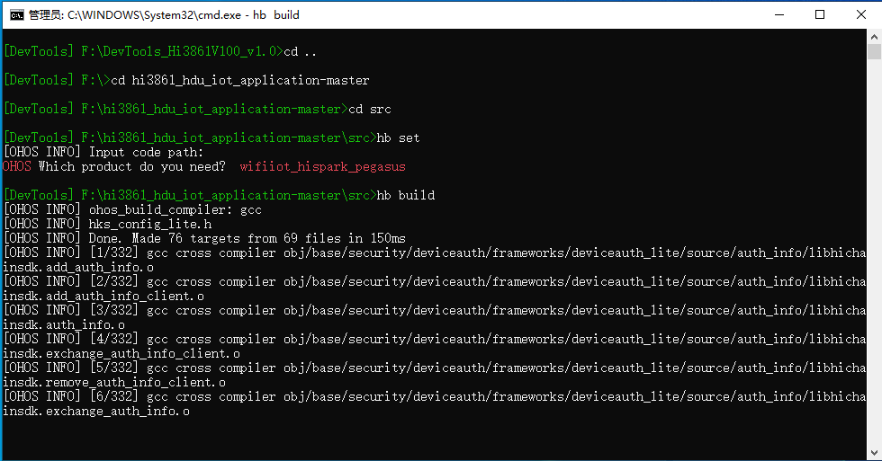

   初次编译会解压编译工具，时间较长。等待编译完成即可。
  
  

### 1.2.4 代码烧录
#### 1.2.4.1 串口驱动安装

* 硬件如下图所示。

  

* 步骤一：先使用配套的Type-C数据线，将开发板与电脑的USB口进行直连，并且接开关拨到右侧，使开发板能够正常工作。如下图所示。


* 步骤二：安装CH340G驱动，打开DevTools_Hi3861V100_v1.0/usb_serial_driver文件夹。


* 步骤三：双击CH341SER.EXE驱动，进入安装界面，点击安装按钮即可，驱动安装成功后，再点击确定按钮。

  


* 步骤四：打开Windows的设备管理器，查看串口设备，若未出现CH340串口设备，请检查驱动是否安装正常。


#### 1.2.4.2 串口烧录

* 步骤一：打开DevTools_Hi3861V100_v1.0/burntool文件夹，可以看到“BurnTool.exe”烧录工具

  

<font color='RedOrange'>**（注意：以下软件包仅用于教学，未经允许不得转发用于商业用途）**</font>

* 步骤二：

  * 双击打开BurnTool.exe烧录工具，点击**Refresh按钮**，使HiBurn能够识别到开发板的串口设备。

  * 点击**COM的下拉框**，选择与设备管理器一致的CH340的串口号，也就是与Hi3861连接的串口号。

  * 点击**Select file按钮**，选择刚在hi3861_hdu_iot_application-master/src/out中编译生成的Hi3861_wifiiot_app_allinone.bin镜像文件

  * 勾选**Auto burn**。


* 步骤三：烧录镜像到开发板，点击connect按钮，进行镜像的烧录，当出现Connecting...的时候，按一下<font color='RedOrange'>**开发板的RST键。**</font>

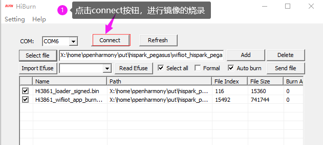

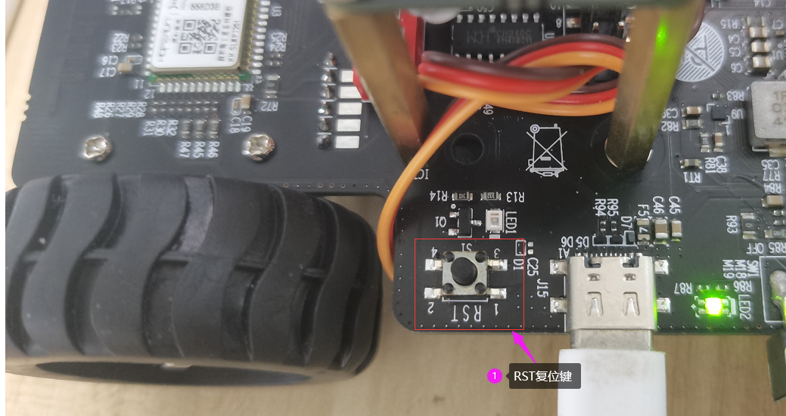

* 当出现下面的进度条，就说明正在进行镜像的烧录


* 当出现下面的打印信息，说明镜像已经烧录成功，然后<font color='RedOrange'>**再点击HiBurn的Disconnect按钮**</font>，与开发板断开连接。


#### 1.2.4.3 串口打印

* 步骤一：下载串口工具（串口工具请自行下载，这里不提供下载方式），这里以sscom串口工具为例

- 步骤二：使用SSCOM接收开发板的串口数据
  *  首先点击串口工具的刷新按钮，使串口工具能够识别到开发板的串口设备。
  * 点击端口号的下拉框，选择与设备管理器一致的COM口
  * 再点击打开串口按钮，开始接收开发板的串口数据。

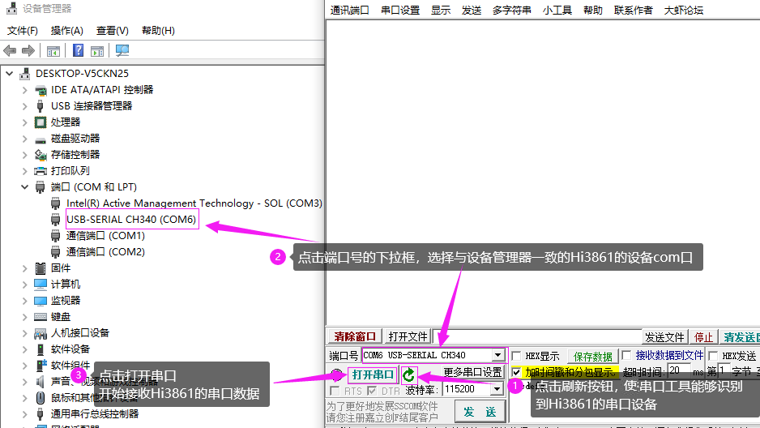

* 步骤三：按一下开发板的RST键，让开发板系统运行起来。


* 步骤四：通过串口工具可以看到 “sdk ver:Hi3861V100R001C00SPC025 2020-09-03 18:10:00”已经打印出来，说明开发板已经运行起来了。

  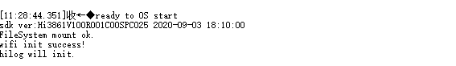

## 1.3 linux下编译环境搭建

### 1.3.1 软件获取

<font color='RedOrange'>**（注意：以下软件包仅用于教学，未经允许不得转发用于商业用途）**</font>

| 工具名称    | 用途说明                          | 版本要求   | 获取渠道                                                     |
| ----------- | --------------------------------- | ---------- | ------------------------------------------------------------ |
| VirtualBox  | Windows安装Ubuntu系统所需的虚拟机 | 6.1.36版本 | [VirtualBox下载链接](https://download.virtualbox.org/virtualbox/6.1.36/VirtualBox-6.1.36-152435-Win.exe) |
| Ubuntu20.04 | 编译环境所需的Linux系统           | 20.04.版本 | [Ubuntu20.04下载链接](https://releases.ubuntu.com/20.04/ubuntu-20.04.5-desktop-amd64.iso) |
| VScode      | 代码阅读和编辑所需的IDE工具       | 1.70.1版本 | [VScode下载链接](https://az764295.vo.msecnd.net/stable/6d9b74a70ca9c7733b29f0456fd8195364076dda/VSCodeUserSetup-x64-1.70.1.exe) |

### 1.3.2 VirtualBox的安装

- 双击在 **1.3.1 软件获取章节下载** 的VirtualBox-6.1.36-152435-Win.exe 安装包，点击下一步，安装VirtualBox。


- 点击浏览按钮，修改VirtualBox的安装路径，然后点击确定按钮，再点击下一步。


- 当出现下面的界面，点击下一步。


- 当出现下面的界面，点击是。


- 当出现下面的安装界面时，点击安装。


- 点击完成，即可完成VirtualBox的安装。


### 1.3.3 Ubuntu20.04的安装

#### 步骤1：导入Ubuntu20.04镜像到VirtualBox

- 打开VirtualBox，点击新建


- 修改虚拟机的名称为hispark，然后修改Ubuntu系统的安装文件夹，把典型配置为linux,然后版本选择 Ubuntu(64-bit)，然后再点击下一步。


- 修改Ubuntu的运行内存大小为4G，然后点击下一步。


- 选择现在创建虚拟硬盘，然后点击创建按钮。


- 选择VDI（VirtualBox磁盘映像），然后点击下一步。


- 选择动态分配，然后点击下一步。


- 修改磁盘空间大小为100GB，然后点击创建按钮。


- 点击设置按钮，选择常规选项，在高级选项处，把共享粘贴板和拖放都设置为双向，然后点击OK按钮。


- 点击VirtualBox的设置，然后点击系统，选择处理器，把处理器的数量改为4。
- 注意：如果您的处理器小于等于4个的话，请把处理器数量改小一些。


- 点击网络，选择网卡2，勾选启动网络连接，选择仅主机网络，点击OK。


- 点击设置按钮，选择存储，然后选择没有盘片，点击光盘按钮，点击选择虚拟盘。


- 选择 **1.1.2 软件获取章节下载**的Ubuntu20.04的镜像文件，然后点击打开按钮。


- 然后点击设置的OK按钮。


- 点击启动，启动Ubuntu系统


#### 步骤2：Ubuntu系统的安装

- 选择中文(简体)，然后点击安装Ubuntu。


- 如果您安装Ubuntu的时候和我一样，因为分辨率问题，导致界面显示不全，无法看到下面的按钮，您需要按住组合键 ``` Ctrl+Alt+t```打开终端面板，然后输入 ```xrandr -s 1920x1080``` 后敲回车，修改Ubuntu的分辨率。


- 选择Chinese，然后点击继续按钮。


- 将安装Ubuntu时下载更新的勾选去掉，然后点击继续按钮。


- 点击现在安装。


- 点击继续按钮。


- 选择上海，然后点击继续按钮。


- 设置好账号和密码，点击继续按钮，此处的账号和密码即为您Ubuntu的登录所需的账号和密码。
- 请按照本文的配置来，账号为：hispark，密码为：hispark。


- 开始安装各种软件。


- Ubuntu安装完成后，点击现在重启按钮。


- 当出现此类弹窗，点击跳过即可。若Ubuntu弹出是否更新的弹窗，点击取消即可。我们先暂时不更新。


- 点击virtualbox的设备，点击安装增强功能


- 当弹出 弹窗询问是否运行自启动软件时，点击取消。
- 此时左边任务栏会多出一个光盘一样的图标，点击并打开光盘图标，进入该文件夹内。


- 在光盘文件夹的空白处，鼠标右键，点击在终端打开。


- 执行下面的命令，进行增强功能的安装。

```
sudo apt-get install  gcc make perl -y

sudo ./VBoxLinuxAdditions.run
```


- 安装成功后，重启一下Ubuntu

#### 步骤3：更新软件

- 当Ubuntu重启之后，点击Ubuntu桌面左下角九个点图标，然后打开软件和更新图标。


- 点击Ubuntu软件，在**下载自**处点击下拉框，选择其他站点。


- 在**中国**下方选择**阿里云**，然后点击选择服务器。


- 此时弹出认证对话框，输入您的Ubuntu登录密码，本文为hispark。


- 点击关闭按钮，然后有对话框时，点击重新载入，此时会有一段时间的软件更新，耐心等待即可。


- 更新完成后，在Ubuntu的桌面，点击鼠标右键，点击在终端打开，打开终端窗口。


- 在终端输入下面两条命令，进行软件更新

```
sudo apt-get update
sudo apt-get upgrade -y
```


#### 步骤4：配置Ubuntu的samba服务

* 执行下面的命令，下载samba服务

```
sudo apt-get install samba samba-common -y 
```


* 执行完成后，在桌面处选择“hispark”文件夹，右键选择属性，等待桌面弹出对话框hispark属性，选择本地网络共享。

  

* 在本地网络共享，按如下配置勾选，设置共享名（注意：共享名不能为hispar），点击创建共享。


* 创建共享之后，会弹出对话框，选择“自动添加权限”（一定要选择，否则无法使用），添加完成后，关闭hispark属性对话框。

  

* 执行下面的命令，重启samba 服务器

```
sudo service smbd restart
```


* 执行下面的命令，安装net-tools工具

```
sudo apt install net-tools  -y
```


* 执行下面的命令，查看Ubuntu的IP地址，本文unbuntu的IP地址是 192.168.56.104

```
ifconfig
```


* 点击Windows的此电脑，鼠标右键，选择映射网络驱动器

    

* 输入<font color='RedOrange '>\\\您Ubuntu的IP地址\hispark</font>，然后点击完成，本文的账号为：hispark，密码为：hispark

```
\\192.168.56.104\share
```

* <font color='RedOrange '>注意：下方的\\\192.168.56.104\share中的192.168.56.104，是本文ubuntu的IP地址，每个人的ubuntu的IP地址可能不一样，这里需要注意。</font>

* 这样Ubuntu的家目录就能够在Windows的磁盘下面显示了。这样您就可以方便的进行Windows和Ubuntu之间的文件共享了。（注意：如果重启电脑或者虚拟机导致映射断开，请重新映射）


### 1.3.4 Docker镜像的安装

 #### 步骤1：安装Docker软件

- 在终端输入下面的命令，安装docker工具 

```
sudo apt install docker.io -y
```


#### 步骤2：配置docker用户权限

* 在Ubuntu的终端，执行下面的命令，配置docker用户的权限

```shell
sudo groupadd docker

sudo gpasswd -a $USER docker

newgrp docker

sudo chmod a+rw /var/run/docker.sock
```


#### 步骤3：下载Docker镜像文件到Ubuntu

* 在Ubuntu的终端，执行下面命令下载docker镜像到Ubuntu，这里需要一点时间，请耐心等待。

```sh
docker pull hispark/hi3861_hdu_iot_application:1.0
```


#### 步骤4：查看docker image信息

- 输入下面的命令，查看docker image的具体信息

```
docker image ls
```


#### 步骤5：启动docker编译环境

- 执行下面的命令，启动docker编译环境，其中第一个<font color='RedOrange '>openharmony</font>为自定义的docker的名字，<font color='RedOrange '>3bd9d23df244</font>为我Ubuntu下docker的IMAGE ID，这里<font color='RedOrange '>请根据自己docker image ID的不同自行修改</font>。

```shell
docker run -itd -p 2222:22 -v /home/hispark/code:/home/hispark --name openharmony 3bd9d23df244

# -p：2222:22 linux的2222端口映射到容器22端口, 访问linux的2222端口即可访问容器的ssh
# -v：表示目录映射关系（前者是宿主机目录，后者是映射到宿主机上的目录），可以使用多个－v做多个目录或文件映射
# --name：为创建的容器命名。
# /home/hispark/code:/home/hispark：/home/hispark/code为虚拟机目录，将容器/home/hispark目录内容映射到code
```


- 进入docker需要执行下面的命令，**<font color='RedOrange '>注意：如果您的Ubuntu重启之后，需要再次启动dcoker编译环境,请重新执行下面指令</font>**

```sh
# 查看当前运⾏的docker实例状态
docker ps -a

# 在上⼀条指显示结果列表中，查看openharmony的STATUS
# 如为 Exited，则需要执⾏下⾯这条指令，再次启动
# 如为 Up，则跳过下⾯这条指令
docker start openharmony

# 进⼊docker编译环境
docker exec -it openharmony bash
# 执⾏后，出现类似如下信息，说明再次进⼊成功
# root@hispark:/home/openharmony#
```


* 如果您想<font color='RedOrange '>退出docker的编译环境</font>，需要执行下面的命令。

```
exit
```


### 1.3.5 下载代码

* 在docker编译环境的终端，执行下面的命令，进行代码的下载。(注意：需要输入自己的gitee账号和密码)

```
 cd /home/hispark
 git clone https://gitee.com/HiSpark/hi3861_hdu_iot_application.git
 cd hi3861_hdu_iot_application
 git checkout V1.0.3
```


* 在docker编译环境终端，执行下面的命令，退出docker环境。

```
exit
```

* 执行下面的命令，进入Ubuntu的 /home/hispark目录下,然后添加权限，"code"为虚拟机目录，用户可以自己指定(指定方式参考步骤5)。

```
cd /home/hispark

sudo chown hispark:hispark code -R
```


### 1.3.6 Vscode的安装

*  双击在**1.3.1 软件获取章节下载**的VScode安装包，windows下安装，点击下一步进行安装。


* 点击浏览按钮，选择VScode的安装路径，然后点击下一步。


* 出现下方界面，点击下一步。


* 出现下方界面，点击下一步。

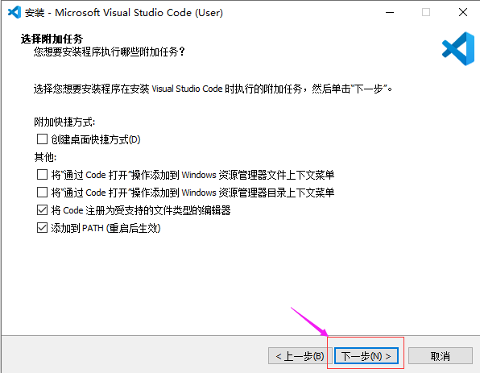

* 出现下方界面，点击安装。


* 出现下方界面，点击完成。


* 打开VScode，点击VScode 左上角的File，然后点击Open Folder（**注意：如果打开vscode右下角出现弹窗，全部关闭**）

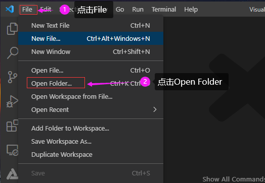

* 选择ubuntu共享目录的 /home/hispark/code/hi3861_hdu_iot_application/src/applications/sample/wifi-iot/app/，然后点击选择文件夹。(注意：hispark为unbuntu用户名，用户根据实际选择目录)


* 代码导入成功后，当出现下面的对话框，勾选复选框，然后点击 yes按钮即可。即可查阅修改代码。


### 1.3.7 代码编译

* 在docker编译环境的终端，执行下面的命令，进入代码的src目录，然后安装hb工具。

```
cd /home/hispark/hi3861_hdu_iot_application/src/

pip install build/lite
```

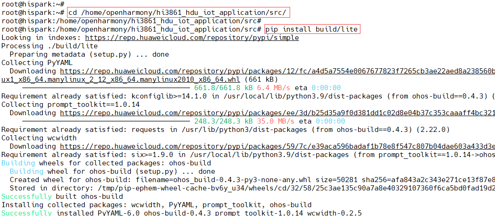

* 在docker的命令行终端，执行下面的命令，进行编译前的配置，当出现 <font color='RedOrange '>**[OHOS INFO] Input code path:**</font>的时候，输入 ``.``号，然后敲回车；然后出现<font color='RedOrange '>**hisilicon>wifiiot_hispark_pegasus**</font>的提示时，直接敲回车即可配置成功。

```
hb set
```


* 在docker的命令行终端，执行下面的命令，进行代码的编译。

```
hb  build  -f
```

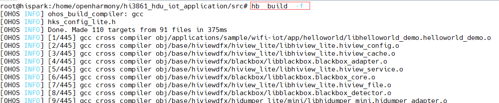

* 编译成功后，会在 /home/openharmony/hi3861_hdu_iot_application/src/out/hispark_pegasus/wifiiot_hispark_pegasus/目录下生成 Hi3861的镜像文件 Hi3861_wifiiot_app_allinone.bin。


### 1.3.8 开发工具下载

* 开发工具下载网址：https://hispark.obs.cn-east-3.myhuaweicloud.com/DevTools_Hi3861V100_v1.0.zip

  

* 下载完成后解压，解压完成后的文件目录结构如下所示：

  

### 1.3.9 代码烧录

#### 1.3.9.1 串口驱动安装

* 硬件如下图所示。

  

* 步骤一：先使用配套的Type-C数据线，将开发板与电脑的USB口进行直连，并且接开关拨到右侧，使开发板能够正常工作。如下图所示。


* 步骤二：安装CH340G驱动，打开DevTools_Hi3861V100_v1.0/usb_serial_driver文件夹。


* 步骤三：双击CH341SER.EXE驱动，进入安装界面，点击安装按钮即可，驱动安装成功后，再点击确定按钮。

  


* 步骤四：打开Windows的设备管理器，查看串口设备，若未出现CH340串口设备，请检查驱动是否安装正常。


#### 1.3.9.2 串口烧录

* 步骤一：打开DevTools_Hi3861V100_v1.0/burntool文件夹，可以看到“BurnTool.exe”烧录工具

  

<font color='RedOrange'>**（注意：以下软件包仅用于教学，未经允许不得转发用于商业用途）**</font>

* 步骤二：

  * 双击打开BurnTool.exe烧录工具，点击**Refresh按钮**，使HiBurn能够识别到开发板的串口设备。

  * 点击**COM的下拉框**，选择与设备管理器一致的CH340的串口号，也就是与Hi3861连接的串口号。

  * 点击**Select file按钮**，选择刚在hi3861_hdu_iot_application-master/src/out中编译生成的Hi3861_wifiiot_app_allinone.bin镜像文件

  * 勾选**Auto burn**。


* 步骤三：烧录镜像到开发板，点击connect按钮，进行镜像的烧录，当出现Connecting...的时候，按一下<font color='RedOrange'>**开发板的RST键。**</font>


* 当出现下面的进度条，就说明正在进行镜像的烧录


* 当出现下面的打印信息，说明镜像已经烧录成功，然后<font color='RedOrange'>**再点击HiBurn的Disconnect按钮**</font>，与开发板断开连接。


#### 1.3.9.3 串口打印

* 步骤一：下载串口工具（串口工具请自行下载，这里不提供下载方式），这里以sscom串口工具为例

- 步骤二：使用SSCOM接收开发板的串口数据
  *  首先点击串口工具的刷新按钮，使串口工具能够识别到开发板的串口设备。
  * 点击端口号的下拉框，选择与设备管理器一致的COM口
  * 再点击打开串口按钮，开始接收开发板的串口数据。


* 步骤三：按一下开发板的RST键，让开发板系统运行起来。


* 步骤四：通过串口工具可以看到 “sdk ver:Hi3861V100R001C00SPC025 2020-09-03 18:10:00”已经打印出来，说明开发板已经运行起来了。

  

## 1.4 运行第一个程序Hello world（☆☆☆推荐学习）

### 1.4.1 工程导入

* 步骤一：打开VSCode，打开DevEco Device Tool主页，点击“导入工程”（<font color='RedOrange'>**注意：DevEco Device Tool安装请参考 1.1章节 Windows下 IDE工具搭建**</font>）

  

* 步骤二：在导入工程弹窗中选择Hi3861 SDK目录，点击“导入”。（如果采用zip包下载，SDK名称为hi3861_hdu_iot_application-master，如果采用git下载SDK名称为hi3861_hdu_iot_application，此处以采用zip下载为例）

  

* 步骤三：在后续导入工程弹窗，SOC栏选择Hi3861，开发板栏选择hi3861，框架栏选择hb，之后点击“导入”，等待导入成功即可。

  

  <font color='RedOrange'>**注意：如果待打开目录之前已成功导入，则再次导入时会导入失败，并提示“当前工程已经创建过，请直接导入”。**</font>

* 步骤四：代码导入成功后，即工程创建成功，之后可使用该IDE 实现代码开发、一键编译、一键烧写等功能。

  

* 步骤五：代码导入成功后，后续可在DevEco Device Tool工具主页直接打开已导入成功的工程。

  
### 1.4.2 初始化配置文件修改及讲解

* 步骤一：修改hi3861_hdu_iot_application_master/src/device/hisilicon/hispark_pegasus/sdk_liteos/app/wifiiot_app/init/app_io_init.c文件，由于这个文件是系统起来时自定义配置IO口功能，这里屏蔽部分代码防止自己demo在配置IO功能时产生冲突。具体屏蔽如下所示。(如果采用zip包下载，SDK名称为hi3861_hdu_iot_application-master，如果采用git下载SDK名称为hi3861_hdu_iot_application，此处以采用zip下载为例）

  ```
  1 /*
  2  * Copyright (c) 2020 Huawei Device Co., Ltd.
  3  * Licensed under the Apache License, Version 2.0 (the "License");
  4  * you may not use this file except in compliance with the License.
  5  * You may obtain a copy of the License at
  6  *
  7  *     http://www.apache.org/licenses/LICENSE-2.0
  8  *
  9  * Unless required by applicable law or agreed to in writing, software
  10  * distributed under the License is distributed on an "AS IS" BASIS,
  11  * WITHOUT WARRANTIES OR CONDITIONS OF ANY KIND, either express or implied.
  12  * See the License for the specific language governing permissions and
  13  * limitations under the License.
  14  */
  15 
  16 #include <hi_io.h>
  17 
  18 hi_void app_io_init(hi_void)
  19 {
  20     /* 用户需根据应用场景，合理选择各外设的IO复用配置，此处仅列出示例 */
  21 #ifdef CONFIG_UART0_SUPPORT
  22     /* uart0 调试串口 */
  23     hi_io_set_func(HI_IO_NAME_GPIO_3, HI_IO_FUNC_GPIO_3_UART0_TXD); /* uart0 tx */
  24     hi_io_set_func(HI_IO_NAME_GPIO_4, HI_IO_FUNC_GPIO_4_UART0_RXD); /* uart0 rx */
  25 #endif
  26 
  27 #ifdef CONFIG_UART1_SUPPORT
  28     /* uart1 AT命令串口 */
  29     // hi_io_set_func(HI_IO_NAME_GPIO_5, HI_IO_FUNC_GPIO_5_UART1_RXD); /* uart1 rx */
  30     // hi_io_set_func(HI_IO_NAME_GPIO_6, HI_IO_FUNC_GPIO_6_UART1_TXD); /* uart1 tx */
  31 #endif
  32 
  33 #ifdef CONFIG_UART2_SUPPORT
  34     /* uart2 sigma认证使用串口 */
  35     // hi_io_set_func(HI_IO_NAME_GPIO_11, HI_IO_FUNC_GPIO_11_UART2_TXD); /* uart2 tx */
  36     // hi_io_set_func(HI_IO_NAME_GPIO_12, HI_IO_FUNC_GPIO_12_UART2_RXD); /* uart2 rx */
  37 #endif
  38 
  39     /* SPI MUX: */
  40 #ifdef CONFIG_SPI_SUPPORT
  41     /* SPI IO复用也可以选择5/6/7/8;0/1/2/3, 根据产品设计选择 */
  42     // hi_io_set_func(HI_IO_NAME_GPIO_9, HI_IO_FUNC_GPIO_9_SPI0_TXD);
  43     // hi_io_set_func(HI_IO_NAME_GPIO_10, HI_IO_FUNC_GPIO_10_SPI0_CK);
  44     // hi_io_set_func(HI_IO_NAME_GPIO_11, HI_IO_FUNC_GPIO_11_SPI0_RXD);
  45     // hi_io_set_func(HI_IO_NAME_GPIO_12, HI_IO_FUNC_GPIO_12_SPI0_CSN);
  46     // hi_io_set_driver_strength(HI_IO_NAME_GPIO_9, HI_IO_DRIVER_STRENGTH_0);
  47 #endif
  48 
  49     /* I2C MUX: */
  50 #ifdef CONFIG_I2C_SUPPORT
  51     /* I2C IO复用也可以选择3/4; 9/10，根据产品设计选择 */
  52     // hi_io_set_func(HI_IO_NAME_GPIO_0, HI_IO_FUNC_GPIO_0_I2C1_SDA);
  53     // hi_io_set_func(HI_IO_NAME_GPIO_1, HI_IO_FUNC_GPIO_1_I2C1_SCL);
  54 #endif
  55 
  56     /* PWM MUX: */
  57 #ifdef CONFIG_PWM_SUPPORT
  58     /* PWM 0/2/3/4/5 配置同理 */
  59     // hi_io_set_func(HI_IO_NAME_GPIO_8, HI_IO_FUNC_GPIO_8_PWM1_OUT);
  60 #endif
  61 
  62     /* I2S MUX: */
  63 #ifdef CONFIG_I2S_SUPPORT
  64     // hi_io_set_func(HI_IO_NAME_GPIO_9, HI_IO_FUNC_GPIO_9_I2S0_MCLK);
  65     // hi_io_set_func(HI_IO_NAME_GPIO_10, HI_IO_FUNC_GPIO_10_I2S0_TX);
  66     // hi_io_set_func(HI_IO_NAME_GPIO_11, HI_IO_FUNC_GPIO_11_I2S0_RX);
  67     // hi_io_set_func(HI_IO_NAME_GPIO_12, HI_IO_FUNC_GPIO_12_I2S0_BCLK);
  68     // hi_io_set_func(HI_IO_NAME_GPIO_13, HI_IO_FUNC_GPIO_13_I2S0_WS);
  69 #endif
  70 
  71     /* SDIO MUX: */
  72 #ifdef CONFIG_SDIO_SUPPORT
  73     // (hi_void)hi_io_set_func(HI_IO_NAME_GPIO_9, HI_IO_FUNC_GPIO_9_SDIO_D2);
  74     // (hi_void)hi_io_set_func(HI_IO_NAME_GPIO_10, HI_IO_FUNC_GPIO_10_SDIO_D3);
  75     // (hi_void)hi_io_set_func(HI_IO_NAME_GPIO_11, HI_IO_FUNC_GPIO_11_SDIO_CMD);
  76     // (hi_void)hi_io_set_func(HI_IO_NAME_GPIO_12, HI_IO_FUNC_GPIO_12_SDIO_CLK);
  77     // (hi_void)hi_io_set_func(HI_IO_NAME_GPIO_13, HI_IO_FUNC_GPIO_13_SDIO_D0);
  78     // (hi_void)hi_io_set_func(HI_IO_NAME_GPIO_14, HI_IO_FUNC_GPIO_14_SDIO_D1);
  79 
  80     // (hi_void)hi_io_set_pull(HI_IO_NAME_GPIO_9, HI_IO_PULL_UP);
  81     // (hi_void)hi_io_set_pull(HI_IO_NAME_GPIO_10, HI_IO_PULL_UP);
  82     // (hi_void)hi_io_set_pull(HI_IO_NAME_GPIO_11, HI_IO_PULL_UP);
  83     // (hi_void)hi_io_set_pull(HI_IO_NAME_GPIO_13, HI_IO_PULL_UP);
  84     // (hi_void)hi_io_set_pull(HI_IO_NAME_GPIO_14, HI_IO_PULL_UP);
  85 #endif
  86 }
  ```

* 步骤二：修改hi3861_hdu_iot_application_master/src/device/hisilicon/hispark_pegasus/sdk_liteos/build/config/usr_config.mk文件，由于这个文件是开启Hi3861功能文件，如I2C,I2S，PWM等等，具体修改如下（这里我只开启了I2C,PWM,UART等，用户根据自己实际情况去修改）。

  ```
  1 # Generated by Kconfiglib (https://github.com/ulfalizer/Kconfiglib)
  2 
  3 #
  4 # Target Chip
  5 #
  6 CONFIG_TARGET_CHIP_HI3861=y
  7 # end of Target Chip
  8 
  9 #
  10 # Security Settings
  11 #
  12 # CONFIG_TARGET_SIG_RSA_V15 is not set
  13 # CONFIG_TARGET_SIG_RSA_PSS is not set
  14 # CONFIG_TARGET_SIG_ECC is not set
  15 CONFIG_TARGET_SIG_SHA256=y
  16 # CONFIG_BOOT_ENCRYPT is not set
  17 CONFIG_TARGET_KERNEL_VER=0
  18 CONFIG_TARGET_BOOT_VER=0
  19 CONFIG_TEE_HUKS_SUPPORT=y
  20 # CONFIG_TEE_HUKS_DEMO_SUPPORT is not set
  21 # CONFIG_FLASH_ENCRYPT_SUPPORT is not set
  22 # end of Security Settings
  23 
  24 #
  25 # Factory Test Settings
  26 #
  27 # CONFIG_FACTORY_TEST_SUPPORT is not set
  28 # end of Factory Test Settings
  29 
  30 #
  31 # BSP Settings
  32 #
  33 # CONFIG_I2C_SUPPORT is not set
  34 CONFIG_I2C_SUPPORT = y
  35 # CONFIG_I2S_SUPPORT is not set
  36 # CONFIG_SPI_SUPPORT is not set
  37 # CONFIG_DMA_SUPPORT is not set
  38 # CONFIG_SDIO_SUPPORT is not set
  39 # CONFIG_SPI_DMA_SUPPORT is not set
  40 # CONFIG_UART_DMA_SUPPORT is not set
  41 # CONFIG_PWM_SUPPORT is not set
  42 CONFIG_PWM_SUPPORT =y
  43 # CONFIG_PWM_HOLD_AFTER_REBOOT is not set
  44 CONFIG_AT_SUPPORT=y
  45 CONFIG_FILE_SYSTEM_SUPPORT=y
  46 CONFIG_UART0_SUPPORT=y
  47 CONFIG_UART1_SUPPORT=y
  48 # CONFIG_UART2_SUPPORT is not set
  49 # end of BSP Settings
  50 
  51 #
  52 # WiFi Settings
  53 #
  54 CONFIG_CE_SUPPORT=y
  55 # CONFIG_FCC_SUPPORT is not set
  56 # CONFIG_MAX_POWER_SUPPORT is not set
  57 # end of WiFi Settings
  58 
  59 #
  60 # Third Party library
  61 #
  62 # CONFIG_CJSON is not set
  63 # CONFIG_CJSON_NESTING_LIMIT=1000
  64 # CONFIG_LIBCOAP is not set
  65 # CONFIG_MQTT is not set
  66 CONFIG_IPERF=y
  67 # end of Third Party library
  68 
  69 #
  70 # Lwip Settings
  71 #
  72 CONFIG_DHCPS_GW=y
  73 # CONFIG_NETIF_HOSTNAME is not set
  74 # CONFIG_DHCP_VENDOR_CLASS_IDENTIFIER is not set
  75 # CONFIG_LWIP_LOWPOWER is not set
  76 # end of Lwip Settings
  77 
  78 #
  79 # OTA Settings
  80 #
  81 CONFIG_COMPRESSION_OTA_SUPPORT=y
  82 # CONFIG_DUAL_PARTITION_OTA_SUPPORT is not set
  83 # end of OTA Settings
  84 
  85 #
  86 # Link Settings
  87 #
  88 # CONFIG_HILINK is not set
  89 # end of Link Settings
  90 
  91 #
  92 # File System Settings
  93 #
  94 CONFIG_FILE_SYSTEM_SUPPORT=y
  95 # end of File System Settings
  96 
  97 #
  98 # Debug Log Settings
  99 #
  100 # CONFIG_DIAG_SUPPORT is not set
  101 # end of Debug Log Settings
  ```

### 1.4.3 编写helloworld代码


 * 步骤一：编写业务代码

   * 点击代码资源列表的空白处，然后鼠标右键，然后点击New Folder。（**注意：如果打开vscode右下角出现弹窗，全部关闭**）

     

   * 点击代码资源列表的空白处，然后鼠标右键，然后点击New Folder。（**注意：如果打开vscode右下角出现弹窗，全部关闭**）

   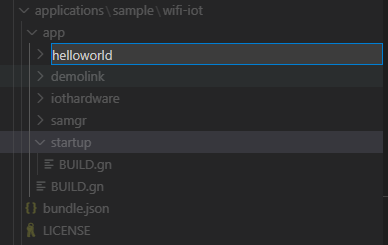

   * 点击helloworld文件夹，然后鼠标右键，点击New File。（**注意：如果打开vscode右下角出现弹窗，全部关闭**）

     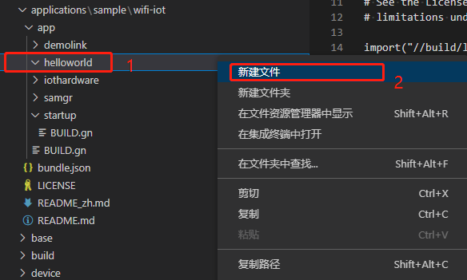

   * 创建一个helloworld_demo.c的c源文件。（**注意：如果打开vscode右下角出现弹窗，全部关闭**）

     

   * 将下方的代码复制到helloworld_demo.c文件中

```c
#include <stdio.h>          // c语言的标准库文件
#include "ohos_init.h"		// 提供用于openharmony初始化和启动服务

void HelloWorld(void)       
{
    // 打印一下 helloworld!的字符串
    printf("helloworld! \r\n"); 
}

// APP_FEATURE_INIT()是openharmony封装好的函数入口，实现main函数的功能。
APP_FEATURE_INIT(HelloWorld);   
```

* 步骤二：编写构建业务代码的BUILD.gn

  * 在helloworld文件夹中创建一个BUILD.gn的文件。（**注意：如果打开vscode右下角出现弹窗，全部关闭**）

    

  * 将下方的代码复制到BUILD.gn文件中。

```python
static_library("helloworld_demo") {
  sources = [
    "helloworld_demo.c",
  ]
  include_dirs = [
    "//base/iot_hardware/peripheral/interfaces/kits",
    ]
}
# static_library：将sources中的源文件编译后生成``helloworld_demo``库文件
# sources：实现本工程的功能需要编译的所有.c源文件。
# include_dirs：sources中的所有.c源文件所包含的头文件的路径。
```

 * 步骤三：修改构建工程的BUILD.gn

   * 在工具中hi3861_hdu_iot_application_master/src/applications/sample/wifi-iot/app/目录下的BUILD.gn文件。如果采用zip包下载，SDK名称为hi3861_hdu_iot_application-master，如果采用git下载SDK名称为hi3861_hdu_iot_application，此处以采用zip下载为例）

   * 将features字段的内容替换为 ``helloworld:helloworld_demo``，第一个helloworld指的是需要编译的工程目录，第二个helloworld_demo指的是applications/sample/wifi-iot/app/helloworld_demo/BUILD.gn文件中的静态库，名称为helloworld_demo。
   
     

### 1.4.4 编译运行

* 步骤一：配置开发工具路径，点击左侧的“工程配置”，在右侧窗口找到“compiler_bin_path”，选择到之前下载的开发工具。

  

  <font color='RedOrange'>**注意工具目录层级，选择到最内层，例如下图”。**</font>

  

* 步骤二：配置完成后，点击左侧“build”，开始编译。

  
  
  初次编译会解压编译工具，时间较长。等待编译完成即可。
  
  

### 1.4.5 代码烧录
#### 1.4.5.1 串口驱动安装

* 硬件如下图所示。

  

* 步骤一：先使用配套的Type-C数据线，将开发板与电脑的USB口进行直连，并且接开关拨到右侧，使开发板能够正常工作。如下图所示。


* 步骤二：安装CH340G驱动，打开DevTools_Hi3861V100_v1.0/usb_serial_driver文件夹。


* 步骤三：双击CH341SER.EXE驱动，进入安装界面，点击安装按钮即可，驱动安装成功后，再点击确定按钮。

  


* 步骤四：打开Windows的设备管理器，查看串口设备，若未出现CH340串口设备，请检查驱动是否安装正常。


#### 1.4.5.2 串口烧录
* 步骤一：当前DevEco Device Tool工具支持Hi3861单板一键烧录功能。需要连接开发板，配置开发板对应的串口，在编译结束后，进行烧录。点击左侧“工程配置”，找到“upload_port”选项，选择开发板对应的烧录串口（<font color='RedOrange'>**注意：如果正在使用Monitor功能，请先“ctrl+c”关闭Monitor，才能正常烧，否则串口占用无法烧录成功**</font>）。

  

* 步骤二：点击左下角“upload”按键，等待提示（出现Connecting，please reset device...），手动进行开发板复位（按下开发板reset键）。

  

* 步骤三：等待烧录完成，大约30s左右，烧录成功。

  

#### 1.4.5.3 Monitor 串口打印"helloworld"

* 步骤一：烧录完成后，可以通过Monitor界面查看串口打印，配置Monitor串口，如下图所示。（<font color='RedOrange'>**注意：如果正在使用Monitor功能，请先“ctrl+c”关闭Monitor，才能正常烧录，否则串口占用无法烧录成功**</font>）

  

* 步骤二：配置完Monitor串口后，直接点击monitor按钮，复位开发板，查看板端打印信，可以看到“helloworld!”等字样。

  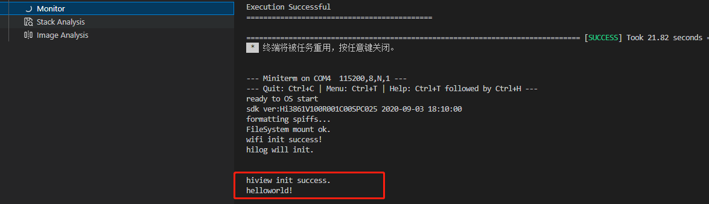

# 2、 BootLoader的启动与运行

## 2.1 Hi3861 RiSC-V boot 启动文件介绍

- Hi3861 的引导程序分为两部分，一部分是在芯片出厂时已经固定在 ROM，这部分的代码主要实现的功能是：芯片上电后，如果没有被打断（没有执行烧录过程）时会检验 flashboot,检验成功后跳转到flashboot 代码处运行；芯片上电后如果被打断（复位操作并执行烧录过程）时，下载 loaderboot,下载完之后校验成功跳转到 loaderboot 运行，汇编代码跳转到 C 代码，再下载其他镜像（burn、boot、signed）并烧录到 flash,结束后，按复位键，芯片启动。

  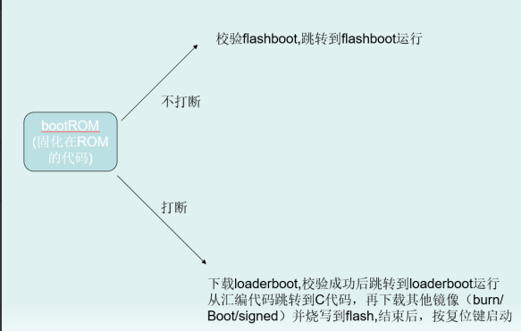

## 2.2 Loaderboot 启动过程

- Loaderboot 启动过程：路径: ./device/hisilicon/hispark_pegasus/sdk_liteos/boot/loaderboot/startup

  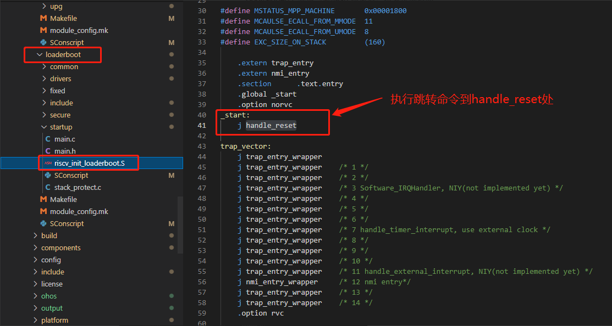

  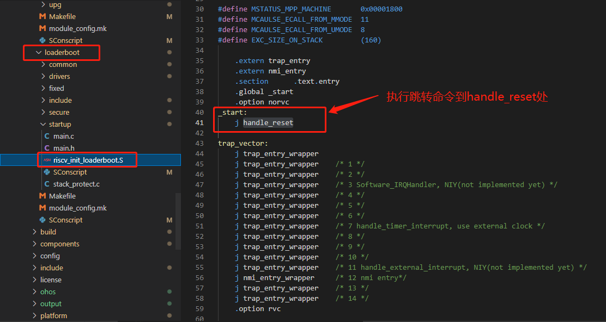

* Loaderboot 跳转到 C 代码：

  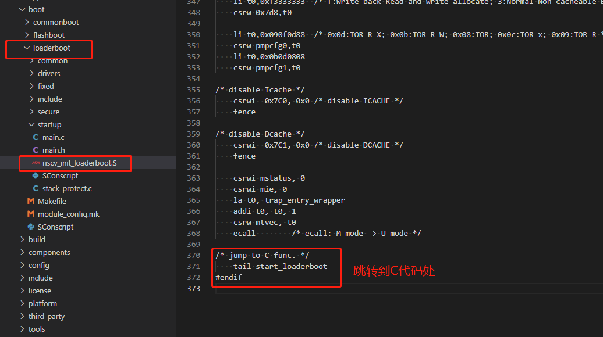

  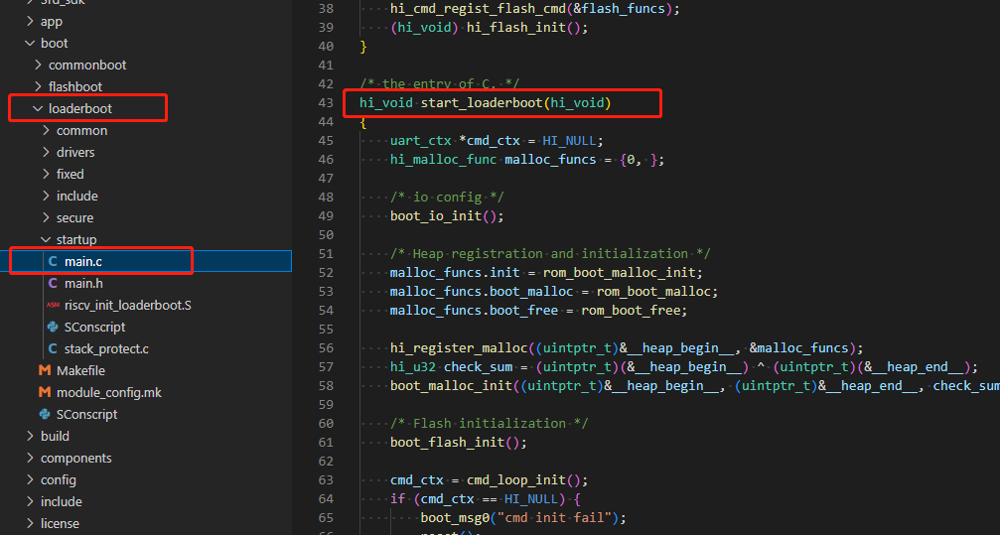

## 2.3 Flashboot代码介绍

- Flashboot 的执行逻辑与上述的 loaderboot 执行逻辑一致。路径: ./device/hisilicon/hispark_pegasus/sdk_liteos/boot/Flashboot/startup

  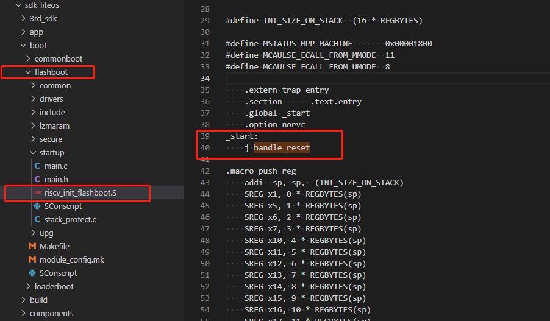

* Flashboot 跳转到 C 代码：

  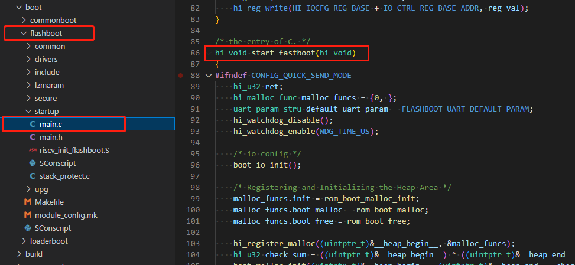

# 3、基础实验

## 3.1 GPIO实验-主芯片GPIO输出实验

### 3.1.1 实验目的

* 本实验通过控制主芯片GPIO 9输出高低电平，实现对交通灯LED3红灯亮灭的控制。

### 3.1.2 实验要求

* 1.软件要求：VSCode，hi3861_hdu_iot_application(如果采用zip包下载，SDK名称为hi3861_hdu_iot_application-master，如果采用git下载SDK名称为hi3861_hdu_iot_application，此处以采用git下载为例）；

* 2.硬件要求：HISPARK_HI3861_IOT_VER.C开发套件；

* 3.硬件配置：将MOTOR_EN拨码开关由ON拨到OFF；硬件搭建如下图所示: 

     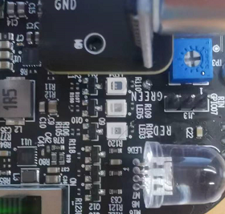 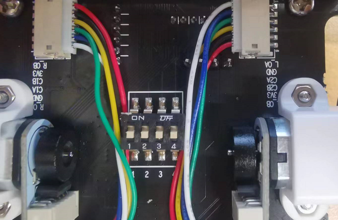

### 3.1.3 接口说明

#### 3.1.3.1 IoTGpioInit()

| **定义：**   | unsigned   int IoTGpioInit(unsigned int id);              |
| ------------ | --------------------------------------------------------- |
| **功能：**   | 初始化指定的IO                                            |
| **参数：**   | id:指定的IO号                                             |
| **返回值：** | IOT_SUCCESS：初始化成功    <br/>IOT_FAILURE:初始化失败    |
| **依赖：**   | //base/iot_hardware/peripheral/interfaces/kits/iot_gpio.h |

#### 3.1.3.2 IoSetFunc()

| **定义：**   | unsigned   int IoSetFunc(unsigned int id, unsigned char val); |
| ------------ | ------------------------------------------------------------ |
| **功能：**   | 配置指定IO的复用功能                                         |
| **参数：**   | id:指定的IO号    <br/>val:配置的复用功能                     |
| **返回值：** | IOT_SUCCESS：配置成功    <br/>IOT_FAILURE:配置失败           |
| **依赖：**   | ./iot_gpio_ex.h                                              |

#### 3.1.3.3 IoTGpioSetDir()

| **定义：**   | unsigned   int IoTGpioSetDir(unsigned int id, IotGpioDir dir); |
| ------------ | ------------------------------------------------------------ |
| **功能：**   | 设置指定IO的管脚方向                                         |
| **参数：**   | id:指定的IO号     <br/>dir:GPIO管脚方向(IOT_GPIO_DIR_IN、IOT_GPIO_DIR_OUT) |
| **返回值：** | IOT_SUCCESS：设置成功    <br/>IOT_FAILURE：设置失败          |
| **依赖：**   | //base/iot_hardware/peripheral/interfaces/kits/iot_gpio.h    |

#### 3.1.3.4 IoTGpioSetOutputVal()

| **定义：**   | unsigned   int IoTGpioSetOutputVal(unsigned int id, IotGpioValue val); |
| ------------ | ------------------------------------------------------------ |
| **功能：**   | 设置指定IO的输出电平                                         |
| **参数：**   | id:指定的IO号     <br/>val:GPIO管脚的输出电平（IOT_GPIO_VALUE0、IOT_GPIO_VALUE1） |
| **返回值：** | IOT_SUCCESS：设置成功    <br/>IOT_FAILURE：设置失败          |
| **依赖：**   | //base/iot_hardware/peripheral/interfaces/kits/iot_gpio.h    |

### 3.1.4 实验流程

* 步骤一：hi3861_hdu_iot_application/src/vendor/hisilicon/hispark_pegasus/demo/led_demo文件夹复制到hi3861_hdu_iot_application/src/applications/sample/wifi-iot/app/目录下。

* 步骤二：修改applications/sample/wifi-iot/app/目录下的BUILD.gn，在features字段中添加led_demo:led_control。注：第一个led_demo指的是需要编译的工程目录，第二个led_control指的是applications/sample/wifi-iot/app/led_demo/BUILD.gn文件中的静态库，名称为led_control。

```c
import("//build/lite/config/component/lite_component.gni")
lite_component("app") {
  features = [ "led_demo:led_control", ]
}
```

* 步骤三：LED亮灭原理：通过GPIO口输出高低电平控制LED亮灭。

    从硬件原理图可以分析出LED3红灯对应的管脚是GPIO09，因此我们需要通过控制GPIO09的高低电平输出，来控制LED3的亮灭。

```c
1 /*
2  * Copyright (c) 2022 HiSilicon (Shanghai) Technologies CO., LIMITED.
3  * Licensed under the Apache License, Version 2.0 (the "License");
4  * you may not use this file except in compliance with the License.
5  * You may obtain a copy of the License at
6  *
7  *     http://www.apache.org/licenses/LICENSE-2.0
8  *
9  * Unless required by applicable law or agreed to in writing, software
10  * distributed under the License is distributed on an "AS IS" BASIS,
11  * WITHOUT WARRANTIES OR CONDITIONS OF ANY KIND, either express or implied.
12  * See the License for the specific language governing permissions and
13  * limitations under the License.
14  */
15 
16 #include <stdio.h>
17 #include <unistd.h>
18 
19 #include "iot_gpio_ex.h"
20 #include "ohos_init.h"
21 #include "cmsis_os2.h"
22 #include "iot_gpio.h"
23 
24 #define LED_LOOP    10
25 #define DELYA_MS    1000
26 
27 static void LedExampleEntry(void)
28 {
29     // LED3的GPIO初始化 GPIO initialization of LED3
30     IoTGpioInit(IOT_IO_NAME_GPIO_9);
31     // 设置GPIO9的管脚复用关系为GPIO Set the pin reuse relationship of GPIO9 to GPIO
32     IoSetFunc(IOT_IO_NAME_GPIO_9, IOT_IO_FUNC_GPIO_9_GPIO);
33     // GPIO方向设置为输出 GPIO direction set to output
34     IoTGpioSetDir(IOT_IO_NAME_GPIO_9, IOT_GPIO_DIR_OUT);
35 
36     for (int i = 0; i < LED_LOOP; i++) {
37         /*
38          * 设置GPIO09输出高电平点亮红色交通灯LED3
39          * Set GPIO09 output high level to turn on red traffic light LED 3
40          */
41         IoTGpioSetOutputVal(IOT_IO_NAME_GPIO_9, IOT_GPIO_VALUE1);
42         TaskMsleep(DELYA_MS);
43         /*
44          * 设置GPIO09输出低电平熄灭红色交通灯LED3
45          * Set GPIO09 output low level to turn off red traffic light LED 3
46          */
47         IoTGpioSetOutputVal(IOT_IO_NAME_GPIO_9, IOT_GPIO_VALUE0);
48         TaskMsleep(DELYA_MS);
49     }
50 }
51 
52 static void LedControlTask(void)
53 {
54     osThreadAttr_t attr;
55 
56     attr.name = "LedCntrolDemo";
57     attr.attr_bits = 0U;
58     attr.cb_mem = NULL;
59     attr.cb_size = 0U;
60     attr.stack_mem = NULL;
61     attr.stack_size = 1024; // 堆栈大小为1024 stack size 1024
62     attr.priority = osPriorityNormal;
63     if (osThreadNew((osThreadFunc_t)LedExampleEntry, NULL, &attr) == NULL) {
64         printf("[LedExample] Failed to create LedTask!\n");
65     }
66 }
67 
68 APP_FEATURE_INIT(LedControlTask);
```

- 步骤四：点击DevEco Device Tool工具“Rebuild”按键，具体编译步骤参考“1.4章节 运行第一个程序helloworld”

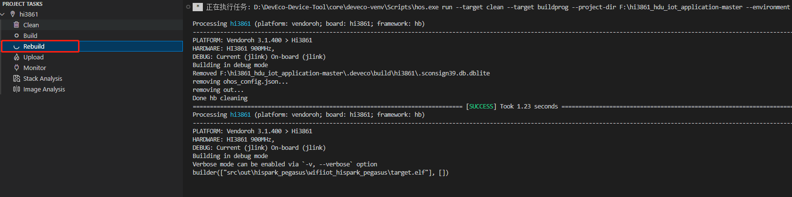

- 步骤五：点击DevEco Device Tool工具“Upload”按键，等待提示（出现Connecting，please reset device...），手动进行开发板复位（按下开发板reset键），将程序烧录到开发板中。具体烧录步骤参考“1.4章节 运行第一个程序helloworld”。

  

### 3.1.5 实验结果

* 软件烧录成功后，按一下开发板的RESET按键复位开发板，可以看到红灯先亮起然后熄灭，循环10次后红灯灯熄灭，说明我们使用GPIO控制LED灯的实验成功。LED的实验效果图如下图所示。

  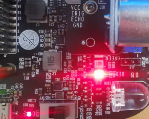

### 3.1.6 扩展实验

* 本实验学习了如何点亮一个灯，请学生做如下实验：
  
  * 1、通过控制GPIO 5，GPIO6的高低电平的输出，从而控制左侧电机前进后退。 
  
  提示：GPIO5,GPIO6同时置高，左侧电机前进；GPIO 5，GPIO6同时置低，左侧电机后退。

## 3.2 GPIO实验-主芯片GPIO输入实验

### 3.2.1 实验目的

* 本实验通过使用主芯片GPIO 0和GPIO 1输入功能，实现对左右侧电机编码器A相中断的计数。

### 3.2.2 实验要求

* 1.软件要求：VSCode，hi3861_hdu_iot_application(如果采用zip包下载，SDK名称为hi3861_hdu_iot_application-master，如果采用git下载SDK名称为hi3861_hdu_iot_application，此处以采用git下载为例）；

* 2.硬件要求：HISPARK_HI3861_IOT_VER.C开发套件；

* 3.硬件配置：将J7跳帽跳至C2A-GPIO 0，J5跳帽跳至C2B-GPIO 12，将MOTOR_EN拨码开关由ON拨到OFF；硬件搭建如下图所示：

     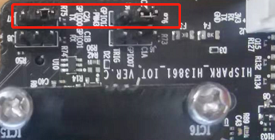

### 3.2.3 接口说明

#### 3.2.3.1 IoSetPull()

| **定义：**   | **unsigned int IoSetPull(unsigned int id, IotIoPull val);** |
| ------------ | ----------------------------------------------------------- |
| **功能：**   | 设置指定GPIO的上下拉功能                                    |
| **参数：**   | id:指定的IO号   <br/>val：待设置的上下拉状态                |
| **返回值：** | IOT_SUCCESS：设置成功    <br/>IOT_FAILURE：设置失败         |
| **依赖：**   | //base/iot_hardware/peripheral/interfaces/kits/iot_gpio.h   |

#### 3.2.3.2 IoTGpioRegisterIsrFunc()

| **定义：**   | unsigned int   IoTGpioRegisterIsrFunc(unsigned int id, <br/>IotGpioIntType intType,IotGpioIntPolarity intPolarity, <br/>GpioIsrCallbackFunc func, char *arg); |
| ------------ | ------------------------------------------------------------ |
| **功能：**   | 设置指定GPIO的中断功能                                       |
| 参数：       | id:指定的IO号   <br/>intType：中断类型 <br/>intPolarity：中断极性 <br/>func：中断触发时的回调函数    <br/>arg：中断回调函数中使用的参数的指针 |
| **返回值：** | IOT_SUCCESS：设置成功     <br/>IOT_FAILURE：设置失败         |
| **依赖：**   | //base/iot_hardware/peripheral/interfaces/kits/iot_gpio.h    |

#### 3.2.3.3 IoTGpioGetInputVal()

| **定义：**   | unsigned   int IoTGpioGetInputVal(unsigned int id, IotGpioValue *val); |
| ------------ | ------------------------------------------------------------ |
| **功能：**   | 读取指定GPIO管脚的高低电平                                   |
| **参数：**   | id:指定的IO号   <br/>val：返回读取的GPIO管脚电平值的指针     |
| **返回值：** | IOT_SUCCESS：读取成功    <br/>IOT_FAILURE：读取失败          |
| **依赖：**   | //base/iot_hardware/peripheral/interfaces/kits/iot_gpio.h    |

### 3.2.4 实验流程

* 步骤一：hi3861_hdu_iot_application/src/vendor/hisilicon/hispark_pegasus/demo/encoder_demo文件夹复制到hi3861_hdu_iot_application/src/applications/sample/wifi-iot/app/目录下。

* 步骤二：修改applications/sample/wifi-iot/app/目录下的BUILD.gn，在features字段中添加encoder_demo:encoder_control。注：第一个encoder_demo指的是需要编译的工程目录，第二个encoder_control指的是applications/sample/wifi-iot/app/ encoder_demo/BUILD.gn文件中的静态库，名称为encoder_control。


```c
import("//build/lite/config/component/lite_component.gni")

lite_component("app") {
  features = [ "encoder_demo:encoder_control", ]
}
```

* 步骤三：原理：Hi3861 GPIO口都带有中断功能，根据外设中断，将IO口设置为输入（输出），上拉（下拉），上升沿（下降沿）触发。

    ​		从硬件原理图可以分析出左侧电机编码器对应的是GPIO0_0和GPIO0_12，因此我们需要配置GPIO0_0和GPIO0_12为中断模式，且为上升沿触发，核心代码如方下所示:

```c
1 /*
2  * Copyright (c) 2022 HiSilicon (Shanghai) Technologies CO., LIMITED.
3  * Licensed under the Apache License, Version 2.0 (the "License");
4  * you may not use this file except in compliance with the License.
5  * You may obtain a copy of the License at
6  *
7  *     http://www.apache.org/licenses/LICENSE-2.0
8  *
9  * Unless required by applicable law or agreed to in writing, software
10  * distributed under the License is distributed on an "AS IS" BASIS,
11  * WITHOUT WARRANTIES OR CONDITIONS OF ANY KIND, either express or implied.
12  * See the License for the specific language governing permissions and
13  * limitations under the License.
14  */
15 
16 /*
17  * 电机编码器的相关API接口
18  * Relevant API interface of motor encoder
19  */
20 
21 #include <stdio.h>
22 #include <stdlib.h>
23 
24 #include "ohos_init.h"
25 #include "cmsis_os2.h"
26 #include "iot_gpio.h"
27 #include "hi_io.h"
28 #include "iot_gpio_ex.h"
29 #include "hi_time.h"
30 
31 static int encoderLeftACounter = 0;
32 static int encoderLeftBCounter = 0;
33 static int rc = 0;
34 #define FLAG_BIT    2
35 
36 /*
37  * 左电机中断处理函数
38  * Left motor interrupt processing function
39  */
40 static void LeftACounterHandler(char *arg)
41 {
42     (void) arg;
43     encoderLeftACounter++;
44     if (encoderLeftACounter == 1 && encoderLeftBCounter == 0) {
45         rc = 1;
46     }
47     if (rc == 1) {
48         printf("A , forward, encoderLeftACounter = %d\r\n", encoderLeftACounter);
49     }
50 }
51 
52 /*
53  * 左电机中断处理函数
54  * Left motor interrupt processing function
55  */
56 static void LeftBCounterHandler(char *arg)
57 {
58     (void) arg;
59     encoderLeftBCounter++;
60     if (encoderLeftACounter == 0 && encoderLeftBCounter == 1) {
61         rc = FLAG_BIT;
62     }
63     if (rc == FLAG_BIT) {
64         printf("B, backward, encoderLeftBCounter = %d\r\n", encoderLeftBCounter);
65     }
66 }
67 
68 void EncoderInit(void)
69 {
70     /*
71      * 左侧电机编码器B相的GPIO初始化
72      * GPIO initialization of left motor encoder phase B
73      */
74     IoTGpioInit(IOT_IO_NAME_GPIO_0);
75     /*
76      * 设置GPIO0的管脚复用关系为GPIO
77      * Set the pin reuse relationship of GPIO0 to GPIO
78      */
79     IoSetFunc(IOT_IO_NAME_GPIO_0, IOT_IO_FUNC_GPIO_0_GPIO);
80     /*
81      * GPIO0方向设置为输入
82      * GPIO0 direction is set as input
83      */
84     IoTGpioSetDir(IOT_IO_NAME_GPIO_0, IOT_GPIO_DIR_IN);
85     /*
86      * 设置GPIO0为上拉功能
87      * Set GPIO0 as pull-up function
88      */
89     IoSetPull(IOT_IO_NAME_GPIO_0, IOT_IO_PULL_UP);
90     /*
91      * 使能GPIO0的中断功能, 上升沿触发中断，LeftBCounterHandler为中断的回调函数
92      * Enable the interrupt function of GPIO0, the rising edge triggers
93      * the interrupt, and LeftBCounterHandler is the interrupt callback function
94      */
95     IoTGpioRegisterIsrFunc(IOT_IO_NAME_GPIO_0, IOT_INT_TYPE_EDGE,
96                            IOT_GPIO_EDGE_RISE_LEVEL_HIGH, LeftBCounterHandler, NULL);
97     /*
98      * 左侧电机编码器A相的GPIO初始化
99      * GPIO initialization of left motor encoder phase A
100      */
101     IoSetFunc(IOT_IO_NAME_GPIO_12, IOT_IO_FUNC_GPIO_12_GPIO);
102     /*
103      * 设置GPIO12的管脚复用关系为GPIO
104      * Set the pin reuse relationship of GPIO12 to GPIO
105      */
106     IoTGpioSetDir(IOT_IO_NAME_GPIO_12, IOT_GPIO_DIR_IN);
107     /*
108      * 设置GPIO12为上拉功能
109      * Set GPIO12 as pull-up function
110      */
111     IoSetPull(IOT_IO_NAME_GPIO_12, IOT_IO_PULL_UP);
112     /*
113      * 使能GPIO1的中断功能, 上升沿触发中断，LeftACounterHandler 为中断的回调函数
114      * Enable the interrupt function of GPIO1, the rising edge triggers the interrupt,
115      * and LeftACounterHandler is the interrupt callback function
116      */
117     IoTGpioRegisterIsrFunc(IOT_IO_NAME_GPIO_12, IOT_INT_TYPE_EDGE,
118                            IOT_GPIO_EDGE_RISE_LEVEL_HIGH, LeftACounterHandler, NULL);
119 }
120 
121 void EncoderEntry(void)
122 {
123     // 左侧电机编码器初始化
124     EncoderInit();
125 }
126 
127 static void EncoderControlTask(void)
128 {
129     osThreadAttr_t attr;
130 
131     attr.name = "LedCntrolDemo";
132     attr.attr_bits = 0U;
133     attr.cb_mem = NULL;
134     attr.cb_size = 0U;
135     attr.stack_mem = NULL;
136     attr.stack_size = 1024; // 堆栈大小为1024，stack size 1024
137     attr.priority = osPriorityNormal;
138     if (osThreadNew((osThreadFunc_t)EncoderEntry, NULL, &attr) == NULL) {
139         printf("[LedExample] Failed to create LedTask!\n");
140     }
141 }
142 
143 APP_FEATURE_INIT(EncoderControlTask);
```

- 步骤四：点击DevEco Device Tool工具“Rebuild”按键，具体编译步骤参考“1.4章节 运行第一个程序helloworld”


- 步骤五：点击DevEco Device Tool工具“Upload”按键，等待提示（出现Connecting，please reset device...），手动进行开发板复位（按下开发板reset键），将程序烧录到开发板中。具体烧录步骤参考“1.4章节 运行第一个程序helloworld”。

  

### 3.2.5 实验结果

* 软件烧录成功后（<font color='RedOrange'>**注意：这里以sscom为例，该工具需要自己百度下载，也可以使用Monitor工具，参考“1.4 章节 运行第一个程序helloworld”**</font>)，按一下开发板的RESET按键复位开发板，可以看到当我们转动小车的左轮时，电机编码器会产生中断，从而进入中断的回调函数，可以在串口工具中看到具体的中断回调函数的打印信息，说明主芯片GPIO输入功能，实现对左编码器中断监测，电机前转A相触发，电机后转B相触发。同一时间只能触发一相，需要触发另一相时，请重新复位。中断时的打印信息如下所示。

    前进A相：

    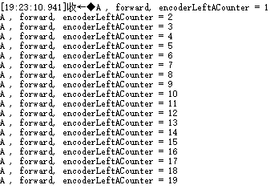

​	 	后退B相：


### 3.2.6 扩展实验

* 本实验学习了通过使用主芯片GPIO输入功能，实现对左侧编码器中断的监测计数，请学生做如下实验：
  
  * 1、让编码器与电机同时工作，并计数，每一秒通过串口打印当前计数，计数500次停止。
  
  ​			提示：GPIO 5和GPIO 6高低电平控制电机转动；
  
  ​		   GPIO 0和GPIO 12实现左侧编码器中断计数；

## 3.3 GPIO实验-IO扩展芯片GPIO输出实验 

### 3.3.1 实验目的

* 本实验内容：IO扩展芯片通过I2C读写实现IO3_0-IO15输出电平高低，实现控制左三色车灯的亮灭。**扩展芯片手册(型号：pca95555D,118；品牌：NXP)获取：https://so.szlcsc.com/global.html?k=pca95555&hot-key=，点击数据手册进行下载**。

### 3.3.2 实验要求

* 1.软件要求：VSCode，hi3861_hdu_iot_application(如果采用zip包下载，SDK名称为hi3861_hdu_iot_application-master，如果采用git下载SDK名称为hi3861_hdu_iot_application，此处以采用git下载为例）；

* 2.硬件要求：HISPARK_HI3861_IOT_VER.C开发套件；

* 3.将MOTOR_EN拨码开关由ON拨到OFF，硬件搭建如下图所示：

    

### 3.3.3 实验流程

* 步骤一：hi3861_hdu_iot_application/src/vendor/hisilicon/hispark_pegasus/demo/tricolor_lamp_demo文件夹复制到hi3861_hdu_iot_application/src/applications/sample/wifi-iot/app/目录下。

* 步骤二：修改applications/sample/wifi-iot/app/目录下的BUILD.gn，在features字段中添加tricolor_lamp_demo: TraColorLampControl。注：tricolor_lamp_demo指的是需要编译的工程目录，TraColorLampControl指的是applications/sample/wifi-iot/app/tricolor_lamp_demo/BUILD.gn文件中的静态库，名称为TraColorLampControl。

```c
import("//build/lite/config/component/lite_component.gni")

lite_component("app") {
  features = [ "tricolor_lamp_demo:TraColorLampControl", ]
}
```

* 步骤三：原理：I2C通信原理：I2C通信中，主机通过时钟线SCL发送时钟信号，通过数据线SDA发送数据（包括从机地址、指令、数据包等），在发送完一帧数据后，需要等待从机的响应，才能继续发送下一帧数据，因此I2C属于同步通信。

    ​			从硬件原理图可以分析出左三色车灯的绿、蓝、红分别对应IO扩展芯片的IO1_3,IO1_4,IO1_5，如果三灯全亮的话会亮白灯，因此需要分别控制IO扩展芯片的IO1_3，IO1_4, IO1_5的高低电平输出，来控制左三色车灯的亮灭。关键代码如下所示：

```c
1 /*
2  * Copyright (c) 2022 HiSilicon (Shanghai) Technologies CO., LIMITED.
3  * Licensed under the Apache License, Version 2.0 (the "License");
4  * you may not use this file except in compliance with the License.
5  * You may obtain a copy of the License at
6  *
7  *     http://www.apache.org/licenses/LICENSE-2.0
8  *
9  * Unless required by applicable law or agreed to in writing, software
10  * distributed under the License is distributed on an "AS IS" BASIS,
11  * WITHOUT WARRANTIES OR CONDITIONS OF ANY KIND, either express or implied.
12  * See the License for the specific language governing permissions and
13  * limitations under the License.
14  */
15 
16 #include <stdio.h>
17 #include <unistd.h>
18 
19 #include "ohos_init.h"
20 #include "cmsis_os2.h"
21 #include "iot_gpio_ex.h"
22 #include "iot_gpio.h"
23 #include "pca9555.h"
24 
25 static void TraColorLampControl(void)
26 {
27     PCA9555Init();
28     SetPCA9555GpioValue(PCA9555_PART1_IODIR, PCA9555_OUTPUT);
29     SetPCA9555GpioValue(PCA9555_PART1_OUTPUT, LED_OFF);
30 
31     /*
32      * 控制左三色车灯跑马灯，绿、蓝、红、白：每隔一秒一次亮
33      * 绿灯：IO1_3 ==> 0000 1000 ==> 0x08
34      * 蓝灯：IO1_4 ==> 0001 0000 ==> 0x10
35      * 红灯：IO1_5 ==>  0010 0000 ==> 0x20
36      * 白灯：三灯全亮 ==>  0011 1000 ==> 0x38
37      * Control the left tricolor running lights, green, blue, red and white: light up once every second
38      * Green light: IO1_ 3 ==> 0000 1000 ==> 0x08
39      * Blue light: IO1_4 ==> 0001 0000 ==> 0x10
40      * Red light: IO1_5 ==>  0010 0000 ==> 0x20
41      * White light: all three lights are on==>0011 1000==>0x38
42      */
43     while (1) {
44         /*
45          * 设置绿灯：IO1_3 输出高电平点亮左车绿灯
46          * Set green light: IO1_ 3 Output high level to turn on the left green light
47          */
48         SetPCA9555GpioValue(PCA9555_PART1_OUTPUT, GREEN_LED);
49         /*
50          * 延时函数毫秒（设置高电平持续时间）
51          * Delay function milliseconds (set high level duration)
52          */
53         TaskMsleep(DELAY_MS);
54         /*
55          * 设置 蓝灯：IO1_4 输出高电平点亮左车蓝灯
56          * Set blue light: IO1_ 4 Output high to turn on the left car blue light
57          */
58         SetPCA9555GpioValue(PCA9555_PART1_OUTPUT, BLUE_LED);
59         /*
60          * 延时函数毫秒（设置高电平持续时间）
61          * Delay function milliseconds (set high level duration)
62          */
63         TaskMsleep(DELAY_MS);
64         /*
65          * 设置红灯：IO1_3 输出高电平点亮左车红灯
66          * Set red light: IO1_ 3 Output high level to turn on the left vehicle red light
67          */
68         SetPCA9555GpioValue(PCA9555_PART1_OUTPUT, RED_LED);
69         /*
70          * 延时函数毫秒（设置高电平持续时间）
71          * Delay function milliseconds (set high level duration)
72          */
73         TaskMsleep(DELAY_MS);
74         /*
75          * 设置 IO1_3 IO1_4 IO1_5 都输出高电平，左车亮白灯
76          * Set IO1_ 3 IO1_ 4 IO1_ 5 output high level, left vehicle white light
77          */
78         SetPCA9555GpioValue(PCA9555_PART1_OUTPUT, WHITE_LED);
79         TaskMsleep(DELAY_MS);
80     }
81 }
82 
83 static void TraColorLampControlEntry(void)
84 {
85     osThreadAttr_t attr;
86     attr.name = "LedCntrolDemo";
87     attr.attr_bits = 0U;
88     attr.cb_mem = NULL;
89     attr.cb_size = 0U;
90     attr.stack_mem = NULL;
91     attr.stack_size = 1024; /* 堆栈大小为1024 stack size 1024 */
92     attr.priority = osPriorityNormal;
93     if (osThreadNew((osThreadFunc_t)TraColorLampControl, NULL, &attr) == NULL) {
94         printf("[LedExample] Failed to create LedTask!\n");
95     }
96 }
97 
98 APP_FEATURE_INIT(TraColorLampControlEntry);
```

- 步骤四：修改.device/soc/hisilicon/hi3861v100/sdk_liteos/build/config/usr_config.mk文件。在这个配置文件中打开I2C驱动宏。搜索字段CONFIG_I2C_SUPPORT ，并打开I2C。配置如下：

  ```
  # CONFIG_I2C_SUPPORT is not set
  CONFIG_I2C_SUPPORT=y
  ```

- 步骤五：点击DevEco Device Tool工具“Rebuild”按键，具体编译步骤参考“1.4章节 运行第一个程序helloworld”


- 步骤六：点击DevEco Device Tool工具“Upload”按键，等待提示（出现Connecting，please reset device...），手动进行开发板复位（按下开发板reset键），将程序烧录到开发板中。具体烧录步骤参考“1.4章节 运行第一个程序helloworld”。

  


### 3.3.4 实验结果

* 软件烧录成功后，按一下开发板的RESET按键复位开发板，可以看到小车左边车灯每隔一秒依次亮绿灯、蓝灯、红灯、白灯，说明我们使用IO扩展芯片的GPIO控制三色车灯的实验成功。三色车灯的实验效果图如下图所示。

    

### 3.3.5 扩展实验

* 本实验学习了如何使用IO扩展芯片的GPIO控制三色车灯，请学生做如下实验：
  * 1、同时控制左右两个三色车灯4s内红，绿，蓝，白灯循环一次。
  
      提示：左右三色灯IO1_0-IO1_5。

 

## 3.4 GPIO实验-IO扩展芯片GPIO输入实验 

### 3.4.1 实验目的

* 本实验通过I2C读写IO扩展芯片实现按键输入功能。**扩展芯片手册(型号：pca95555D,118；品牌：NXP)获取：https://so.szlcsc.com/global.html?k=pca95555&hot-key=，点击数据手册进行下载**。

### 3.4.2 实验要求

* 1.软件要求：VSCode，hi3861_hdu_iot_application(如果采用zip包下载，SDK名称为hi3861_hdu_iot_application-master，如果采用git下载SDK名称为hi3861_hdu_iot_application，此处以采用git下载为例）；

* 2.硬件要求：HISPARK_HI3861_IOT_VER.C开发套件；

* 3.将MOTOR_EN拨码开关由ON拨到OFF，硬件搭建如下图所示：

    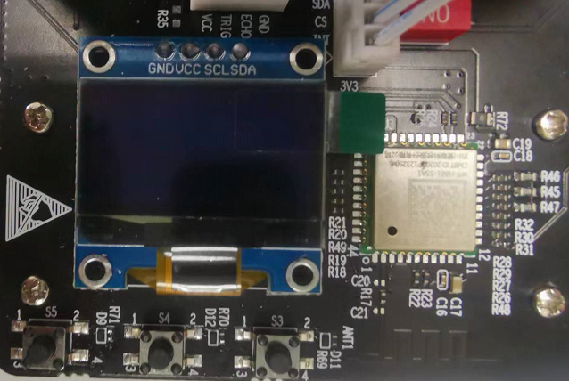 ****

### 3.4.3 实验流程

* 步骤一：hi3861_hdu_iot_application/src/vendor/hisilicon/hispark_pegasus/demo/button_demo文件夹复制到hi3861_hdu_iot_application/src/applications/sample/wifi-iot/app/目录下。

* 步骤二：修改applications/sample/wifi-iot/app/目录下的BUILD.gn，在features字段中添加button_demo: button_control。注：第一个button_demo指的是需要编译的工程目录，第二个button_control指的是applications/sample/wifi-iot/app/ button_demo/BUILD.gn文件中的静态库，名称为button_control。


```c
import("//build/lite/config/component/lite_component.gni")

lite_component("app") {
  features = [ "button_demo:button_control", ]
}
```

* 步骤三：原理：I2C通信原理：I2C通信中，主机通过时钟线SCL发送时钟信号，通过数据线SDA发送数据（包括从机地址、指令、数据包等），在发送完一帧数据后，需要等待从机的响应，才能继续发送下一帧数据，因此I2C属于同步通信。

    ​			从硬件原理图可以分析出按键S3对应的是IO0_2,按键S4对应的是IO0_3,按键S5对应的是IO0_4，因此我们需要分别使用IO扩展芯片的IO0_2，IO0_3, IO0_4的输入功能，监测按键S3、S4、S5的按压中断事件。关键代码如下所示：

```c
1 /*
2  * Copyright (c) 2022 HiSilicon (Shanghai) Technologies CO., LIMITED.
3  * Licensed under the Apache License, Version 2.0 (the "License");
4  * you may not use this file except in compliance with the License.
5  * You may obtain a copy of the License at
6  *
7  *     http://www.apache.org/licenses/LICENSE-2.0
8  *
9  * Unless required by applicable law or agreed to in writing, software
10  * distributed under the License is distributed on an "AS IS" BASIS,
11  * WITHOUT WARRANTIES OR CONDITIONS OF ANY KIND, either express or implied.
12  * See the License for the specific language governing permissions and
13  * limitations under the License.
14  */
15 
16 #include <stdio.h>
17 #include <unistd.h>
18 #include "hi_timer.h"
19 
20 #include "ohos_init.h"
21 #include "cmsis_os2.h"
22 #include "iot_gpio_ex.h"
23 #include "iot_gpio.h"
24 #include "iot_errno.h"
25 #include "hi_errno.h"
26 #include "pca9555.h"
27 
28 #define DELAY_US    20
29 static volatile int g_buttonState = 0;
30 
31 void OnFuncKeyPressed(char *arg)
32 {
33     (void) arg;
34     g_buttonState = 1;
35 }
36 
37 void FuncKeyInit(void)
38 {
39     /*
40      * 使能GPIO11的中断功能, OnFuncKeyPressed 为中断的回调函数
41      * Enable the interrupt function of GPIO11. OnFuncKeyPressed is the interrupt callback function
42      */
43     IoTGpioRegisterIsrFunc(IOT_IO_NAME_GPIO_11, IOT_INT_TYPE_EDGE,
44                            IOT_GPIO_EDGE_FALL_LEVEL_LOW, OnFuncKeyPressed, NULL);
45     /*
46      * S3:IO0_2,S4:IO0_3,S5:IO0_4 0001 1100 => 0x1c 将IO0_2,IO0_3,IO0_4方向设置为输入，1为输入，0位输出
47      * S3:IO0_ 2,S4:IO0_ 3,S5:IO0_ 4 0001 1100=>0x1c Change IO0_ 2,IO0_ 3,IO0_ 4 direction is set as
48      * input, 1 is input, and 0 bit is output
49      */
50     SetPCA9555GpioValue(PCA9555_PART0_IODIR, 0x1c);
51 }
52 
53 void GetFunKeyState(void)
54 {
55     uint8_t ext_io_state = 0;
56     uint8_t ext_io_state_d = 0;
57     uint8_t status;
58 
59     while (1) {
60         if (g_buttonState == 1) {
61             uint8_t diff;
62             status = PCA9555I2CReadByte(&ext_io_state);
63             if (status != IOT_SUCCESS) {
64                 printf("i2c error!\r\n");
65                 ext_io_state = 0;
66                 ext_io_state_d = 0;
67                 g_buttonState = 0;
68                 continue;
69             }
70 
71             diff = ext_io_state ^ ext_io_state_d;
72             if (diff == 0) {
73                 printf("diff = 0! state:%0X, %0X\r\n", ext_io_state, ext_io_state_d);
74             }
75             if ((diff & 0x04) && ((ext_io_state & 0x04) == 0)) {
76                 printf("button1 pressed,\r\n");
77             } else if ((diff & 0x08) && ((ext_io_state & 0x08) == 0)) {
78                 printf("button2 pressed \r\n");
79             } else if ((diff & 0x10) && ((ext_io_state & 0x10) == 0)) {
80                 printf("button3 pressed \r\n");
81             }
82             status = PCA9555I2CReadByte(&ext_io_state);
83             ext_io_state_d = ext_io_state;
84             g_buttonState = 0;
85         }
86         usleep(DELAY_US);
87     }
88 }
89 
90 static void ButtonControl(void)
91 {
92     printf("ButtonControl\r\n");
93     /*
94      * IO扩展芯片初始化
95      * IO expansion chip initialization
96      */
97     PCA9555Init();
98     /*
99      * 配置IO扩展芯片的part1的所有管脚为输出
100      * Configure all pins of part1 of IO expansion chip as output
101      */
102     SetPCA9555GpioValue(PCA9555_PART1_IODIR, PCA9555_OUTPUT);
103     /*
104      * 配置左右三色车灯全灭
105      * Configured with left and right tricolor lights all off
106      */
107     SetPCA9555GpioValue(PCA9555_PART1_OUTPUT, LED_OFF);
108     /*
109      * 按键中断初始化
110      * Key interrupt initialization
111      */
112     FuncKeyInit();
113     /*
114      * 获取实时的按键状态
115      * Get real-time key status
116      */
117     GetFunKeyState();
118 }
119 
120 static void ButtonControlEntry(void)
121 {
122     osThreadAttr_t attr;
123     attr.name = "LedCntrolDemo";
124     attr.attr_bits = 0U;
125     attr.cb_mem = NULL;
126     attr.cb_size = 0U;
127     attr.stack_mem = NULL;
128     attr.stack_size = 1024; // 堆栈大小为1024,Stack size is 1024
129     attr.priority = osPriorityNormal;
130     if (osThreadNew((osThreadFunc_t)ButtonControl, NULL, &attr) == NULL) {
131         printf("[LedExample] Failed to create LedTask!\n");
132     }
133 }
134 
135 APP_FEATURE_INIT(ButtonControlEntry);
```

- 步骤四：点击DevEco Device Tool工具“Rebuild”按键，具体编译步骤参考“1.4章节 运行第一个程序helloworld”


- 步骤五：点击DevEco Device Tool工具“Upload”按键，等待提示（出现Connecting，please reset device...），手动进行开发板复位（按下开发板reset键），将程序烧录到开发板中。具体烧录步骤参考“1.4章节 运行第一个程序helloworld”。

  

### 3.4.4 实验结果

* 软件烧录成功后，使用串口工具连接好小车的串口（<font color='RedOrange'>**注意：这里以sscom为例，该工具需要自己百度下载，也可以使用Monitor工具，参考“1.4 章节 运行第一个程序helloworld”**</font>)，按一下开发板的RESET按键复位开发板，当我们按下按键S3时，串口工具会打印button1 pressed，当我们按下按键S2时，串口工具会打印button2 pressed，当我们按下按键S1时，串口工具会打印button3 pressed，说明我们使用IO扩展芯片GPIO的输入功能，实现对按键中断监测的实验成功。串口的打印信息如下所示。

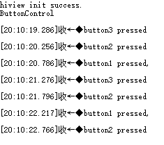

### 3.4.5 扩展实验

* 本实验学习了IO扩展芯片实现按键输入功能，请学生做如下实验：
  * 1、按键S1控制左右三色灯亮红色，按键S2控制左右三色灯亮蓝色，按键S3控制左右三色灯亮绿色。
  
      提示：代码参考2.3节，2.4节。

## 3.5 GPIO综合实验 

### 3.5.1 实验目的

* 本实验通过使用主芯片GPIO的输入和输出功能，实现对超声波的驱动。

### 3.5.2 实验要求

* 1.软件要求：VSCode，hi3861_hdu_iot_application(如果采用zip包下载，SDK名称为hi3861_hdu_iot_application-master，如果采用git下载SDK名称为hi3861_hdu_iot_application，此处以采用git下载为例）；

* 2.硬件要求：HISPARK_HI3861_IOT_VER.C开发套件；

* 3.接线要求：将MOTOR_EN拨码开关由ON拨到OFF，超声波模块J19-J1，J6：GPIO7 - TRIG；硬件搭建如下图所示：

    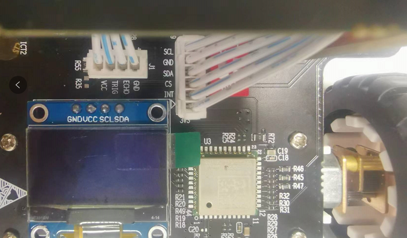 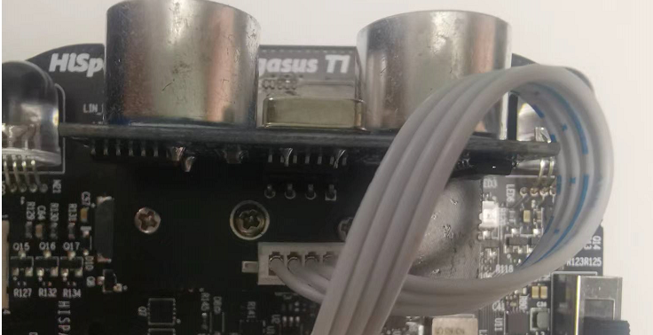
    
    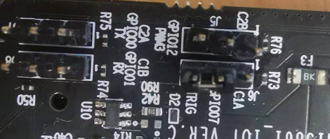 

### 3.5.3 实验流程

* 步骤一：hi3861_hdu_iot_application/src/vendor/hisilicon/hispark_pegasus/demo/hcsr04_demo文件夹复制到hi3861_hdu_iot_application/src/applications/sample/wifi-iot/app/目录下。

* 步骤二：修改applications/sample/wifi-iot/app/目录下的BUILD.gn，在features字段中添加hcsr04_demo: hcsr04_control。注：第一个hcsr04_demo指的是需要编译的工程目录，第二个hcsr04_control指的是applications/sample/wifi-iot/app/ hcsr04_demo/BUILD.gn文件中的静态库，名称为hcsr04_control。

```c
import("//build/lite/config/component/lite_component.gni")

lite_component("app") {
  features = [ "hcsr04_demo:hcsr04_control", ]
}
```

* 步骤三：超声波实现原理只需要提供一个 10uS 以上脉冲触发信号，该模块内部将发出 8 个 40kHz 周期电平并检测回波。一旦检测到有回波信号则输出回响信号 。回响信号的脉冲宽度与所测的距离成正比。由此通过发射信号到收到的回响信号时间间隔可以计算得到距离。公式：距离=高电平时间*声速（340M/S）/2；建议测量周期为 60ms 以上，以防止发射信号对回响信号的影响。

​			从硬件原理图可以分析出超声波传感器对应的管脚是ECHO_GPIO08和TRIG_GPIO07,关键代码如下所示：

```c
1 /*
2  * Copyright (c) 2022 HiSilicon (Shanghai) Technologies CO., LIMITED.
3  * Licensed under the Apache License, Version 2.0 (the "License");
4  * you may not use this file except in compliance with the License.
5  * You may obtain a copy of the License at
6  *
7  *     http://www.apache.org/licenses/LICENSE-2.0
8  *
9  * Unless required by applicable law or agreed to in writing, software
10  * distributed under the License is distributed on an "AS IS" BASIS,
11  * WITHOUT WARRANTIES OR CONDITIONS OF ANY KIND, either express or implied.
12  * See the License for the specific language governing permissions and
13  * limitations under the License.
14  */
15 
16 /*
17     HCSR05 超声波模块的相关API接口
18 */
19 #include <stdio.h>
20 #include <stdlib.h>
21 
22 #include "ohos_init.h"
23 #include "cmsis_os2.h"
24 #include "iot_watchdog.h"
25 #include "iot_gpio.h"
26 #include "hi_time.h"
27 #include "hi_io.h"
28 #include "iot_gpio_ex.h"
29 
30 #define DELAY_US20    20
31 #define DELAY_MS10    10
32 
33 void Hcsr04Init(void)
34 {
35     /*
36      * 设置超声波Echo为输入模式
37      * 设置GPIO8功能（设置为GPIO功能）
38      * Set ultrasonic echo as input mode
39      * Set GPIO8 function (set as GPIO function)
40      */
41     IoSetFunc(IOT_IO_NAME_GPIO_8, IOT_IO_FUNC_GPIO_8_GPIO);
42     /*
43      * 设置GPIO8为输入方向
44      * Set GPIO8 as the input direction
45      */
46     IoTGpioSetDir(IOT_IO_NAME_GPIO_8, IOT_GPIO_DIR_IN);
47     /*
48      * 设置GPIO7功能（设置为GPIO功能）
49      * Set GPIO7 function (set as GPIO function)
50      */
51     IoSetFunc(IOT_IO_NAME_GPIO_7, IOT_IO_FUNC_GPIO_7_GPIO);
52     /*
53      * 设置GPIO7为输出方向
54      * Set GPIO7 as the output direction
55      */
56     IoTGpioSetDir(IOT_IO_NAME_GPIO_7, IOT_GPIO_DIR_OUT);
57 }
58 
59 float GetDistance(void)
60 {
61     static unsigned long start_time = 0, time = 0;
62     float distance = 0.0;
63     IotGpioValue value = IOT_GPIO_VALUE0;
64     unsigned int flag = 0;
65     /*
66      * 设置GPIO7输出低电平
67      * 给trig发送至少10us的高电平脉冲，以触发传感器测距
68      * Set GPIO7 to output direction
69      * Send a high level pulse of at least 10us to the trig to trigger the range measurement of the sensor
70      */
71     IoTGpioSetOutputVal(IOT_IO_NAME_GPIO_7, IOT_GPIO_VALUE1);
72     hi_udelay(DELAY_US20);
73     IoTGpioSetOutputVal(IOT_IO_NAME_GPIO_7, IOT_GPIO_VALUE0);
74     /*
75      * 计算与障碍物之间的距离
76      * Calculate the distance from the obstacle
77      */
78     while (1) {
79         /*
80          * 获取GPIO8的输入电平状态
81          * Get the input level status of GPIO8
82          */
83         IoTGpioGetInputVal(IOT_IO_NAME_GPIO_8, &value);
84         /*
85          * 判断GPIO8的输入电平是否为高电平并且flag为0
86          * Judge whether the input level of GPIO8 is high and the flag is 0
87          */
88         if (value == IOT_GPIO_VALUE1 && flag == 0) {
89             /*
90              * 获取系统时间
91              * get SysTime
92              */
93             start_time = hi_get_us();
94             flag = 1;
95         }
96         /*
97          * 判断GPIO8的输入电平是否为低电平并且flag为1
98          * Judge whether the input level of GPIO8 is low and the flag is 1
99          */
100         if (value == IOT_GPIO_VALUE0 && flag == 1) {
101             /*
102              * 获取高电平持续时间
103              * Get high level duration
104              */
105             time = hi_get_us() - start_time;
106             break;
107         }
108     }
109     /* 计算距离障碍物距离（340米/秒 转换为 0.034厘米/微秒, 2代表去来，两倍距离） */
110     /* Calculate the distance from the obstacle */
111     /* (340 m/s is converted to 0.034 cm/microsecond 2 represents going and coming, twice the distance) */
112     distance = time * 0.034 / 2;
113     printf("distance is %0.2f cm\r\n", distance);
114     return distance;
115 }
116 
117 void Hcsr04SampleTask(void)
118 {
119     printf("Hcsr04SampleTask init\r\n");
120     while (1) {
121         GetDistance();
122         osDelay(DELAY_MS10);
123     }
124 }
125 
126 void Hcsr04SampleEntry(void)
127 {
128     osThreadAttr_t attr;
129     Hcsr04Init();
130     IoTWatchDogDisable();
131     attr.name = "Hcsr04SampleTask";
132     attr.attr_bits = 0U;
133     attr.cb_mem = NULL;
134     attr.cb_size = 0U;
135     attr.stack_mem = NULL;
136     attr.stack_size = 1024 * 5; // 堆栈大小为1024*5 stack size 5*1024
137     attr.priority = osPriorityNormal;
138 
139     if (osThreadNew((osThreadFunc_t)Hcsr04SampleTask, NULL, &attr) == NULL) {
140         printf("[Hcsr04SampleTask] Failed to create Hcsr04SampleTask!\n");
141     }
142 }
143 APP_FEATURE_INIT(Hcsr04SampleEntry);
```

- 步骤四：点击DevEco Device Tool工具“Rebuild”按键，具体编译步骤参考“1.4章节 运行第一个程序helloworld”


- 步骤五：点击DevEco Device Tool工具“Upload”按键，等待提示（出现Connecting，please reset device...），手动进行开发板复位（按下开发板reset键），将程序烧录到开发板中。具体烧录步骤参考“1.4章节 运行第一个程序helloworld”。

  

### 3.5.4 实验结果

* 软件烧录成功后，使用串口工具连接好小车的串口（<font color='RedOrange'>**注意：这里以sscom为例，该工具需要自己百度下载，也可以使用Monitor工具，参考“1.4 章节 运行第一个程序helloworld”**</font>)，按一下开发板的RESET按键复位开发板，可以看到超声波测量出来的距离信息在串口工具中打印出来,说明通过使用主芯片GPIO的输入和输出功能，实现对超声波传感器的驱动实验成功。


### 3.5.5 扩展实验

* 本实验学习了通过使用主芯片GPIO的输入和输出功能，实现超声波测距，请学生做如下实验：
  * 1、通过超声波模块实现控制左右两个三色灯亮不同颜色，当距离小于某个值，三色车灯亮红灯，大于某个值，三色车灯亮白灯。
  
      提示：参考GPIO-IO扩展芯片输出实验

 

## 3.6 PWM实验-芯片自带PWM实验 

### 3.6.1 实验目的

* 本实验通过使用芯片自带的PWM功能，实现对左右电机前进后退。

### 3.6.2 实验要求

* 1.软件要求：VSCode，hi3861_hdu_iot_application(如果采用zip包下载，SDK名称为hi3861_hdu_iot_application-master，如果采用git下载SDK名称为hi3861_hdu_iot_application，此处以采用git下载为例）；

* 2.硬件要求：HISPARK_HI3861_IOT_VER.C开发套件；

* 3.硬件配置：将MOTOR_EN拨码开关由OFF拨到ON，硬件搭建如下图所示：

    

### 3.6.3 接口说明

#### 3.6.3.1 IoTPwmInit()

| **定义：**   | unsigned   int IoTPwmInit(unsigned int port);            |
| ------------ | -------------------------------------------------------- |
| **功能：**   | 初始化指定PWM端口                                        |
| **参数：**   | Port：指定的PWM端口                                      |
| **返回值：** | IOT_SUCCESS：初始化成功    <br/>IOT_FAILURE：初始化失败  |
| **依赖：**   | //base/iot_hardware/peripheral/interfaces/kits/iot_pwm.h |

#### 3.6.3.2 IoTPwmStart()

| 定义：       | unsigned   int IoTPwmStart(unsigned int port, unsigned short duty, unsigned int freq); |
| ------------ | ------------------------------------------------------------ |
| **功能：**   | 启动PWM信号输出                                              |
| **参数：**   | Port：指定的PWM端口   <br/>duty：指PWM信号输出的占空比。该值范围为1到99   <br/>freq：指PWM信号输出的频率。取值范围为:[1,   65535] |
| **返回值：** | IOT_SUCCESS：启动成功    <br/>IOT_FAILURE：启动失败          |
| **依赖：**   | //base/iot_hardware/peripheral/interfaces/kits/iot_pwm.h     |

#### 3.6.3.3 IoTPwmStop()

| **定义：**   | unsigned   int IoTPwmStop(unsigned int port);            |
| ------------ | -------------------------------------------------------- |
| **功能：**   | 停止PWM信号输出                                          |
| **参数：**   | Port：指定的PWM端口                                      |
| **返回值：** | IOT_SUCCESS：停止成功    IOT_FAILURE：停止失败           |
| **依赖：**   | //base/iot_hardware/peripheral/interfaces/kits/iot_pwm.h |

#### 3.6.3.4 IoTPwmDeinit()

| 定义：   | unsigned   int IoTPwmDeinit(unsigned int port);          |
| -------- | -------------------------------------------------------- |
| 功能：   | 去初始化指定PWM端口                                      |
| 参数：   | Port：指定的PWM端口                                      |
| 返回值： | IOT_SUCCESS：设置成功    IOT_FAILURE：设置失败           |
| 依赖：   | //base/iot_hardware/peripheral/interfaces/kits/iot_pwm.h |

### 3.6.4 实验流程

* 步骤一：hi3861_hdu_iot_application/src/vendor/hisilicon/hispark_pegasus/demo/motor_demo文件夹复制到hi3861_hdu_iot_application/src/applications/sample/wifi-iot/app/目录下。

* 步骤二：修改applications/sample/wifi-iot/app/目录下的BUILD.gn，在features字段中添加motor_demo: motor_control。注：第一个motor_demo指的是需要编译的工程目录，第二个motor_control指的是applications/sample/wifi-iot/app/ motor_demo/BUILD.gn文件中的静态库，名称为motor_control。

```c
import("//build/lite/config/component/lite_component.gni")

lite_component("app") {
  features = [ "motor_demo:motor_control", ]
}
```

* 步骤三：PWM原理：脉冲宽度调制，即在一个周期内存在不同极性的电平状态；PWM频率：指一秒钟内从高电平时间在到低电平时间，再从低电平跳到高电平的瞬间次数，也就是一秒钟内有多少个PWM的周期，f = T / 1(HZ)；PWM周期：是指一秒钟内从高电平时间在到低电平时间，T = f / 1(s)；PWM周期：是指一秒钟内从高电平时间在到低电平时间，T = f / 1(s)。

    从硬件原理图可以分析出左轮的直流电机对应的是PWM_GPIO05、PWM_GPIO06，右轮直流电机对应的是PWM_GPIO09、PWM_GPIO10,核心代码如方下所示:

```c
1 /*
2  * Copyright (c) 2022 HiSilicon (Shanghai) Technologies CO., LIMITED.
3  * Licensed under the Apache License, Version 2.0 (the "License");
4  * you may not use this file except in compliance with the License.
5  * You may obtain a copy of the License at
6  *
7  *     http://www.apache.org/licenses/LICENSE-2.0
8  *
9  * Unless required by applicable law or agreed to in writing, software
10  * distributed under the License is distributed on an "AS IS" BASIS,
11  * WITHOUT WARRANTIES OR CONDITIONS OF ANY KIND, either express or implied.
12  * See the License for the specific language governing permissions and
13  * limitations under the License.
14  */
15 
16 /*
17     GA12-N20 直流减速电机的相关API接口
18     左轮：IB:GPIO5, IA: GPIO6
19     右轮：IB:GPIO9, IA: GPIO10
20 */
21 #include <stdio.h>
22 #include <unistd.h>
23 
24 #include "iot_gpio_ex.h"
25 #include "ohos_init.h"
26 #include "cmsis_os2.h"
27 #include "iot_gpio.h"
28 #include "iot_watchdog.h"
29 #include "iot_pwm.h"
30 
31 #define IOT_PWM_PORT_PWM0   0
32 #define IOT_PWM_PORT_PWM1   1
33 #define IOT_PWM_PORT_PWM2   2
34 #define IOT_PWM_PORT_PWM3   3
35 #define IOT_FREQ            65535
36 #define IOT_DUTY            50
37 
38 // PWM取值：分频系数[1, 65535] PWM value: frequency division coefficient [1, 65535]
39 void LeftWheelForword(void)
40 {
41     IoTPwmStart(IOT_PWM_PORT_PWM2, IOT_DUTY, IOT_FREQ);
42 }
43 
44 void LeftWheelBackword(void)
45 {
46     IoTPwmStart(IOT_PWM_PORT_PWM3, IOT_DUTY, IOT_FREQ);
47 }
48 
49 void LeftWheelStop(void)
50 {
51     IoTPwmStop(IOT_PWM_PORT_PWM2);
52     IoTPwmStop(IOT_PWM_PORT_PWM3);
53 }
54 
55 void RightWheelForword(void)
56 {
57     IoTPwmStart(IOT_PWM_PORT_PWM1, IOT_DUTY, IOT_FREQ);
58 }
59 
60 void RightWheelBackword(void)
61 {
62     IoTPwmStart(IOT_PWM_PORT_PWM0, IOT_DUTY, IOT_FREQ);
63 }
64 
65 void RightWheelStop(void)
66 {
67     IoTPwmStop(IOT_PWM_PORT_PWM0);
68     IoTPwmStop(IOT_PWM_PORT_PWM1);
69 }
70 
71 void GA12N20Init(void)
72 {
73     // 左电机GPIO5,GPIO6初始化 Initialization of left motor GPIO5 and GPIO6
74     IoTGpioInit(IOT_IO_NAME_GPIO_5);
75     IoTGpioInit(IOT_IO_NAME_GPIO_6);
76     // 右电机GPIO9, GPIO10初始化 Right motor GPIO9, GPIO10 initialization
77     IoTGpioInit(IOT_IO_NAME_GPIO_9);
78     IoTGpioInit(IOT_IO_NAME_GPIO_10);
79 
80     // 设置GPIO5的管脚复用关系为PWM2输出 Set the pin multiplexing relationship of GPIO5 to PWM2 output
81     IoSetFunc(IOT_IO_NAME_GPIO_5, IOT_IO_FUNC_GPIO_5_PWM2_OUT);
82     // 设置GPIO6的管脚复用关系为PWM3输出 Set the pin multiplexing relationship of GPIO6 to PWM3 output
83     IoSetFunc(IOT_IO_NAME_GPIO_6, IOT_IO_FUNC_GPIO_6_PWM3_OUT);
84     // 设置GPIO9的管脚复用关系为PWM0输出 Set the pin multiplexing relationship of GPIO9 to PWM0 output
85     IoSetFunc(IOT_IO_NAME_GPIO_9, IOT_IO_FUNC_GPIO_9_PWM0_OUT);
86     // 设置GPIO10的管脚复用关系为PWM01输出 Set the pin multiplexing relationship of GPIO10 to PWM01 output
87     IoSetFunc(IOT_IO_NAME_GPIO_10, IOT_IO_FUNC_GPIO_10_PWM1_OUT);
88 
89     // GPIO5方向设置为输出 GPIO5 direction set to output
90     IoTGpioSetDir(IOT_IO_NAME_GPIO_5, IOT_GPIO_DIR_OUT);
91     // GPIO6方向设置为输出 GPIO6 direction set to output
92     IoTGpioSetDir(IOT_IO_NAME_GPIO_6, IOT_GPIO_DIR_OUT);
93     // GPIO9方向设置为输出 GPIO9 direction set to output
94     IoTGpioSetDir(IOT_IO_NAME_GPIO_9, IOT_GPIO_DIR_OUT);
95     // GPIO10方向设置为输出 GPIO10 direction set to output
96     IoTGpioSetDir(IOT_IO_NAME_GPIO_10, IOT_GPIO_DIR_OUT);
97     // 初始化PWM2 Initialize PWM2
98     IoTPwmInit(IOT_PWM_PORT_PWM2);
99     // 初始化PWM3 Initialize PWM3
100     IoTPwmInit(IOT_PWM_PORT_PWM3);
101     // 初始化PWM0 Initialize PWM0
102     IoTPwmInit(IOT_PWM_PORT_PWM0);
103     // 初始化PWM1 Initialize PWM1
104     IoTPwmInit(IOT_PWM_PORT_PWM1);
105     // 先使两个电机处于停止状态 motors stop
106     RightWheelStop();
107     LeftWheelStop();
108 }
109 
110 void GA12N205Task(void)
111 {
112     // 初始化电机模块 Initialize the motor module
113     GA12N20Init();
114     // 实现左电机向前转动 Realize the forward rotation of the left motor
115     LeftWheelForword();
116     // 实现右电机向前转动 The right motor rotates forward
117     RightWheelForword();
118 }
119 
120 void GA12N20SampleEntry(void)
121 {
122     osThreadAttr_t attr;
123     IoTWatchDogDisable();
124     attr.name = "GA12N205Task";
125     attr.attr_bits = 0U;
126     attr.cb_mem = NULL;
127     attr.cb_size = 0U;
128     attr.stack_mem = NULL;
129     attr.stack_size = 1024 * 5; // 堆栈大小为1024*5,stack size 1024*5
130     attr.priority = osPriorityNormal;
131 
132     if (osThreadNew((osThreadFunc_t)GA12N205Task, NULL, &attr) == NULL) {
133         printf("[GA12N205Task] Failed to create Hcsr04SampleTask!\n");
134     }
135 }
136 
137 APP_FEATURE_INIT(GA12N20SampleEntry);
```

- 步骤四：修改hi3861_hdu_iot_application/src/device/hisilicon/hispark_pegasus/sdk_liteos/build/config/usr_config.mk文件。在这个配置文件中打开PWM驱动宏。搜索字段CONFIG_PWM_SUPPORT ，并打开PWM。配置如下：
  
  ```
  # CONFIG_PWM_SUPPORT is not set
  CONFIG_PWM_SUPPORT=y
  ```
  
- 步骤五：点击DevEco Device Tool工具“Rebuild”按键，具体编译步骤参考“1.4章节 运行第一个程序helloworld”


- 步骤六：点击DevEco Device Tool工具“Upload”按键，等待提示（出现Connecting，please reset device...），手动进行开发板复位（按下开发板reset键），将程序烧录到开发板中。具体烧录步骤参考“1.4章节 运行第一个程序helloworld”。

  

### 3.6.5 实验结果

* 软件烧录成功后，按一下开发板的RESET按键复位开发板，可以看到小车可以正常的往前行驶，说明我们使用芯片自带的PWM功能，实现对电机控制的实验成功。

### 3.6.6 扩展实验

* 本实验学习了通过使用芯片自带的PWM功能，实现对电机的控制，请学生做如下实验：

    * 1、  通过使用PWM功能，实现对蜂鸣器的控制；

    提示：GPIO 12复用PWM3实现蜂鸣器鸣响。

    * 2、  通过使用芯片自带的PWM功能，实现对黄色交通灯亮度的控制；

    提示：GPIO 5复用PWM2功能，实现对黄色交通灯亮度的控制。

## 3.7 PWM实验-GPIO模拟PWM实验 

### 3.7.1 实验目的

* 本实验通过使用GPIO模拟PWM的功能，实现对舵机的控制。

### 3.7.2 实验要求

* 1.软件要求：VSCode，hi3861_hdu_iot_application(如果采用zip包下载，SDK名称为hi3861_hdu_iot_application-master，如果采用git下载SDK名称为hi3861_hdu_iot_application，此处以采用git下载为例）；

* 2.硬件要求：HISPARK_HI3861_IOT_VER.C开发套件；

* 3.接线：将MOTOR_EN拨码开关由ON拨到OFF，舵机 - J3；注意：由于舵机使用5V供电使用需要插上电池）;硬件搭建如下图所示：

    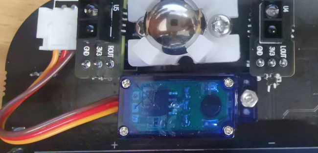 

### 3.7.3 实验流程

* 步骤一：hi3861_hdu_iot_application/src/vendor/hisilicon/hispark_pegasus/demo/sg92r_demo文件夹复制到hi3861_hdu_iot_application/src/applications/sample/wifi-iot/app/目录下。

* 步骤二：修改applications/sample/wifi-iot/app/目录下的BUILD.gn，在features字段中添加sg92r_demo: sg92r_control。注：第一个sg92r_demo指的是需要编译的工程目录，第二个sg92r_control指的是applications/sample/wifi-iot/app/ sg92r_demo/BUILD.gn文件中的静态库，名称为sg92r_control。

```c
import("//build/lite/config/component/lite_component.gni")

lite_component("app") {
  features = [ "sg92r_demo:sg92r_control", ]
}
```

* 步骤三：Sg92r舵机原理：Sg92舵机的控制需要产生一个20ms的脉冲信号，以0.5ms到2.5ms的高电平来控制舵机的角度；高电平持续时间对应角度如下表所示。

    | 高电平持续时间 | 角度 |
    | -------------- | ---- |
    | 0.5ms          | 0°   |
    | 1.0ms          | 45°  |
    | 1.5ms          | 90°  |
    | 2.0ms          | 135° |
    | 2.5ms          | 180° |

    从硬件原理图可以分析PWM舵机对应的是PWM_GPIO02，因此我们可以通过使用GPIO02模拟PWM，实现对舵机的驱动，核心代码如方下所示:

```c
1 /*
2  * Copyright (c) 2022 HiSilicon (Shanghai) Technologies CO., LIMITED.
3  * Licensed under the Apache License, Version 2.0 (the "License");
4  * you may not use this file except in compliance with the License.
5  * You may obtain a copy of the License at
6  *
7  *     http://www.apache.org/licenses/LICENSE-2.0
8  *
9  * Unless required by applicable law or agreed to in writing, software
10  * distributed under the License is distributed on an "AS IS" BASIS,
11  * WITHOUT WARRANTIES OR CONDITIONS OF ANY KIND, either express or implied.
12  * See the License for the specific language governing permissions and
13  * limitations under the License.
14  */
15 
16 #include <stdio.h>
17 #include <stdlib.h>
18 
19 #include "ohos_init.h"
20 #include "cmsis_os2.h"
21 #include "iot_gpio.h"
22 #include "hi_io.h"
23 #include "iot_gpio_ex.h"
24 #include "iot_watchdog.h"
25 #include "hi_time.h"
26 
27 #define  COUNT   10
28 #define  FREQ_TIME    20000
29 
30 void SetAngle(unsigned int duty)
31 {
32     unsigned int time = FREQ_TIME;
33 
34     IoTGpioSetOutputVal(IOT_IO_NAME_GPIO_2, IOT_GPIO_VALUE1);
35     hi_udelay(duty);
36     IoTGpioSetOutputVal(IOT_IO_NAME_GPIO_2, IOT_GPIO_VALUE0);
37     hi_udelay(time - duty);
38 }
39 
40 /* The steering gear is centered
41  * 1、依据角度与脉冲的关系，设置高电平时间为1500微秒
42  * 2、不断地发送信号，控制舵机居中
43 */
44 void RegressMiddle(void)
45 {
46     unsigned int angle = 1500;
47     for (int i = 0; i < COUNT; i++) {
48         SetAngle(angle);
49     }
50 }
51 
52 /* Turn 90 degrees to the right of the steering gear
53  * 1、依据角度与脉冲的关系，设置高电平时间为500微秒
54  * 2、不断地发送信号，控制舵机向右旋转90度
55 */
56 /*  Steering gear turn right */
57 void EngineTurnRight(void)
58 {
59     unsigned int angle = 500;
60     for (int i = 0; i < COUNT; i++) {
61         SetAngle(angle);
62     }
63 }
64 
65 /* Turn 90 degrees to the left of the steering gear
66  * 1、依据角度与脉冲的关系，设置高电平时间为2500微秒
67  * 2、不断地发送信号，控制舵机向左旋转90度
68 */
69 /* Steering gear turn left */
70 void EngineTurnLeft(void)
71 {
72     unsigned int angle = 2500;
73     for (int i = 0; i < COUNT; i++) {
74         SetAngle(angle);
75     }
76 }
77 
78 void S92RInit(void)
79 {
80     IoTGpioInit(IOT_IO_NAME_GPIO_2);
81     IoSetFunc(IOT_IO_NAME_GPIO_2, IOT_IO_FUNC_GPIO_2_GPIO);
82     IoTGpioSetDir(IOT_IO_NAME_GPIO_2, IOT_GPIO_DIR_OUT);
83 }
84 
85 void Sg92RTask(void)
86 {
87     unsigned int time = 200;
88     S92RInit();
89 
90     while (1) {
91         /* 舵机归中 Steering gear centering */
92         RegressMiddle();
93         TaskMsleep(time);
94 
95         /*
96          * 舵机左转90度
97          * Steering gear turns 90 degrees to the left
98          */
99         EngineTurnLeft();
100         TaskMsleep(time);
101 
102         /* 舵机归中 Steering gear centering */
103         RegressMiddle();
104         TaskMsleep(time);
105 
106         /*
107          * 舵机右转90度
108          * Steering gear turns right 90 degrees
109          */
110         EngineTurnRight();
111         TaskMsleep(time);
112 
113         /* 舵机归中 Steering gear centering */
114         RegressMiddle();
115         TaskMsleep(time);
116     }
117 }
118 
119 void Sg92rSampleEntry(void)
120 {
121     osThreadAttr_t attr;
122     IoTWatchDogDisable();
123     attr.name = "Sg92RTask";
124     attr.attr_bits = 0U;
125     attr.cb_mem = NULL;
126     attr.cb_size = 0U;
127     attr.stack_mem = NULL;
128     attr.stack_size = 1024 * 5; // 堆栈大小为1024*5 stack size 5*1024
129     attr.priority = osPriorityNormal;
130 
131     if (osThreadNew((osThreadFunc_t)Sg92RTask, NULL, &attr) == NULL) {
132         printf("[GA12N205Task] Failed to create Hcsr04SampleTask!\n");
133     }
134 }
135 
136 APP_FEATURE_INIT(Sg92rSampleEntry);
```

- 步骤四：点击DevEco Device Tool工具“Rebuild”按键，具体编译步骤参考“1.4章节 运行第一个程序helloworld”


- 步骤五：点击DevEco Device Tool工具“Upload”按键，等待提示（出现Connecting，please reset device...），手动进行开发板复位（按下开发板reset键），将程序烧录到开发板中。具体烧录步骤参考“1.4章节 运行第一个程序helloworld”。

  

### 3.7.4 实验结果

* 软件烧录成功后，按一下开发板的RESET按键复位开发板，可以看到小车的舵机模块一直在循环的进行舵机归中，舵机左转90度，舵机归中，舵机右转90度，舵机归中的操作，说明我们使用GPIO模拟PWM的功能，实现对舵机控制的实验成功。

    

### 3.7.5 扩展实验

* 本实验学习了通过使用GPIO模拟PWM的功能，实现对舵机的控制，请学生做如下实验：
  * 1、通过使用GPIO模拟PWM的功能，实现对蜂鸣器的控制。
  
      提示：蜂鸣器鸣响通过GPIO12高低电平持续时间，实现模拟PWM信号。

## 3.8 I2C实验-单I2C轮询实验 

### 3.8.1 实验目的

* 本实验通过使用单I2C轮询的功能，实现对电量的检测，并将实时电量在OLED屏幕上面显示。**电量检测芯片手册(型号：CW2015CHBD；品牌：Cellwise赛微)获取：https://so.szlcsc.com/global.html?k=CW2015&hot-key=LM358DR2G，点击数据手册进行下载**。

### 3.8.2 实验要求

* 1.软件要求：VSCode，hi3861_hdu_iot_application(如果采用zip包下载，SDK名称为hi3861_hdu_iot_application-master，如果采用git下载SDK名称为hi3861_hdu_iot_application，此处以采用git下载为例）；

* 2.接线：将MOTOR_EN拨码开关由ON拨到OFF；硬件要求：HISPARK_HI3861_IOT_VER.C开发套件；

  

### 3.8.3 接口说明

#### 3.8.3.1 IoTI2cInit()

| **定义：**   | unsigned   int IoTI2cInit(unsigned int id, unsigned int baudrate); |
| ------------ | ------------------------------------------------------------ |
| **功能：**   | 以指定的波特率初始化I2C设备。                                |
| **参数：**   | id:I2C设备ID   <br/>baudrate：指定的I2C波特率                |
| **返回值：** | IOT_SUCCESS：初始化成功    IOT_FAILURE：初始化失败           |
| **依赖：**   | //base/iot_hardware/peripheral/interfaces/kits/iot_i2c.h     |

#### 3.8.3.2 IoTI2cDeinit()

| **定义：**   | unsigned   int IoTI2cDeinit(unsigned int id);            |
| ------------ | -------------------------------------------------------- |
| **功能：**   | 去初始化I2c设备                                          |
| **参数：**   | id：I2C设备ID                                            |
| **返回值：** | IOT_SUCCESS：去初始化成功    IOT_FAILURE：去初始化失败   |
| **依赖：**   | //base/iot_hardware/peripheral/interfaces/kits/iot_i2c.h |

#### 3.8.3.3 IoTI2cWrite()

| 定义：       | unsigned   int IoTI2cWrite(unsigned int id, unsigned short deviceAddr, <br/>const unsigned   char *data, unsigned int dataLen); |
| ------------ | ------------------------------------------------------------ |
| **功能：**   | 将数据写入I2C设备                                            |
| **参数：**   | id：I2C设备id   <br/>deviceAddr：I2C设备地址    <br/>data：指向要写入的数据的指针     <br/>dataLen：指向要写入的数据长度 |
| **返回值：** | IOT_SUCCESS：数据写入成功    IOT_FAILURE：数据写入失败       |
| **依赖：**   | //base/iot_hardware/peripheral/interfaces/kits/iot_i2c.h     |

#### 3.8.3.4 IoTI2cRead()

| **定义：**   | unsigned   int IoTI2cRead(unsigned int id, unsigned short deviceAddr, <br/>unsigned char   *data, unsigned int dataLen); |
| ------------ | ------------------------------------------------------------ |
| **功能：**   | 从I2C设备读取数据                                            |
| **参数：**   | id：I2C设备id       deviceAddr：I2C设备地址    <br/>data：表示指向要读取的数据的指针     dataLen：表示要读取的数据长度 |
| **返回值：** | IOT_SUCCESS：数据读取成功    IOT_FAILURE：数据读取失败       |
| **依赖：**   | //base/iot_hardware/peripheral/interfaces/kits/iot_i2c.h     |

#### 3.8.3.5 IoTI2cSetBaudrate()

| **定义：**   | unsigned   int IoTI2cSetBaudrate(unsigned int id, unsigned int baudrate); |
| ------------ | ------------------------------------------------------------ |
| **功能：**   | 设置I2C设备的波特率                                          |
| **参数：**   | id：I2C设备ID   <br/>baudrate：指定的I2C波特率口             |
| **返回值：** | IOT_SUCCESS：设置成功    IOT_FAILURE：设置失败               |
| **依赖：**   | //base/iot_hardware/peripheral/interfaces/kits/iot_i2c.h     |

### 3.8.4 实验流程

* 步骤一：hi3861_hdu_iot_application/src/vendor/hisilicon/hispark_pegasus/demo/cw2015_demo文件夹复制到hi3861_hdu_iot_application/src/applications/sample/wifi-iot/app/目录下。

* 步骤二：修改applications/sample/wifi-iot/app/目录下的BUILD.gn，在features字段中添加cw2015_demo:cw2015_control。注：第一个cw2015_demo指的是需要编译的工程目录，第二个cw2015_control指的是applications/sample/wifi-iot/app/cw2015_demo/BUILD.gn文件中的静态库，名称为cw2015_control。


```c
import("//build/lite/config/component/lite_component.gni")

lite_component("app") {
  features = [ "cw2015_demo:cw2015_control", ]
}
```

* 步骤三：I2C通信原理：I2C通信中，主机通过时钟线SCL发送时钟信号，通过数据线SDA发送数据（包括从机地址、指令、数据包等），在发送完一帧数据后，需要等待从机的响应，才能继续发送下一帧数据，因此I2C属于同步通信。

    从硬件原理图可以分析出电源监控传感器与开发板板子通过 I2C0(SDA_GPIO13、SCL_GPIO14) 连接，通讯波特率为 400K,因此我们代码需要通过 I2C 的读写函数读回电池电量值，核心代码如方下所示:

```c
1 /*
2  * Copyright (c) 2022 HiSilicon (Shanghai) Technologies CO., LIMITED.
3  * Licensed under the Apache License, Version 2.0 (the "License");
4  * you may not use this file except in compliance with the License.
5  * You may obtain a copy of the License at
6  *
7  *     http://www.apache.org/licenses/LICENSE-2.0
8  *
9  * Unless required by applicable law or agreed to in writing, software
10  * distributed under the License is distributed on an "AS IS" BASIS,
11  * WITHOUT WARRANTIES OR CONDITIONS OF ANY KIND, either express or implied.
12  * See the License for the specific language governing permissions and
13  * limitations under the License.
14  */
15 
16 #include <stdio.h>
17 #include <stdint.h>
18 #include <string.h>
19 #include <unistd.h>
20 
21 #include "ohos_init.h"
22 #include "cmsis_os2.h"
23 #include "iot_gpio_ex.h"
24 #include "iot_i2c.h"
25 #include "iot_gpio.h"
26 #include "iot_errno.h"
27 #include "iot_watchdog.h"
28 #include "hi_errno.h"
29 #include "hi_i2c.h"
30 #include "oled_ssd1306.h"
31 
32 #define IOT_I2C_IDX_BAUDRATE (400 * 1000)
33 #define CW2015_I2C_IDX 0
34 #define IOT_PWM_PORT_PWM3   3
35 #define CW2015_READ_ADDR     (0xC5)
36 #define CW2015_WRITE_ADDR    (0xC4)
37 #define WRITELEN  2
38 #define CW2015_HIGHT_REGISTER 0x02
39 #define CW2015_LOW_REGISTER   0x03
40 #define CW2015_WAKE_REGISTER  0x0A
41 #define DELYA_US20            20
42 
43 /*
44  * @berf i2c read
45  * @param hi_u8 reg_high_8bit_cmd:Transmit register value 8 bits high
46  * @param hi_u8 reg_low_8bit_cmd:Transmit register value low 8 bits
47  * @param hi_u8* recv_data:Receive data buff
48  * @param hi_u8 send_len:Sending data length
49  * @param hi_u8 read_len:Length of received data
50  */
51 uint32_t Cw20_WriteRead(uint8_t reg_high_8bit_cmd, uint8_t send_len, uint8_t read_len)
52 {
53     uint32_t status = 0;
54     uint32_t ret = 0;
55     uint8_t recvData[888] = { 0 };
56     hi_i2c_data i2c_write_cmd_addr = { 0 };
57     uint8_t send_user_cmd[1] = {reg_high_8bit_cmd};
58     memset(recvData, 0x0, sizeof(recvData));
59     i2c_write_cmd_addr.send_buf = send_user_cmd;
60     i2c_write_cmd_addr.send_len = send_len;
61 
62     i2c_write_cmd_addr.receive_buf = recvData;
63     i2c_write_cmd_addr.receive_len = read_len;
64 
65     status = hi_i2c_writeread(CW2015_I2C_IDX, CW2015_READ_ADDR, &i2c_write_cmd_addr);
66     if (status != IOT_SUCCESS) {
67         printf("I2cRead() failed, %0X!\n", status);
68         return status;
69     }
70     ret = recvData[0];
71     return ret;
72 }
73 
74 uint32_t Cw20_Write(uint8_t addr, uint8_t writedata, uint32_t buffLen)
75 {
76     uint8_t buffer[2] = {addr, writedata};
77     uint32_t retval = IoTI2cWrite(CW2015_I2C_IDX, CW2015_WRITE_ADDR, buffer, buffLen);
78     if (retval != IOT_SUCCESS) {
79         printf("IoTI2cWrite(%02X) failed, %0X!\n", buffer[0], retval);
80         return retval;
81     }
82     printf("IoTI2cWrite(%02X)\r\n", buffer[0]);
83     return IOT_SUCCESS;
84 }
85 
86 void CW2015Init(void)
87 {
88     /*
89      * 初始化I2C设备0，并指定波特率为400k
90      * Initialize I2C device 0 and specify the baud rate as 400k
91      */
92     IoTI2cInit(CW2015_I2C_IDX, IOT_I2C_IDX_BAUDRATE);
93     /*
94      * 设置I2C设备0的波特率为400k
95      * Set the baud rate of I2C device 0 to 400k
96      */
97     IoTI2cSetBaudrate(CW2015_I2C_IDX, IOT_I2C_IDX_BAUDRATE);
98     /*
99      * 设置GPIO13的管脚复用关系为I2C0_SDA
100      * Set the pin reuse relationship of GPIO13 to I2C0_ SDA
101      */
102     IoSetFunc(IOT_IO_NAME_GPIO_13, IOT_IO_FUNC_GPIO_13_I2C0_SDA);
103     /*
104      * 设置GPIO14的管脚复用关系为I2C0_SCL
105      * Set the pin reuse relationship of GPIO14 to I2C0_ SCL
106      */
107     IoSetFunc(IOT_IO_NAME_GPIO_14, IOT_IO_FUNC_GPIO_14_I2C0_SCL);
108     /* 使电量检测模块从sleep mode变为wake up mode,0x00代表唤醒,0x11代表沉睡,2代表2bit控制 */
109     /* Change the power detection module from sleep mode to wake up mode. */
110     /* 0x00 represents wake-up, 0x11 represents deep sleep, and 2 bit control */
111     Cw20_Write(CW2015_WAKE_REGISTER, 0x00, 2);
112 }
113 
114 float GetVoltage(void)
115 {
116     uint8_t buff[WRITELEN] = {0};
117     float voltage = 0;
118     uint32_t temp = 0;
119     // 读取电压的前6位 Read the first 6 bits of voltage
120     buff[0] = Cw20_WriteRead(CW2015_HIGHT_REGISTER, 1, 1);
121     // 读取电压的后8位 Read the last 8 bits of voltage
122     buff[1] = Cw20_WriteRead(CW2015_LOW_REGISTER, 1, 1);
123     /* 通过位运算最后得到14位的A/D测量值 */
124     /* The final 14 bit A/D measurement value is obtained through bit operation */
125     /* 将buf[0]左移8位与buf[1]组成最终电压值 */
126     /* Move buf [0] to the left by 8 bits to form the final voltage value with buf [1] */
127     temp = (buff[0] << 8) | buff[1];
128     /* 通过计算得到最终的电压值 （CW2015的电压分辨率为305.0uV,转换1uv = 1 / 1） */
129     /* The final voltage value is obtained through calculation */
130     /* the voltage resolution of CW2015 is 305.0uV, and the conversion 1uv=1/1) */
131     voltage = temp * 305.0 / 1;
132     return voltage;
133 }
134 
135 static void CW2015Task(void)
136 {
137     static char line[32] = {0};
138     float voltage = 0.0;
139 
140     CW2015Init();
141     OledInit();
142     OledFillScreen(0);
143     while (1) {
144         voltage = GetVoltage();
145         int ret = snprintf(line, sizeof(line), "voltage: %.2f", voltage);
146         if (ret != 13) { // 需要显示的字符串长度为13，The length of the string to be displayed is 13
147             printf("GetVoltage failed\r\n");
148         }
149         /* 在OLED屏幕的第20列5行显示1行 */
150         /* Display 1 row in the 20th column and 5 rows of OLED screen */
151         OledShowString(20, 5, line, 1);
152         usleep(DELYA_US20);
153     }
154 }
155 
156 void CW2015SampleEntry(void)
157 {
158     osThreadAttr_t attr;
159     IoTWatchDogDisable();
160     attr.name = "CW2015Task";
161     attr.attr_bits = 0U;
162     attr.cb_mem = NULL;
163     attr.cb_size = 0U;
164     attr.stack_mem = NULL;
165     attr.stack_size = 1024 * 5; // 堆栈大小为1024*5，The stack size is 1024 * 5
166     attr.priority = osPriorityNormal;
167 
168     if (osThreadNew((osThreadFunc_t)CW2015Task, NULL, &attr) == NULL) {
169         printf("[CW2015Task] Failed to create CW2015TaskSampleTask!\n");
170     }
171 }
172 
173 APP_FEATURE_INIT(CW2015SampleEntry);
```

* 步骤四：修改hi3861_hdu_iot_application/src/device/hisilicon/hispark_pegasus/sdk_liteos/build/config/usr_config.mk文件。在这个配置文件中打开I2C驱动宏。搜索字段CONFIG_I2C_SUPPORT ，并打开I2C。配置如下：

    ```
    # CONFIG_I2C_SUPPORT is not set
    CONFIG_I2C_SUPPORT=y
    ```

- 步骤五：点击DevEco Device Tool工具“Rebuild”按键，具体编译步骤参考“1.4章节 运行第一个程序helloworld”


- 步骤六：点击DevEco Device Tool工具“Upload”按键，等待提示（出现Connecting，please reset device...），手动进行开发板复位（按下开发板reset键），将程序烧录到开发板中。具体烧录步骤参考“1.4章节 运行第一个程序helloworld”。

  

### 3.8.5 实验结果

* 软件烧录成功后，按一下开发板的RESET按键复位开发板，可以看到OLED屏幕上面实时显示此时小车的电压信息，说明我们使用单I2C轮询的功能，实现对电量的检测的实验成功。

    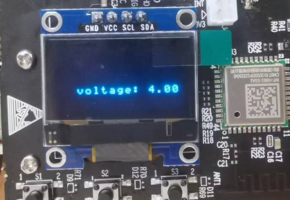

### 3.8.6 扩展实验

* 本实验学习了通过使用单I2C轮询的功能，实现对电量的检测，请学生做如下实验：
  
  * 1、  使用单I2C轮询的功能，实现与RTC进行通信，OLED屏幕显示万年历。
  
  ​	提示：RTC 芯片手册（编号：C2924605，型号： INS5699S） 获取：https://so.szlcsc.com/global.html?k=C2924605&hot-key=LM358DR2G，点击数据手册进行下载。硬件接线：I2C0_SDA_GPIO 13，I2C0_SDA_GPIO 14，INT_RTC - IO0_5
  
  * 原理：先通过I2C设置RTC时间，在读取RTC寄存器，并将时间显示在屏幕上。
  
  * 部分代码参考（完整代码参考：rtc_demo）：
  
      ```c
      1 /*
      2  * Copyright (c) 2022 HiSilicon (Shanghai) Technologies CO., LIMITED.
      3  * Licensed under the Apache License, Version 2.0 (the "License");
      4  * you may not use this file except in compliance with the License.
      5  * You may obtain a copy of the License at
      6  *
      7  *     http://www.apache.org/licenses/LICENSE-2.0
      8  *
      9  * Unless required by applicable law or agreed to in writing, software
      10  * distributed under the License is distributed on an "AS IS" BASIS,
      11  * WITHOUT WARRANTIES OR CONDITIONS OF ANY KIND, either express or implied.
      12  * See the License for the specific language governing permissions and
      13  * limitations under the License.
      14  */
      15 
      16 #include <stdio.h>
      17 #include <stdint.h>
      18 #include <string.h>
      19 #include <unistd.h>
      20 #include "ohos_init.h"
      21 #include "cmsis_os2.h"
      22 #include "iot_gpio.h"
      23 #include "iot_errno.h"
      24 #include "hi_errno.h"
      25 #include "hi_time.h"
      26 #include "ssd1306_fonts.h"
      27 #include "oled_ssd1306.h"
      28 #include "iot_gpio_ex.h"
      29 #include "iot_i2c.h"
      30 #include "app_demo_rtc.h"
      31 
      32 #define IOT_I2C_IDX_BAUDRATE (400 * 1000)
      33 #define INS5902_I2C_IDX      0
      34 #define DECIMA               10
      35 #define HEX                  16
      36 
      37 int second = 0;
      38 int minute = 0;
      39 int hour = 0;
      40 int day = 0;
      41 int date = 0;
      42 int month = 0;
      43 int year = 0;
      44 
      45 /* gpio init */
      46 void gpio_init(void)
      47 {
      48     // 设置GPIO13的管脚复用关系为I2C0_SDA Set the pin reuse relationship of GPIO13 to I2C0_ SDA
      49     IoSetFunc(IOT_IO_NAME_GPIO_13, IOT_IO_FUNC_GPIO_13_I2C0_SDA);
      50     // 设置GPIO14的管脚复用关系为I2C0_SCL Set the pin reuse relationship of GPIO14 to I2C0_ SCL
      51     IoSetFunc(IOT_IO_NAME_GPIO_14, IOT_IO_FUNC_GPIO_14_I2C0_SCL);
      52 }
      53 
      54 uint32_t ins5902_i2c_write(uint8_t reg_addr, uint8_t high_8, uint8_t low_8, uint8_t reg_len)
      55 {
      56     uint8_t temp1 = 0;
      57     uint8_t temp2 = 0;
      58     temp1 = (high_8 / DECIMA * HEX) + (high_8 % DECIMA); // Hexadecimal to BCD
      59     temp2 = (low_8 / DECIMA * HEX) + (low_8 % DECIMA); // Hexadecimal to BCD
      60     uint8_t buffer[3] = {reg_addr, temp1, temp2};
      61     uint32_t retval = IoTI2cWrite(INS5902_I2C_IDX, INS5902_WRITE_ADDRESS, buffer, reg_len);
      62     if (retval != IOT_SUCCESS) {
      63         printf("IoTI2cWrite(%02X) failed, %0X!\n", buffer[0], retval);
      64         return retval;
      65     }
      66     printf("IoTI2cWrite(%02X)\r\n", buffer[0]);
      67     return IOT_SUCCESS;
      68 }
      69 
      70 
      71 uint32_t ins5902_write(uint8_t reg_addr, uint8_t high_8)
      72 {
      73     uint8_t buffer[2] = {reg_addr, high_8};
      74     uint32_t buffLen = 2;
      75     uint32_t retval = IoTI2cWrite(INS5902_I2C_IDX, INS5902_WRITE_ADDRESS, buffer, buffLen);
      76     if (retval != IOT_SUCCESS) {
      77         printf("IoTI2cWrite(%02X) failed, %0X!\n", buffer[0], retval);
      78         return retval;
      79     }
      80     printf("IoTI2cWrite(%02X)\r\n", buffer[0]);
      81     return IOT_SUCCESS;
      82 }
      83 
      84 uint8_t ins5902_read(uint8_t rtc_reg, uint32_t recv_len, uint8_t *rct_buf)
      85 {
      86     // ins5902_rtc_type read_rtc;
      87     uint8_t recv_data[INS5902_REG_ARRAY_LEN] = { 0 };
      88     /* Request memory space */
      89     memset(rct_buf, 0x00, sizeof(rct_buf));
      90     memset(recv_data, 0x0, sizeof(recv_data));
      91 
      92     uint32_t status = IoTI2cRead(INS5902_I2C_IDX, INS5902_READ_ADDRESS, recv_data, recv_len);
      93     if (status != HI_ERR_SUCCESS) {
      94         printf("===== Error: ins5902 sencor I2C read status = 0x%x! =====\r\n", status);
      95         return status;
      96     }
      97     switch (rtc_reg) {
      98         case RTC_SECOND:
      99             rct_buf[0] = recv_data[0];
      100             break;
      101         case RTC_MINUTE:
      102             rct_buf[0] = recv_data[0];
      103             break;
      104         case RTC_HOUR:
      105             rct_buf[0] = recv_data[0];
      106             break;
      107         case RTC_DAY :
      108             rct_buf[0] = recv_data[0];
      109             break;
      110         case RTC_DATE:
      111             rct_buf[0] = recv_data[0];
      112             break;
      113         case RTC_MONTH:
      114             rct_buf[0] = recv_data[0];
      115             break;
      116         case RTC_YEAR:
      117             rct_buf[0] = recv_data[0];
      118             break;
      119         default:
      120             break;
      121     }
      122     return rct_buf[0];
      123 }
      124 /* rtc timer setting */
      125 void rct_set_init(void)
      126 {
      127     uint32_t ret;
      128     ins5902_rtc_type rct_time_set = { 0 };
      129     rct_time_set.rtc_second[0] = 30; // 30代表秒 30 represents seconds
      130     rct_time_set.rtc_minue[0] = 05; // 05代表分钟 05 for minutes
      131     rct_time_set.rtc_hour[0] = 17; // 17代表小时 17 represents hours
      132     rct_time_set.rtc_day[0] = 5; // 5代表周6 5 represents week 6
      133     rct_time_set.rtc_date[0] = 4; // 4代表号 4 Representative No
      134     rct_time_set.rtc_month[0] = 6; // 6代表月 6 representative months
      135     rct_time_set.rtc_year[0] = 22; // 22代表年 22 Representative year
      136     // set second
      137     ret = ins5902_i2c_write(RTC_SECOND, rct_time_set.rtc_second[0], NULL, SEND_SET_REG_LEN);
      138     if (ret != HI_ERR_SUCCESS) {
      139         printf("Failed to second cmd\r\n");
      140     }
      141     hi_udelay(DELAY_TIME);
      142     // set minute
      143     ret = ins5902_i2c_write(RTC_MINUTE, rct_time_set.rtc_minue[0], NULL, SEND_SET_REG_LEN);
      144     if (ret != HI_ERR_SUCCESS) {
      145         printf("Failed to minute cmd\r\n");
      146     }
      147     hi_udelay(DELAY_TIME);
      148     // set hour
      149     ret = ins5902_i2c_write(RTC_HOUR, rct_time_set.rtc_hour[0], NULL, SEND_SET_REG_LEN);
      150     if (ret != HI_ERR_SUCCESS) {
      151         printf("Failed to hour cmd\r\n");
      152     }
      153     hi_udelay(DELAY_TIME);
      154     // set day
      155     ret = ins5902_i2c_write(RTC_DAY, rct_time_set.rtc_day[0], NULL, SEND_SET_REG_LEN);
      156     if (ret != HI_ERR_SUCCESS) {
      157         printf("Failed to day cmd\r\n");
      158     }
      159     hi_udelay(DELAY_TIME);
      160     // set date
      161     ret = ins5902_i2c_write(RTC_DATE, rct_time_set.rtc_date[0], NULL, SEND_SET_REG_LEN);
      162     if (ret != HI_ERR_SUCCESS) {
      163         printf("Failed to date cmd\r\n");
      164     }
      165     hi_udelay(DELAY_TIME);
      166     // set month
      167     ret = ins5902_i2c_write(RTC_MONTH, rct_time_set.rtc_month[0], NULL, SEND_SET_REG_LEN);
      168     if (ret != HI_ERR_SUCCESS) {
      169         printf("Failed to month cmd\r\n");
      170     }
      171     hi_udelay(DELAY_TIME);
      172     // set year
      173     ret = ins5902_i2c_write(RTC_YEAR, rct_time_set.rtc_year[0], NULL, SEND_SET_REG_LEN);
      174     if (ret != HI_ERR_SUCCESS) {
      175         printf("Failed to year cmd\r\n");
      176     }
      177     hi_udelay(DELAY_TIME);
      178 }
      179 
      180 uint8_t GetWeek(uint8_t weekdata)
      181 {
      182     uint8_t res = 0;
      183     if (weekdata == 40) { // The read register value is 40, representing week 6
      184         res = 6;
      185     } else if (weekdata == 20) { // The read register value is 20, representing week 5
      186         res = 5;
      187     } else if (weekdata == 10) { // The read register value is 10, representing week 4
      188         res = 4;
      189     } else if (weekdata == 8) { // The read register value is 8, representing week 3
      190         res = 3;
      191     } else if (weekdata == 4) { // The read register value is 4, representing week 2
      192         res = 2;
      193     } else if (weekdata == 2) { // The read register value is 2, representing week 1
      194         res = 1;
      195     } else if (weekdata == 1) { // The read register value is 1, representing week 7
      196         res = 7;
      197     }
      198     return res;
      199 }
      200 
      201 void GetSecond(void)
      202 {
      203     uint8_t rct_read_data[RTC_REG_TIME_BUF] = { 0 };
      204     ins5902_rtc_type rtc_data = { 0 };
      205     static char line[SSD1306_LEN] = { 0 };
      206     ins5902_i2c_write(RTC_SECOND_REGISTER, NULL, NULL, SEND_READ_DATA_LEN);
      207     ins5902_read(RTC_SECOND, SEND_READ_DATA_LEN, rct_read_data);
      208     if (rtc_data.rtc_second[0] != rct_read_data[0]) {
      209         rtc_data.rtc_second[0] = rct_read_data[0];
      210         second = rct_read_data[0] / HEX * DECIMA + rct_read_data[0] % HEX;
      211         int ret = snprintf(line, sizeof(line), "%d", second);
      212         /* 需要显示的字符串长度为2和1 */
      213         /* The length of the string to be displayed is 2 and 1 */
      214         if (ret != 2 && ret != 1) {
      215             printf("failed\r\n");
      216         }
      217         if (second >= RTC_OLED_DATA) {
      218             /* 在OLED屏幕的第48列6行显示1行 */
      219             /* Display 1 row in the 48th column and 6 rows of the OLED screen */
      220             OledShowString(48, 6, line, 1);
      221         } else {
      222             OledShowString(48, 6, "0", 1); // Display 1 row in the 48th column and 6 rows of the OLED screen
      223             OledShowString(56, 6, line, 1); // Display 1 row in the 56th column and 6 rows of the OLED screen
      224         }
      225         OledShowString(64, 6, " ", 1); // Display 1 row in the 64th column and 6 rows of the OLED screen
      226     }
      227     TaskMsleep(DELAY_TIME);
      228 }
      229 
      230 void GetMinute(void)
      231 {
      232     uint8_t rct_read_data[RTC_REG_TIME_BUF] = { 0 };
      233     ins5902_rtc_type rtc_data = { 0 };
      234     static char line[SSD1306_LEN] = { 0 };
      235     ins5902_i2c_write(RTC_MINUTE_REGISTER, NULL, NULL, SEND_READ_DATA_LEN);
      236     ins5902_read(RTC_MINUTE, SEND_READ_DATA_LEN, rct_read_data);
      237     if (rtc_data.rtc_minue[0] != rct_read_data[0]) {
      238         rtc_data.rtc_minue[0] = rct_read_data[0];
      239         minute = rct_read_data[0] / HEX * DECIMA + rct_read_data[0] % HEX;
      240         int ret = snprintf(line, sizeof(line), "%d", minute);
      241         /* 需要显示的字符串长度为2和1 */
      242         /* The length of the string to be displayed is 2 and 1 */
      243         if (ret != 1 && ret != 2) {
      244             printf("failed\r\n");
      245         }
      246         if (minute >= RTC_OLED_DATA) {
      247             OledShowString(24, 6, line, 1); // Display 1 row in the 24th column and 6 rows of the OLED screen
      248             OledShowString(40, 6, ":", 1); // Display 1 row in the 40th column and 6 rows of the OLED screen
      249         } else {
      250             OledShowString(24, 6, "0", 1); // Display 1 row in the 24th column and 6 rows of the OLED screen
      251             OledShowString(32, 6, line, 1); // Display 1 row in the 32th column and 6 rows of the OLED screen
      252             OledShowString(40, 6, ":", 1); // Display 1 row in the 40th column and 6 rows of the OLED screen
      253         }
      254         OledShowString(56, 6, "0", 1); // Display 1 row in the 56th column and 6 rows of the OLED screen
      255     }
      256 }
      257 
      258 void GetHour(void)
      259 {
      260     uint8_t rct_read_data[RTC_REG_TIME_BUF] = { 0 };
      261     ins5902_rtc_type rtc_data = { 0 };
      262     static char line[SSD1306_LEN] = { 0 };
      263     ins5902_i2c_write(RTC_HOUR_REGISTER, NULL, NULL, SEND_READ_DATA_LEN);
      264     ins5902_read(RTC_HOUR, SEND_READ_DATA_LEN, rct_read_data);
      265     if (rtc_data.rtc_hour[0] != rct_read_data[0]) {
      266         rtc_data.rtc_hour[0] = rct_read_data[0];
      267         hour = rct_read_data[0] / HEX * DECIMA + rct_read_data[0] % HEX;
      268         int ret = snprintf(line, sizeof(line), "%d", hour);
      269         /* 需要显示的字符串长度为2和1 */
      270         /* The length of the string to be displayed is 2 and 1 */
      271         if (ret != 2 && ret != 1) {
      272             printf("failed\r\n");
      273         }
      274         if (hour >= RTC_OLED_DATA) {
      275             OledShowString(0, 6, line, 1); // Display 1 row in the 0th column and 6 rows of the OLED screen
      276             OledShowString(16, 6, ":", 1); // Display 1 row in the 16th column and 6 rows of the OLED screen
      277         } else {
      278             OledShowString(0, 6, "0", 1); // Display 1 row in the 0th column and 6 rows of the OLED screen
      279             OledShowString(8, 6, line, 1); // Display 1 row in the 8th column and 6 rows of the OLED screen
      280             OledShowString(16, 6, ":", 1); // Display 1 row in the 16th column and 6 rows of the OLED screen
      281         }
      282         OledShowString(64, 6, " ", 1); // Display 1 row in the 64th column and 6 rows of the OLED screen
      283     }
      284 }
      285 
      286 void GetDay(void)
      287 {
      288     uint8_t rct_read_data[RTC_REG_TIME_BUF] = { 0 };
      289     ins5902_rtc_type rtc_data = { 0 };
      290     static char line[SSD1306_LEN] = { 0 };
      291     ins5902_i2c_write(RTC_DAY_REGISTER, NULL, NULL, SEND_READ_DATA_LEN);
      292     ins5902_read(RTC_DAY, SEND_READ_DATA_LEN, rct_read_data);
      293     if (rtc_data.rtc_day[0] != rct_read_data[0]) {
      294         rtc_data.rtc_day[0] = rct_read_data[0];
      295         day = rct_read_data[0] / HEX * DECIMA + rct_read_data[0] % HEX;
      296         day = GetWeek(day);
      297         int ret = snprintf(line, sizeof(line), "%d", day);
      298         /* 需要显示的字符串长度为2和1 */
      299         /* The length of the string to be displayed is 2 and 1 */
      300         if (ret != 2 && ret != 1) {
      301             printf("failed\r\n");
      302         }
      303         OledShowString(72, 6, "week:", 1); // Display 1 row in the 72th column and 6 rows of the OLED screen
      304         OledShowString(112, 6, line, 1); // Display 1 row in the 112th column and 6 rows of the OLED screen
      305     }
      306 }
      307 
      308 void GetDate(void)
      309 {
      310     uint8_t rct_read_data[RTC_REG_TIME_BUF] = { 0 };
      311     ins5902_rtc_type rtc_data = { 0 };
      312     static char line[SSD1306_LEN] = { 0 };
      313     ins5902_i2c_write(RTC_DATE_REGISTER, NULL, NULL, SEND_READ_DATA_LEN);
      314     ins5902_read(RTC_DATE, SEND_READ_DATA_LEN, rct_read_data);
      315     if (rtc_data.rtc_date[0] != rct_read_data[0]) {
      316         rtc_data.rtc_date[0] = rct_read_data[0];
      317         date = rct_read_data[0] / HEX * DECIMA + rct_read_data[0] % HEX;
      318         int ret = snprintf(line, sizeof(line), "%d", date);
      319         /* 需要显示的字符串长度为2和1 */
      320         /* The length of the string to be displayed is 2 and 1 */
      321         if (ret != 2 && ret != 1) {
      322             printf("failed\r\n");
      323         }
      324         if (date >= RTC_OLED_DATA) {
      325             OledShowString(89, 4, line, 1); // Display 1 row in the 89th column and 4 rows of the OLED screen
      326         } else {
      327             OledShowString(89, 4, "0", 1); // Display 1 row in the 89th column and 4 rows of the OLED screen
      328             OledShowString(97, 4, line, 1); // Display 1 row in the 97th column and 4 rows of the OLED screen
      329         }
      330             OledShowString(105, 4, " ", 1); // Display 1 row in the 105th column and 4 rows of the OLED screen
      331     }
      332 }
      333 
      334 void GetMonth(void)
      335 {
      336     uint8_t rct_read_data[RTC_REG_TIME_BUF] = { 0 };
      337     ins5902_rtc_type rtc_data = { 0 };
      338     static char line[SSD1306_LEN] = { 0 };
      339     ins5902_i2c_write(RTC_MONTH_REGISTER, NULL, NULL, SEND_READ_DATA_LEN);
      340     ins5902_read(RTC_MONTH, SEND_READ_DATA_LEN, rct_read_data);
      341     if (rtc_data.rtc_month[0] != rct_read_data[0]) {
      342         rtc_data.rtc_month[0] = rct_read_data[0];
      343         month = rct_read_data[0] / HEX * DECIMA + rct_read_data[0] % HEX;
      344         int ret = snprintf(line, sizeof(line), "%d", month);
      345         /* 需要显示的字符串长度为2和1 */
      346         /* The length of the string to be displayed is 2 and 1 */
      347         if (ret != 2) {
      348             printf("failed\r\n");
      349         }
      350         if (month >= RTC_OLED_DATA) {
      351             OledShowString(65, 4, line, 1); // Display 1 row in the 65th column and 4 rows of the OLED screen
      352             OledShowString(81, 4, "-", 1); // Display 1 row in the 81th column and 4 rows of the OLED screen
      353         } else {
      354             OledShowString(65, 4, "0", 1); // Display 1 row in the 65th column and 4 rows of the OLED screen
      355             OledShowString(73, 4, line, 1); // Display 1 row in the 73th column and 4 rows of the OLED screen
      356             OledShowString(81, 4, "-", 1); // Display 1 row in the 81th column and 4 rows of the OLED screen
      357         }
      358     }
      359 }
      360 
      361 void GetYear(void)
      362 {
      363     uint8_t rct_read_data[RTC_REG_TIME_BUF] = { 0 };
      364     ins5902_rtc_type rtc_data = { 0 };
      365     static char line[SSD1306_LEN] = { 0 };
      366     ins5902_i2c_write(RTC_YEAR_REGISTER, NULL, NULL, SEND_READ_DATA_LEN);
      367     ins5902_read(RTC_YEAR, SEND_READ_DATA_LEN, rct_read_data);
      368     if (rtc_data.rtc_year[0] != rct_read_data[0]) {
      369         rtc_data.rtc_year[0] = rct_read_data[0];
      370         year = rct_read_data[0] / HEX * DECIMA + rct_read_data[0] % HEX;
      371         int ret = snprintf(line, sizeof(line), "%d", year);
      372         if (ret != 2) { // 需要显示的字符串长度为2
      373             printf("failed\r\n");
      374         }
      375         OledShowString(25, 4, "20", 1); // Display 1 row in the 25th column and 4 rows of the OLED screen
      376         OledShowString(41, 4, line, 1); // Display 1 row in the 41th column and 4 rows of the OLED screen
      377         OledShowString(57, 4, "-", 1); // Display 1 row in the 57th column and 4 rows of the OLED screen
      378         OledShowString(104, 4, " ", 1); // Display 1 row in the 104th column and 4 rows of the OLED screen
      379     }
      380 }
      381 
      382 /* read rtc time */
      383 void rtc_timer(void)
      384 {
      385     IoSetFunc(IOT_IO_NAME_GPIO_13, IOT_IO_FUNC_GPIO_13_I2C0_SDA);
      386     IoSetFunc(IOT_IO_NAME_GPIO_14, IOT_IO_FUNC_GPIO_14_I2C0_SCL);
      387     IoTI2cInit(INS5902_I2C_IDX, IOT_I2C_IDX_BAUDRATE);
      388     IoTI2cSetBaudrate(INS5902_I2C_IDX, IOT_I2C_IDX_BAUDRATE);
      389     /* ssd1306 config init */
      390     OledInit();
      391     OledFillScreen(0);
      392     rct_set_init(); // Set RTC initial time 1.第一次启动set time, 掉电后自动跑，请不要设置时间
      393     ins5902_write(BATTERY_REGISTER, BATTERY_SWITCH); // 开启电池
      394     while (1) {
      395         /*----------------------second--------------*/
      396         GetSecond();
      397         // /*----------------------minute--------------*/
      398         GetMinute();
      399         /*----------------------hour--------------*/
      400         GetHour();
      401         /*----------------------day-------------*/
      402         GetDay();
      403         /*----------------------date--------------*/
      404         GetDate();
      405         /*----------------------month--------------*/
      406         GetMonth();
      407         /*----------------------year--------------*/
      408         GetYear();
      409     }
      410 }
      411 
      412 static void RTCSampleEntry(void)
      413 {
      414     osThreadAttr_t attr;
      415 
      416     attr.name = "RTCTask";
      417     attr.attr_bits = 0U;
      418     attr.cb_mem = NULL;
      419     attr.cb_size = 0U;
      420     attr.stack_mem = NULL;
      421     attr.stack_size = INS5902_TASK_STAK_SIZE;
      422     attr.priority = INS5902_TASK_PRIORITY;
      423 
      424     if (osThreadNew((osThreadFunc_t)rtc_timer, NULL, &attr) == NULL) {
      425         printf("[LedExample] Failed to create LedTask!\n");
      426     }
      427 }
      428 
      429 APP_FEATURE_INIT(RTCSampleEntry);
      ```


## 3.9 I2C实验-中断触发实验 

### 3.9.1 实验目的

* 本实验通过使用I2C中断触发的功能，实现对NFC的驱动。NFC 芯片手册（型号： FM11NT081D）获取： https://www.fmsh.com/2ac114a8-ce2d-aa9d-cef4-ad3919eeb513/，选择 FM11NT081D 芯片型号 进行下载。

### 3.9.2 实验要求

* 1.软件要求：VSCode，hi3861_hdu_iot_application(如果采用zip包下载，SDK名称为hi3861_hdu_iot_application-master，如果采用git下载SDK名称为hi3861_hdu_iot_application，此处以采用git下载为例）；

* 2.硬件要求：HISPARK_HI3861_IOT_VER.C开发套件；

* 3.接线方式：将MOTOR_EN拨码开关由ON拨到OFF，J7-NFC；硬件搭建如下图所示：

     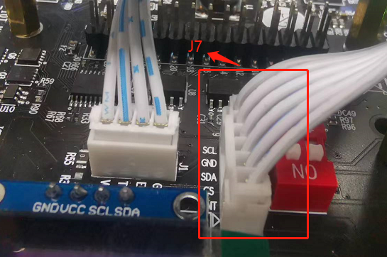
    
    

### 3.9.3 实验流程

* 步骤一：hi3861_hdu_iot_application/src/vendor/hisilicon/hispark_pegasus/demo/nfc_demo文件夹复制到hi3861_hdu_iot_application/src/applications/sample/wifi-iot/app/目录下。

* 步骤二：修改applications/sample/wifi-iot/app/目录下的BUILD.gn，在features字段中添加nfc_demo: nfc_control。注：第一个nfc_demo指的是需要编译的工程目录，第二个nfc_control指的是applications/sample/wifi-iot/app/ nfc_demo/BUILD.gn文件中的静态库，名称为nfc_control。

```c
import("//build/lite/config/component/lite_component.gni")

lite_component("app") {
  features = [ "nfc_demo:nfc_control", ]
}
```

* 步骤三：原理：FM11NT081D使用I2C通信，INT_NFC在IO扩展芯片IO0_6上（默认为高，低有效），CS_NFC在IO扩展芯片I01_6上，当CS_NFC脚为低时，正常通信，手机靠近NFC之后，NFC产生中断，使IO扩展芯片IO0_6被拉低，触发IO扩展芯片中断，实现了I2C中断触发。

    从硬件原理图可以分析出中断脚对应的是GPIO11，SDA对应的是GPIO13，SCL对应的是GPIO14,核心代码如方下所示:

```c
1 /*
2  * Copyright (c) 2022 HiSilicon (Shanghai) Technologies CO., LIMITED.
3  * Licensed under the Apache License, Version 2.0 (the "License");
4  * you may not use this file except in compliance with the License.
5  * You may obtain a copy of the License at
6  *
7  *     http://www.apache.org/licenses/LICENSE-2.0
8  *
9  * Unless required by applicable law or agreed to in writing, software
10  * distributed under the License is distributed on an "AS IS" BASIS,
11  * WITHOUT WARRANTIES OR CONDITIONS OF ANY KIND, either express or implied.
12  * See the License for the specific language governing permissions and
13  * limitations under the License.
14  */
15 
16 #include <stdio.h>
17 #include <unistd.h>
18 #include "ohos_init.h"
19 #include "cmsis_os2.h"
20 #include "hi_stdlib.h"
21 #include "iot_gpio_ex.h"
22 #include "hi_time.h"
23 #include "iot_gpio.h"
24 #include "iot_watchdog.h"
25 #include "iot_i2c.h"
26 #include "pca9555.h"
27 #include "iot_errno.h"
28 #include "hi_i2c.h"
29 
30 #define NFC_EERROM_BASE_ADD              (0x0010)
31 #define NFC_EERROM_FINALY_ADDR           (0x0384)
32 #define NFC_EERROM_ONE_ADDR              (0x0381)
33 #define NFC_EERROM_TWO_ADDR              (0x0385)
34 #define NFC_CMD_LEN                      (2)
35 #define NFC_WECHAT_NDEF_LEN              (34)
36 #define READ_NFC_WECHAT_NDEF_LEN         (50)
37 #define NFC_TOUTIAO_NDEF_LEN             (47)
38 #define READ_NFC_TOUTIAO_NDEF_LEN        (63)
39 #define NFC_EERROM_READ_BUFF_LEN_MAX     (888)
40 #define C081_NFC_ADDR                    (0xAE)
41 #define I2C_WR                           (0x00)
42 #define I2C_RD                           (0x01)
43 #define C081_NFC_WRITE_ADDR              (C081_NFC_ADDR | I2C_WR)
44 #define C081_NFC_READ_ADDR               (C081_NFC_ADDR | I2C_RD)
45 #define FM11_E2_USER_ADDR                (0x0010)
46 #define FM11_E2_MAUNF_ADDR               (0x03FF)
47 #define FM11_E2_BLOCK_SIZE               (16)
48 #define DEFAULT_MD_LEN                   (128)
49 #define RIGHR_MOVE_8_BIT                 (8)
50 #define NFC_NDEF_MAX_LEN                 (888)
51 #define OLED_I2C_BAUDRATE                (400*1000)
52 #define NFC_REGISTER1                    (0x05)
53 #define NFC_REGISTER2                    (0x78)
54 #define NFC_REGISTER3                    (0xF7)
55 #define NFC_REGISTER4                    (0x90)
56 #define NFC_REGISTER5                    (0x02)
57 #define NFC_CS_HIGH                      (0x01)
58 #define NFC_CS_LOW                       (0x00)
59 
60 static volatile int g_buttonState = 0;
61 
62 unsigned char ndefFile[NFC_NDEF_MAX_LEN] = {
63     // 淘宝 TaoBao
64     0x03, 0x23,
65     0xd4, 0x0f, 0x11, 0x61, 0x6e, 0x64, 0x72, 0x6f,
66     0x69, 0x64, 0x2e, 0x63, 0x6f, 0x6d, 0x3a, 0x70,
67     0x6b, 0x67, 0x63, 0x6f, 0x6d, 0x2e, 0x74, 0x61,
68     0x6f, 0x62, 0x61, 0x6f, 0x2e, 0x74, 0x61, 0x6f,
69     0x62, 0x61, 0x6f,
70 };
71 
72 static void PullUpCsn(void)
73 {
74     SetPCA9555GpioValue(PCA9555_PART1_OUTPUT, NFC_CS_HIGH);
75 }
76 
77 static void PullDownCsn(void)
78 {
79     SetPCA9555GpioValue(PCA9555_PART1_OUTPUT, NFC_CS_LOW);
80 }
81 
82 static unsigned int C081NfcI2cWrite(unsigned char regHigh8bitCmd,
83     unsigned char regLow8bitCmd, unsigned char* recvData, unsigned char sendLen)
84 {
85     unsigned int status = 0;
86     IotI2cData c081NfcI2cWriteCmdAddr = { 0 };
87     unsigned char sendUserCmd[64] = {regHigh8bitCmd, regLow8bitCmd};
88 
89     c081NfcI2cWriteCmdAddr.sendBuf = sendUserCmd;
90     c081NfcI2cWriteCmdAddr.sendLen = 2 + sendLen; // 2代表两位地址长度，2 represents the two bit address length
91     for (unsigned int i = 0; i < sendLen; i++) {
92         sendUserCmd[ 2 + i] = *(recvData + i); // 2代表两位地址长度，2 represents the two bit address length
93     }
94     status = IoTI2cWrite(PCA9555_I2C_IDX, C081_NFC_WRITE_ADDR,
95                          c081NfcI2cWriteCmdAddr.sendBuf, c081NfcI2cWriteCmdAddr.sendLen);
96     if (status != IOT_SUCCESS) {
97         printf("I2cWrite(%02X) failed, %0X!\n", sendUserCmd[0], status);
98         return status;
99     }
100     return IOT_SUCCESS;
101 }
102 
103 /*
104  * @berf EEPROM page write
105  * @param unsigned char *pBuffer: Send data buff
106  * @param unsigned short WriteAddr:Send register address
107  * @param unsigned char datalen:Sending data length
108  */
109 void EepWritePage(unsigned char *pBuffer, unsigned short WriteAddr, unsigned char datalen)
110 {
111     unsigned int status;
112     if (pBuffer == NULL) {
113         printf("eepWritePage buffer is null\r\n");
114     }
115     PullDownCsn();
116     /* 代表地址高8位和低8位，2代表发送的数据长度 */
117     /* represents the high and low 8 bits of the address, and 2 represents the length of the data sent */
118     status = C081NfcI2cWrite((unsigned char)((WriteAddr & 0xFF00) >> 8),
119                              (unsigned char)(WriteAddr & 0x00FF), pBuffer, datalen);
120     if (status != IOT_SUCCESS) {
121         printf("write failed\r\n");
122     }
123     TaskMsleep(10); // The delay time must be 10ms
124     PullUpCsn();
125 }
126 
127 /*
128  * @berf write EEPROM
129  * @param unsigned short addr:eeprom address
130  * @param unsigned int len:Write data length
131  * @param unsigned char *wbuf:write data buff
132  */
133 void Fm11nt081dWriteEeprom(unsigned short baseAddr, unsigned int len, unsigned char *wbuf)
134 {
135     unsigned char offset = 0;
136     unsigned char *writeBuff = wbuf;
137     unsigned int writeLen = len;
138     unsigned short addr = baseAddr;
139     if (writeBuff == NULL) {
140         printf("write ndef is null\r\n");
141         return;
142     }
143     if (addr < FM11_E2_USER_ADDR || addr >= FM11_E2_MAUNF_ADDR) {
144         offset = FM11_E2_BLOCK_SIZE - (addr % FM11_E2_BLOCK_SIZE);
145         printf("offset = %d, writeLen = %d\r\n", offset, writeLen);
146         if (writeLen > offset) {
147             EepWritePage(writeBuff, addr, offset);
148             addr += offset;
149             writeBuff += offset;
150             writeLen -= offset;
151         } else {
152             EepWritePage(writeBuff, addr, writeLen);
153             writeLen = 0;
154         }
155     }
156     while (writeLen) {
157         if (writeLen >= FM11_E2_BLOCK_SIZE) {
158             EepWritePage(writeBuff, addr, FM11_E2_BLOCK_SIZE);
159             addr += FM11_E2_BLOCK_SIZE;
160             writeBuff += FM11_E2_BLOCK_SIZE;
161             writeLen -= FM11_E2_BLOCK_SIZE;
162         } else {
163             EepWritePage(writeBuff, addr, writeLen);
164             writeLen = 0;
165         }
166     }
167 }
168 
169 /*
170  * @berf i2c read
171  * @param unsigned char reg_high_8bit_cmd:Transmit register value 8 bits high
172  * @param unsigned char reg_low_8bit_cmd:Transmit register value low 8 bits
173  * @param unsigned char* recv_data:Receive data buff
174  * @param unsigned char send_len:Sending data length
175  * @param unsigned char read_len:Length of received data
176  */
177 unsigned int WriteRead(unsigned char regHigh8bitCmd, unsigned char regLow8bitCmd,
178     unsigned char sendLen, unsigned char readLen)
179 {
180     unsigned int status = 0;
181     unsigned char recvData[888] = { 0 }; // 888代表recvData长度，888 stands for recvData length
182     hi_i2c_data c081NfcI2cWriteCmdAddr = { 0 };
183     unsigned char sendUserCmd[2] = {regHigh8bitCmd, regLow8bitCmd};
184     (void)memset_s(&recvData, sizeof(unsigned char), 0x0, sizeof(recvData));
185 
186     c081NfcI2cWriteCmdAddr.send_buf = sendUserCmd;
187     c081NfcI2cWriteCmdAddr.send_len = sendLen;
188 
189     c081NfcI2cWriteCmdAddr.receive_buf = recvData;
190     c081NfcI2cWriteCmdAddr.receive_len = readLen;
191 
192     status = hi_i2c_writeread(PCA9555_I2C_IDX, C081_NFC_ADDR | I2C_RD, &c081NfcI2cWriteCmdAddr);
193     if (status != IOT_SUCCESS) {
194         printf("hi_i2c_writeread failed, %0X!\n", status);
195         return status;
196     }
197     return IOT_SUCCESS;
198 }
199 
200 /*
201  * @berf read EEPROM
202  * @param unsigned char *dataBuff:Read data and save it in buff
203  * @param unsigned short ReadAddr:Read address
204  * @param unsigned short len:Read length
205  */
206 unsigned int Fm11nt081ReadEep(unsigned short ReadAddr, unsigned short len)
207 {
208     unsigned int status;
209     /* 左移8位代表地址高8位和低8位，2代表发送的数据长度 */
210     /* represents the high and low 8 bits of the address, and 2 represents the length of the data sent */
211     status = WriteRead((unsigned char)((ReadAddr & 0xFF00) >> 8), (unsigned char)(ReadAddr & 0x00FF), 2, len);
212     if (status != IOT_SUCCESS) {
213         return status;
214     }
215     return  IOT_SUCCESS;
216 }
217 
218 /* NFC chip configuration, usually do not call NFC init */
219 void NFCInit(void)
220 {
221     // Chip default configuration，wbuf len 5
222     unsigned char wbuf[5] = {NFC_REGISTER1, NFC_REGISTER2, NFC_REGISTER3, NFC_REGISTER4, NFC_REGISTER5};
223     /* The CSN pin is masked when the byte is read and turned on when the EEP is written */
224     hi_udelay(100); // 延时100us读写数据,wait 100us read write data
225     Fm11nt081dWriteEeprom(NFC_EERROM_ONE_ADDR, 1, &wbuf[1]);
226     Fm11nt081dWriteEeprom(NFC_EERROM_TWO_ADDR, 1, &wbuf[3]); // wbuf第3个
227     Fm11nt081dWriteEeprom(NFC_EERROM_BASE_ADD, NFC_TOUTIAO_NDEF_LEN, ndefFile);
228     PullDownCsn();
229     Fm11nt081ReadEep(NFC_EERROM_BASE_ADD, READ_NFC_TOUTIAO_NDEF_LEN);
230 }
231 
232 void OnNFCRead(char* arg)
233 {
234     (void) arg;
235     g_buttonState = 1;
236 }
237 
238 void GetFunKeyState(void)
239 {
240     uint8_t ext_io_state = 0;
241     uint8_t ext_io_state_d = 0;
242     uint8_t status;
243 
244     while (1) {
245         if (g_buttonState == 1) {
246             uint8_t diff;
247             status = PCA9555I2CReadByte(&ext_io_state);
248             if (status != IOT_SUCCESS) {
249                 printf("i2c error!\r\n");
250                 ext_io_state = 0;
251                 ext_io_state_d = 0;
252                 g_buttonState = 0;
253                 continue;
254             }
255 
256             diff = ext_io_state ^ ext_io_state_d;
257             if (diff == 0) {
258             }
259             /*
260              * 0x40代表NFC INIT接在IO扩展芯片IO01_6
261              * 0x40 represents that NFC INIT is connected to IO expansion chip IO01_ six
262              */
263             if ((diff & 0x40) && ((ext_io_state & 0x40) == 0)) {
264                 /*
265                  * 当有设备读取NFC时，此时会触发NFC的中断，打印 read nfc。
266                  * When a device reads the NFC, the NFC interrupt will be triggered and the read nfc will be printed
267                  */
268                 printf("read nfc \r\n");
269             }
270             status = PCA9555I2CReadByte(&ext_io_state);
271             ext_io_state_d = ext_io_state;
272             g_buttonState = 0;
273         }
274         TaskMsleep(20); // 每隔20ms读取一次，Read every 20ms
275     }
276 }
277 
278 /* app nfc demo */
279 void NFCDemoTask(void)
280 {
281     PCA9555Init();
282     /*
283      * 配置IO扩展芯片的part1的所有管脚为输出,0x00所有管脚输出
284      * Configure all pins of part1 of IO expansion chip as output, and 0x00 as output
285      */
286     SetPCA9555GpioValue(PCA9555_PART1_IODIR, 0x00);
287     /*
288      * 配置左右三色车灯全灭
289      * Configured with left and right tricolor lights all off
290      */
291     SetPCA9555GpioValue(PCA9555_PART1_OUTPUT, LED_OFF);
292     /*
293      * 0x40代表配置IO0_6方向设置为输入，1为输入，0为输出
294      * 0x40 represents IO0 configuration_ 6 direction is set as input, 1 is input, 0 is output
295      */
296     SetPCA9555GpioValue(PCA9555_PART0_IODIR, 0x40);
297     /*
298      * 使能GPIO11的中断功能, OnNFCRead 为中断的回调函数
299      * Enable the interrupt function of GPIO11. OnNFCRead is the interrupt callback function
300      */
301     IoTGpioRegisterIsrFunc(IOT_IO_NAME_GPIO_11, IOT_INT_TYPE_EDGE, IOT_GPIO_EDGE_FALL_LEVEL_LOW, OnNFCRead, NULL);
302     NFCInit();
303     GetFunKeyState();
304 }
305 
306 void C081NFCExampleEntry(void)
307 {
308     osThreadAttr_t attr;
309     IoTWatchDogDisable();
310     attr.name = "NFCDemoTask";
311     attr.attr_bits = 0U;
312     attr.cb_mem = NULL;
313     attr.cb_size = 0U;
314     attr.stack_mem = NULL;
315     attr.stack_size = 5 * 1024; // 堆栈大小为5*1024，stack size 5*1024
316     attr.priority = osPriorityNormal;
317 
318     if (osThreadNew((osThreadFunc_t)NFCDemoTask, NULL, &attr) == NULL) {
319         printf("[NFCDemoTask] Falied to create NFCDemoTask!\n");
320     }
321 }
322 
323 APP_FEATURE_INIT(C081NFCExampleEntry);
```

- 步骤四：修改hi3861_hdu_iot_application/src/device/hisilicon/hispark_pegasus/sdk_liteos/build/config/usr_config.mk文件。在这个配置文件中打开I2C驱动宏。搜索字段CONFIG_I2C_SUPPORT ，并打开I2C。配置如下：

  ```
  # CONFIG_I2C_SUPPORT is not set
  CONFIG_I2C_SUPPORT=y
  ```

- 步骤五：点击DevEco Device Tool工具“Rebuild”按键，具体编译步骤参考“1.4章节 运行第一个程序helloworld”


- 步骤六：点击DevEco Device Tool工具“Upload”按键，等待提示（出现Connecting，please reset device...），手动进行开发板复位（按下开发板reset键），将程序烧录到开发板中。具体烧录步骤参考“1.4章节 运行第一个程序helloworld”。

  

### 3.9.4 实验结果

* 软件烧录成功后，使用串口工具连接好小车的串口（<font color='RedOrange'>**注意：这里以sscom为例，该工具需要自己百度下载，也可以使用Monitor工具，参考“1.4 章节 运行第一个程序helloworld”**</font>)，按一下开发板的RESET按键复位开发板，当我们使用手机靠近小车的NFC模块时，会拉起手机的淘宝应用，同时可以看到串口打印出read nfc的字样，说明我们使用I2C中断触发的功能，实现对NFC驱动的实验成功。串口打印信息如下所示。

    

### 3.9.5 扩展实验

* 本实验学习了通过使用I2C中断触发的功能，实现对NFC的驱动，请学生做如下实验：
  * 1、通过使用I2C中断触发功能，实现电池电量检测中断触发，当电量低于3.3V时，蜂鸣器报警。
  
      提示：参考单I2C轮询实验。硬件接线：INT_CW2015 - IO0_7，I2C0_SDA - GPIO 13，I2C0_SCL - GPIO 14;

## 3.10 I2C实验-I2C总线实验 

### 3.10.1 实验目的

* 本实验通过使用I2C总线，实现同时轮询多个设备如:电量检测（CW2015），陀螺仪、OLED屏、IO扩展芯片，NFC。陀螺仪芯片手册（编号：C94048，型 号： LSM6DSMTR）获取：https://so.szlcsc.com/global.html?k=LSM6DSM&hot-key=LM358DR2G， 点击数据手册进行下载。

### 3.10.2 实验要求

* 1.软件要求：VSCode，hi3861_hdu_iot_application(如果采用zip包下载，SDK名称为hi3861_hdu_iot_application-master，如果采用git下载SDK名称为hi3861_hdu_iot_application，此处以采用git下载为例）；

* 2.接线要求：将MOTOR_EN拨码开关由ON拨到OFF；硬件要求：HISPARK_HI3861_IOT_VER.C开发套件；

  

### 3.10.3 实验流程

* 步骤一：hi3861_hdu_iot_application/src/vendor/hisilicon/hispark_pegasus/demo/i2c_bus_demo文件夹复制到hi3861_hdu_iot_application/src/applications/sample/wifi-iot/app/目录下。

* 步骤二：修改applications/sample/wifi-iot/app/目录下的BUILD.gn，在features字段中添加i2c_bus_demo: i2c_bus_demo。注：第一个i2c_bus_demo指的是需要编译的工程目录，第二个i2c_bus_demo指的是applications/sample/wifi-iot/app/ i2c_bus_demo/BUILD.gn文件中的静态库，名称为i2c_bus_demo。

```c
import("//build/lite/config/component/lite_component.gni")

lite_component("app") {
  features = [ "i2c_bus_demo:i2c_bus_demo", ]
}
```

* 步骤三：原理：I2C通信中，主机通过时钟线SCL发送时钟信号，通过数据线SDA发送数据（包括从机地址、指令、数据包等），在发送完一帧数据后，需要等待从机的响应，才能继续发送下一帧数据，因此I2C属于同步通信。一个I2C主设备可以与多个I2C从设备通信。

    根据原理图可以发现NFC，陀螺仪，IO扩展芯片，OLED屏幕都使用同一个I2C通路I2C0，硬件：I2C0_SDA - GPIO 13，I2C0_SCL - GPIO 14。NFC，IO扩展芯片，OLED参考前面章节，这里提供陀螺仪部分代码以及I2C总线代码。

```c
1 /*
2  * Copyright (c) 2022 HiSilicon (Shanghai) Technologies CO., LIMITED.
3  * Licensed under the Apache License, Version 2.0 (the "License");
4  * you may not use this file except in compliance with the License.
5  * You may obtain a copy of the License at
6  *
7  *     http://www.apache.org/licenses/LICENSE-2.0
8  *
9  * Unless required by applicable law or agreed to in writing, software
10  * distributed under the License is distributed on an "AS IS" BASIS,
11  * WITHOUT WARRANTIES OR CONDITIONS OF ANY KIND, either express or implied.
12  * See the License for the specific language governing permissions and
13  * limitations under the License.
14  */
15 
16 #include <math.h>
17 #include <stdlib.h>
18 #include <string.h>  // For memcpy
19 
20 #include <hi_time.h>
21 
22 #include <stdio.h>
23 #include <unistd.h>
24 #include "iot_gpio_ex.h"
25 
26 #include "ohos_init.h"
27 #include "cmsis_os2.h"
28 
29 #include "iot_i2c.h"
30 #include "iot_errno.h"
31 #include "hi_errno.h"
32 #include "hi_i2c.h"
33 #include "iot_gpio.h"
34 #include "ssd1306_fonts.h"
35 #include "ssd1306.h"
36 #include "gyro.h"
37 
38 #define LSM6DS_I2C_IDX 0
39 #define IOT_I2C_IDX_BAUDRATE         4 // 400k
40  /* 20.0f 比例增益支配率收敛到加速度计/磁强计 Proportional gain dominance converges to accelerometer/magnetometer */
41 #define Kp 20.0f
42 /* 0004f 积分增益支配率的陀螺仪偏见的衔接 The Connection of Gyroscope Bias with Integrated Gain Dominance */
43 #define Ki 0.0004f
44 /* 0.005f 采样周期的一半 Half of the sampling period */
45 #define halfT 0.005f
46 /* 1 0 0 0四元数的元素，代表估计方向 Element of quaternion, representing estimation direction */
47 float q0 = 1, q1 = 0, q2 = 0, q3 = 0;
48 /* 按比例缩小积分误差 Scale down integral error */
49 float exInt = 0, eyInt = 0, ezInt = 0;
50 /* 偏航角，俯仰角，翻滚角 Yaw angle */
51 float Yaw, Pitch, Roll;
52 /* 0.0f 偏航角初始值 0.0f initial yaw angle */
53 static float yaw_conv = 0.0f;
54 
55 /*
56  * @berf i2c read
57  * @param hi_u8 reg_high_8bit_cmd:Transmit register value 8 bits high
58  * @param hi_u8 reg_low_8bit_cmd:Transmit register value low 8 bits
59  * @param hi_u8* recv_data:Receive data buff
60  * @param hi_u8 send_len:Sending data length
61  * @param hi_u8 read_len:Length of received data
62 */
63 uint32_t LSM6DS_WriteRead(uint8_t reg_high_8bit_cmd, uint8_t send_len, uint8_t read_len)
64 {
65     uint32_t status = 0;
66     uint8_t recvData[888] = { 0 };
67     uint32_t ret = 0;
68     hi_i2c_data c081nfc_i2c_write_cmd_addr = { 0 };
69     uint8_t send_user_cmd[1] = {reg_high_8bit_cmd};
70 
71     memset(recvData, 0x0, sizeof(recvData));
72     c081nfc_i2c_write_cmd_addr.send_buf = send_user_cmd;
73     c081nfc_i2c_write_cmd_addr.send_len = send_len;
74 
75     c081nfc_i2c_write_cmd_addr.receive_buf = recvData;
76     c081nfc_i2c_write_cmd_addr.receive_len = read_len;
77 
78     status = hi_i2c_writeread(LSM6DS_I2C_IDX, LSM6DS_READ_ADDR, &c081nfc_i2c_write_cmd_addr);
79     if (status != IOT_SUCCESS) {
80         printf("I2cRead() failed, %0X!\n", status);
81         return status;
82     }
83     ret = recvData[0];
84     return ret;
85 }
86 
87 uint32_t LSM6DS_ReadCont(uint8_t reg_addr, uint8_t* buffer, uint16_t read_len)
88 {
89     uint32_t status;
90     hi_i2c_data i2c_attr;
91 
92     i2c_attr.send_buf = &reg_addr;
93     i2c_attr.send_len = 1;
94     i2c_attr.receive_buf = buffer;
95     i2c_attr.receive_len = read_len;
96 
97     status = hi_i2c_writeread(LSM6DS_I2C_IDX, LSM6DS_READ_ADDR, &i2c_attr);
98     for (int i = 0; i < read_len; i++) {
99         printf("0x%x ", buffer[i]);
100     }
101     printf("\r\n");
102     return status;
103 }
104 
105 static uint32_t LSM6DS_Write(uint8_t addr, uint8_t writedata, uint32_t buffLen)
106 {
107     uint8_t buffer[2] = {addr, writedata}; // 2代表buff长度 2 represents buff length
108     uint32_t retval = IoTI2cWrite(LSM6DS_I2C_IDX, LSM6DS_WRITE_ADDR, buffer, buffLen);
109     if (retval != IOT_SUCCESS) {
110         printf("IoTI2cWrite(%02X) failed, %0X!\n", buffer[0], retval);
111         return retval;
112     }
113     printf("IoTI2cWrite(%02X)\r\n", buffer[0]);
114     return IOT_SUCCESS;
115 }
116 
117 void GetLSM6DS(void)
118 {
119     while (1) {
120         TaskMsleep(5); // 5ms
121         Lsm_Get_RawAcc();
122     }
123 }
124 
125 void LSM6DS_Init(void)
126 {
127     /* 0x34 2初始化陀螺仪 0x34 2 Initialize gyroscope */
128     LSM6DS_Write(LSM6DSL_CTRL3_C, 0x34, 2);
129     /* 0X4C 2 配置陀螺仪 0X4C 2 Configure gyroscope */
130     LSM6DS_Write(LSM6DSL_CTRL2_G, 0X4C, 2); // 角速度陀螺仪配置2000dps ,104Hz
131     /* 0x38 2  timer en, pedo en, tilt en */
132     LSM6DS_Write(LSM6DSL_CTRL10_C, 0x38, 2);
133     /* 0x4F 2 加速度配置量程为8g,104Hz, lpf1_bw_sel=1, bw0_xl=1; */
134     /* 0x4F 2 The acceleration configuration range is 8g, 104Hz, lpf1_ bw_ sel=1, bw0_ xl=1; */
135     LSM6DS_Write(LSM6DSL_CTRL1_XL, 0x4F, 2);
136     /* 0x10 2  */
137     LSM6DS_Write(LSM6DSL_TAP_CFG, 0x10, 2);
138     /* 0x00 2  */
139     LSM6DS_Write(LSM6DSL_WAKE_UP_DUR, 0x00, 2);
140     /* 0x02 2  */
141     LSM6DS_Write(LSM6DSL_WAKE_UP_THS, 0x02, 2);
142     /* 0x40 2  */
143     LSM6DS_Write(LSM6DSL_TAP_THS_6D, 0x40, 2);
144     /* 0x01 2  */
145     LSM6DS_Write(LSM6DSL_CTRL8_XL, 0x01, 2);
146 }
147 
148 void IMU_YAW_CAL(float gyroZ)
149 {
150     static float dt = 0.03;  // 0.03
151     static float yaw = 0.0f, temp = 0.0f;
152 
153     // 除去零偏
154     #if 0
155     static int a = 0;
156     a++;
157     if (hi_get_seconds() <= 5) { // 5s
158         printf("---------times-----------:%d\n", a);
159     }
160     #endif
161 
162     if (fabs(gyroZ) < 0.04) { // 0.04初始值
163         temp = 0;
164     } else {
165         temp = gyroZ * dt;
166     }
167     yaw += temp;
168     /* 57.32 */
169     yaw_conv = yaw * 57.32;
170     // 360°一个循环
171     if (fabs(yaw_conv) > 360.0f) {
172         if ((yaw_conv) < 0) {
173             yaw_conv += 360.0f; // 360°一个循环
174         } else {
175             yaw_conv -= 360.0f; // 360°一个循环
176         }
177     }
178     printf("yaw_conv:%.02f\n", yaw_conv);
179     static char line[32] = {0};
180     ssd1306_SetCursor(0, 30); // 30行0列开始
181     int ret = snprintf(line, sizeof(line), "yaw_conv:%.2f", yaw_conv);
182     if (ret != 14) { // 字符串长度为14
183         printf("ret = %d\r\n", ret);
184     }
185     ssd1306_DrawString(line, Font_7x10, White);
186 }
187 
188 void Lsm_Get_RawAcc(void)
189 {
190     uint8_t buf[12] = { 0 };
191     int16_t acc_x = 0, acc_y = 0, acc_z = 0;
192     float acc_x_conv = 0, acc_y_conv = 0, acc_z_conv = 0;
193     int16_t ang_rate_x = 0, ang_rate_y = 0, ang_rate_z = 0;
194     float ang_rate_x_conv = 0, ang_rate_y_conv = 0, ang_rate_z_conv = 0;
195     float ang_rate_x_cal = 0, ang_rate_y_cal = 0, ang_rate_z_cal = 0;
196     if ((LSM6DS_WriteRead(LSM6DSL_STATUS_REG, 1, 1) & 0x03) != 0) {
197         if (IOT_SUCCESS != LSM6DS_ReadCont(LSM6DSL_OUTX_L_G, buf, 12)) { // 12buf长度
198             printf("i2c read error!\n");
199         } else {
200             ang_rate_x = (buf[1] << 8) + buf[0]; // buf第1位左移8位与buff第0位
201             ang_rate_y = (buf[3] << 8) + buf[2]; // buf第3位左移8位与buff第2位
202             ang_rate_z = (buf[5] << 8) + buf[4]; // buf第5位左移8位与buff第4位
203             acc_x = (buf[7] << 8) + buf[6]; // buf第7位左移8位与buff第6位
204             acc_y = (buf[9] << 8) + buf[8]; // buf第9位左移8位与buff第8位
205             acc_z = (buf[11] << 8) + buf[10]; // buf第11位左移8位与buff第10位
206 
207             ang_rate_x_conv = (3.14 * ang_rate_x) / 180; // 3.14= π 180 °
208             ang_rate_y_conv = (3.14 * ang_rate_y) / 180; // 3.14= π 180 °
209             ang_rate_z_conv = (3.14 * ang_rate_z) / 180; // 3.14= π 180 °
210             ang_rate_x_cal = ang_rate_x_conv / 14.29; // 14.29量程
211             ang_rate_y_cal = ang_rate_y_conv / 14.29; // 14.29量程
212             ang_rate_z_cal = ang_rate_z_conv / 14.29; // 14.29量程
213             acc_x_conv = acc_x / 4098.36; // 4098.36量程
214             acc_y_conv = acc_y / 4098.36; // 4098.36量程
215             acc_z_conv = acc_z / 4098.36; // 4098.36量程
216             printf("lsm trans acc: %.2f, %.2f, %.2f \n ang: %.2f, %.2f, %.2f, ang_cal: %.2f, %.2f, %.2f\n ",
217                    acc_x_conv, acc_y_conv, acc_z_conv, ang_rate_x_conv, ang_rate_y_conv, ang_rate_z_conv,
218                    ang_rate_x_cal, ang_rate_y_cal, ang_rate_z_cal);
219             IMU_YAW_CAL(ang_rate_z_cal);
220         }
221     }
222 }
```

```c
1 /*
2  * Copyright (c) 2022 HiSilicon (Shanghai) Technologies CO., LIMITED.
3  * Licensed under the Apache License, Version 2.0 (the "License");
4  * you may not use this file except in compliance with the License.
5  * You may obtain a copy of the License at
6  *
7  *     http://www.apache.org/licenses/LICENSE-2.0
8  *
9  * Unless required by applicable law or agreed to in writing, software
10  * distributed under the License is distributed on an "AS IS" BASIS,
11  * WITHOUT WARRANTIES OR CONDITIONS OF ANY KIND, either express or implied.
12  * See the License for the specific language governing permissions and
13  * limitations under the License.
14  */
15 
16 #include <stdio.h>
17 #include <unistd.h>
18 #include "hi_timer.h"
19 
20 #include "ssd1306_fonts.h"
21 #include "ssd1306.h"
22 #include "cw2015_control.h"
23 #include "gyro.h"
24 #include "hi_time.h"
25 #include "iot_watchdog.h"
26 #include "pca9555.h"
27 #include "nfc_control.h"
28 
29 #include "ohos_init.h"
30 #include "cmsis_os2.h"
31 #include "iot_gpio_ex.h"
32 #include "iot_gpio.h"
33 #include "iot_errno.h"
34 #include "hi_errno.h"
35 
36 
37 int g_buttonState = 0;
38 
39 void OnFuncKeyPressed(char *arg)
40 {
41     (void) arg;
42     g_buttonState = 1;
43 }
44 
45 void PressToRestore(void)
46 {
47     uint8_t ext_io_state = 0;
48     IotGpioValue value = 0;
49     uint8_t intLowFlag = 0;
50     uint32_t cTick = 0;
51     uint8_t status;
52     status = IoTGpioGetInputVal(IOT_IO_NAME_GPIO_11, &value);
53     if (status != IOT_SUCCESS) {
54         printf("status = %d\r\n", status);
55     }
56     if (value == 1) {
57         intLowFlag = 0;
58     } else {
59         if (intLowFlag == 0) {
60             cTick = hi_get_milli_seconds();
61             intLowFlag = 1;
62         } else {
63             if ((hi_get_milli_seconds() - cTick) > 2) { // 2ms
64                 status = PCA9555I2CReadByte(&ext_io_state);
65                 intLowFlag = 0;
66             }
67         }
68     }
69 }
70 
71 void GetFunKeyState(void)
72 {
73     uint8_t ext_io_state = 0;
74     uint8_t ext_io_state_d = 0;
75     uint8_t status;
76     while (1) {
77         if (g_buttonState == 1) {
78             uint8_t diff;
79             status = PCA9555I2CReadByte(&ext_io_state);
80             if (status != IOT_SUCCESS) {
81                 printf("failed\r\n");
82             }
83             diff = ext_io_state ^ ext_io_state_d;
84             if ((diff & 0x04) && ((ext_io_state & 0x04) == 0)) {
85                     printf("S3 prassed\r\n");
86                     IoTGpioSetOutputVal(IOT_IO_NAME_GPIO_5, IOT_GPIO_VALUE0);
87                     IoTGpioSetOutputVal(IOT_IO_NAME_GPIO_9, IOT_GPIO_VALUE1);
88                     IoTGpioSetOutputVal(IOT_IO_NAME_GPIO_10, IOT_GPIO_VALUE0);
89             } else if ((diff & 0x08) && ((ext_io_state & 0x08) == 0)) {
90                     printf("S4 prassed\r\n");
91                     IoTGpioSetOutputVal(IOT_IO_NAME_GPIO_5, IOT_GPIO_VALUE0);
92                     IoTGpioSetOutputVal(IOT_IO_NAME_GPIO_9, IOT_GPIO_VALUE0);
93                     IoTGpioSetOutputVal(IOT_IO_NAME_GPIO_10, IOT_GPIO_VALUE1);
94             } else if ((diff & 0x10) && ((ext_io_state & 0x10) == 0)) {
95                     printf("S5 prassed\r\n");
96                     IoTGpioSetOutputVal(IOT_IO_NAME_GPIO_5, IOT_GPIO_VALUE1);
97                     IoTGpioSetOutputVal(IOT_IO_NAME_GPIO_9, IOT_GPIO_VALUE0);
98                     IoTGpioSetOutputVal(IOT_IO_NAME_GPIO_10, IOT_GPIO_VALUE0);
99             }
100             ext_io_state_d = ext_io_state;
101             g_buttonState = 0;
102         } else {
103             PressToRestore();
104         }
105     }
106 }
107 
108 // 电量检测模块Task
109 void CW2015Task(void)
110 {
111     static char line[32] = {0}; // 32
112     float voltage = 0.0;
113 
114     while (1) {
115         voltage = GetVoltage();
116         // 将获取到的电源格式化为字符串
117         ssd1306_SetCursor(0, 15); // 15
118         int ret = snprintf(line, sizeof(line), "voltage: %.2f", voltage);
119         if (ret != 13) { // 13
120             printf("failed\r\n");
121         }
122         ssd1306_DrawString(line, Font_7x10, White);
123         ssd1306_UpdateScreen();
124         TaskMsleep(10); // 10ms
125     }
126 }
127 
128 // NFC模块task
129 void NFCTask(void)
130 {
131     NFCInit(); // 初始化NFC模块
132 }
133 
134 void LSM6DSTask(void)
135 {
136     GetLSM6DS();
137 }
138 
139 // 功能按键task
140 void FunKeyTask(void)
141 {
142     // 获取实时的按键状态
143     GetFunKeyState();
144 }
145 
146 void TrafficLightInit(void)
147 {
148     // LED3的GPIO初始化
149     IoTGpioInit(IOT_IO_NAME_GPIO_9);
150     // 设置GPIO9的管脚复用关系为GPIO
151     IoSetFunc(IOT_IO_NAME_GPIO_9, IOT_IO_FUNC_GPIO_9_GPIO);
152     // GPIO方向设置为输出
153     IoTGpioSetDir(IOT_IO_NAME_GPIO_9, IOT_GPIO_DIR_OUT);
154 
155     // LED5的GPIO初始化
156     IoTGpioInit(IOT_IO_NAME_GPIO_10);
157     // 设置GPIO9的管脚复用关系为GPIO
158     IoSetFunc(IOT_IO_NAME_GPIO_10, IOT_IO_FUNC_GPIO_10_GPIO);
159     // GPIO方向设置为输出
160     IoTGpioSetDir(IOT_IO_NAME_GPIO_10, IOT_GPIO_DIR_OUT);
161 
162     // LED4的GPIO初始化
163     IoTGpioInit(IOT_IO_NAME_GPIO_5);
164     // 设置GPIO5的管脚复用关系为GPIO
165     IoSetFunc(IOT_IO_NAME_GPIO_5, IOT_IO_FUNC_GPIO_5_GPIO);
166     // GPIO方向设置为输出
167     IoTGpioSetDir(IOT_IO_NAME_GPIO_5, IOT_GPIO_DIR_OUT);
168 
169     IoTGpioSetOutputVal(IOT_IO_NAME_GPIO_5, IOT_GPIO_VALUE0);
170     IoTGpioSetOutputVal(IOT_IO_NAME_GPIO_9, IOT_GPIO_VALUE0);
171     IoTGpioSetOutputVal(IOT_IO_NAME_GPIO_10, IOT_GPIO_VALUE0);
172 }
173 
174 void I2CBusInit(void)
175 {
176     PCA9555Init(); // 初始化PCA9555 扩展IO芯片模块
177     // 配置IO扩展芯片的part1的所有管脚为输出
178     SetPCA9555GpioValue(PCA9555_PART1_IODIR, 0x00);
179     // 配置左右三色车灯全灭
180     SetPCA9555GpioValue(PCA9555_PART1_OUTPUT, LED_OFF);
181     CW2015Init();  // 电量检测模块
182     LSM6DS_Init();  // 陀螺仪模块初始化
183     ssd1306_Init(); // 初始化 SSD1306 OLED模块
184     ssd1306_Fill(Black);
185     TrafficLightInit(); // 交通灯初始化
186 
187     // 使能GPIO11的中断功能, OnFuncKeyPressed 为中断的回调函数
188     IoTGpioRegisterIsrFunc(IOT_IO_NAME_GPIO_11, IOT_INT_TYPE_EDGE,
189                            IOT_GPIO_EDGE_FALL_LEVEL_LOW, OnFuncKeyPressed, NULL);
190 
191     // S3:IO0_2,S4:IO0_3,S5:IO0_4 0001 1100 => 0x1c 将IO0_2,IO0_3,IO0_4方向设置为输入，1为输入，0位输出
192     SetPCA9555GpioValue(PCA9555_PART0_IODIR, 0x1c);
193 }
194 
195 void I2CBusExampleEntry(void)
196 {
197     osThreadAttr_t attr;
198 
199     I2CBusInit();
200     IoTWatchDogDisable();
201 
202     attr.name = "NFCTask";
203     attr.attr_bits = 0U;
204     attr.cb_mem = NULL;
205     attr.cb_size = 0U;
206     attr.stack_mem = NULL;
207     attr.stack_size = 5 * 1024; // 5*1024
208     attr.priority = osPriorityNormal;
209 
210     // NFC
211     if (osThreadNew((osThreadFunc_t)NFCTask, NULL, &attr) == NULL) {
212         printf("[NFCTask] Failed to create NFCTask!\n");
213     }
214 
215     // 电量监测
216     attr.name = "CW2015Task";
217     if (osThreadNew((osThreadFunc_t)CW2015Task, NULL, &attr) == NULL) {
218         printf("[CW2015Task] Failed to create CW2015Task!\n");
219     }
220 
221     // 功能按键
222     attr.name = "FunKeyTask";
223     if (osThreadNew((osThreadFunc_t)FunKeyTask, NULL, &attr) == NULL) {
224         printf("[FunKeyTask] Failed to create FunKeyTask!\n");
225     }
226 
227     // 陀螺仪
228     attr.name = "LSM6DSTask";
229     if (osThreadNew((osThreadFunc_t)LSM6DSTask, NULL, &attr) == NULL) {
230         printf("[LSM6DSTask] Failed to create LSM6DSTask!\n");
231     }
232 }
233 
234 APP_FEATURE_INIT(I2CBusExampleEntry);
```

- 步骤四：修改hi3861_hdu_iot_application/src/device/hisilicon/hispark_pegasus/sdk_liteos/build/config/usr_config.mk文件。在这个配置文件中打开I2C驱动宏。搜索字段CONFIG_I2C_SUPPORT ，并打开I2C。配置如下：

  ```
  # CONFIG_I2C_SUPPORT is not set
  CONFIG_I2C_SUPPORT=y
  ```

- 步骤五：点击DevEco Device Tool工具“Rebuild”按键，具体编译步骤参考“1.4章节 运行第一个程序helloworld”


- 步骤六：点击DevEco Device Tool工具“Upload”按键，等待提示（出现Connecting，please reset device...），手动进行开发板复位（按下开发板reset键），将程序烧录到开发板中。具体烧录步骤参考“1.4章节 运行第一个程序helloworld”。

  

### 3.10.4 实验结果

* 软件烧录成功后，按一下开发板的RESET按键复位开发板，可以在OLED屏幕上面看到陀螺仪方向角实时数据以及电池电量数据，当手机靠近小车的NFC模块时，NFC会拉起手机的淘宝应用，且可以通过S1、S2、S3功能按键来控制三个交通灯的亮灭，说明我们使用I2C总线，实现同时轮询多个设备的实验成功。

    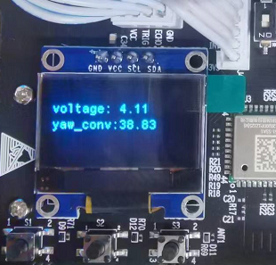

### 3.10.5 扩展实验

* 本实验学习了通过使用I2C总线，实现同时轮询多个设备如:电量检测，陀螺仪、OLED屏、按键扩展中断，请学生做如下实验：

    * 1.通过I2C总线，实现RTC在OLED屏幕实时显示万年历，并同时将陀螺仪，超声波数据也显示在OLED上。

        提示：参考单I2C轮询实验，GPIO综合实验。

## 3.11 ADC实验 

### 3.11.1 实验目的

* 本实验通过使用主芯片的ADC功能，实现对红外对管的驱动。

### 3.11.2 实验要求

* 1.软件要求：VSCode，hi3861_hdu_iot_application(如果采用zip包下载，SDK名称为hi3861_hdu_iot_application-master，如果采用git下载SDK名称为hi3861_hdu_iot_application，此处以采用git下载为例）；

* 2.硬件要求：HISPARK_HI3861_IOT_VER.C开发套件；

* 3.接线方式：插上J5 GPIO 12 - PWM3 ,J6 GPIO 7 - TRIG，同时插上J13GPIO7 - RIN，J12 GPIO12 - LIN；硬件搭建如下图所示：

    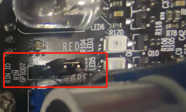 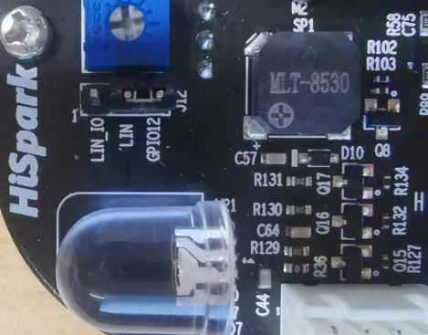
    
     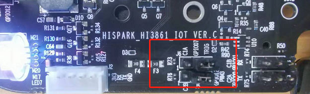

### 3.11.3 接口说明

#### 3.11.3.1 AdcRead()

| **定义：**   | unsigned int AdcRead(IotAdcChannelIndex   channel, unsigned const short *data, IotAdcEquModelSel equModel,   IotAdcCurBais curBais, unsigned const short rstCnt); |
| ------------ | ------------------------------------------------------------ |
| **功能：**   | 根据输入参数从指定的ADC通道读取一段采样数据                  |
| **参数：**   | channel：表示指定的ADC通道   <br/>data：表示指向存储读取数据的地址的指针   <br/>eqmodel表示方程模型                <br/>curBais表示模拟功率控制模式   <br/>rstCnt表示从重置到转换开始的时间计数(一次计数是334ns，其值需在0~0xFF0之间) |
| **返回值：** | IOT_SUCCESS：ADC数据读取成功    IOT_FAILURE：ADC数据读取失败 |
| **依赖：**   | ./iot_adc.h                                                  |

### 3.11.4 实验流程

* 步骤一：hi3861_hdu_iot_application/src/vendor/hisilicon/hispark_pegasus/demo/lth1550_demo文件夹复制到hi3861_hdu_iot_application/src/applications/sample/wifi-iot/app/目录下。

* 步骤二：修改applications/sample/wifi-iot/app/目录下的BUILD.gn，在features字段中添加lth1550_demo:lth1550_control。注：第一个lth1550_demo指的是需要编译的工程目录，第二个lth1550_control指的是applications/sample/wifi-iot/app/ lth1550_demo/BUILD.gn文件中的静态库，名称为lth1550_control。

```c
import("//build/lite/config/component/lite_component.gni")

lite_component("app") {
  features = [ "lth1550_demo:lth1550_control", ]
}
```

步骤三：原理：ADC即模拟-数字转换器，可以将连续变化的模拟信号转换为数字信号，进而使用数字电路进行处理，称之为数字信号处理。

​	从硬件原理图可以分析出左红外对管对应的是GPIO12，右红外对管对应的是GPIO07，通过ADC通道从传感器读回数据，核心代码如方下所示:

```c
1 /*
2  * Copyright (c) 2022 HiSilicon (Shanghai) Technologies CO., LIMITED.
3  * Licensed under the Apache License, Version 2.0 (the "License");
4  * you may not use this file except in compliance with the License.
5  * You may obtain a copy of the License at
6  *
7  *     http://www.apache.org/licenses/LICENSE-2.0
8  *
9  * Unless required by applicable law or agreed to in writing, software
10  * distributed under the License is distributed on an "AS IS" BASIS,
11  * WITHOUT WARRANTIES OR CONDITIONS OF ANY KIND, either express or implied.
12  * See the License for the specific language governing permissions and
13  * limitations under the License.
14  */
15 
16 /* ADC的相关API接口 Related API interfaces of ADC */
17 #include <stdio.h>
18 #include <unistd.h>
19 
20 #include "ohos_init.h"
21 #include "cmsis_os2.h"
22 #include "iot_gpio_ex.h"
23 #include "iot_gpio.h"
24 #include "iot_adc.h"
25 #include "hi_adc.h"
26 #include "iot_watchdog.h"
27 #include "iot_errno.h"
28 
29 void Lth1550Init(void)
30 {
31     /* 红外对管对应的GPIO，左：ADC0_GPIO12，右：ADC3_GPIO07 */
32     /* GPIO corresponding to infrared tube, left: ADC0_ GPIO12, right: ADC3_ GPIO07 */
33     IoTGpioInit(IOT_IO_NAME_GPIO_7);
34     /* 设置GPIO07的管脚复用关系为GPIO */
35     /* Set the pin reuse relationship of GPIO07 to GPIO */
36     IoSetFunc(IOT_IO_NAME_GPIO_7, IOT_IO_FUNC_GPIO_7_GPIO);
37     IoTGpioSetDir(IOT_IO_NAME_GPIO_7, IOT_GPIO_DIR_IN);
38     IoTGpioInit(IOT_IO_NAME_GPIO_12);
39     IoSetFunc(IOT_IO_NAME_GPIO_12, IOT_IO_FUNC_GPIO_12_GPIO);
40     IoTGpioSetDir(IOT_IO_NAME_GPIO_12, IOT_GPIO_DIR_IN);
41 }
42 
43 void GetInfraredData(IotAdcChannelIndex idx)
44 {
45     unsigned short data = 0;
46     int ret = 0;
47     /* ADC_Channal_6  自动识别模式  CNcomment:4次平均算法模式 CNend 0xff */
48     /* ADC_ Channal_ 6 Automatic recognition mode CNcomment: 4 times average algorithm mode CNend 0xff */
49     ret = AdcRead(idx, &data, IOT_ADC_EQU_MODEL_4, IOT_ADC_CUR_BAIS_DEFAULT, 0xff);
50     if (ret != IOT_SUCCESS) {
51         printf("hi_adc_read failed\n");
52     }
53     if (IOT_ADC_CHANNEL_0 == idx) {
54         printf("Left ADC value is %d \r\n", data);
55     } else if (IOT_ADC_CHANNEL_3 == idx) {
56         printf("Right ADC value is %d \r\n", data);
57     }
58 }
59 
60 static void adcTask(void)
61 {
62     Lth1550Init();
63     while (1) {
64         GetInfraredData(IOT_ADC_CHANNEL_3);
65         GetInfraredData(IOT_ADC_CHANNEL_0);
66         usleep(20); // wait 20 us
67     }
68 }
69 
70 void ADCExampleEntry(void)
71 {
72     osThreadAttr_t attr;
73     IoTWatchDogDisable();
74     attr.name = "adcTask";
75     attr.attr_bits = 0U;
76     attr.cb_mem = NULL;
77     attr.cb_size = 0U;
78     attr.stack_mem = NULL;
79     attr.stack_size = 5 * 1024; // 堆栈大小5*1024，stack size 5*1024
80     attr.priority = osPriorityNormal;
81 
82     if (osThreadNew((osThreadFunc_t)adcTask, NULL, &attr) == NULL) {
83         printf("[LSM6DSTask] Failed to create LSM6DSTask!\n");
84     }
85 }
86 
87 APP_FEATURE_INIT(ADCExampleEntry);
```

- 步骤四：点击DevEco Device Tool工具“Rebuild”按键，具体编译步骤参考“1.4章节 运行第一个程序helloworld”


- 步骤五：点击DevEco Device Tool工具“Upload”按键，等待提示（出现Connecting，please reset device...），手动进行开发板复位（按下开发板reset键），将程序烧录到开发板中。具体烧录步骤参考“1.4章节 运行第一个程序helloworld”。

  

### 3.11.5 实验结果

* 软件烧录成功后，使用串口工具连接好小车的串口（<font color='RedOrange'>**注意：这里以sscom为例，该工具需要自己百度下载，也可以使用Monitor工具，参考“1.4 章节 运行第一个程序helloworld”**</font>)，按一下开发板的RESET按键复位开发板，当我们将红色对管置于黑色或者白色的背景下，串口打印出来的ADC数据有明显的变化，说明我们使用主芯片的ADC功能，实现对红外对管驱动的实验成功。注意：如果要使用小车的红外对管，需要使用跳线帽选择J5和J6的2、3脚，不然无法检测到数据。

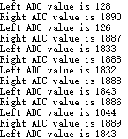

### 3.11.6 扩展实验

* 本实验学习了通过使用主芯片的ADC功能，实现对红外对管的驱动，请学生做如下实验：

    * 1.GPIO 7 和GPIO 12 复用ADC功能，实现小车哪一边在黑色背景下，哪边电机停止，哪一边在白色背景下，哪边电机就转动。

        提示：参考主芯片GPIO输出实验。


## 3.12 串口实验 

### 3.12.1 实验目的

* 本实验通过使用主芯片的UART，实现串口的自收自发功能。

### 3.12.2 实验要求

* 1.软件要求：VSCode，hi3861_hdu_iot_application(如果采用zip包下载，SDK名称为hi3861_hdu_iot_application-master，如果采用git下载SDK名称为hi3861_hdu_iot_application，此处以采用git下载为例）；

* 2.硬件要求：HISPARK_HI3861_IOT_VER.C开发套件；

* 3.硬件配置：C44 跳线帽接TX-RX；J7跳帽跳至TX-GPIO 0，J8跳帽跳至RX-GPIO 1（单独实验需要，其他实验去掉）；硬件搭建如下图所示：

     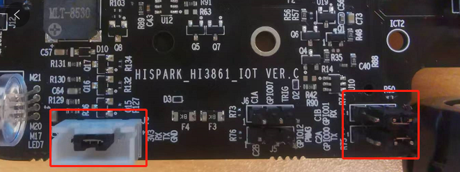

### 3.12.3 接口说明

#### 3.12.3.1 IoTUartInit()

| **定义：**   | unsigned   int IoTUartInit(unsigned int id, const IotUartAttribute *param); |
| ------------ | ------------------------------------------------------------ |
| **功能：**   | 初始化指定的UART端口                                         |
| **参数：**   | id：表示UART设备的端口号   <br/>param：表示指向UART属性的指针 |
| **返回值：** | IOT_SUCCESS：初始化成功    IOT_FAILURE：初始化失败           |
| **依赖：**   | //base/iot_hardware/peripheral/interfaces/kits/iot_uart.h    |

#### 3.12.3.2 IoTUartRead()

| 定义：       | int   IoTUartRead(unsigned int id, unsigned char *data, unsigned int dataLen); |
| ------------ | ------------------------------------------------------------ |
| **功能：**   | 从UART设备中读取指定长度的数据                               |
| **参数：**   | id：表示UART设备的端口号   <br/>data：表示指向要读取数据的起始地址的指针   <br/>dataLen：表示要读取的字节数 |
| **返回值：** | 数据读取成功：返回成功读取的字节数    数据读取失败：返回 -1  |
| **依赖：**   | //base/iot_hardware/peripheral/interfaces/kits/iot_uart.h    |

#### 3.12.3.3 IoTUartWrite()

| 定义：       | int   IoTUartWrite(unsigned int id, const unsigned char *data, unsigned int   dataLen); |
| ------------ | ------------------------------------------------------------ |
| **功能：**   | 将指定长度的数据写入UART设备                                 |
| **参数：**   | id：表示UART设备的端口号   <br/>data：表示指向要写入的数据的起始地址的指针   <br/>dataLen：表示要写入的字节数 |
| **返回值：** | 数据写入成功：返回成功写入的字节数    数据写入失败：返回 -1  |
| **依赖：**   | //base/iot_hardware/peripheral/interfaces/kits/iot_uart.h    |

#### 3.12.3.4 IoTUartDeinit()

| **定义：**   | unsigned   int IoTUartDeinit(unsigned int id);            |
| ------------ | --------------------------------------------------------- |
| **功能：**   | 去初始化指定的UART端口                                    |
| **参数：**   | id：表示UART设备的端口号                                  |
| **返回值：** | IOT_SUCCESS：去初始化成功   IOT_FAILURE：去初始化失败     |
| **依赖：**   | //base/iot_hardware/peripheral/interfaces/kits/iot_uart.h |

### 3.12.4 实验流程

* 步骤一：hi3861_hdu_iot_application/src/vendor/hisilicon/hispark_pegasus/demo/uart_demo文件夹复制到hi3861_hdu_iot_application/src/applications/sample/wifi-iot/app/目录下。

* 步骤二：修改applications/sample/wifi-iot/app/目录下的BUILD.gn，在features字段中添加uart_demo: uart_control。注：第一个uart_demo指的是需要编译的工程目录，第二个uart_control指的是applications/sample/wifi-iot/app/uart_demo/BUILD.gn文件中的静态库，名称为uart_control。

```c
import("//build/lite/config/component/lite_component.gni")

lite_component("app") {
  features = [ "uart_demo:uart_control",]
}
```

* 步骤三：UART通信原理：数据从一个设备UART的发送引脚（Tx） 流向另一个设备UART的接收（Rx） 引脚。

    由于默认UART 0为调试串口对应的是GPIO03和GPIO04,一般情况下不修改；与其他设备通信使用UART 1或者UART 2,本实验使用的是UART1，对应的就是GPIO00（UART1的TX）和GPIO01（UART1的RT），核心代码如方下所示:

```C
1 /*
2  * Copyright (c) 2022 HiSilicon (Shanghai) Technologies CO., LIMITED.
3  * Licensed under the Apache License, Version 2.0 (the "License");
4  * you may not use this file except in compliance with the License.
5  * You may obtain a copy of the License at
6  *
7  *     http://www.apache.org/licenses/LICENSE-2.0
8  *
9  * Unless required by applicable law or agreed to in writing, software
10  * distributed under the License is distributed on an "AS IS" BASIS,
11  * WITHOUT WARRANTIES OR CONDITIONS OF ANY KIND, either express or implied.
12  * See the License for the specific language governing permissions and
13  * limitations under the License.
14  */
15 
16 #include <stdio.h>
17 #include <unistd.h>
18 #include <string.h>
19 
20 #include "iot_gpio_ex.h"
21 #include "ohos_init.h"
22 #include "cmsis_os2.h"
23 #include "iot_gpio.h"
24 #include "iot_uart.h"
25 #include "hi_uart.h"
26 #include "iot_watchdog.h"
27 #include "iot_errno.h"
28 
29 #define UART_BUFF_SIZE 100
30 #define U_SLEEP_TIME   1
31 
32 void Uart1GpioInit(void)
33 {
34     IoTGpioInit(IOT_IO_NAME_GPIO_0);
35     // 设置GPIO0的管脚复用关系为UART1_TX Set the pin reuse relationship of GPIO0 to UART1_ TX
36     IoSetFunc(IOT_IO_NAME_GPIO_0, IOT_IO_FUNC_GPIO_0_UART1_TXD);
37     IoTGpioInit(IOT_IO_NAME_GPIO_1);
38     // 设置GPIO1的管脚复用关系为UART1_RX Set the pin reuse relationship of GPIO1 to UART1_ RX
39     IoSetFunc(IOT_IO_NAME_GPIO_1, IOT_IO_FUNC_GPIO_1_UART1_RXD);
40 }
41 
42 void Uart1Config(void)
43 {
44     uint32_t ret;
45     /* 初始化UART配置，波特率 9600，数据bit为8,停止位1，奇偶校验为NONE */
46     /* Initialize UART configuration, baud rate is 9600, data bit is 8, stop bit is 1, parity is NONE */
47     IotUartAttribute uart_attr = {
48         .baudRate = 9600,
49         .dataBits = 8,
50         .stopBits = 1,
51         .parity = 0,
52     };
53     ret = IoTUartInit(HI_UART_IDX_1, &uart_attr);
54     if (ret != IOT_SUCCESS) {
55         printf("Init Uart1 Falied Error No : %d\n", ret);
56         return;
57     }
58 }
59 
60 static void UartTask(void)
61 {
62     const char *data = "Hello OpenHarmony !!!\n";
63     uint32_t count = 0;
64     uint32_t len = 0;
65     unsigned char uartReadBuff[UART_BUFF_SIZE] = {0};
66 
67     // 对UART1的一些初始化 Some initialization of UART1
68     Uart1GpioInit();
69     // 对UART1参数的一些配置 Some configurations of UART1 parameters
70     Uart1Config();
71 
72     while (1) {
73         // 通过UART1 发送数据 Send data through UART1
74         IoTUartWrite(HI_UART_IDX_1, (unsigned char*)data, strlen(data));
75         // 通过UART1 接收数据 Receive data through UART1
76         len = IoTUartRead(HI_UART_IDX_1, uartReadBuff, UART_BUFF_SIZE);
77         if (len > 0) {
78             // 把接收到的数据打印出来 Print the received data
79             printf("Uart Read Data is: [ %d ] %s \r\n", count, uartReadBuff);
80         }
81         usleep(U_SLEEP_TIME);
82         count++;
83     }
84 }
85 
86 void UartExampleEntry(void)
87 {
88     osThreadAttr_t attr;
89     IoTWatchDogDisable();
90 
91     attr.name = "UartTask";
92     attr.attr_bits = 0U;
93     attr.cb_mem = NULL;
94     attr.cb_size = 0U;
95     attr.stack_mem = NULL;
96     attr.stack_size = 5 * 1024; // 任务栈大小*1024 stack size 5*1024
97     attr.priority = osPriorityNormal;
98 
99     if (osThreadNew((osThreadFunc_t)UartTask, NULL, &attr) == NULL) {
100         printf("[UartTask] Failed to create UartTask!\n");
101     }
102 }
103 
104 APP_FEATURE_INIT(UartExampleEntry);
```

- 步骤四：修改hi3861_hdu_iot_application/src/device/hisilicon/hispark_pegasus/sdk_liteos/build/config/usr_config.mk文件。在这个配置文件中打开UART驱动宏。搜索字段CONFIG_UART1_SUPPORT ，并打开UART1。配置如下：
  
  ```
  # CONFIG_UART1_SUPPORT is not set
  CONFIG_UART1_SUPPORT =y
  ```
  
- 步骤五：点击DevEco Device Tool工具“Rebuild”按键，具体编译步骤参考“1.4章节 运行第一个程序helloworld”


- 步骤六：点击DevEco Device Tool工具“Upload”按键，等待提示（出现Connecting，please reset device...），手动进行开发板复位（按下开发板reset键），将程序烧录到开发板中。具体烧录步骤参考“1.4章节 运行第一个程序helloworld”。

  
### 3.12.5 实验结果

* 注意：需要把TX和RX通过跳线帽连接，可以参考实验要求。
* 软件烧录成功后，打开串口工具，按一下开发板的RESET按键复位开发板，可以看到串口打印出来了写入UART1的数据，说明使用主芯片的UART，实现串口的自收自发功能的实验成功。串口打印信息如下所示。


### 3.12.6 扩展实验

* 本实验通过使用主芯片的UART，实现串口的自收自发功能，请学生做如下实验：
  * 1、两个队伍之间通信，通过按键相互控制另外一个车的红色交通灯亮灭。
  
      提示：一辆车按S1按键发送亮灭标志，另一辆车通过UART串口接收到标志，实现控制红色交通灯亮灭。
  
## 3.13 基础WiFi实验

### 3.13.1 实验目的

* 本实验主要学习Hi3861V100的STA和AP模式。

### 3.13.2 实验要求

* 1.软件要求：VSCode，hi3861_hdu_iot_application(如果采用zip包下载，SDK名称为hi3861_hdu_iot_application-master，如果采用git下载SDK名称为hi3861_hdu_iot_application，此处以采用git下载为例）；
* 2.硬件要求：HISPARK_HI3861_IOT_VER.C开发套件；
* 3.硬件搭建如下图所示：

   

### 3.13.3 接口说明

* STA模式

#### 3.13.3.1 ConnectToHotspot()

| **定义：**   | int ConnectToHotspot(WifiDeviceConfig* apConfig);           |
| ------------ | ----------------------------------------------------------- |
| **功能：**   | 连接WiFi                                                    |
| **参数：**   | WiFi相关参数比如SSID,密码                                   |
| **返回值：** | 1：成功                                                     |
| **依赖：**   | //foundation/communication/wifi_lite/interfaces/wifiservice |

#### 3.13.3.2 DisconnectWithHotspot()

| 定义：     | void DisconnectWithHotspot(int netId);                      |
| ---------- | ----------------------------------------------------------- |
| **功能：   | 断开WiFi                                                    |
| **参数：** | WiFi对应的netId                                             |
| **返回值： | 无                                                          |
| **依赖：** | //foundation/communication/wifi_lite/interfaces/wifiservice |

* AP模式

#### 3.13.3.3 StartHotspot()

| 定义：     | int StartHotspot(const HotspotConfig* config);              |
| ---------- | ----------------------------------------------------------- |
| **功能：** | 开启AP                                                      |
| **参数：** | AP参数包括：IP地址，默认网关，子网掩码                      |
| **返回值： | 0：成功                                                     |
| **依赖：** | //foundation/communication/wifi_lite/interfaces/wifiservice |

#### 3.13.3.4 StopHotspot()

| **定义：**   | void StopHotspot(void);                                     |
| ------------ | ----------------------------------------------------------- |
| **功能：**   | 断开AP                                                      |
| **参数：**   | 无                                                          |
| **返回值：** | 无                                                          |
| **依赖：**   | //foundation/communication/wifi_lite/interfaces/wifiservice |

### 3.13.4 实验流程

* 步骤一：hi3861_hdu_iot_application/src/vendor/hisilicon/hispark_pegasus/demo/wifi_demo文件夹复制到hi3861_hdu_iot_application/src/applications/sample/wifi-iot/app/目录下。

* 步骤二：修改applications/sample/wifi-iot/app/ wifi_demo/目录下的BUILD.gn，如果使用Hi3861V100 STA模式，将"wifi_starter.c"和"wifi_hotspot_demo.c"屏蔽，如果使用Hi3861V100 AP模式，将"wifi_connecter.c"和"wifi_connect_demo.c"屏蔽（注意：只能同时使用一种模式）。

```c
static_library("wifi_control") {
  sources = [
    #"wifi_connecter.c",
    "wifi_starter.c",
    #"wifi_connect_demo.c",
    "wifi_hotspot_demo.c",
  ]

  include_dirs = [
    "./",
    "//utils/native/lite/include",
    "//kernel/liteos_m/kal/cmsis",
    "//base/iot_hardware/peripheral/interfaces/kits",
    "//foundation/communication/wifi_lite/interfaces/wifiservice",
    "//vendor/hisi/hi3861/hi3861/third_party/lwip_sack/include",
    ]
}
```

* 步骤三：修改applications/sample/wifi-iot/app/目录下的BUILD.gn，在features字段中添加wifi_demo: wifi_control。注：第一个wifi_demo指的是需要编译的工程目录，第二个wifi_control指的是applications/sample/wifi-iot/app/wifi_demo/BUILD.gn文件中的静态库，名称为wifi_control。

```c
import("//build/lite/config/component/lite_component.gni")

lite_component("app") {
  features = [ "wifi_demo:wifi_control", ]
}
```

* 步骤四：Hi3861V100作为STA模式(参考步骤2修改文件实现demo功能)，使用开发板连接路由器或者手机热点，可以在wifi_connect_demo.c修改热点名称和密码（注意：只支持4G网络）本demo wifi名：“H”，密码：“12345678”。核心代码如下所示。
```c
1 /*
2  * Copyright (c) 2022 HiSilicon (Shanghai) Technologies CO., LIMITED.
3  * Licensed under the Apache License, Version 2.0 (the "License");
4  * you may not use this file except in compliance with the License.
5  * You may obtain a copy of the License at
6  *
7  *     http://www.apache.org/licenses/LICENSE-2.0
8  *
9  * Unless required by applicable law or agreed to in writing, software
10  * distributed under the License is distributed on an "AS IS" BASIS,
11  * WITHOUT WARRANTIES OR CONDITIONS OF ANY KIND, either express or implied.
12  * See the License for the specific language governing permissions and
13  * limitations under the License.
14  */
15 
16 #include "wifi_device.h"
17 #include "cmsis_os2.h"
18 
19 #include "lwip/netifapi.h"
20 #include "lwip/api_shell.h"
21 
22 static void PrintLinkedInfo(WifiLinkedInfo* info)
23 {
24     if (!info) return;
25 
26     static char macAddress[32] = {0};
27     unsigned char* mac = info->bssid;
28     int ret = snprintf(macAddress, sizeof(macAddress), "%02X:%02X:%02X:%02X:%02X:%02X",
29         mac[0], mac[1], mac[2], mac[3], mac[4], mac[5]); /* mac address 0,1,2,3,4,5 */
30     if (ret != 17) {  /* mac len 17 */
31         printf("ret failed = %d\r\n", ret);
32     }
33     printf("bssid: %s, rssi: %d, connState: %d, reason: %d, ssid: %s\r\n",
34         macAddress, info->rssi, info->connState, info->disconnectedReason, info->ssid);
35 }
36 
37 static volatile int g_connected = 0;
38 
39 static void OnWifiConnectionChanged(int state, WifiLinkedInfo* info)
40 {
41     if (!info) return;
42 
43     printf("%s %d, state = %d, info = \r\n", __FUNCTION__, __LINE__, state);
44     PrintLinkedInfo(info);
45 
46     if (state == WIFI_STATE_AVALIABLE) {
47         g_connected = 1;
48     } else {
49         g_connected = 0;
50     }
51 }
52 
53 static void OnWifiScanStateChanged(int state, int size)
54 {
55     printf("%s %d, state = %X, size = %d\r\n", __FUNCTION__, __LINE__, state, size);
56 }
57 
58 static WifiEvent g_defaultWifiEventListener = {
59     .OnWifiConnectionChanged = OnWifiConnectionChanged,
60     .OnWifiScanStateChanged = OnWifiScanStateChanged
61 };
62 
63 static struct netif* g_iface = NULL;
64 
65 int ConnectToHotspot(WifiDeviceConfig* apConfig)
66 {
67     WifiErrorCode errCode;
68     int netId = -1;
69 
70     errCode = RegisterWifiEvent(&g_defaultWifiEventListener);
71     printf("RegisterWifiEvent: %d\r\n", errCode);
72 
73     errCode = EnableWifi();
74     printf("EnableWifi: %d\r\n", errCode);
75 
76     errCode = AddDeviceConfig(apConfig, &netId);
77     printf("AddDeviceConfig: %d\r\n", errCode);
78 
79     g_connected = 0;
80     errCode = ConnectTo(netId);
81     printf("ConnectTo(%d): %d\r\n", netId, errCode);
82 
83     while (!g_connected) {
84         osDelay(10); // wait 10=100ms  until connect to AP
85     }
86     printf("g_connected: %d\r\n", g_connected);
87 
88     g_iface = netifapi_netif_find("wlan0");
89     if (g_iface) {
90         err_t ret = netifapi_dhcp_start(g_iface);
91         printf("netifapi_dhcp_start: %d\r\n", ret);
92 
93         osDelay(100); // wait 100=1s DHCP server give me IP
94         ret = netifapi_netif_common(g_iface, dhcp_clients_info_show, NULL);
95         printf("netifapi_netif_common: %d\r\n", ret);
96     }
97     return netId;
98 }
99 
100 void DisconnectWithHotspot(int netId)
101 {
102     if (g_iface) {
103         err_t ret = netifapi_dhcp_stop(g_iface);
104         printf("netifapi_dhcp_stop: %d\r\n", ret);
105     }
106 
107     WifiErrorCode errCode = Disconnect(); // disconnect with your AP
108     printf("Disconnect: %d\r\n", errCode);
109 
110     errCode = UnRegisterWifiEvent(&g_defaultWifiEventListener);
111     printf("UnRegisterWifiEvent: %d\r\n", errCode);
112 
113     RemoveDevice(netId); // remove AP config
114     printf("RemoveDevice: %d\r\n", errCode);
115 
116     errCode = DisableWifi();
117     printf("DisableWifi: %d\r\n", errCode);
118 }
```

   Hi3861V100作为AP模式(参考步骤2修改文件实现demo工)，可以使用手机连接开发板AP，可以在wifi_hotspot_demo.c文件中修改开发板AP的名称和密码。本demo AP名称：“HiSpark-AP”，密码为：“12345678”。核心代码如下所示。
```c
1 /*
2  * Copyright (c) 2022 HiSilicon (Shanghai) Technologies CO., LIMITED.
3  * Licensed under the Apache License, Version 2.0 (the "License");
4  * you may not use this file except in compliance with the License.
5  * You may obtain a copy of the License at
6  *
7  *     http://www.apache.org/licenses/LICENSE-2.0
8  *
9  * Unless required by applicable law or agreed to in writing, software
10  * distributed under the License is distributed on an "AS IS" BASIS,
11  * WITHOUT WARRANTIES OR CONDITIONS OF ANY KIND, either express or implied.
12  * See the License for the specific language governing permissions and
13  * limitations under the License.
14  */
15 
16 #include "wifi_starter.h"
17 #include "cmsis_os2.h"
18 
19 #include "lwip/netifapi.h"
20 
21 static volatile int g_hotspotStarted = 0;
22 
23 static void OnHotspotStateChanged(int state)
24 {
25     printf("OnHotspotStateChanged: %d.\r\n", state);
26     if (state == WIFI_HOTSPOT_ACTIVE) {
27         g_hotspotStarted = 1;
28     } else {
29         g_hotspotStarted = 0;
30     }
31 }
32 
33 static volatile int g_joinedStations = 0;
34 
35 static void PrintStationInfo(StationInfo* info)
36 {
37     if (!info) return;
38     static char macAddress[32] = {0};
39     unsigned char* mac = info->macAddress;
40     int ret = snprintf(macAddress, sizeof(macAddress), "%02X:%02X:%02X:%02X:%02X:%02X",
41         mac[0], mac[1], mac[2], mac[3], mac[4], mac[5]); /* mac address 0,1,2,3,4,5 */
42     if (ret != 17) { /* mac len 17 */
43         printf("ret failed = %d\r\n", ret);
44     }
45     printf(" PrintStationInfo: mac=%s, reason=%d.\r\n", macAddress, info->disconnectedReason);
46 }
47 
48 static void OnHotspotStaJoin(StationInfo* info)
49 {
50     g_joinedStations++;
51     PrintStationInfo(info);
52     printf("+OnHotspotStaJoin: active stations = %d.\r\n", g_joinedStations);
53 }
54 
55 static void OnHotspotStaLeave(StationInfo* info)
56 {
57     g_joinedStations--;
58     PrintStationInfo(info);
59     printf("-OnHotspotStaLeave: active stations = %d.\r\n", g_joinedStations);
60 }
61 
62 WifiEvent g_defaultWifiEventListener = {
63     .OnHotspotStaJoin = OnHotspotStaJoin,
64     .OnHotspotStaLeave = OnHotspotStaLeave,
65     .OnHotspotStateChanged = OnHotspotStateChanged,
66 };
67 
68 static struct netif* g_iface = NULL;
69 
70 int StartHotspot(const HotspotConfig* config)
71 {
72     WifiErrorCode errCode = WIFI_SUCCESS;
73 
74     errCode = RegisterWifiEvent(&g_defaultWifiEventListener);
75     printf("RegisterWifiEvent: %d\r\n", errCode);
76 
77     errCode = SetHotspotConfig(config);
78     printf("SetHotspotConfig: %d\r\n", errCode);
79 
80     g_hotspotStarted = 0;
81     errCode = EnableHotspot();
82     printf("EnableHotspot: %d\r\n", errCode);
83 
84     while (!g_hotspotStarted) {
85         osDelay(10); /* 10=100ms */
86     }
87     printf("g_hotspotStarted = %d.\r\n", g_hotspotStarted);
88 
89     g_iface = netifapi_netif_find("ap1");
90     if (g_iface) {
91         ip4_addr_t ipaddr;
92         ip4_addr_t gateway;
93         ip4_addr_t netmask;
94 
95         IP4_ADDR(&ipaddr,  192, 168, 1, 1);     /* input your IP for example: 192.168.1.1 */
96         IP4_ADDR(&gateway, 192, 168, 1, 1);     /* input your gateway for example: 192.168.1.1 */
97         IP4_ADDR(&netmask, 255, 255, 255, 0);   /* input your netmask for example: 255.255.255.0 */
98         err_t ret = netifapi_netif_set_addr(g_iface, &ipaddr, &netmask, &gateway);
99         printf("netifapi_netif_set_addr: %d\r\n", ret);
100 
101         ret = netifapi_dhcps_start(g_iface, 0, 0);
102         printf("netifapi_dhcp_start: %d\r\n", ret);
103     }
104     return errCode;
105 }
106 
107 void StopHotspot(void)
108 {
109     if (g_iface) {
110         err_t ret = netifapi_dhcps_stop(g_iface);
111         printf("netifapi_dhcps_stop: %d\r\n", ret);
112     }
113 
114     WifiErrorCode errCode = UnRegisterWifiEvent(&g_defaultWifiEventListener);
115     printf("UnRegisterWifiEvent: %d\r\n", errCode);
116 
117     errCode = DisableHotspot();
118     printf("EnableHotspot: %d\r\n", errCode);
119 }
```
- 步骤五：点击DevEco Device Tool工具“Rebuild”按键，具体编译步骤参考“1.4章节 运行第一个程序helloworld”


- 步骤六：点击DevEco Device Tool工具“Upload”按键，等待提示（出现Connecting，please reset device...），手动进行开发板复位（按下开发板reset键），将程序烧录到开发板中。具体烧录步骤参考“1.4章节 运行第一个程序helloworld”。

  

### 3.13.5 实验结果

* 如果Hi3861作为STA模式，打开SSCOM串口工具（<font color='RedOrange'>**注意：这里以sscom为例，该工具需要自己百度下载，也可以使用Monitor工具，参考“1.4 章节 运行第一个程序helloworld”**</font>)，Hi3861连接WiFi成功后出现如下打印：

    

* 如果Hi3861作为AP模式，打开SSCOM串口工具（<font color='RedOrange'>**注意：这里以sscom为例，该工具需要自己百度下载，也可以使用Monitor工具，参考“1.4 章节 运行第一个程序helloworld”**</font>)，手机可以搜索到HiSpark-AP，然后连接，同时串口出现如下打印：

    

# 4、操作系统实验

## 4.1 线程

### 4.1.1 实验目的

* 掌握如何使用多线程编程，实现对多个外设的控制。

### 4.1.2 实验要求

* 1.软件要求：VSCode，hi3861_hdu_iot_application(如果采用zip包下载，SDK名称为hi3861_hdu_iot_application-master，如果采用git下载SDK名称为hi3861_hdu_iot_application，此处以采用git下载为例）；

* 2.硬件要求：HISPARK_HI3861_IOT_VER.C开发套件；

* 3.接线方式：将MOTOR_EN拨码开关由ON拨到OFF；硬件搭建如下图所示：

   

### 4.1.3 接口说明

#### 4.1.3.1 osThreadNew  ()

| 定义： | osThreadId_t osThreadNew (osThreadFunc_t func, void *argument, <br/>const osThreadAttr_t *attr); |
| ------ | ------------------------------------------------------------ |
| 功能   | 创建一个线程并将其添加到活动线程                             |
| 参数   | func：线程函数<br/>argument：参数指针，作为开始参数传递给线程函数   <br/>attr:线程属性；NULL：默认值 |
| 返回值 | 创建成功：返回线程ID   创建失败：返回NULL                    |
| 依赖   | //third_party/cmsis/CMSIS/RTOS2/Include/cmsis_os2.h          |

| 接口名称              | 函数说明                                               |
| --------------------- | ------------------------------------------------------ |
| osThreadGetName       | 获取指定线程的名字                                     |
| osThreadGetId         | 获取当前运行线程的线程ID                               |
| osThreadGetState      | 获取当前线程的状态                                     |
| osThreadSetPriority   | 设置指定线程的优先级                                   |
| osThreadGetPriority   | 获取当前线程的优先级                                   |
| osThreadYield         | 将运行控制转交给下一个处于READY状态的线程              |
| osThreadSuspend       | 挂起指定线程的运行                                     |
| osThreadResume        | 恢复指定线程的运行                                     |
| osThreadDetach        | 分离指定的线程（当线程终止运行时，线程存储可以被回收） |
| osThreadJoin          | 等待指定线程终止运行                                   |
| osThreadExit          | 终止当前线程的运行                                     |
| osThreadTerminate     | 终止指定线程的运行                                     |
| osThreadGetStackSize  | 获取指定线程的栈空间大小                               |
| osThreadGetStackSpace | 获取指定线程的未使用的栈空间大小                       |
| osThreadGetCount      | 获取活跃线程数                                         |
| osThreadEnumerate     | 获取线程组中的活跃线程数                               |

* 以上接口依赖的头文件是：//third_party/cmsis/CMSIS/RTOS2/Include/cmsis_os2.h

### 4.1.4 实验流程

* 步骤一：hi3861_hdu_iot_application/src/vendor/hisilicon/hispark_pegasus/demo/thread_demo文件夹复制到hi3861_hdu_iot_application/src/applications/sample/wifi-iot/app/目录下。

* 步骤二：修改applications/sample/wifi-iot/app/目录下的BUILD.gn，在features字段中添加thread_demo: thread_demo。注：第一个thread_demo指的是需要编译的工程目录，第二个thread_demo指的是applications/sample/wifi-iot/app/ thread_demo/BUILD.gn文件中的静态库，名称为thread_demo。

```c
import("//build/lite/config/component/lite_component.gni")
lite_component("app") {
  features = [ "thread_demo:thread_demo", ]
}
```

* 步骤三：修改核心代码

```c
1 /*
2  * Copyright (c) 2022 HiSilicon (Shanghai) Technologies CO., LIMITED.
3  * Licensed under the Apache License, Version 2.0 (the "License");
4  * you may not use this file except in compliance with the License.
5  * You may obtain a copy of the License at
6  *
7  *     http://www.apache.org/licenses/LICENSE-2.0
8  *
9  * Unless required by applicable law or agreed to in writing, software
10  * distributed under the License is distributed on an "AS IS" BASIS,
11  * WITHOUT WARRANTIES OR CONDITIONS OF ANY KIND, either express or implied.
12  * See the License for the specific language governing permissions and
13  * limitations under the License.
14  */
15 
16 #include <stdio.h>
17 #include <unistd.h>
18 
19 #include "iot_gpio_ex.h"
20 #include "iot_pwm.h"
21 #include "iot_gpio.h"
22 #include "ohos_init.h"
23 #include "cmsis_os2.h"
24 #include "iot_watchdog.h"
25 
26 #define STACK_SIZE          1024
27 #define OS_DELAY            5
28 #define IOT_PWM_PORT_PWM2   2       // GPIO5对应的是PWM2
29                                     // GPIO5 corresponds to PWM2
30 #define PWM_CHANGE_TIMES    99      // PWM循环输出的次数
31                                     // Number of PWM cycle outputs
32 #define PWM_FREQ            65535   // PWM分频倍数
33                                     // PWM frequency division multiple
34 #define PWM_DELAY_10US      10      // PWM循环一次延迟的时间
35                                     // Time of delay for one PWM cycle
36 
37 
38 void YellowLedControl(const char *arg)
39 {
40     (void)arg;
41     unsigned int i;
42 
43     while (1) {
44         for (i = 0; i < PWM_CHANGE_TIMES; i++) {
45             IoTPwmStart(IOT_PWM_PORT_PWM2, i, PWM_FREQ);
46             usleep(PWM_DELAY_10US);
47         }
48         i = 0;
49     }
50 }
51 
52 void RedLedControl(const char *arg)
53 {
54     (void)arg;
55     while (1) {
56         IoTGpioSetOutputVal(IOT_IO_NAME_GPIO_9, IOT_GPIO_VALUE1);
57         // 延时函数毫秒（设置高电平持续时间）
58         // Delay function milliseconds (set high level duration)
59         usleep(OS_DELAY);
60         // 设置GPIO09输出低电平熄灭红色交通灯LED3
61         // Set GPIO09 output low level to turn off red traffic light LED 3
62         IoTGpioSetOutputVal(IOT_IO_NAME_GPIO_9, IOT_GPIO_VALUE0);
63         usleep(OS_DELAY);
64     }
65 }
66 
67 void LedGpioInit(void)
68 {
69     IoTGpioInit(IOT_IO_NAME_GPIO_9);                                // RED LED的GPIO初始化
70                                                                     // GPIO initialization of RED LED
71     IoSetFunc(IOT_IO_NAME_GPIO_9, IOT_IO_FUNC_GPIO_9_GPIO);         // 设置GPIO9的管脚复用关系为GPIO
72                                                                     // Set the pin reuse relationship of GPIO9 to GPIO
73     IoTGpioSetDir(IOT_IO_NAME_GPIO_9, IOT_GPIO_DIR_OUT);            // GPIO9方向设置为输出
74                                                                     // GPIO9 direction set to output
75     IoTGpioSetOutputVal(IOT_IO_NAME_GPIO_9, IOT_GPIO_VALUE0);       // 设置GPIO09输出低电平,熄灭红色交通灯LED
76     // Set GPIO09 output low level and turn off the red traffic light LED
77     IoTGpioInit(IOT_IO_NAME_GPIO_5);                                // 初始化GPIO5管脚
78                                                                     // Initialize GPIO5 pin
79     IoSetFunc(IOT_IO_NAME_GPIO_5, IOT_IO_FUNC_GPIO_5_PWM2_OUT);     // 设置GPIO5的管脚复用关系为PWM
80     // Set the pin multiplexing relationship of GPIO5 to PWM
81     IoTGpioSetDir(IOT_IO_NAME_GPIO_5, IOT_GPIO_DIR_OUT);            // 设置GPIO5的管脚方向为输出
82                                                                     // Set the pin direction of GPIO5 as output
83     IoTPwmInit(IOT_PWM_PORT_PWM2);                                  // 初始化GPIO5为PWM2
84                                                                     // Initialize GPIO5 to PWM2
85 }
86 
87 void ThreadExampleEntry(void)
88 {
89     osThreadAttr_t attr;
90 
91     LedGpioInit();
92     IoTWatchDogDisable();
93 
94     attr.name = "RedLedControl";
95     attr.attr_bits = 0U;
96     attr.cb_mem = NULL;
97     attr.cb_size = 0U;
98     attr.stack_mem = NULL;
99     attr.stack_size = STACK_SIZE;
100     attr.priority = osPriorityNormal;
101 
102     // 创建一个线程，并注册一个回调函数RedLedControl，控制红色LED灯每隔1秒钟闪烁一次
103     // Create a thread and register a callback function RedLedControl to
104     // control the red LED to flash once every 1 second
105     if (osThreadNew((osThreadFunc_t)RedLedControl, NULL, &attr) == NULL) {
106         printf("[RedLedControl] osThreadNew Falied to create RedLedControl!\n");
107     }
108 
109     // 创建第二个线程，注册回调函数为GreenLedControl,控制绿色LED灯，实现呼吸灯效果
110     // Create the second thread, register the callback function as GreenLedControl,
111     // control the green LED light, and achieve the effect of breathing light
112     attr.name = "YellowLedControl";
113     attr.priority = osPriorityNormal;
114     if (osThreadNew((osThreadFunc_t)YellowLedControl, NULL, &attr) == NULL) {
115         printf("[YellowLedControl] osThreadNew Falied to create YellowLedControl!\n");
116     }
117 }
118 
119 APP_FEATURE_INIT(ThreadExampleEntry);
```

- 步骤四：点击DevEco Device Tool工具“Rebuild”按键，具体编译步骤参考“1.4章节 运行第一个程序helloworld”


- 步骤五：点击DevEco Device Tool工具“Upload”按键，等待提示（出现Connecting，please reset device...），手动进行开发板复位（按下开发板reset键），将程序烧录到开发板中。具体烧录步骤参考“1.4章节 运行第一个程序helloworld”。

  

### 4.1.5 实验结果

* 软件烧录成功后，按一下开发板的RESET按键复位开发板，小车的红色LED屏幕会每隔1秒钟闪烁一次，并控制黄色LED灯，实现呼吸灯的效果，说明我们使用多线程来控制多个外设的实验成功。

    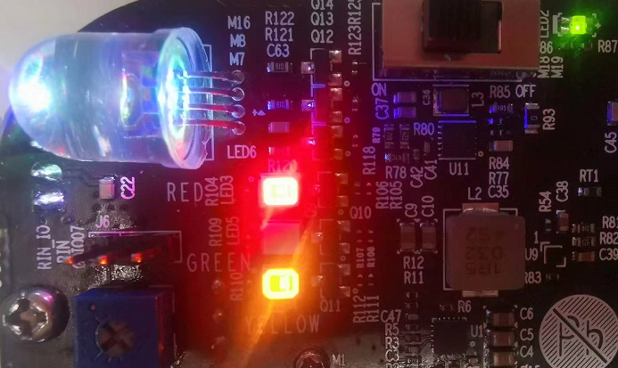

### 4.1.6 扩展实验

* 本实验学习了如何使用多线程编程，请学生做如下实验：
  * 1、创建两个线程，一个线程用来实时获取电量检测模块的数据，另外一个线程用来实时获取陀螺仪的数据。

## 4.2 信号量

### 4.2.1 实验目的

* 通过使用信号量，在不同线程中访问共享资源，来模拟交通灯的实验。

### 4.2.2 实验要求

* 1.软件要求：VSCode，hi3861_hdu_iot_application(如果采用zip包下载，SDK名称为hi3861_hdu_iot_application-master，如果采用git下载SDK名称为hi3861_hdu_iot_application，此处以采用git下载为例）；

* 2.硬件要求：HISPARK_HI3861_IOT_VER.C开发套件；

* 3.接线方式：将MOTOR_EN拨码开关由ON拨到OFF；硬件搭建如下图所示：

   

### 4.2.3 接口说明

#### 4.2.3.1 osSemaphoreNew()

| **定义：** | osSemaphoreId_t   osSemaphoreNew(uint32_t max_count,<br/>uint32_t initial_count,const   osSemaphoreAttr_t *attr); |
| ---------- | ------------------------------------------------------------ |
| **功能：** | 创建初始化信号量对象                                         |
| **参数：** | max_count:可用令牌的最大数量   <br/>initial_count：可用令牌的初始数量  <br/>attr:信号量属性；NULL：默认值 |
| **返回值** | 创建成功：返回信号量ID   创建失败：返回NULL                  |
| **依赖：** | //third_party/cmsis/CMSIS/RTOS2/Include/cmsis_os2.h          |

#### 4.2.3.2 osSemaphoreGetName ()

| **定义：**   | const char   *osSemaphoreGetName (osSemaphoreId_t semaphore_id); |
| ------------ | ------------------------------------------------------------ |
| **功能：**   | 获取信号量对象的名称                                         |
| **参数：**   | semaphore_id：信号量ID                                       |
| **返回值：** | 创建成功：将名称返回以null结尾的字符串   创建失败：返回NULL  |
| **依赖：**   | //third_party/cmsis/CMSIS/RTOS2/Include/cmsis_os2.h          |

#### 4.2.3.3 osSemaphoreAcquire ()

| **定义：**   | osStatus_t   osSemaphoreAcquire (osSemaphoreId_t semaphore_id, <br/>uint32_t timeout); |
| ------------ | ------------------------------------------------------------ |
| **功能：**   | 获取信号量令牌，如果没有可用令牌则会超时                     |
| **参数：**   | semaphore_id:信号量ID   <br/>timeout：CMSIS_RTOS_TimeOutValue或在没有超时的情况下为0。 |
| **返回值：** | 返回指示函数执行状态的状态码                                 |
| **依赖：**   | //third_party/cmsis/CMSIS/RTOS2/Include/cmsis_os2.h          |

#### 4.2.3.4 osSemaphoreRelease ()

| **定义：**   | osStatus_t   osSemaphoreRelease (osSemaphoreId_t semaphore_id); |
| ------------ | ------------------------------------------------------------ |
| **功能：**   | 释放信号量令牌，直到初始化最大计数                           |
| **参数：**   | semaphore_id:信号量ID                                        |
| **返回值：** | 返回指示函数执行状态的状态码                                 |
| **依赖：**   | //third_party/cmsis/CMSIS/RTOS2/Include/cmsis_os2.h          |

#### 4.2.3.5 osSemaphoreGetCount ()

| **定义：**   | uint32_t   osSemaphoreGetCount (osSemaphoreId_t semaphore_id); |
| ------------ | ------------------------------------------------------------ |
| **功能：**   | 获取当前信号量令牌计数                                       |
| **参数：**   | semaphore_id:信号量ID                                        |
| **返回值：** | 返回可用令牌数                                               |
| **依赖：**   | //third_party/cmsis/CMSIS/RTOS2/Include/cmsis_os2.h          |

#### 4.2.3.6 osSemaphoreDelete ()

| **定义：**   | osStatus_t   osSemaphoreDelete (osSemaphoreId_t semaphore_id); |
| ------------ | ------------------------------------------------------------ |
| **功能：**   | 删除信号量对象                                               |
| **参数：**   | semaphore_id:信号量ID                                        |
| **返回值：** | 返回指示函数执行状态的状态码                                 |
| **依赖：**   | //third_party/cmsis/CMSIS/RTOS2/Include/cmsis_os2.h          |

### 4.2.4 实验流程

* 步骤一：hi3861_hdu_iot_application/src/vendor/hisilicon/hispark_pegasus/demo/semaphore_demo文件夹复制到hi3861_hdu_iot_application/src/applications/sample/wifi-iot/app/目录下。

* 步骤二：修改applications/sample/wifi-iot/app/目录下的BUILD.gn，在features字段中添加semaphore_demo:semaphore_demo。注：第一个semaphore_demo指的是需要编译的工程目录，第二个semaphore_demo指的是applications/sample/wifi-iot/app/ semaphore_demo /BUILD.gn文件中的静态库，名称为semaphore_demo。

```c
import("//build/lite/config/component/lite_component.gni")

lite_component("app") {
  features = [ "semaphore_demo:semaphore_demo", ]
}
```

* 步骤三：原理：信号量是一种实现任务间通信的机制，实现任务之间同步或临界资源的互斥访问。在多任务操作系统中，不同的任务之间需要同步运行，信号量功能可以为用户提供这方面的支持。当任务申请(Pend)信号量时，如果申请成功，则信号量的计数值递减，如若申请失败，则挂起在该信号量的等待任务队列上，一旦有任务释放该信号量，则等待任务队列中的任务被唤醒开始执行。代码如下：

```c
1 /*
2  * Copyright (c) 2022 HiSilicon (Shanghai) Technologies CO., LIMITED.
3  * Licensed under the Apache License, Version 2.0 (the "License");
4  * you may not use this file except in compliance with the License.
5  * You may obtain a copy of the License at
6  *
7  *     http://www.apache.org/licenses/LICENSE-2.0
8  *
9  * Unless required by applicable law or agreed to in writing, software
10  * distributed under the License is distributed on an "AS IS" BASIS,
11  * WITHOUT WARRANTIES OR CONDITIONS OF ANY KIND, either express or implied.
12  * See the License for the specific language governing permissions and
13  * limitations under the License.
14  */
15 
16 #include <stdio.h>
17 #include <unistd.h>
18 
19 #include "ohos_init.h"
20 #include "cmsis_os2.h"
21 
22 #define SIDE_WOLK_DELAY         5   // 人行道持续工作5秒
23 // The sidewalk works continuously for 5 seconds
24 #define MOTOR_WAY_DELAY         10  // 机动车道持续工作10秒
25                                     // The motorway works continuously for 10 seconds
26 #define NUM                     1
27 #define STACK_SIZE              1024
28 
29 osSemaphoreId_t traffic_light;      // 交通灯信号量
30                                     // Traffic light signal volume
31 
32 // 人行道线程
33 // Sidewalk thread
34 void SideWalkThread(const char *arg)
35 {
36     unsigned int cout;
37     (void)arg;
38 
39     while (NUM) {
40         // 获取交通灯信号量令牌
41         // Obtain traffic light semaphore token
42         osSemaphoreAcquire(traffic_light, osWaitForever);
43         printf("**************Pedestrians pass and vehicles stop**************\r\n");
44         for (cout = SIDE_WOLK_DELAY; cout > 0; cout--) {
45             printf("[SideWalkThread] Countdown for sidewalk work %d \r\n", cout);
46             osDelay(100); // 10ms * 100 = 1s
47         }
48         // 释放交通灯信号量
49         // Release traffic light signal
50         osSemaphoreRelease(traffic_light);
51     }
52 }
53 
54 // 机动车道线程
55 // Motorway thread
56 void MotorWayThread(const char *arg)
57 {
58     unsigned int cout;
59     (void)arg;
60     while (NUM) {
61         // 获取交通灯信号量令牌
62         // Obtain traffic light semaphore token
63         osSemaphoreAcquire(traffic_light, osWaitForever);
64         printf("**************Vehicles pass and pedestrians stop**************\r\n");
65         for (cout = MOTOR_WAY_DELAY; cout > 0; cout--) {
66             printf("[MotorWayThread] Countdown for MotorWay work %d\r\n", cout);
67             osDelay(100); // 10ms * 100 = 1s
68         }
69         // 释放交通灯信号量
70         // Release traffic light signal
71         osSemaphoreRelease(traffic_light);
72     }
73 }
74 
75 static void SemaphoreDemoEntry(void)
76 {
77     osThreadAttr_t attr;
78 
79     attr.name = "SideWalkThread";
80     attr.attr_bits = 0U;
81     attr.cb_mem = NULL;
82     attr.cb_size = 0U;
83     attr.stack_mem = NULL;
84     attr.stack_size = STACK_SIZE;
85     attr.priority = osPriorityNormal;
86 
87     // 创建一个线程，回调函数是SideWalkThread，用来执行人行道的工作
88     // Create a thread. The callback function is SideWalkThread, which is used to execute the work of the sidewalk
89     if (osThreadNew((osThreadFunc_t)SideWalkThread, NULL, &attr) == NULL) {
90         printf("[SideWalkThread] Failed to create SideWalkThread!\n");
91     }
92 
93     // 创建另一个线程，回调函数是MotorWayThread，用来执行机动车道线程的工作
94     // Create another thread. The callback function is MotorWayThread,
95     // which is used to execute the work of the motorway thread
96     if (osThreadNew((osThreadFunc_t)MotorWayThread, NULL, &attr) == NULL) {
97         printf("[MotorWayThread] Failed to create MotorWayThread!\n");
98     }
99 
100     // 创建一个交通灯的信号量，可用令牌的最大数量为1，可用令牌的初始化数量为0
101     // Create a traffic light semaphore. The maximum number of available tokens is 1,
102     // and the initialization number of available tokens is 0
103     traffic_light = osSemaphoreNew(1, 0, NULL);
104     if (traffic_light == NULL) {
105         printf("Falied to create Semaphore!\n");
106     }
107 
108     // 释放交通灯信号量
109     // Release traffic light signal
110     osSemaphoreRelease(traffic_light);
111 }
112 
113 APP_FEATURE_INIT(SemaphoreDemoEntry);
```

- 步骤四：点击DevEco Device Tool工具“Rebuild”按键，具体编译步骤参考“1.4章节 运行第一个程序helloworld”


- 步骤五：点击DevEco Device Tool工具“Upload”按键，等待提示（出现Connecting，please reset device...），手动进行开发板复位（按下开发板reset键），将程序烧录到开发板中。具体烧录步骤参考“1.4章节 运行第一个程序helloworld”。

  

### 4.2.5 实验结果

* 软件烧录成功后，使用串口工具连接好小车的串口（<font color='RedOrange'>**注意：这里以sscom为例，该工具需要自己百度下载，也可以使用Monitor工具，参考“1.4 章节 运行第一个程序helloworld”**</font>)，按一下开发板的RESET按键复位开发板，可以从串口工具看到，当人行道线程获取到交通灯信号量时，会输出 Pedestrians pass and vehicles stop，此时人行道进入倒计时5秒的工作状态，此时机动车道处于等待状态，5秒后，释放交通灯信号量，此时机动车道线程获取到交通灯信号量，会输出Vehicles pass and pedestrians stop，此时机动车道进入倒计时10秒的工作状态，此时人行道处于等待状态，10秒后释放交通灯信号量，然后再次进入循环，说明我们通过使用信号量，在不同线程中访问共享资源，来模拟交通灯的实验成功。


### 4.2.6 扩展实验

* 本实验通过使用信号量，在不同线程中访问共享资源，来模拟交通灯的实验，请学生做如下实验：
  * 1、通过使用信号量，实现生产者消费者的实验。

## 4.3 定时器

### 4.3.1 实验目的

* 本实验通过使用定时器，来实现宠物喂食机的定时投喂的功能。

### 4.3.2 实验要求

* 1.软件要求：VSCode，hi3861_hdu_iot_application(如果采用zip包下载，SDK名称为hi3861_hdu_iot_application-master，如果采用git下载SDK名称为hi3861_hdu_iot_application，此处以采用git下载为例）；

* 2.硬件要求：HISPARK_HI3861_IOT_VER.C开发套件；

* 3.接线方式：将MOTOR_EN拨码开关由ON拨到OFF；硬件搭建如下图所示：

   

### 4.3.3 接口说明

#### 4.3.3.1 osTimerNew ()

| **定义：** | osTimerId_t   osTimerNew (osTimerFunc_t func, osTimerType_t type, <br/>void *argument, const   osTimerAttr_t *attr); |
| ---------- | ------------------------------------------------------------ |
| **功能：** | 创建并初始化计时器                                           |
| **参数：** | func：指向回调函数的指针   <br/>type：osTimerOnce表示一次触发, osTimerPeriodic表示周期性行为   <br/>argument：计数器回调函数的参数    attr ：定时器属性；NULL：默认值 |
| **返回值** | 创建成功：返回定时器ID   创建失败：返回NULL                  |
| **依赖：** | //third_party/cmsis/CMSIS/RTOS2/Include/cmsis_os2.h          |

#### 4.3.3.2 osTimerGetName ()

| **定义：**   | const char   *osTimerGetName (osTimerId_t timer_id);        |
| ------------ | ----------------------------------------------------------- |
| **功能：**   | 获取定时器的名称                                            |
| **参数：**   | timer_id：定时器ID                                          |
| **返回值：** | 创建成功：将名称返回以null结尾的字符串   创建失败：返回NULL |
| **依赖：**   | //third_party/cmsis/CMSIS/RTOS2/Include/cmsis_os2.h         |

#### 4.3.3.3 osTimerStart ()

| **定义：**   | osStatus_t   osTimerStart (osTimerId_t timer_id, uint32_t ticks); |
| ------------ | ------------------------------------------------------------ |
| **功能：**   | 启动或重新启动定时器                                         |
| **参数：**   | timer_id：定时器ID   <br/>ticks：CMSIS_RTOS_TimeOutValue定时器的“时间刻度”值。 |
| **返回值：** | 返回指示函数执行状态的状态码                                 |
| **依赖：**   | //third_party/cmsis/CMSIS/RTOS2/Include/cmsis_os2.h          |

#### 4.3.3.4 osTimerStop ()

| **定义：**   | osStatus_t   osTimerStop (osTimerId_t timer_id);    |
| ------------ | --------------------------------------------------- |
| **功能：**   | 停止定时器                                          |
| **参数：**   | timer_id：定时器ID                                  |
| **返回值：** | 返回指示函数执行状态的状态码                        |
| **依赖：**   | //third_party/cmsis/CMSIS/RTOS2/Include/cmsis_os2.h |

#### 4.3.3.5 osTimerIsRunning ()

| **定义：**   | uint32_t   osTimerIsRunning (osTimerId_t timer_id); |
| ------------ | --------------------------------------------------- |
| **功能：**   | 检查定时器是否正在运行                              |
| **参数：**   | timer_id：定时器ID                                  |
| **返回值：** | 返回1：正在运行；返回0,：未在运行。                 |
| **依赖：**   | //third_party/cmsis/CMSIS/RTOS2/Include/cmsis_os2.h |

#### 4.3.3.6 osTimerDelete ()

| **定义：**   | osStatus_t   osTimerDelete (osTimerId_t timer_id);  |
| ------------ | --------------------------------------------------- |
| **功能：**   | 删除定时器                                          |
| **参数：**   | timer_id：定时器ID                                  |
| **返回值：** | 返回指示函数执行状态的状态码                        |
| **依赖：**   | //third_party/cmsis/CMSIS/RTOS2/Include/cmsis_os2.h |

### 4.3.4 实验流程

* 步骤一：hi3861_hdu_iot_application/src/vendor/hisilicon/hispark_pegasus/demo/timer_demo文件夹复制到hi3861_hdu_iot_application/src/applications/sample/wifi-iot/app/目录下。

* 步骤二：修改applications/sample/wifi-iot/app/目录下的BUILD.gn，在features字段中添加timer_demo: timer_demo。注：第一个timer_demo指的是需要编译的工程目录，第二个timer_demo指的是applications/sample/wifi-iot/app/ timer_demo /BUILD.gn文件中的静态库，名称为timer_demo。

```c
import("//build/lite/config/component/lite_component.gni")

lite_component("app") {
  features = [ "timer_demo:timer_demo", ]
}
```

* 步骤三：原理：软件定时器使用了系统的一个队列和一个任务资源，软件定时器的触发遵循队列规则，先进先出。定时时间短的定时器总是比定时时间长的靠近队列头，满足优先被触发的准则。
    软件定时器以Tick为基本计时单位，当用户创建并启动一个软件定时器时，LiteOS会根据当前系统Tick时间及用户设置的定时时间间隔确定该定时器的到期Tick时间，并将该定时器控制结构挂入计时全局链表。
    当Tick中断到来时，在Tick中断处理函数中扫描软件定时器的计时全局链表，看是否有定时器超时，若有则将超过的定时器记录下来。
    Tick中断处理函数结束后，软件定时器任务（优先级为最高）被唤醒，在该任务中调用之前记录下来的定时器的超时回调函数。代码如下：

```c
1 /*
2  * Copyright (c) 2022 HiSilicon (Shanghai) Technologies CO., LIMITED.
3  * Licensed under the Apache License, Version 2.0 (the "License");
4  * you may not use this file except in compliance with the License.
5  * You may obtain a copy of the License at
6  *
7  *     http://www.apache.org/licenses/LICENSE-2.0
8  *
9  * Unless required by applicable law or agreed to in writing, software
10  * distributed under the License is distributed on an "AS IS" BASIS,
11  * WITHOUT WARRANTIES OR CONDITIONS OF ANY KIND, either express or implied.
12  * See the License for the specific language governing permissions and
13  * limitations under the License.
14  */
15 
16 #include <stdio.h>
17 #include <string.h>
18 #include <unistd.h>
19 
20 #include "ohos_init.h"
21 #include "cmsis_os2.h"
22 #include "iot_watchdog.h"
23 
24 #define STACK_SIZE          1024
25 #define COUNT_STOP          5
26 #define TIMER_COUNT_NUM     100
27 #define FEED_DELAY          10
28 
29 static int count = 0;   // 定义一个count变量，用于控制投喂的次数
30                         // Define a count variable to control the feeding times
31 
32 void FeedSomeFood(void)
33 {
34     count++;
35     printf("[Timer_demo] Start feeding count is %d \r\n", count);
36 }
37 
38 void TimerThread(const char *arg)
39 {
40     (void)arg;
41     osTimerId_t id;
42     osStatus_t status;
43 
44     // 创建一个周期性的定时器,回调函数是FeedSomeFood，用于宠物喂食机的投喂
45     // Create a periodic timer. The callback function is FeedSomeFood, which is used for feeding the pet feeder
46     id = osTimerNew((osTimerFunc_t)FeedSomeFood, osTimerPeriodic, NULL, NULL);
47     if (id == NULL) {
48         printf("[Timer_demo] osTimerNew failed.\r\n");
49     } else {
50         printf("[Timer_demo] osTimerNew success.\r\n");
51     }
52 
53     // 开始计时100个时钟周期,一个时钟周期是10ms，100个时钟周期就是1s
54     // Start timing 100 clock cycles, one clock cycle is 10ms, 100 clock cycles is 1s
55     status = osTimerStart(id, TIMER_COUNT_NUM);
56     if (status != osOK) {
57         printf("[Timer_demo] osTimerStart failed.\r\n");
58     } else {
59         printf("[Timer_demo] osTimerStart success.\r\n");
60     }
61 
62     // 投喂5次后，停止投喂
63     // Stop feeding after feeding for 5 times
64     while (count < COUNT_STOP) {
65         osDelay(FEED_DELAY);
66     }
67 
68     // 停止定时器
69     // Stop Timer
70     status = osTimerStop(id);
71     printf("[Timer_demo] Timer Stop, status :%d. \r\n", status);
72 
73     // 删除定时器
74     // Delete Timer
75     status = osTimerDelete(id);
76     printf("[Timer_demo] Timer Delete, status :%d. \r\n", status);
77 }
78 
79 void TimerExampleEntry(void)
80 {
81     osThreadAttr_t attr;
82 
83     IoTWatchDogDisable();
84 
85     attr.name = "TimerThread";
86     attr.attr_bits = 0U;
87     attr.cb_mem = NULL;
88     attr.cb_size = 0U;
89     attr.stack_mem = NULL;
90     attr.stack_size = STACK_SIZE;
91     attr.priority = osPriorityNormal;
92 
93     // 创建一个线程，并注册一个回调函数 TimerThread，控制红色LED灯每隔1秒钟闪烁一次
94     // Create a thread, register a callback function TimerThread, and control the red LED to flash once every 1 second
95     if (osThreadNew((osThreadFunc_t)TimerThread, NULL, &attr) == NULL) {
96         printf("[Timer_demo] osThreadNew Falied to create TimerThread!\n");
97     }
98 }
99 
100 
101 APP_FEATURE_INIT(TimerExampleEntry);
```

- 步骤四：点击DevEco Device Tool工具“Rebuild”按键，具体编译步骤参考“1.4章节 运行第一个程序helloworld”


- 步骤五：点击DevEco Device Tool工具“Upload”按键，等待提示（出现Connecting，please reset device...），手动进行开发板复位（按下开发板reset键），将程序烧录到开发板中。具体烧录步骤参考“1.4章节 运行第一个程序helloworld”。

  

### 4.3.5 实验结果

* 软件烧录成功后，使用串口工具连接好小车的串口（<font color='RedOrange'>**注意：这里以sscom为例，该工具需要自己百度下载，也可以使用Monitor工具，参考“1.4 章节 运行第一个程序helloworld”**</font>)，按一下开发板的RESET按键复位开发板，可以从串口工具看到，首先会创建一个定时器，然后开启定时器，当100个时钟周期后，就会调用一次宠物喂食机的投喂功能，投喂5次后，就会停止定时器，然后删除定时器，当出现如下的打印信息，就说明使用定时器，来实现宠物喂食机的定时投喂的实验成功。


### 4.3.6 扩展实验

* 本实验通过使用定时器，来实现宠物喂食机的定时投喂的功能，请学生做如下实验：
  * 1、通过使用定时器，模拟交通灯的警报功能，每隔30秒钟开启蜂鸣器一次，一次响5秒钟。


## 4.4 中断处理

### 4.4.1 实验目的

* 本实验内容：主要实现中断机理认知与定时器中断实验案例。

### 4.4.2 实验要求

* 1.软件要求：VSCode，hi3861_hdu_iot_application(如果采用zip包下载，SDK名称为hi3861_hdu_iot_application-master，如果采用git下载SDK名称为hi3861_hdu_iot_application，此处以采用git下载为例）；
* 2.硬件要求：HISPARK_HI3861_IOT_VER.C开发套件；
* 3.接线方式：将MOTOR_EN拨码开关由ON拨到OFF；硬件搭建如下图所示：

   

### 4.4.3 接口说明

#### 4.4.3.1 osSemaphoreNew()

| **定义：** | HI_EXTERN hi_xtal_clock hi_get_xtal_clock(hi_void);          |
| ---------- | ------------------------------------------------------------ |
| **功能：** | 创建初始化信号量对象                                         |
| **参数：** | max_count:可用令牌的最大数量   <br/>initial_count：可用令牌的初始数量  <br/>attr:信号量属性；NULL：默认值 |
| **返回值** | 创建成功：返回信号量ID   创建失败：返回NULL                  |
| **依赖：** | //third_party/cmsis/CMSIS/RTOS2/Include/cmsis_os2.h          |

#### 4.4.3.2 osSemaphoreGetName ()

| **定义：**   | hi_u32 hi_int_lock(hi_void)；                               |
| ------------ | ----------------------------------------------------------- |
| **功能：**   | 获取信号量对象的名称                                        |
| **参数：**   | semaphore_id：信号量ID                                      |
| **返回值：** | 创建成功：将名称返回以null结尾的字符串   创建失败：返回NULL |
| **依赖：**   | //third_party/cmsis/CMSIS/RTOS2/Include/cmsis_os2.h         |

#### 4.4.3.3 osSemaphoreAcquire ()

| **定义：**   | hi_u32 hi_irq_request(hi_u32 vector, hi_u32 flags, irq_routine routine, hi_u32 param); |
| ------------ | ------------------------------------------------------------ |
| **功能：**   | 获取信号量令牌，如果没有可用令牌则会超时                     |
| **参数：**   | semaphore_id:信号量ID   <br/>timeout：CMSIS_RTOS_TimeOutValue或在没有超时的情况下为0。 |
| **返回值：** | 返回指示函数执行状态的状态码                                 |
| **依赖：**   | //third_party/cmsis/CMSIS/RTOS2/Include/cmsis_os2.h          |

### 4.4.4 实验流程

* 步骤一：hi3861_hdu_iot_application/src/vendor/hisilicon/hispark_pegasus/demo/interrupt_demo文件夹复制到hi3861_hdu_iot_application/src/applications/sample/wifi-iot/app/目录下。

* 步骤二：修改applications/sample/wifi-iot/app/目录下的BUILD.gn，在features字段中添加interrupt_demo:interrupt_demo。注：第一个interrupt_demo指的是需要编译的工程目录，第二个指的是applications/sample/wifi-iot/app/interrupt_demo/BUILD.gn文件中的静态库，名称为interrupt_demo。

```c
import("//build/lite/config/component/lite_component.gni")

lite_component("app") {
  features = [ "interrupt_demo:interrupt_demo", ]
}
```

* 步骤三：原理：中断是指CPU暂停执行当前程序，转而执行新程序的过程。中断相关的硬件可以划分为3类：

    ●设备：发起中断的源，当设备需要请求CPU时，产生一个中断信号，该信号连接至中断控制器。

    ●中断控制器：接收中断输入并上报给CPU。可以设置中断源的优先级、触发方式、打开和关闭等操作。

    ●CPU软中断： 由CPU软件发起的中断，一般用于操作系统的模式和线程切换。

    使用场景：

    当有中断请求产生时，CPU暂停当前的任务，转而去响应外设请求。用户通过中断申请，注册中断处理程序，可以指定CPU响应中断请求时所执行的具体操作。代码如下：

```c
1 /*
2  * Copyright (c) 2022 HiSilicon (Shanghai) Technologies CO., LIMITED.
3  * Licensed under the Apache License, Version 2.0 (the "License");
4  * you may not use this file except in compliance with the License.
5  * You may obtain a copy of the License at
6  *
7  *     http://www.apache.org/licenses/LICENSE-2.0
8  *
9  * Unless required by applicable law or agreed to in writing, software
10  * distributed under the License is distributed on an "AS IS" BASIS,
11  * WITHOUT WARRANTIES OR CONDITIONS OF ANY KIND, either express or implied.
12  * See the License for the specific language governing permissions and
13  * limitations under the License.
14  */
15 
16 #include <hi_isr.h>
17 #include <hi_early_debug.h>
18 #include <hi_types_base.h>
19 #include <hi_errno.h>
20 #include <hi3861.h>
21 #include <hi_task.h>
22 #include <hi_clock.h>
23 #include "ohos_init.h"
24 #include "cmsis_os2.h"
25 #include "iot_watchdog.h"
26 
27 #define SHIFT_BYTE              (8)
28 #define TIMER_INTERVAL          (3000)
29 #define STACK_SIZE              (1024)
30 #define TIMER_BASE_ADDRESS      (0x40050000)
31 #define TIMER_OFFSET            (0x14)
32 #define TIMER_ID                (2)
33 #define TIMER_FREQ_24M          (24 * 1)
34 #define TIMER_FREQ_40M          (40 * 1)
35 
36 #define TIMER_REGISTER          (0x40010030)
37 
38 // 定时器寄存器
39 // Timer register
40 #define TEST_TIMER_CONTROLREG   (0x008)
41 #define TEST_TIMER_LOADCOUNT    (0x000)
42 #define TEST_TIMER_EOI          (0x00C)
43 #define TEST_TIMER_INTSTATUS    (0x010)
44 
45 unsigned int g_timer_cnt_cb = 0;
46 unsigned int tmp = 0;
47 unsigned int uvIntSave;
48 
49 // 定时器计数，到达后触发中断函数
50 // Timer count, trigger interrupt function upon arrival
51 void timer2_isr_trigger(unsigned char id, unsigned int period)
52 {
53     unsigned int temp;
54     unsigned short reg_val;
55     reg_val = 0;
56     hi_reg_read16(TIMER_REGISTER, reg_val);     // 读取定时器2寄存器
57                                                 // Read Timer 2 Register
58     reg_val |= (1 << SHIFT_BYTE);               // 寄存器赋值
59                                                 // register assignment
60     hi_reg_write16(TIMER_REGISTER, reg_val);    // 写入寄存器
61                                                 // Write register
62     hi_reg_write32(TIMER_BASE_ADDRESS + id * TIMER_OFFSET + TEST_TIMER_CONTROLREG, 0);  // 取消使能
63     hi_reg_write32(TIMER_BASE_ADDRESS + id * TIMER_OFFSET + TEST_TIMER_LOADCOUNT, period);   // 设置间隔初始值
64     
65     /*
66      * 时钟模式: 32bit [bit 1 设置为 1]
67      * 时钟滴答 1/1 时钟频率 [bit 3 设置为 0, bit 2 设置为 0]
68      * 时钟循环 [bit 1 设置为 1]
69      * Clock mode: 32bit [bit 1 is set to 1]
70      * Clock ticks 1/1 clock frequency [bit 3 is set to 0, bit 2 is set to 0]
71      * Clock cycle [bit 1 is set to 1]
72     */
73     temp = (1U << 0) | (1U << 1);       // 1: 可循环, 0: 使能
74                                         // 1: Circulable, 0: enable
75     hi_reg_write32(TIMER_BASE_ADDRESS + id * TIMER_OFFSET + TEST_TIMER_CONTROLREG, temp);
76     g_timer_cnt_cb = 0;                 // 清除寄存器
77                                         // Clear register
78     printf("The clock is over\r\n");
79 }
80 
81 // 清除中断
82 // Clear Interrupt
83 void timer_clear(unsigned char id)
84 {
85     hi_u32 reg_val = 0;
86     hi_reg_read32(TIMER_BASE_ADDRESS + id * TIMER_OFFSET + TEST_TIMER_EOI, reg_val);
87     if (reg_val != HI_ERR_SUCCESS) {
88         printf("clear timer interrupt failed, reg_val=%d\r\n", reg_val);
89     }
90 }
91 
92 // 时间中断函数
93 // Time interrupt function
94 void timer2_irq_handle(unsigned int irqv)
95 {
96     (void)irqv;
97     g_timer_cnt_cb++;
98     dprintf("\n into the func timer2_irq_handle\n");
99     timer_clear(TIMER_ID);  // 清中断
100                             // close the interrupt
101 }
102 
103 // 获取晶振频率
104 // get the frequence of XTAL
105 unsigned int GetXTALClock(void)
106 {
107     unsigned int xtal = 0;
108     unsigned int timer_freq = 0;
109     xtal = hi_get_xtal_clock(); // 获取外部晶振频率
110                                 // get the frequence of extern XTAL
111     if (xtal == HI_XTAL_CLOCK_24M) {
112         timer_freq = TIMER_FREQ_24M;
113     } else if (xtal == HI_XTAL_CLOCK_40M) {
114         timer_freq = TIMER_FREQ_40M;
115     } else if (xtal == HI_XTAL_CLOCK_MAX) {
116         timer_freq = TIMER_FREQ_40M;
117         printf("Crystal frequency invalid\r\n");
118     }
119     return timer_freq;
120 }
121 
122 // 计时器中断回调函数
123 // the callback function of timer interruption
124 void TimerIrqTask(void)
125 {
126     unsigned int irq_idx = TIMER_2_IRQ;
127     unsigned int timer_freq;
128     timer_freq = GetXTALClock();
129     timer2_isr_trigger(TIMER_ID, timer_freq);   // 开启计时器1s后触发中断
130                                                 // Trigger the interrupt 1 s after starting the timer
131     uvIntSave = hi_int_lock();                  // 关闭所有中断
132                                                 // Turn off all interrupts
133     // 注册中断函数
134     // Register interrupt function
135     unsigned int ret = hi_irq_request(TIMER_2_IRQ, HI_IRQ_FLAG_PRI1, timer2_irq_handle, 0);
136     if (ret != HI_ERR_SUCCESS) {
137         printf("request example irq fail:%x\n", ret);
138         return;
139     }
140     if (g_timer_cnt_cb != 0) {
141         dprintf("\n [hi_int_lock] failed\n");
142     }
143     dprintf("\n [hi_int_lock] success\n\n -Restore the state before shutting down the interrupt-\n");
144     hi_int_restore(uvIntSave);  // 中断前完成相关处理
145                                 // Complete relevant processing before interruption
146     if (g_timer_cnt_cb != 0) {
147         dprintf("\n [hi_int_restore] failed, timer cnt cb = %d\n", g_timer_cnt_cb);
148     }
149 
150     tmp = g_timer_cnt_cb;
151     ret = hi_irq_enable(irq_idx);   // 使能中断
152                                     // Enable interrupt
153     if (ret != HI_ERR_SUCCESS) {
154         dprintf("failed to hi_irq_enable func ,ret = 0x%x\r\n", ret);
155     }
156     hi_sleep(TIMER_INTERVAL);       // 进入3s的中断函数
157                                     // Interrupt function entering 3s
158 
159     if (g_timer_cnt_cb > tmp) {
160         dprintf("[timer2_irq_handle]success, timer cnt cb=%d\r\n", g_timer_cnt_cb);
161     } else {
162         dprintf("[timer2_irq_handle]failed, timer cnt cb=%d\r\n", g_timer_cnt_cb);
163     }
164     tmp = g_timer_cnt_cb;
165     hi_irq_disable(irq_idx);    // 关闭中断
166                                 // close the interrupt
167     if (g_timer_cnt_cb == tmp) {
168         dprintf("[hi_irq_disable]success\r\n");
169     } else {
170         dprintf("[hi_irq_disable]failed, timer cnt cb=%d\r\n", g_timer_cnt_cb);
171     }
172     hi_irq_free(irq_idx);   // 释放中断
173                             // relase the interrupt
174 }
175 
176 void ExampleTimerIrqEntry(void)
177 {
178     IoTWatchDogDisable();
179     osThreadAttr_t attr;
180     attr.name = "TimerIrqTask";
181     attr.attr_bits = 0U;
182     attr.cb_mem = NULL;
183     attr.cb_size = 0U;
184     attr.stack_mem = NULL;
185     attr.stack_size = STACK_SIZE;
186     attr.priority = osPriorityNormal;
187 
188     // 创建一个线程，并注册一个回调函数 TimerThread，控制红色LED灯每隔1秒钟闪烁一次
189     // Create a thread, register a callback function TimerThread, and control the red LED to flash once every 1 second
190     if (osThreadNew((osThreadFunc_t)TimerIrqTask, NULL, &attr) == NULL) {
191         printf("[TimerIrqTask] osThreadNew Falied to create TimerIrqTask!\n");
192     }
193 }
194 
195 APP_FEATURE_INIT(ExampleTimerIrqEntry);
```

- 步骤四：点击DevEco Device Tool工具“Rebuild”按键，具体编译步骤参考“1.4章节 运行第一个程序helloworld”


- 步骤五：点击DevEco Device Tool工具“Upload”按键，等待提示（出现Connecting，please reset device...），手动进行开发板复位（按下开发板reset键），将程序烧录到开发板中。具体烧录步骤参考“1.4章节 运行第一个程序helloworld”。

  

### 4.4.5 实验结果

* 软件烧录成功后，使用串口工具连接好小车的串口（<font color='RedOrange'>**注意：这里以sscom为例，该工具需要自己百度下载，也可以使用Monitor工具，参考“1.4 章节 运行第一个程序helloworld”**</font>)，按一下开发板的RESET按键复位开发板，可以从串口工具看到。

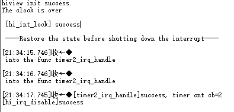

### 4.4.6 扩展实验

* 本实验通过使用软中断的实验，请学生做如下实验：
  * 1、通过软中断实现红灯亮的时候，转而执行黄灯亮。
  
      提示：红灯：GPIO 9 ，黄灯：GPIO 5。


# 5、综合实验

## 5.1 超声波避障小车实验

### 5.1.1 实验目的

* 本实验内容：通过舵机转动使超声波模块可以获取左右两边和中间的距离，判断小车前进方向,实现小车避障。

### 5.1.2 实验要求

* 1.软件要求：VSCode，hi3861_hdu_iot_application(如果采用zip包下载，SDK名称为hi3861_hdu_iot_application-master，如果采用git下载SDK名称为hi3861_hdu_iot_application，此处以采用git下载为例）；

* 2.硬件要求：HISPARK_HI3861_IOT_VER.C开发套件；

* 3.接线要求：将MOTOR_EN拨码开关由OFF拨到ON，超声波模块J19-J1，J6：GPIO7 - TRIG；硬件搭建如下图所示：

     
    
     

### 5.1.3 流程图参考


### 5.1.4 工程参考

* **2.5 GPIO综合实验**
* **2.6 PWM实验-芯片自带PWM实验**

* **2.7 PWM实验-GPIO模拟PWM实验**

### 5.1.5 部分代码参考

* 完整代码参考：ultrasonic_car_demo。本demo实现了S1按键菜单选项栏，进入对应界面修改小车前进速度，左转右转速度，舵机转动角度，超声波距离临界值，方向角角度，通过S2,S3增加每个模块对应参数值。在主界面时，通过S2,S3按键实现小车开启停止超声波避障。当小车正前方距离障碍物较近时，小车停止，舵机左右转动，获取左右距离，哪边距离大小车往哪边转向，转弯的角度超过90°。具体请参考工程代码（烧录固件后, 根据不同的小车的个体差异, 可能需要微调参数）。

```C
1 /*
2  * Copyright (c) 2022 HiSilicon (Shanghai) Technologies CO., LIMITED.
3  * Licensed under the Apache License, Version 2.0 (the "License");
4  * you may not use this file except in compliance with the License.
5  * You may obtain a copy of the License at
6  *
7  *     http://www.apache.org/licenses/LICENSE-2.0
8  *
9  * Unless required by applicable law or agreed to in writing, software
10  * distributed under the License is distributed on an "AS IS" BASIS,
11  * WITHOUT WARRANTIES OR CONDITIONS OF ANY KIND, either express or implied.
12  * See the License for the specific language governing permissions and
13  * limitations under the License.
14  */
15 
16 #include <stdio.h>
17 #include <stdlib.h>
18 #include "ohos_init.h"
19 #include "cmsis_os2.h"
20 #include "iot_gpio.h"
21 #include "hi_io.h"
22 #include "gyro.h"
23 #include "ssd1306.h"
24 #include "iot_errno.h"
25 #include "iot_gpio_ex.h"
26 #include "pca9555.h"
27 #include "motor_control.h"
28 #include "sg92r_control.h"
29 #include "hi_time.h"
30 #include "hcsr04.h"
31 
32 CAR_DRIVE car_drive = { 0 };
33 ENUM_MODE g_mode = MODE_ON_OFF;
34 
35 int g_CarStarted = 0;
36 float yaw_data = 0.0f;
37 
38 #define MASK_BUTTON1        (0x10)
39 #define MASK_BUTTON2        (0x08)
40 #define MASK_BUTTON3        (0x04)
41 #define YAW                 (90.0)
42 #define DISTANCE            (15.0)
43 #define CAR_TURN_LEFT                     (0)
44 #define CAR_TURN_RIGHT                    (1)
45 
46 void init_ctrl_algo(void)
47 {
48     (void)memset(car_drive, 0, sizeof(CAR_DRIVE));
49     car_drive.LeftForward = 13; // 13 左轮前进速度
50     car_drive.RightForward = 10; // 10 右轮前进速度
51     car_drive.TurnLeft = 30; // 30 左转弯右轮速度
52     car_drive.TurnRight = 30; // 30 右转弯左轮速度
53     car_drive.yaw = YAW;
54     car_drive.distance = DISTANCE;
55     car_drive.leftangle = 2500; // 2500 舵机左转90度
56     car_drive.middangle = 1500; // 1500 舵机居中
57     car_drive.rightangle = 500; // 500 舵机右转90度
58 }
59 
60 void init_oled_mode(void)
61 {
62     g_mode = MODE_ON_OFF;
63     ssd1306_ClearOLED();
64     ssd1306_printf("LF:%d, RF:%d", car_drive.LeftForward, car_drive.RightForward);
65     ssd1306_printf("TL:%d, TR:%d", car_drive.TurnRight, car_drive.TurnLeft);
66     ssd1306_printf("yaw:%.02f", car_drive.yaw);
67     ssd1306_printf("distance:%.2f", car_drive.distance);
68 }
69 
70 void ButtonDesplay(ENUM_MODE mode)
71 {
72     switch (mode) {
73         case MODE_ON_OFF:
74             ssd1306_printf("LF:%d, RF:%d", car_drive.LeftForward, car_drive.RightForward);
75             ssd1306_printf("TL:%d, TR:%d", car_drive.TurnRight, car_drive.TurnLeft);
76             ssd1306_printf("yaw:%.2f", car_drive.yaw);
77             ssd1306_printf("distance:%.2f", car_drive.distance);
78             break;
79         case MODE_SET_LEFT_FORWARD:
80             ssd1306_printf("Set LForward=%d", car_drive.LeftForward);
81             break;
82         case MODE_SET_RIGHT_FORWARD:
83             ssd1306_printf("Set RForward=%d", car_drive.RightForward);
84             break;
85         case MODE_SET_TURN_LEFT:
86             ssd1306_printf("Set TurnLeft=%d", car_drive.TurnRight);
87             break;
88         case MODE_SET_TURN_RIGHT:
89             ssd1306_printf("Set TurnRight=%d", car_drive.TurnLeft);
90             break;
91         case MODE_SET_YAW:
92             ssd1306_printf("Set yaw = %.2f", car_drive.yaw);
93             break;
94         case MODE_SET_DISTANCE:
95             ssd1306_printf("Set distance=%.2f", car_drive.distance);
96             break;
97         case MODE_SET_LEFTSG92R:
98             ssd1306_printf("Set LSg92r = %u", car_drive.leftangle);
99             break;
100         case MODE_SET_MIDDERSG92R:
101             ssd1306_printf("Set MSg92r = %u", car_drive.middangle);
102             break;
103         case MODE_SET_RIGHTSG92R:
104             ssd1306_printf("Set RSg92r = %u", car_drive.rightangle);
105             break;
106         default:
107             init_oled_mode();
108             break;
109     }
110 }
111 
112 void ButtonSet(ENUM_MODE mode, bool button_pressed)
113 {
114     printf("mode = %d\r\n", mode);
115     switch (mode) {
116         case MODE_ON_OFF:
117             g_CarStarted = !g_CarStarted;
118             ssd1306_ClearOLED();
119             printf("g_CarStarted = %d\r\n", g_CarStarted);
120             ssd1306_printf(g_CarStarted ? "start" : "stop");
121             break;
122         case MODE_SET_LEFT_FORWARD:
123             car_drive.LeftForward += ((button_pressed) ? -1 : 1);
124             ssd1306_printf("LeftForward=%d", car_drive.LeftForward);
125             break;
126         case MODE_SET_RIGHT_FORWARD:
127             car_drive.RightForward += (button_pressed ? -1 : 1);
128             ssd1306_printf("RightForward=%d", car_drive.RightForward);
129             break;
130         case MODE_SET_TURN_LEFT:
131             car_drive.TurnRight += ((button_pressed) ? -1 : 1);
132             ssd1306_printf("TurnLeft=%d", car_drive.TurnRight);
133             break;
134         case MODE_SET_TURN_RIGHT:
135             car_drive.TurnLeft += ((button_pressed) ? -1 : 1);
136             ssd1306_printf("TurnRight=%d", car_drive.TurnLeft);
137             break;
138         case MODE_SET_YAW:
139             car_drive.yaw += ((button_pressed) ? -0.1 : 0.1); // 航向角每次增加或者减少0.1
140             ssd1306_printf("yaw =%.2f", car_drive.yaw);
141             break;
142         case MODE_SET_DISTANCE:
143             car_drive.distance += (button_pressed ? -0.1 : 0.1); // 距离每次增加或者减少0.1
144             ssd1306_printf("distance=%.2f", car_drive.distance);
145             break;
146         case MODE_SET_LEFTSG92R:
147             car_drive.leftangle += (button_pressed ? -100 : 100); // 舵机左转每次增加或者减少100
148             ssd1306_printf("MidderSg92r = %u", car_drive.leftangle);
149             break;
150         case MODE_SET_MIDDERSG92R:
151             car_drive.middangle += (button_pressed ? -100 : 100); // 舵机居中每次增加或者减少100
152             ssd1306_printf("MidderSg92r = %u", car_drive.middangle);
153             break;
154         case MODE_SET_RIGHTSG92R:
155             car_drive.rightangle += (button_pressed ? -100 : 100); // 舵机右转每次增加或者减少100
156             ssd1306_printf("MidderSg92r = %u", car_drive.rightangle);
157             break;
158         default:
159             break;
160     }
161 }
162 
163 void ButtonPressProc(uint8_t ext_io_val)
164 {
165     static uint8_t ext_io_val_d = 0xFF;
166     uint8_t diff;
167     bool button1_pressed, button2_pressed, button3_pressed;
168     diff = ext_io_val ^ ext_io_val_d;
169     button1_pressed = ((diff & MASK_BUTTON1) && ((ext_io_val & MASK_BUTTON1) == 0)) ? true : false;
170     button2_pressed = ((diff & MASK_BUTTON2) && ((ext_io_val & MASK_BUTTON2) == 0)) ? true : false;
171     button3_pressed = ((diff & MASK_BUTTON3) && ((ext_io_val & MASK_BUTTON3) == 0)) ? true : false;
172     ssd1306_ClearOLED();
173     if (button1_pressed) {
174         g_mode = (g_mode >= (MODE_END - 1)) ? 0 : (g_mode + 1);
175         ButtonDesplay(g_mode);
176     } else if (button2_pressed || button3_pressed) {
177         ButtonSet(g_mode, button2_pressed);
178     }
179     ext_io_val_d = ext_io_val;
180 }
181 
182 void Hcsr04Init(void)
183 {
184     // 设置超声波Echo为输入模式
185     // 设置GPIO8功能（设置为GPIO功能）
186     IoSetFunc(IOT_IO_NAME_GPIO_8, IOT_IO_FUNC_GPIO_8_GPIO);
187     // 设置GPIO8为输入方向
188     IoTGpioSetDir(IOT_IO_NAME_GPIO_8, IOT_GPIO_DIR_IN);
189 
190     // 设置GPIO7功能（设置为GPIO功能）
191     IoSetFunc(IOT_IO_NAME_GPIO_7, IOT_IO_FUNC_GPIO_7_GPIO);
192     // 设置GPIO7为输出方向
193     IoTGpioSetDir(IOT_IO_NAME_GPIO_7, IOT_GPIO_DIR_OUT);
194 }
195 
196 float GetDistance(void)
197 {
198     // 定义变量
199     static unsigned long start_time = 0, time = 0;
200     float distance = 0.0;
201     IotGpioValue value = IOT_GPIO_VALUE0;
202     unsigned int flag = 0;
203 
204     // 设置GPIO7输出低电平
205     /* 给trig发送至少10us的高电平脉冲，以触发传感器测距 */
206     IoTGpioSetOutputVal(IOT_IO_NAME_GPIO_7, IOT_GPIO_VALUE1);
207     // 20us延时函数（设置高电平持续时间）
208     hi_udelay(20);
209     // 设置GPIO7输出高电平
210     IoTGpioSetOutputVal(IOT_IO_NAME_GPIO_7, IOT_GPIO_VALUE0);
211     /* 计算与障碍物之间的距离 */
212     while (1) {
213         // 获取GPIO8的输入电平状态
214         IoTGpioGetInputVal(IOT_IO_NAME_GPIO_8, &value);
215         // 判断GPIO8的输入电平是否为高电平并且flag为0
216         if (value == IOT_GPIO_VALUE1 && flag == 0) {
217             // 获取系统时间
218             start_time = hi_get_us();
219             // 将flag设置为1
220             flag = 1;
221         }
222         // 判断GPIO8的输入电平是否为低电平并且flag为1
223         if (value == IOT_GPIO_VALUE0 && flag == 1) {
224             // 获取高电平持续时间
225             time = hi_get_us() - start_time;
226             break;
227         }
228     }
229     // 计算距离障碍物距离（340米/秒 转换为 0.034厘米/微秒），一去一来2倍距离
230     distance = time * 0.034 / 2;
231     return distance;
232 }
233 
234 /* Judge steering gear */
235 unsigned int engine_go_where(void)
236 {
237     unsigned int temp;
238     float left_distance = 0.0;
239     float right_distance = 0.0;
240     /* 舵机往左转动测量左边障碍物的距离 */
241 
242     EngineTurnLeft(car_drive.leftangle);
243     TaskMsleep(200); // 200ms
244     left_distance = GetDistance();
245     TaskMsleep(200); // 200ms
246     /* 归中 */
247     RegressMiddle(car_drive.middangle);
248     TaskMsleep(200); // 200ms
249 
250     /* 舵机往右转动测量右边障碍物的距离 */
251     EngineTurnRight(car_drive.rightangle);
252     TaskMsleep(200); // 200ms
253     right_distance = GetDistance();
254     TaskMsleep(200); // 200ms
255     /* 归中 */
256     RegressMiddle(car_drive.middangle);
257 
258     if (left_distance > right_distance) {
259         temp =  CAR_TURN_LEFT;
260     } else {
261         temp =  CAR_TURN_RIGHT;
262     }
263     return temp;
264 }
265 
266 /*
267  * 根据障碍物的距离来判断小车的行走方向
268  * 1、距离大于等于15cm继续前进
269  * 2、距离小于15cm，先停止再后退0.1s,继续进行测距,再进行判断
270  */
271 /* Judge the direction of the car */
272 void car_where_to_go(float distance)
273 {
274     if (distance < car_drive.distance) {
275         car_backward(car_drive.LeftForward, car_drive.RightForward);
276         TaskMsleep(500); // 后退500ms
277         car_stop();
278         unsigned int ret = engine_go_where();
279         if (ret == CAR_TURN_LEFT) {
280             while ((GetYaw() - yaw_data) < car_drive.yaw) {
281                 Lsm_Get_RawAcc();
282                 car_left(car_drive.TurnRight);
283             }
284         } else if (ret == CAR_TURN_RIGHT) {
285             while ((yaw_data - GetYaw()) < car_drive.yaw) {
286                 Lsm_Get_RawAcc();
287                 car_right(car_drive.TurnLeft);
288             }
289         }
290     } else {
291         car_forward(car_drive.LeftForward, car_drive.RightForward);
292     }
293     yaw_data = GetYaw();
294 }
295 
296 /* 超声波避障 */
297 void ultrasonic_demo(void)
298 {
299     float m_distance = 0.0;
300     /* 获取前方物体的距离 */
301     m_distance = GetDistance();
302     car_where_to_go(m_distance);
303     TaskMsleep(20); // 20ms执行一次
304 }
305 
306 void UltrasonicDemoTask(void)
307 {
308     InitPCA9555();
309     S92RInit();
310     GA12N20Init();
311     Hcsr04Init();
312     LSM6DS_Init();
313     TaskMsleep(100); // 等待100ms初始化完成
314     init_ctrl_algo();
315     init_oled_mode();
316     PCA_RegisterEventProcFunc(ButtonPressProc);
317     while (1) {
318         if (g_CarStarted) {
319             ultrasonic_demo();
320         } else {
321             car_stop();
322         }
323     }
324 }
325 
326 void UltrasonicSampleEntry(void)
327 {
328     osThreadAttr_t attr;
329     attr.name = "UltrasonicDemoTask";
330     attr.attr_bits = 0U;
331     attr.cb_mem = NULL;
332     attr.cb_size = 0U;
333     attr.stack_mem = NULL;
334     attr.stack_size = 1024 * 5; /* 堆栈大小为1024*5 */
335     attr.priority = osPriorityNormal;
336 
337     if (osThreadNew((osThreadFunc_t)UltrasonicDemoTask, NULL, &attr) == NULL) {
338         printf("[UltrasonicDemoTask] Failed to create UltrasonicDemoTask!\n");
339     }
340 }
341 APP_FEATURE_INIT(UltrasonicSampleEntry);
```
## 5.2 循迹小车实验

### 5.2.1 实验目的

实验内容：小车可以调节滑动变阻器RP1实现左右寻迹模块每10ms采集黑白线条不同的模拟值，将模拟信号转换为数字信号，从而实现小车沿着黑色线条行驶。

### 5.2.2 实验要求

* 1.软件要求：VSCode，hi3861_hdu_iot_application(如果采用zip包下载，SDK名称为hi3861_hdu_iot_application-master，如果采用git下载SDK名称为hi3861_hdu_iot_application，此处以采用git下载为例）；

* 2.硬件要求：HISPARK_HI3861_IOT_VER.C开发套件；

* 3.接线方式：将MOTOR_EN拨码开关由OFF拨到ON，插上J5 GPIO 12 - PWM3 ,J6 GPIO 7 - TRIG，同时插上J13GPIO7 - RIN，J12 GPIO12 - LIN；硬件搭建如下图所示：

     

     

* 4.如果使用IO扩展板左右红外管测距接收，将MOTOR_EN拨码开关由OFF拨到ON，右红外管需要J13跳帽跳至RIN_IO、RIN;左红外管测需要J12跳帽跳至LIN_IO、LIN;

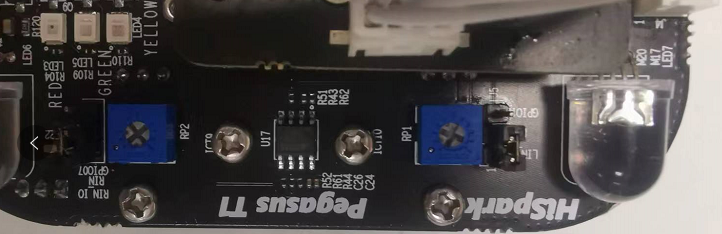

* 5.滑动变阻器RP1,RP2如下图所示。

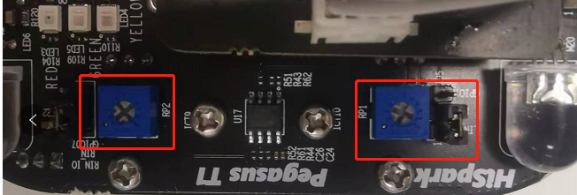

###  5.2.3 流程图参考


  

###  5.2.4  工程参考

* **2.6 PWM实验-芯片自带PWM实验**

* **2.11 ADC实验**

* **3.3 定时器**

###  5.2.5  部分代码参考

* 如果使用3861原始IO口左右红外管测距
* 完整代码参考：trace_demo。本demo 实现了S1按键菜单选项栏，进入对应界面修改小车前进速度，左转右转速度，通过S2,S3增加每个模块对应参数值。在主界面时，通过S2,S3按键实现小车开启停止寻迹。小车左轮在黑线时，小车左大灯亮白光，右轮转动，小车右轮在黑线时，小车右大灯亮白灯，小车左轮转动，小车两边都不在黑线时，小车前进。具体请参考工程代码（烧录固件后, 根据不同的小车的个体差异, 可能需要微调参数，同时根据自己需要调节滑动变阻器RP1和RP2）。

```C
1 
2 /*
3  * Copyright (c) 2022 HiSilicon (Shanghai) Technologies CO., LIMITED.
4  * Licensed under the Apache License, Version 2.0 (the "License");
5  * you may not use this file except in compliance with the License.
6  * You may obtain a copy of the License at
7  *
8  *     http://www.apache.org/licenses/LICENSE-2.0
9  *
10  * Unless required by applicable law or agreed to in writing, software
11  * distributed under the License is distributed on an "AS IS" BASIS,
12  * WITHOUT WARRANTIES OR CONDITIONS OF ANY KIND, either express or implied.
13  * See the License for the specific language governing permissions and
14  * limitations under the License.
15  */
16 
17 #include <stdio.h>
18 #include <unistd.h>
19 #include "ohos_init.h"
20 #include "cmsis_os2.h"
21 #include "iot_gpio_ex.h"
22 #include "iot_gpio.h"
23 #include "iot_adc.h"
24 #include "hi_adc.h"
25 #include "iot_errno.h"
26 #include "ssd1306.h"
27 #include "pca9555.h"
28 #include "motor_control.h"
29 #include "trace_module.h"
30 
31 static volatile int g_State = 0;
32 
33 CAR_DRIVE car_drive = { 0 };
34 ENUM_MODE g_mode = MODE_ON_OFF;
35 
36 int g_CarStarted = 0;
37 
38 #define MASK_BUTTON1        (0x10)
39 #define MASK_BUTTON2        (0x08)
40 #define MASK_BUTTON3        (0x04)
41 
42 void init_ctrl_algo(void)
43 {
44     memset(car_drive, 0, sizeof(CAR_DRIVE));
45     car_drive.LeftForward = 10; // 10 左轮前进速度
46     car_drive.RightForward = 10; // 10 右轮前进速度
47     car_drive.TurnLeft = 35; // 35 左转弯右轮速度
48     car_drive.TurnRight = 30; // 30 右转弯左轮速度
49     car_drive.leftadcdata = 790; // 790代表左边ADC数据
50     car_drive.rightadcdata = 1650; // 1650代表右边ADC数据
51 }
52 
53 void init_oled_mode(void)
54 {
55     g_mode = MODE_ON_OFF;
56     ssd1306_ClearOLED();
57     ssd1306_printf("LF:%d, RF:%d", car_drive.LeftForward, car_drive.RightForward);
58     ssd1306_printf("TL:%d, TR:%d", car_drive.TurnRight, car_drive.TurnLeft);
59     ssd1306_printf("leftadcdata:%d", car_drive.leftadcdata);
60     ssd1306_printf("rightadcdata:%d", car_drive.rightadcdata);
61 }
62 
63 void LeftLED(void)
64 {
65     PCA_WriteReg(PCA9555_REG_OUT1, LEFT_LED); /* IO1 012345低电平 */
66 }
67 
68 void RightLed(void)
69 {
70     PCA_WriteReg(PCA9555_REG_OUT1, RIGHT_LED); /* IO1 012345低电平 */
71 }
72 
73 void LedOff(void)
74 {
75     PCA_WriteReg(PCA9555_REG_OUT1, LED_OFF); /* IO1 012345低电平 */
76 }
77 
78 void ButtonDesplay(ENUM_MODE mode)
79 {
80     switch (mode) {
81         case MODE_ON_OFF:
82             ssd1306_printf("LF:%d, RF:%d", car_drive.LeftForward, car_drive.RightForward);
83             ssd1306_printf("TL:%d, TR:%d", car_drive.TurnRight, car_drive.TurnLeft);
84             ssd1306_printf("leftadcdata:%d", car_drive.leftadcdata);
85             ssd1306_printf("rightadcdata:%d", car_drive.rightadcdata);
86             break;
87         case MODE_SET_LEFT_FORWARD:
88             ssd1306_printf("Set LForward=%d", car_drive.LeftForward);
89             break;
90         case MODE_SET_RIGHT_FORWARD:
91             ssd1306_printf("Set RForward=%d", car_drive.RightForward);
92             break;
93         case MODE_SET_TURN_LEFT:
94             ssd1306_printf("Set TurnLeft=%d", car_drive.TurnRight);
95             break;
96         case MODE_SET_TURN_RIGHT:
97             ssd1306_printf("Set TurnRight=%d", car_drive.TurnLeft);
98             break;
99         case MODE_SET_LEFT_ADC:
100             ssd1306_printf("Set LeftADC=%d", car_drive.leftadcdata);
101             break;
102         case MODE_SET_RIGHT_ADC:
103             ssd1306_printf("Set RightADC=%d", car_drive.rightadcdata);
104             break;
105         default:
106             break;
107     }
108 }
109 
110 void ButtonSet(ENUM_MODE mode, bool button_pressed)
111 {
112     printf("mode = %d\r\n", mode);
113     switch (mode) {
114         case MODE_ON_OFF:
115             g_CarStarted = !g_CarStarted;
116             ssd1306_ClearOLED();
117             printf("g_CarStarted = %d\r\n", g_CarStarted);
118             ssd1306_printf(g_CarStarted ? "start" : "stop");
119             break;
120         case MODE_SET_LEFT_FORWARD:
121             car_drive.LeftForward += ((button_pressed) ? -1 : 1);
122             ssd1306_printf("LeftForward=%d", car_drive.LeftForward);
123             break;
124         case MODE_SET_RIGHT_FORWARD:
125             car_drive.RightForward += (button_pressed ? -1 : 1);
126             ssd1306_printf("RightForward=%d", car_drive.RightForward);
127             break;
128         case MODE_SET_TURN_LEFT:
129             car_drive.TurnRight += ((button_pressed) ? -1 : 1);
130             ssd1306_printf("TurnLeft=%d", car_drive.TurnRight);
131             break;
132         case MODE_SET_TURN_RIGHT:
133             car_drive.TurnLeft += ((button_pressed) ? -1 : 1);
134             ssd1306_printf("TurnRight=%d", car_drive.TurnLeft);
135             break;
136         case MODE_SET_LEFT_ADC:
137             car_drive.leftadcdata += ((button_pressed) ? -10 : 10); // 10代表adc正负10
138             ssd1306_printf("TurnRight=%d", car_drive.leftadcdata);
139             break;
140         case MODE_SET_RIGHT_ADC:
141             car_drive.rightadcdata += ((button_pressed) ? -10 : 10); // 10代表adc正负10
142             ssd1306_printf("TurnRight=%d", car_drive.rightadcdata);
143             break;
144         default:
145             break;
146     }
147 }
148 
149 void ButtonPressProc(uint8_t ext_io_val)
150 {
151     static uint8_t ext_io_val_d = 0xFF;
152     uint8_t diff;
153     bool button1_pressed, button2_pressed, button3_pressed;
154     diff = ext_io_val ^ ext_io_val_d;
155     button1_pressed = ((diff & MASK_BUTTON1) && ((ext_io_val & MASK_BUTTON1) == 0)) ? true : false;
156     button2_pressed = ((diff & MASK_BUTTON2) && ((ext_io_val & MASK_BUTTON2) == 0)) ? true : false;
157     button3_pressed = ((diff & MASK_BUTTON3) && ((ext_io_val & MASK_BUTTON3) == 0)) ? true : false;
158     ssd1306_ClearOLED();
159     if (button1_pressed) {
160         g_mode = (g_mode >= (MODE_END - 1)) ? 0 : (g_mode + 1);
161         ButtonDesplay(g_mode);
162     } else if (button2_pressed || button3_pressed) {
163         ButtonSet(g_mode, button2_pressed);
164     }
165     ext_io_val_d = ext_io_val;
166 }
167 
168 
169 /*
170  * init gpio11/12 as a input io
171  * GPIO 11 connects the left tracking module
172  * GPIO 11 connects the right tracking module
173 */
174 void trace_module_init(void)
175 {
176     // 设置GPIO07的管脚复用关系为GPIO
177     IoSetFunc(IOT_IO_NAME_GPIO_7, IOT_IO_FUNC_GPIO_7_GPIO);
178      // 设置GPIO07的管脚方向为入
179     IoTGpioSetDir(IOT_IO_NAME_GPIO_7, IOT_GPIO_DIR_IN);
180  
181     // GPIO12初始化
182     // 设置GPIO012的管脚复用关系为GPIO
183     IoSetFunc(IOT_IO_NAME_GPIO_12, IOT_IO_FUNC_GPIO_12_GPIO);
184     // 设置GPIO12的管脚方向为入
185     IoTGpioSetDir(IOT_IO_NAME_GPIO_12, IOT_GPIO_DIR_IN);
186 }
187 
188 
189 IotGpioValue get_do_value(IotAdcChannelIndex idx)
190 {
191     unsigned short data = 0;
192     int ret = -1;
193 
194     for (int i = 0; i < ADC_TEST_LENGTH; i++) {
195         // ADC_Channal_6  自动识别模式  CNcomment:4次平均算法模式 CNend
196         ret = AdcRead(idx, &data, IOT_ADC_EQU_MODEL_4, IOT_ADC_CUR_BAIS_DEFAULT, 0xF0);
197         if (ret != HI_ERR_SUCCESS) {
198             printf("hi_adc_read failed\n");
199         }
200     }
201 
202     if (idx == IOT_ADC_CHANNEL_3) {
203         printf("gpio7 m_right_value is %d\n", data);
204     } else if (idx == IOT_ADC_CHANNEL_0) {
205         printf("gpio12 m_left_value is %d\n", data);
206     }
207 
208     if (data > car_drive.rightadcdata && idx == IOT_ADC_CHANNEL_3) {
209         ret = 0;
210     } else if ((data > car_drive.leftadcdata) && idx == IOT_ADC_CHANNEL_0) {
211         ret = 1;
212     } else if (data < car_drive.rightadcdata && idx == IOT_ADC_CHANNEL_3) {
213         ret = 2; // 2代表右边在白线的状态
214     } else if (data < car_drive.leftadcdata && idx == IOT_ADC_CHANNEL_0) {
215         ret = 3; // 3代表左边在白线的状态
216     }
217 
218     return ret;
219 }
220 
221 void TraceExampleTask(void)
222 {
223     int m_left_value;
224     int m_right_value;
225     InitPCA9555();
226     GA12N20Init();
227     trace_module_init();
228     TaskMsleep(100); // 等待100ms初始化完成
229     init_ctrl_algo();
230     init_oled_mode();
231     PCA_RegisterEventProcFunc(ButtonPressProc);
232     while (1) {
233         if (g_State == 1 && g_CarStarted) {
234             m_right_value = get_do_value(IOT_ADC_CHANNEL_3); // gpio7 ==>ADC5
235             m_left_value = get_do_value(IOT_ADC_CHANNEL_0); // gpio12 ==>ADC0
236             if ((m_left_value == 3) && (m_right_value == 0)) { // 左偏，向右转 3代表左边在白线的状态
237                  car_right(car_drive.TurnLeft);
238                  RightLed();
239             } else if ((m_left_value == 1) && (m_right_value == 2)) { // 右偏，向左转 2代表右边在白线的状态
240                 car_left(car_drive.TurnRight);
241                 LeftLED();
242             } else if ((m_left_value == 3) && (m_right_value == 2)) { // 2,3代表左右两边都在白线
243                 car_forward(car_drive.LeftForward, car_drive.RightForward);
244                 LedOff();
245             } else { // 脱离轨道
246                 car_stop();
247             }
248             g_State = 0;
249         } else if (!g_CarStarted) {
250             car_stop();
251         }
252     }
253 }
254 
255 void cb_timeout_periodic(void *arg)
256 {
257     (void)arg;
258     g_State = 1;
259 }
260 
261 void timer_periodic(void)
262 {
263     osTimerId_t periodic_tid = osTimerNew(cb_timeout_periodic, osTimerPeriodic, NULL, NULL);
264     if (periodic_tid == NULL) {
265         printf("[Timer Test] osTimerNew(periodic timer) failed.\r\n");
266         return;
267     } else {
268         printf("[Timer Test] osTimerNew(periodic timer) success, tid: %p.\r\n", periodic_tid);
269     }
270     osStatus_t status = osTimerStart(periodic_tid, 10);
271     if (status != osOK) {
272         printf("[Timer Test] osTimerStart(periodic timer) failed.\r\n");
273         return;
274     } else {
275         printf("[Timer Test] osTimerStart(periodic timer) success, wait a while and stop.\r\n");
276     }
277 }
278 
279 
280 void TraceExampleEntry(void)
281 {
282     osThreadAttr_t attr;
283     timer_periodic();
284     attr.name = "adcTask";
285     attr.attr_bits = 0U;
286     attr.cb_mem = NULL;
287     attr.cb_size = 0U;
288     attr.stack_mem = NULL;
289     attr.stack_size = 5 * 1024; // 堆栈大小为5 *1024
290     attr.priority = osPriorityNormal;
291     if (osThreadNew((osThreadFunc_t)TraceExampleTask, NULL, &attr) == NULL) {
292         printf("[LSM6DSTask] Failed to create LSM6DSTask!\n");
293     }
294 }
295 APP_FEATURE_INIT(TraceExampleEntry);
```

* 如果使用扩展IO口左右红外管测距

    完整代码参考：trace_ex_demo。本demo 实现了小车左轮在黑线时，小车左大灯亮白光，右轮转动，小车右轮在黑线时，小车右大灯亮白灯，小车左轮转动，小车两边都不在黑线时，小车前进。具体请参考工程代码。（烧录固件后, 根据不同的小车的个体差异, 可能需要微调参数比如小车速度，根据自己需要调节滑动变阻器RP2和RP3）。

```C
1 /*
2  * Copyright (c) 2022 HiSilicon (Shanghai) Technologies CO., LIMITED.
3  * Licensed under the Apache License, Version 2.0 (the "License");
4  * you may not use this file except in compliance with the License.
5  * You may obtain a copy of the License at
6  *
7  *     http://www.apache.org/licenses/LICENSE-2.0
8  *
9  * Unless required by applicable law or agreed to in writing, software
10  * distributed under the License is distributed on an "AS IS" BASIS,
11  * WITHOUT WARRANTIES OR CONDITIONS OF ANY KIND, either express or implied.
12  * See the License for the specific language governing permissions and
13  * limitations under the License.
14  */
15 
16 #include <stdio.h>
17 #include <stdlib.h>
18 #include <memory.h>
19 
20 #include "ohos_init.h"
21 #include "cmsis_os2.h"
22 
23 #include "iot_i2c.h"
24 #include "iot_errno.h"
25 #include "hi_errno.h"
26 #include "hi_i2c.h"
27 #include "iot_gpio_ex.h"
28 #include "iot_watchdog.h"
29 #include "iot_gpio.h"
30 #include "hi_time.h"
31 #include "motor_control.h"
32 #include "pca9555.h"
33 
34 #define PCA5555_I2C_IDX 0
35 #define IOT_I2C_IDX_BAUDRATE         4 // 400k
36 #define PCA9555_INT_PIN_NAME    (IOT_IO_NAME_GPIO_11)
37 #define PCA9555_INT_PIN_FUNC    (IOT_IO_FUNC_GPIO_11_GPIO)
38 #define PCA_REG_IO0_STATE       (0x00)
39 
40 uint8_t g_ext_io_input = 0;
41 uint8_t g_ext_io_input_d = 0;
42 uint8_t g_ext_io_output = 0;
43 int g_intLowFlag = 0;
44 uint32_t g_StartTick = 0;
45 static volatile int g_ext_io_int_valid = 0;
46 
47 uint32_t PCA_WriteReg(uint8_t reg_addr, uint8_t reg_val)
48 {
49     uint8_t buffer[2];
50     
51     buffer[0] = reg_addr;
52     buffer[1] = reg_val;
53 
54     uint32_t retval = IoTI2cWrite(PCA5555_I2C_IDX, PCA9555_WRITE_ADDR, buffer, 2);
55     if (retval != IOT_SUCCESS) {
56         printf("IoTI2cWrite failed\n");
57         return retval;
58     }
59     return IOT_SUCCESS;
60 }
61 
62 /**
63  * @berf i2c read
64  * @param hi_u8 reg_high_8bit_cmd:Transmit register value 8 bits high
65  * @param hi_u8 reg_low_8bit_cmd:Transmit register value low 8 bits
66  * @param hi_u8* recv_data:Receive data buff
67  * @param hi_u8 send_len:Sending data length
68  * @param hi_u8 read_len:Length of received data
69 */
70 static uint32_t PCA95555_WriteRead(uint8_t reg_high_8bit_cmd, uint8_t send_len, uint8_t read_len)
71 {
72     uint32_t status =0;
73     uint32_t ret = 0;
74     uint8_t recvData[888] = {0};
75     hi_i2c_data c081nfc_i2c_write_cmd_addr ={0};
76     uint8_t send_user_cmd[1] = {reg_high_8bit_cmd};
77     memset(recvData, 0x0, sizeof(recvData));
78     c081nfc_i2c_write_cmd_addr.send_buf = send_user_cmd;
79     c081nfc_i2c_write_cmd_addr.send_len = send_len;
80 
81     c081nfc_i2c_write_cmd_addr.receive_buf = recvData;
82     c081nfc_i2c_write_cmd_addr.receive_len = read_len;
83 
84     status = hi_i2c_writeread(PCA5555_I2C_IDX, PCA9555_READ_ADDR, &c081nfc_i2c_write_cmd_addr);
85     if (status != HI_ERR_SUCCESS) {
86         return status;
87     }
88     ret = recvData[0];
89     return ret;
90 }
91 
92 static uint32_t PCA95555_Write(uint8_t* buffer, uint32_t buffLen)
93 {
94     uint32_t retval = IoTI2cWrite(PCA5555_I2C_IDX, PCA9555_WRITE_ADDR, buffer, buffLen);
95     if (retval != IOT_SUCCESS) {
96         printf("IoTI2cWrite(%02X) failed, %0X!\n", buffer[0], retval);
97         return retval;
98     }
99     return IOT_SUCCESS;
100 }
101 
102 void PCA_Gpio_Config(uint8_t addr, uint8_t buffer, uint32_t buffLen)
103 {
104     uint8_t write[WRITELEN] = {addr, buffer};
105     PCA95555_Write(write, buffLen);
106 }
107 
108 void LeftLED(void)
109 {
110     PCA_WriteReg(PCA9555_REG_OUT1, LEFT_LED); /* IO1 012345低电平 */
111 }
112 
113 void RightLed(void)
114 {
115     PCA_WriteReg(PCA9555_REG_OUT1, RIGHT_LED); /* IO1 012345低电平 */
116 }
117 
118 void LedOff(void)
119 {
120     PCA_WriteReg(PCA9555_REG_OUT1, LED_OFF); /* IO1 012345低电平 */
121 }
122 
123 void PressToRestore(void)
124 {
125     IotGpioValue value = 0;
126     uint8_t status;
127     status = IoTGpioGetInputVal(IOT_IO_NAME_GPIO_11, &value);
128     if (status != IOT_SUCCESS) {
129         printf("status = %d\r\n", status);
130     }
131     if (value == 1) {
132         g_intLowFlag = 0;
133     } else {
134         if (g_intLowFlag == 0) {
135             g_StartTick = hi_get_milli_seconds();
136             g_intLowFlag = 1;
137         } else {
138             if ((hi_get_milli_seconds() - g_StartTick) > 2) {
139                 g_ext_io_input = PCA95555_WriteRead(PCA9555_REG_IN0, 1, 1);
140                 g_intLowFlag = 0;
141             }
142         }
143     }
144 }
145 
146 void PCA9555_int_proc(void)
147 {
148     uint8_t diff;
149     if (g_ext_io_int_valid == 1) {
150         g_ext_io_input = PCA95555_WriteRead(PCA9555_REG_IN0, 1, 1);
151         diff = g_ext_io_input ^ g_ext_io_input_d;
152         /* ext io 0 - 1: lighting sensor */
153         if (diff & 0x01) {
154             if (g_ext_io_input & 0x01) { // 0x01左边大灯
155                 printf("left lighten\n");
156                 LeftLED();
157             } else {
158                 printf("left darken\n");
159                 LedOff();
160             }
161         }
162         if (diff & 0x02) {
163             if (g_ext_io_input & 0x02) { // 0x02右边大灯
164                 printf("right lighten\n");
165                 RightLed();
166             } else {
167                 printf("right darken\n");
168                 LedOff();
169             }
170         }
171         g_ext_io_int_valid = 0;
172         g_ext_io_input_d = g_ext_io_input;
173     } else {
174         PressToRestore();
175     }
176 }
177 
178 
179 void PCA95555TestTask(void)
180 {
181     PCA_Gpio_Config(PCA9555_REG_CFG0, 0x1F, 2);     /* 0x1f,2长度按键加编码器 */
182     PCA_Gpio_Config(PCA9555_REG_CFG1, 0x00, 2);     /*IO1 012345输出 */
183     PCA_Gpio_Config(PCA9555_REG_OUT1, LED_OFF, 2);  /*IO1 012345低电平 */
184     while (1) {
185         PCA9555_int_proc();
186         static int time_stamp = 0;
187         if ((hi_get_milli_seconds() - time_stamp) > 100) {
188             time_stamp = hi_get_milli_seconds();
189             if((g_ext_io_input & 0x03) == 0x02) { // 与0x03,等于0x02代表左轮在黑线
190                 car_left();
191             } else if((g_ext_io_input & 0x03) == 0x01) { // 与0x03,等于0x01代表右轮在黑线
192                 car_right();
193             } else if((g_ext_io_input & 0x03) == 0x03) { // 与0x03,等于0x03代表两轮在黑线
194                 car_stop();
195             } else {
196                 car_forward();
197             }
198         }
199     }
200 }
201 
202 void OnExtIoTriggered(char *arg)
203 {
204     (void) arg;
205     g_ext_io_int_valid = 1;
206 }
207 
208 void PCA95555GpioInit(void)
209 {
210     IoTI2cInit(0, IOT_I2C_IDX_BAUDRATE); /* baudrate: 4 */
211     IoTI2cSetBaudrate(0, IOT_I2C_IDX_BAUDRATE);
212     IoSetFunc(IOT_IO_NAME_GPIO_13, IOT_IO_FUNC_GPIO_13_I2C0_SDA);
213     IoSetFunc(IOT_IO_NAME_GPIO_14, IOT_IO_FUNC_GPIO_14_I2C0_SCL);
214 
215     IoTGpioInit(IOT_IO_NAME_GPIO_11);
216     IoSetFunc(IOT_IO_NAME_GPIO_11, IOT_IO_FUNC_GPIO_11_GPIO);
217     IoTGpioSetDir(IOT_IO_NAME_GPIO_11, IOT_GPIO_DIR_IN);
218     IoSetPull(IOT_IO_NAME_GPIO_11, IOT_IO_PULL_UP);
219     IoTGpioRegisterIsrFunc(IOT_IO_NAME_GPIO_11, IOT_INT_TYPE_EDGE, IOT_GPIO_EDGE_FALL_LEVEL_LOW, OnExtIoTriggered, NULL);
220 }
221 
222 void TraceDemoTest(void)
223 {
224     osThreadAttr_t attr;
225     PCA95555GpioInit();
226     GA12N20Init();
227     IoTWatchDogDisable();
228     attr.name = "PCA95555Task";
229     attr.attr_bits = 0U;
230     attr.cb_mem = NULL;
231     attr.cb_size = 0U;
232     attr.stack_mem = NULL;
233     attr.stack_size = 5 * 1024; // 任务栈大小5*1024
234     attr.priority = osPriorityNormal;
235 
236     if (osThreadNew((osThreadFunc_t)PCA95555TestTask, NULL, &attr) == NULL) {
237         printf("[robot_car_demo] Failed to create Aht20TestTask!\n");
238     }
239 }
240 APP_FEATURE_INIT(TraceDemoTest);
```
## 5.3 IMU小车控制实验
### 5.3.1 实验目的

实验内容：通过IMU实时获取小车的方向角，通过方向角控制小车走一个正方形

### 5.3.2 实验要求

* 1.软件要求：VSCode，hi3861_hdu_iot_application(如果采用zip包下载，SDK名称为hi3861_hdu_iot_application-master，如果采用git下载SDK名称为hi3861_hdu_iot_application，此处以采用git下载为例）；

* 2.硬件要求：HISPARK_HI3861_IOT_VER.C开发套件；

* 3.接线要求：将MOTOR_EN拨码开关由OFF拨到ON；硬件搭建如下所示。

  

### 5.3.3 流程图参考


### 5.3.4 工程参考

* **2.10 PWM实验-GPIO模拟PWM实验**
* **2.10 I2C实验-I2C总线实验**

### 5.3.5 部分代码参考

* 完整代码参考：imu_square_demo。本demo实现了S1按键菜单选项栏，进入对应界面修改小车前进速度，左转速度，方向角角度，小车前进时间，通过S2,S3增加每个模块对应参数值。在主界面时，通过S2,S3按键实现小车开启停止小车走正方形。具体请参考工程代码（烧录固件后, 根据不同的小车的个体差异, 可能需要微调参数）。

```C
1 /*
2  * Copyright (c) 2022 HiSilicon (Shanghai) Technologies CO., LIMITED.
3  * Licensed under the Apache License, Version 2.0 (the "License");
4  * you may not use this file except in compliance with the License.
5  * You may obtain a copy of the License at
6  *
7  *     http://www.apache.org/licenses/LICENSE-2.0
8  *
9  * Unless required by applicable law or agreed to in writing, software
10  * distributed under the License is distributed on an "AS IS" BASIS,
11  * WITHOUT WARRANTIES OR CONDITIONS OF ANY KIND, either express or implied.
12  * See the License for the specific language governing permissions and
13  * limitations under the License.
14  */
15 
16 #include <stdlib.h>
17 #include <stdio.h>
18 #include <unistd.h>
19 #include <math.h>
20 
21 #include <hi_time.h>
22 #include <hi_timer.h>
23 
24 #include "iot_gpio_ex.h"
25 #include "ssd1306.h"
26 #include "ssd1306_fonts.h"
27 
28 #include "ohos_init.h"
29 #include "cmsis_os2.h"
30 
31 #include "iot_i2c.h"
32 #include "iot_errno.h"
33 #include "hi_errno.h"
34 #include "hi_i2c.h"
35 #include "iot_gpio.h"
36 #include "motor_control.h"
37 #include "pca9555.h"
38 #include "gyro.h"
39 
40 float q0 = 1, q1 = 0, q2 = 0, q3 = 0;   // 四元数的元素，代表估计方向
41 float exInt = 0, eyInt = 0, ezInt = 0;  // 按比例缩小积分误差
42 float Yaw;                 // 偏航角，俯仰角，翻滚角
43 
44 #define LSM6DS_I2C_IDX 0
45 #define IOT_I2C_IDX_BAUDRATE         4 // 400k
46 
47 #define Kp 20.0f                // 比例增益支配率收敛到加速度计/磁强计
48 #define Ki 0.0004f                // 积分增益支配率的陀螺仪偏见的衔接
49 #define halfT 0.005f             // 采样周期的一半
50 
51 CAR_DRIVE car_drive = { 0 };
52 ENUM_MODE g_mode = MODE_ON_OFF;
53 
54 int g_CarStarted = 0;
55 float yaw_data = 0.0f;
56 
57 #define MASK_BUTTON1        (0x10)
58 #define MASK_BUTTON2        (0x08)
59 #define MASK_BUTTON3        (0x04)
60 #define YAW                 (90.0)
61 
62 void init_ctrl_algo(void)
63 {
64     memset(car_drive, 0, sizeof(CAR_DRIVE));
65     car_drive.LeftForward = 13; // 13 左轮前进速度
66     car_drive.RightForward = 10; // 10 右轮前进速度
67     car_drive.TurnRight = 30; // 30 右转弯左轮速度
68     car_drive.yaw1 = YAW;
69     car_drive.yaw2 = 181.0; // 航向角181.0
70     car_drive.yaw3 = 270.0; // 航向角270.0
71     car_drive.yaw4 = 360.0; // 航向角360.0
72     car_drive.time = 3000; // 行驶时间3000ms
73 }
74 
75 void init_oled_mode(void)
76 {
77     g_mode = MODE_ON_OFF;
78     ssd1306_ClearOLED();
79     ssd1306_printf("LF:%d, RF:%d", car_drive.LeftForward, car_drive.RightForward);
80     ssd1306_printf("TL:%d, time:%d", car_drive.TurnRight, car_drive.time);
81     ssd1306_printf("yaw1:%.1f,yaw2:%.1f", car_drive.yaw1, car_drive.yaw2);
82     ssd1306_printf("yaw3:%.1f,yaw4:%.1f", car_drive.yaw3, car_drive.yaw4);
83 }
84 
85 void ButtonDesplay(ENUM_MODE mode)
86 {
87     switch (mode) {
88         case MODE_ON_OFF:
89             ssd1306_printf("LF:%d, RF:%d", car_drive.LeftForward, car_drive.RightForward);
90             ssd1306_printf("TL:%d, time:%d", car_drive.TurnRight, car_drive.time);
91             ssd1306_printf("yaw1:%.1f,yaw2:%.1f", car_drive.yaw1, car_drive.yaw2);
92             ssd1306_printf("yaw3:%.1f,yaw4:%.1f", car_drive.yaw3, car_drive.yaw4);
93             break;
94         case MODE_SET_LEFT_FORWARD:
95             ssd1306_printf("Set LForward=%d", car_drive.LeftForward);
96             break;
97         case MODE_SET_RIGHT_FORWARD:
98             ssd1306_printf("Set RForward=%d", car_drive.RightForward);
99             break;
100         case MODE_SET_TURN_LEFT:
101             ssd1306_printf("Set TurnRight=%d", car_drive.TurnRight);
102             break;
103         case MODE_SET_YAW1:
104             ssd1306_printf("Set yaw1 = %.2f", car_drive.yaw1);
105             break;
106         case MODE_SET_YAW2:
107             ssd1306_printf("Set yaw2 = %.2f", car_drive.yaw2);
108             break;
109         case MODE_SET_YAW3:
110             ssd1306_printf("Set yaw3 = %.2f", car_drive.yaw3);
111             break;
112         case MODE_SET_YAW4:
113             ssd1306_printf("Set yaw4 = %.2f", car_drive.yaw4);
114             break;
115         case MODE_SET_DRIVE_TIME:
116             ssd1306_printf("Set time = %d", car_drive.time);
117             break;
118         default:
119             init_oled_mode();
120             break;
121     }
122 }
123 
124 void ButtonSet(ENUM_MODE mode, bool button_pressed)
125 {
126     printf("mode = %d\r\n", mode);
127     switch (mode) {
128         case MODE_ON_OFF:
129             g_CarStarted = !g_CarStarted;
130             ssd1306_ClearOLED();
131             printf("g_CarStarted = %d\r\n", g_CarStarted);
132             ssd1306_printf(g_CarStarted ? "start" : "stop");
133             break;
134         case MODE_SET_LEFT_FORWARD:
135             car_drive.LeftForward += ((button_pressed) ? -1 : 1);
136             ssd1306_printf("LeftForward=%d", car_drive.LeftForward);
137             break;
138         case MODE_SET_RIGHT_FORWARD:
139             car_drive.RightForward += (button_pressed ? -1 : 1);
140             ssd1306_printf("RightForward=%d", car_drive.RightForward);
141             break;
142         case MODE_SET_TURN_LEFT:
143             car_drive.TurnRight += ((button_pressed) ? -1 : 1);
144             ssd1306_printf("TurnLEFT=%d", car_drive.TurnRight);
145             break;
146         case MODE_SET_YAW1:
147             car_drive.yaw1 += ((button_pressed) ? -0.1 : 0.1); // 航向角每次增加或者减少0.1
148             ssd1306_printf("yaw1 =%.2f", car_drive.yaw1);
149             break;
150         case MODE_SET_YAW2:
151             car_drive.yaw2 += ((button_pressed) ? -0.1 : 0.1); // 航向角每次增加或者减少0.1
152             ssd1306_printf("yaw2 =%.2f", car_drive.yaw2);
153             break;
154         case MODE_SET_YAW3:
155             car_drive.yaw3 += ((button_pressed) ? -0.1 : 0.1); // 航向角每次增加或者减少0.1
156             ssd1306_printf("yaw3 =%.2f", car_drive.yaw3);
157             break;
158         case MODE_SET_YAW4:
159             car_drive.yaw4 += ((button_pressed) ? -0.1 : 0.1); // 航向角每次增加或者减少0.1
160             ssd1306_printf("yaw4 =%.2f", car_drive.yaw4);
161             break;
162         case MODE_SET_DRIVE_TIME:
163             car_drive.time += ((button_pressed) ? -10 : 10); // 时间增加减少10ms
164             ssd1306_printf("time =%d", car_drive.time);
165             break;
166         default:
167             break;
168     }
169 }
170 
171 void ButtonPressProc(uint8_t ext_io_val)
172 {
173     static uint8_t ext_io_val_d = 0xFF;
174     uint8_t diff;
175     bool button1_pressed, button2_pressed, button3_pressed;
176     diff = ext_io_val ^ ext_io_val_d;
177     button1_pressed = ((diff & MASK_BUTTON1) && ((ext_io_val & MASK_BUTTON1) == 0)) ? true : false;
178     button2_pressed = ((diff & MASK_BUTTON2) && ((ext_io_val & MASK_BUTTON2) == 0)) ? true : false;
179     button3_pressed = ((diff & MASK_BUTTON3) && ((ext_io_val & MASK_BUTTON3) == 0)) ? true : false;
180     ssd1306_ClearOLED();
181     if (button1_pressed) {
182         g_mode = (g_mode >= (MODE_END - 1)) ? 0 : (g_mode + 1);
183         ButtonDesplay(g_mode);
184     } else if (button2_pressed || button3_pressed) {
185         ButtonSet(g_mode, button2_pressed);
186     }
187     ext_io_val_d = ext_io_val;
188 }
189 
190 
191 /**
192  * @berf i2c read
193  * @param hi_u8 reg_high_8bit_cmd:Transmit register value 8 bits high
194  * @param hi_u8 reg_low_8bit_cmd:Transmit register value low 8 bits
195  * @param hi_u8* recv_data:Receive data buff
196  * @param hi_u8 send_len:Sending data length
197  * @param hi_u8 read_len:Length of received data
198 */
199 static uint32_t LSM6DS_WriteRead(uint8_t reg_high_8bit_cmd, uint8_t send_len, uint8_t read_len)
200 {
201     uint32_t status = 0;
202     uint8_t recvData[888] = { 0 }; // 888长度
203     uint32_t ret = 0;
204     hi_i2c_data c081nfc_i2c_write_cmd_addr = { 0 };
205     uint8_t send_user_cmd[1] = {reg_high_8bit_cmd};
206 
207     memset(recvData, 0x0, sizeof(recvData));
208     c081nfc_i2c_write_cmd_addr.send_buf = send_user_cmd;
209     c081nfc_i2c_write_cmd_addr.send_len = send_len;
210 
211     c081nfc_i2c_write_cmd_addr.receive_buf = recvData;
212     c081nfc_i2c_write_cmd_addr.receive_len = read_len;
213 
214     status = hi_i2c_writeread(LSM6DS_I2C_IDX, LSM6DS_READ_ADDR, &c081nfc_i2c_write_cmd_addr);
215     if (status != IOT_SUCCESS) {
216         printf("I2cRead() failed, %0X!\n", status);
217         return status;
218     }
219 
220     ret = recvData[0];
221     return ret;
222 }
223 
224 static uint32_t LSM6DS_ReadCont(uint8_t reg_addr, uint8_t* buffer, uint16_t read_len)
225 {
226     uint32_t status;
227     hi_i2c_data i2c_attr;
228 
229     i2c_attr.send_buf = &reg_addr;
230     i2c_attr.send_len = 1;
231     i2c_attr.receive_buf = buffer;
232     i2c_attr.receive_len = read_len;
233 
234     status = hi_i2c_writeread(LSM6DS_I2C_IDX, LSM6DS_READ_ADDR, &i2c_attr);
235     return status;
236 }
237 
238 static uint32_t LSM6DS_Write(uint8_t addr, uint8_t writedata, uint32_t buffLen)
239 {
240     uint8_t buffer[2] = {addr, writedata}; // 2长度
241     uint32_t retval = IoTI2cWrite(LSM6DS_I2C_IDX, LSM6DS_WRITE_ADDR, buffer, buffLen);
242     if (retval != IOT_SUCCESS) {
243         printf("IoTI2cWrite(%02X) failed, %0X!\n", buffer[0], retval);
244         return retval;
245     }
246     printf("IoTI2cWrite(%02X)\r\n", buffer[0]);
247     return IOT_SUCCESS;
248 }
249 
250 void LSM6DS_Init(void)
251 {
252     LSM6DS_Write(LSM6DSL_CTRL3_C, 0x34, 2); // 0x34 2 初始化陀螺仪
253     LSM6DS_Write(LSM6DSL_CTRL2_G, 0X4C, 2); // 0x4c 2 角速度陀螺仪配置2000dps,104Hz
254     LSM6DS_Write(LSM6DSL_CTRL10_C, 0x38, 2); // 0x38 2 timer en, pedo en, tilt en ??
255     LSM6DS_Write(LSM6DSL_CTRL1_XL, 0x4F, 2); // 0x4F 2 加速度配置量程为8g,104Hz, lpf1_bw_sel=1, bw0_xl=1;
256     
257     LSM6DS_Write(LSM6DSL_TAP_CFG, 0x10, 2); // 0x10 2长度 LSM6DSL_TAP_CFG
258     LSM6DS_Write(LSM6DSL_WAKE_UP_DUR, 0x00, 2); // 0x00 2长度 LSM6DSL_WAKE_UP_DUR
259     LSM6DS_Write(LSM6DSL_WAKE_UP_THS, 0x02, 2); // 0x02 2长度 LSM6DSL_WAKE_UP_THS
260     LSM6DS_Write(LSM6DSL_TAP_THS_6D, 0x40, 2); // 0x40 2长度 LSM6DSL_TAP_THS_6D
261     LSM6DS_Write(LSM6DSL_CTRL8_XL, 0x01, 2); // 0x01 2长度 LSM6DSL_CTRL8_XL
262 }
263 
264 void CarSquar(void)
265 {
266     if (g_CarStarted) {
267         car_forward(car_drive.LeftForward, car_drive.RightForward);
268         TaskMsleep(car_drive.time);
269         while (fabs(Yaw) < car_drive.yaw1) {
270             Lsm_Get_RawAcc();
271             car_left(car_drive.TurnRight);
272         }
273         car_forward(car_drive.LeftForward, car_drive.RightForward);
274         TaskMsleep(car_drive.time);
275         while (fabs(Yaw) < car_drive.yaw2) {
276             Lsm_Get_RawAcc();
277             car_left(car_drive.TurnRight);
278         }
279         car_forward(car_drive.LeftForward, car_drive.RightForward);
280         TaskMsleep(car_drive.time);
281         while (fabs(Yaw) < car_drive.yaw3) {
282             Lsm_Get_RawAcc();
283             car_left(car_drive.TurnRight);
284         }
285         car_forward(car_drive.LeftForward, car_drive.RightForward);
286         TaskMsleep(car_drive.time);
287         while (fabs(Yaw) < car_drive.yaw4) {
288             Lsm_Get_RawAcc();
289             car_left(car_drive.TurnRight);
290         }
291         car_stop();
292         g_CarStarted = !g_CarStarted;
293         ssd1306_printf(g_CarStarted ? "start" : "stop");
294     } else {
295         car_stop();
296     }
297 }
298 
299 static void IMUSquarTask(void)
300 {
301     uint32_t ret;
302     InitPCA9555();
303     GA12N20Init();
304     LSM6DS_Init();
305     TaskMsleep(100); // 等待100ms初始化完成
306     ret = LSM6DS_WriteRead(LSM6DSL_WHO_AM_I, 1, 1);
307     printf("who am i: %X\n", ret);
308     init_ctrl_algo();
309     init_oled_mode();
310     PCA_RegisterEventProcFunc(ButtonPressProc);
311     while (1) {
312         CarSquar();
313     }
314 }
315 
316 void IMU_YAW_CAL(float gyroZ)
317 {
318     static float dt = 0.01; // 0.01代表100ms读取一次陀螺仪数据
319     static float yaw_conv = 0.0f, temp = 0.0f;
320 
321     // 除去零偏
322 #if 0
323     static int a = 0;
324     a++;
325     if (hi_get_seconds() <= 5) { // 5ms
326         printf("---------times-----------:%d\n", a);
327     }
328 #endif
329 
330     if (fabs(gyroZ) < 0.04) { // 0.04 gyroZ标准值
331         temp = 0;
332     } else {
333         temp = gyroZ * dt;
334     }
335     yaw_conv += temp;
336     Yaw = yaw_conv * 57.32; // 57.32标准值
337     // 360°一个循环
338     if (fabs(Yaw) > 360.0f) {
339         if ((Yaw) < 0) {
340             Yaw += 360.0f;
341         } else {
342             Yaw -= 360.0f;
343         }
344     }
345 }
346 
347 
348 void Lsm_Get_RawAcc(void)
349 {
350     uint8_t buf[12] = {0}; // 12位陀螺仪数据
351     int16_t ang_rate_z = 0;
352     float ang_rate_z_conv = 0;
353 
354     if ((LSM6DS_WriteRead(LSM6DSL_STATUS_REG, 1, 1) & 0x03) != 0) {
355         if (IOT_SUCCESS != LSM6DS_ReadCont(LSM6DSL_OUTX_L_G, buf, 12)) { // 12个buff长度
356             printf("i2c read error!\n");
357         } else {
358             ang_rate_z = (buf[5] << 8) + buf[4]; // 将buff5 右移8位在与上buff 4
359             ang_rate_z_conv = 3.14 / 180.0 * ang_rate_z / 14.29; // 3.14= π， 180.0° 14.29为陀螺仪量程
360             IMU_YAW_CAL(ang_rate_z_conv);
361         }
362     }
363 }
364 
365 void IMUSquarSampleEntry(void)
366 {
367     osThreadAttr_t attr;
368     attr.name = "IMUSquarTask";
369     attr.attr_bits = 0U;
370     attr.cb_mem = NULL;
371     attr.cb_size = 0U;
372     attr.stack_mem = NULL;
373     attr.stack_size = 1024 * 5; // 堆栈大小5*1024
374     attr.priority = osPriorityNormal;
375 
376     if (osThreadNew(IMUSquarTask, NULL, &attr) == NULL) {
377         printf("[RobotTask] Failed to create Aht20TestTask!\n");
378     }
379 }
380 APP_FEATURE_INIT(IMUSquarSampleEntry);
```


## 5.4 平衡车实验

### 5.4.1 实验目的

本实验内容：通过直立环、速度环、转向环算法，IMU测量小车的倾角和倾角速度控制小车车轮加速度消除小车倾角实现保持小车两轮平衡直线行驶，增加y轴速度积分求转向叫实现平衡车转弯。

直立环：控制电机的加速度和小车倾角成正比，可以让小车保持平衡，就是小车向倾斜的方向运动，倾斜角越大，小车运动越快。

速度环：小车前倾，直立环使小车加速前进，让小车保持平衡，然后对速度进行闭环控制，将小车速度环目标设置为0，小车就可以长期稳定平衡。

转向环：给予两个电机差速，即左轮最终赋值减去转向输入值，右轮最终赋值加上转向输入值，两值大小相同，符号相反。

### 5.4.2 实验要求

* 1.软件要求：VSCode，hi3861_hdu_iot_application(如果采用zip包下载，SDK名称为hi3861_hdu_iot_application-master，如果采用git下载SDK名称为hi3861_hdu_iot_application，此处以采用git下载为例）；

* 2.硬件要求：HISPARK_HI3861_IOT_VER.C开发套件；

* 3.接线方式：将J7跳帽跳至C2A-GPIO 0，J5跳帽跳至C2B-GPIO 12，J6跳线帽跳至C1A-GPIO 07，j8跳线帽跳至C1B-GPIO 01，将MOTOR_EN拨码开关由OFF拨到ON；硬件搭建如下图所示：

    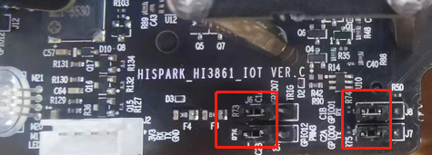

### 5.4.3 流程图参考


### 5.4.4 部分代码参考

* 完整代码参考：balance_car_demo。本demo实现了S1按键菜单选项栏，进入对应界面修改小车俯仰角，kp系数，kd系数，通过S2,S3增加每个模块对应参数值。在主界面时，通过S2,S3按键实现小车开启停止平衡车。具体请参考工程代码（烧录固件后, 根据不同的小车的个体差异, 可能需要微调参数）。

```C
1 /*
2  * Copyright (c) 2022 HiSilicon (Shanghai) Technologies CO., LIMITED.
3  * Licensed under the Apache License, Version 2.0 (the "License");
4  * you may not use this file except in compliance with the License.
5  * You may obtain a copy of the License at
6  *
7  *     http://www.apache.org/licenses/LICENSE-2.0
8  *
9  * Unless required by applicable law or agreed to in writing, software
10  * distributed under the License is distributed on an "AS IS" BASIS,
11  * WITHOUT WARRANTIES OR CONDITIONS OF ANY KIND, either express or implied.
12  * See the License for the specific language governing permissions and
13  * limitations under the License.
14  */
15 
16 /* 平衡车直立控制算法演示Demo, 这个Demo里包括了陀螺仪滤波, 电机驱动, AB编码器, PID控制算法,
17  * OLED字符串显示, 扩展IO, 定时器中断等功能
18  * 固件烧录成功后, 按OLED的提示, S3按键将启动平衡车功能, S1键将切换设置项
19  * 烧录固件后, 根据不同的小车的个体差异, 可能需要微调参数. 目前, 单节电池放在下电池仓,
20  * 并加装了金属卡扣后, target angle缺省设置为-82.8度:
21  * 如果你的小车一直后仰, 试着增大target, 即向0度方向调整
22  * 如果你的小车一直前倾, 试着减小target, 即向-90度方向调整
23  *
24  * Demo of the balance car vertical control algorithm. This Demo includes gyroscope filtering,
25  * motor drive, AB encoder, PID control algorithm, OLED string display, extended IO, timer interrupt
26  * and other functions. After the firmware is successfully burned, press the OLED prompt, S3 will
27  * start the balance car function, and S1 will switch the settings. After the firmware is burned,
28  * according to the individual differences of different cars, you may need to fine tune the parameters
29  * At present, after a single battery is placed in the lower battery compartment and metal clips are
30  * installed, the target angle is set to -82.8 degrees by default:
31  * if your car keeps leaning back, try to increase the target, that is, adjust to the direction of 0 degrees
32  * If your car keeps leaning forward, try to reduce the target, that is, adjust to the direction of -90 degrees
33  */
34 
35 #include <stdint.h>
36 #include <stdbool.h>
37 #include <stdlib.h>
38 #include <string.h>  // For memcpy
39 #include <stdio.h>
40 #include <unistd.h>
41 #include <ohos_init.h>
42 #include <cmsis_os2.h>
43 #include <hi_timer.h>
44 #include "gyro.h"
45 #include "ssd1306.h"
46 #include "ssd1306_fonts.h"
47 #include "wheel_codec.h"
48 #include "robot_l9110s.h"
49 #include "iot_watchdog.h"
50 #include "ctrl_algo.h"
51 #include "hi_task.h"
52 #include "pca9555.h"
53 #include "debug_util.h"
54 
55 typedef enum {
56     MODE_ON_OFF = 0,
57     MODE_STAND_TARGET,
58     MODE_STAND_KP,
59     MODE_STAND_KD,
60     MODE_VELO_TARGET,
61     MODE_VELO_KP,
62     MODE_VELO_KI,
63     MODE_END,
64     MODE_TURN,
65     MODE_DEBUG_GYRO,
66     MODE_KI_ADJ,
67 } ENUM_MODE;
68 
69 #define MASK_BUTTON1        (0x10)
70 #define MASK_BUTTON2        (0x08)
71 #define MASK_BUTTON3        (0x04)
72 #define DEAD_ZONE           (1)   // pwm valid range: [-99, -DEAD_ZONE], [DEAD_ZONE, 99]
73 
74 CTRL_PID_STRUCT ctrl_pid_velocity2 = {0};
75 CTRL_PID_STRUCT ctrl_pid_stand2 = {0};
76 
77 ENUM_MODE g_mode = MODE_ON_OFF;
78 int g_car_started = 0;
79 static int g_TimerFlag = 0;
80 uint32_t g_timer_handle;
81 float g_target_angle = -81.8f;
82 int g_target_velo = 0;
83 int g_target_diff = 0;
84 
85 void print_oled_mode(void)
86 {
87     g_mode = MODE_ON_OFF;
88     ssd1306_ClearOLED();
89     ctrl_pid_velocity2 = GetVelocity();
90     ctrl_pid_stand2 = GetStand();
91     ssd1306_printf("kp:%.2f, kd:%.2f", ctrl_pid_stand2.kp, ctrl_pid_stand2.kd);
92     ssd1306_printf("kp:%.2f, ki:%.4f", ctrl_pid_velocity2.kp, ctrl_pid_velocity2.ki);
93     ssd1306_printf("press S1 to switch\n");
94     ssd1306_printf("press S3 to start\n");
95 }
96 
97 void timer_svr(hi_u32 data)
98 {
99     data=data;
100     g_TimerFlag = 1;
101 }
102 
103 void init_gyro_timer(void)
104 {
105     uint32_t ret;
106 
107     ret = hi_timer_create(&g_timer_handle);
108     if (ret != HI_ERR_SUCCESS) {
109         printf("hrtimer create fail\n");
110         return;
111     } else {
112         printf("create timer success\n");
113     }
114     ret = hi_timer_start(g_timer_handle, HI_TIMER_TYPE_PERIOD, 10, timer_svr, 188); // 10ms, 188
115 }
116 
117 void ButtonDesplay(ENUM_MODE mode)
118 {
119     switch (mode) {
120         case MODE_ON_OFF:
121             ssd1306_printf("stand loop");
122             ssd1306_printf("kp:%.2f, kd:%.2f", ctrl_pid_stand2.kp, ctrl_pid_stand2.kd);
123             ssd1306_printf("target angle:%.2f", g_target_angle);
124             ssd1306_printf("press btn2/3 to start");
125             break;
126         case MODE_STAND_TARGET:
127             ssd1306_printf("target angle=%.1f", g_target_angle);
128             break;
129         case MODE_STAND_KP:
130             ssd1306_printf("stand kp=%.2f", ctrl_pid_stand2.kp);
131             break;
132         case MODE_STAND_KD:
133             ssd1306_printf("stand kd=%.2f", ctrl_pid_stand2.kd);
134             break;
135         case MODE_VELO_KP:
136             ssd1306_printf("velocity kp=%.2f", ctrl_pid_velocity2.kp);
137             break;
138         case MODE_VELO_KI:
139             ssd1306_printf("velocity ki=%.4f", ctrl_pid_velocity2.ki);
140             break;
141         case MODE_VELO_TARGET:
142             ssd1306_printf("velocity target=%d", g_target_velo);
143             break;
144         case MODE_TURN:
145             ssd1306_printf("turn:%d", g_target_diff);
146             break;
147         case MODE_DEBUG_GYRO:
148             ssd1306_printf("dfx");
149             ssd1306_printf("press 2 record");
150             ssd1306_printf("press 3 report");
151             break;
152         default:
153             print_oled_mode();
154             break;
155     }
156 }
157 
158 void ButtonSet(ENUM_MODE mode, bool button_pressed, bool button4_pressed)
159 {
160     switch (mode) {
161         case MODE_ON_OFF:
162             g_car_started = !g_car_started;
163             ssd1306_ClearOLED();
164             ssd1306_printf(g_car_started ? "start" : "stop");
165             break;
166         case MODE_DEBUG_GYRO:
167             if (button_pressed) {
168                 reset_debug_points();
169             }
170             if (button4_pressed) {
171                 print_debug_points();
172             }
173             break;
174         case MODE_STAND_KP:
175             ctrl_pid_stand2.kp += ((button_pressed) ? -0.1 : 0.1); // 0.1 kp系数
176             ssd1306_printf("stand kp=%.2f", ctrl_pid_stand2.kp);
177             break;
178         case MODE_STAND_KD:
179             ctrl_pid_stand2.kd += (button_pressed ? -0.1 : 0.1); // 0.1 kd系数
180             ssd1306_printf("stand kd=%.2f",  ctrl_pid_stand2.kd);
181             break;
182         case MODE_VELO_KP:
183             ctrl_pid_velocity2.kp += ((button_pressed) ? -0.01 : 0.01); // 0.01 kp系数
184             ssd1306_printf("velocity kp=%.2f", ctrl_pid_velocity2.kp);
185             break;
186         case MODE_VELO_KI:
187             ctrl_pid_velocity2.ki += ((button_pressed) ? -0.001 : 0.001); // 0.001速度环系数
188             ssd1306_printf("velocity ki=%.4f", ctrl_pid_velocity2.ki);
189             break;
190         case MODE_VELO_TARGET:
191             g_target_velo += ((button_pressed) ? -1 : 1);
192             ssd1306_printf("velo target =%d", g_target_velo);
193             break;
194         case MODE_STAND_TARGET:
195             g_target_angle += (button_pressed ? -0.1 : 0.1); // 0.1 俯仰角系数
196             ssd1306_printf("target_angle=%.1f", g_target_angle);
197             break;
198         case MODE_TURN:
199             g_target_diff += (button_pressed ? -1 : 1);
200             ssd1306_printf("turn diff=%d", g_target_diff);
201             break;
202         default:
203             print_oled_mode();
204     }
205 }
206 
207 void ButtonPressProc(uint8_t ext_io_val)
208 {
209     static uint8_t ext_io_val_d = 0xFF;
210     uint8_t diff;
211     bool button1_pressed, button2_pressed, button3_pressed;
212     
213     diff = ext_io_val ^ ext_io_val_d;
214     button1_pressed = ((diff & MASK_BUTTON1) && ((ext_io_val & MASK_BUTTON1) == 0)) ? true : false;
215     button2_pressed = ((diff & MASK_BUTTON2) && ((ext_io_val & MASK_BUTTON2) == 0)) ? true : false;
216     button3_pressed = ((diff & MASK_BUTTON3) && ((ext_io_val & MASK_BUTTON3) == 0)) ? true : false;
217 
218     ssd1306_ClearOLED();
219     if (button1_pressed) {
220         g_mode = (g_mode >= (MODE_END - 1)) ? 0 : (g_mode + 1);
221         ButtonDesplay(g_mode);
222     } else if (button2_pressed || button3_pressed) {
223         ButtonSet(g_mode, button2_pressed, button3_pressed);
224     }
225     ext_io_val_d = ext_io_val;
226 }
227 
228 void car_state(int pwm)
229 {
230     int pwm_mid = pwm;
231 /* execute */
232     if (g_car_started) {
233         if ((pwm_mid > -DEAD_ZONE) && (pwm_mid < DEAD_ZONE)) {
234             car_stop();
235         } else {
236             car_drive(pwm_mid);
237         }
238     } else {
239         car_stop();
240     }
241 }
242 
243 void BalanceTask(void)
244 {
245     int pwm_mid;
246     float bias, exec;
247     int16_t pos_right, pos_left;
248     static int16_t pos_right_d = 0, pos_left_d = 0;
249     int16_t velo_left, velo_right;
250     int16_t velo = 0;
251 
252     printf("last compile:%s,%s\n", __DATE__, __TIME__);
253     hi_sleep(200); // 200ms
254     InitGyro();
255     init_ctrl_algo();
256     ssd1306_Init();
257     InitPCA9555();
258     init_car_drive();
259     car_stop();
260     init_test_pin();
261     init_gyro_timer();
262     init_wheel_codec();
263     /* button function */
264     print_oled_mode();
265     PCA_RegisterEventProcFunc(ButtonPressProc);
266 
267     while (1) {
268         usleep(1);
269         if (g_TimerFlag == 1) {
270             g_TimerFlag = 0;
271             /* get pitch feedback */
272             Lsm_Get_RawAcc();
273             /* call ctrl algorithm */
274             get_wheel_cnt(&pos_left, &pos_right);
275             velo_left = pos_left - pos_left_d;
276             velo_right = pos_right - pos_right_d;
277             pos_left_d = pos_left;
278             pos_right_d = pos_right;
279             velo = velo_left + velo_right;
280             bias = ctrl_pid_algo(g_target_velo, velo, &ctrl_pid_velocity2);
281             float pitch = GetPitchValue();
282             exec = ctrl_pid_algo(g_target_angle + bias, pitch, &ctrl_pid_stand2);
283             pwm_mid = (int)(exec);
284             /* dfx */
285             append_debug_point(velo_left);
286             append_debug_point(velo_right);
287             append_debug_point((int16_t)(bias * 100)); // 100
288             append_debug_point((int16_t)((g_target_angle + bias - pitch) * 100)); // 100
289             append_debug_point(pwm_mid);
290             car_state(pwm_mid);
291         }
292     }
293 }
294 
295 
296 void BalanceDemo(void)
297 {
298     osThreadAttr_t attr;
299     init_car_drive();
300     IoTWatchDogDisable();
301     attr.name = "BalanceDemo";
302     attr.attr_bits = 0U;
303     attr.cb_mem = NULL;
304     attr.cb_size = 0U;
305     attr.stack_mem = NULL;
306     attr.stack_size = 5 * 1024; // 任务栈大小为5 *1024
307     attr.priority = osPriorityNormal;
308     if (osThreadNew((osThreadFunc_t)BalanceTask, NULL, &attr) == NULL) {
309         printf("[BalanceTask] Failed to create BalanceTask!\n");
310     }
311 }
312 
313 APP_FEATURE_INIT(BalanceDemo);
256                 if(button2_pressed)
257                     reset_debug_points();
258                 if(button3_pressed)
259                     print_debug_points();
260                 break;
261             case MODE_STAND_KP_ADJ:
262                 ctrl_pid_stand.kp += ((button2_pressed) ? -0.1 : 0.1);
263                 ssd1306_printf("stand kp=%.2f", ctrl_pid_stand.kp); 
264                 break;
265             case MODE_STAND_KD_ADJ:
266                 ctrl_pid_stand.kd += (button2_pressed ? -0.1 : 0.1);
267                 ssd1306_printf("stand kd=%.2f",  ctrl_pid_stand.kd); 
268                 break;            
269             case MODE_VELO_KP_ADJ:
270                 ctrl_pid_velocity.kp += ((button2_pressed) ? -0.01 : 0.01);
271                 ssd1306_printf("velocity kp=%.2f", ctrl_pid_velocity.kp); 
272                 break;
273             case MODE_VELO_KI_ADJ:
274                 ctrl_pid_velocity.ki += ((button2_pressed) ? -0.001 : 0.001);
275                 ssd1306_printf("velocity ki=%.4f", ctrl_pid_velocity.ki); 
276                 break;
277             case MODE_VELO_TARGET_ADJ:
278                 target_velo += ((button2_pressed) ? -1 : 1);        
279                 ssd1306_printf("velo target =%d", target_velo); 
280                 break;
281             case MODE_STAND_BASE_ADJ:
282                 stand_base += (button2_pressed ? -0.1 : 0.1);
283                 ssd1306_printf("stand_base=%.2f", stand_base);
284                 break;
285             case MODE_TURN:
286                 target_diff += (button2_pressed ? -1 : 1);
287                 ssd1306_printf("turn diff=%d", target_diff);
288                 break;
289             default:
290                 init_oled_mode();
291         }
292     }
293     
294     ext_io_val_d = ext_io_val;
295 }
296 
297 
298 int test_pwm = 99;
299 int test_endur = 5000;
300 int test_dir = 0;
301 int test_cnt = 0;
302 
303 
304 
305 void LSM6DS_Init()
306 {
307     //LSM6DS_Write(LSM6DSL_CTRL3_C, 0x30, 2);
308     LSM6DS_Write(LSM6DSL_CTRL3_C, 0x34, 2);
309 
310     LSM6DS_Write(LSM6DSL_CTRL2_G , 0X4C, 2); // 角速度陀螺仪配置2000dps ,104Hz
311     LSM6DS_Write(LSM6DSL_CTRL10_C, 0x38, 2); // timer en, pedo en, tilt en ??
312 
313     //LSM6DS_Write(LSM6DSL_CTRL1_XL, 0x43, 2); // 加速度配置量程为2g,104Hz, lpf1_bw_sel=1, bw0_xl=1;
314     LSM6DS_Write(LSM6DSL_CTRL1_XL, 0x4F, 2); // 加速度配置量程为8g,104Hz, lpf1_bw_sel=1, bw0_xl=1;
315     
316     LSM6DS_Write(LSM6DSL_TAP_CFG, 0x10, 2);
317     LSM6DS_Write(LSM6DSL_WAKE_UP_DUR, 0x00, 2);
318     LSM6DS_Write(LSM6DSL_WAKE_UP_THS, 0x02, 2);
319     // LSM6DS_Write(LSM6DSL_MD1_CFG, 0x20, 2);
320     LSM6DS_Write(LSM6DSL_TAP_THS_6D, 0x40, 2);
321     LSM6DS_Write(LSM6DSL_CTRL8_XL, 0x01, 2);
322 }
323 
324 void IMU_YAW_CAL(float gyroZ)
325 {
326     static float dt = 0.03;
327     static float yaw = 0.0f, temp = 0.0f;
328 
329     // 除去零偏
330     #if 0
331     static int a = 0;
332     a++;
333     if (hi_get_seconds() <= 5) {
334         printf("---------times-----------:%d\n", a);
335     }
336     #endif
337 
338     if (fabs(gyroZ) < 0.04) {
339         temp = 0;
340     } else {
341         temp = gyroZ * dt;
342     }
343     yaw += temp;
344     yaw_conv = yaw * 57.32;
345     // 360°一个循环
346     if (fabs(yaw_conv) > 360.0f) {
347         if ((yaw_conv) < 0) {
348             yaw_conv += 360.0f;
349         } else {
350             yaw_conv -= 360.0f;
351         }
352     }
353 }
354 
355 void IMU_Attitude_cal(float gx, float gy, float gz, float ax, float ay, float az)
356 {
357     float norm;
358     float vx, vy, vz;
359     float ex, ey, ez;
360     float atan2_x, atan2_y;
361     float atan2_y_pitch;
362 
363     // 把采集到的三轴加速度转化为单位向量，即向量除以模
364     norm = (float)sqrt((float)(ax*ax + ay*ay + az*az));
365     ax = ax / norm;
366     ay = ay / norm;
367     az = az / norm;
368 
369     // 把四元素换算成方向余弦中的第三行的三个元素
370     // vx、vy、vz其实就是上一次的欧拉角(四元数)机体参考坐标系换算出来的重力的单位向量
371     vx = 2*(q1*q3 - q0*q2);
372     vy = 2*(q0*q1 + q2*q3);
373     vz = q0*q0 - q1*q1 - q2*q2 + q3*q3;
374 
375     // 对向量叉乘，求出姿态误差
376     // ex、ey、ez为三轴误差元素
377     ex = (ay*vz - az*vy);
378     ey = (az*vx - ax*vz);
379     ez = (ax*vy - ay*vx);
380 
381     // 叉乘向量仍旧是机体坐标系上的，而陀螺仪积分误差也是机体坐标系
382     // 而且叉积的大小与陀螺仪误差成正比，正好拿来纠正陀螺
383     exInt = exInt + ex*gyroKi;
384     eyInt = eyInt + ey*gyroKi;
385     ezInt = ezInt + ez*gyroKi;
386 
387     // 调整后的陀螺仪测量
388     gx = gx + gyroKp*ex + exInt;
389     gy = gy + gyroKp*ey + eyInt;
390     gz = gz + gyroKp*ez + ezInt;
391 
392     // 使用一阶龙格库塔解四元数微分方程
393     q0 = q0 + (-q1*gx - q2*gy - q3*gz)*gyroHalfT;
394     q1 = q1 + (q0*gx + q2*gz - q3*gy)*gyroHalfT;
395     q2 = q2 + (q0*gy - q1*gz + q3*gx)*gyroHalfT;
396     q3 = q3 + (q0*gz + q1*gy - q2*gx)*gyroHalfT;
397 
398     // 四元数归一化
399     norm = sqrt(q0*q0 + q1*q1 + q2*q2 + q3*q3);
400     q0 = q0 / norm;
401     q1 = q1 / norm;
402     q2 = q2 / norm;
403     q3 = q3 / norm;
404     
405     // 计算姿态角，本文Roll为横滚角，Pitch为俯仰角
406     atan2_x = -2 * q1 * q1 - 2 * q2* q2 + 1;
407     atan2_y = 2 * q2 * q3 + 2 * q0 * q1;
408     if (atan2_x > 0) {
409         Roll = atan(atan2_y / atan2_x) * 180 / 3.14;
410     } else if (atan2_x < 0 && atan2_y >= 0) {
411         Roll = atan(atan2_y / atan2_x) * 180 / 3.14 + 180;
412     } else if (atan2_x < 0 && atan2_y < 0) {
413         Roll = atan(atan2_y / atan2_x) * 180 / 3.14 - 180;
414     } else if (atan2_y > 0 && atan2_x == 0) {
415         Roll = 90;
416     } else if (atan2_y <  0 && atan2_x == 0) {
417         Roll = -90;
418     } else {
419         printf("undefined\n");
420     }
421 
422     // 俯仰角
423     atan2_y_pitch = -2 * q1 * q3 + 2 * q0* q2;
424     if (atan2_x > 0) {
425         Pitch = atan(atan2_y_pitch / atan2_x) * 180 / 3.14;
426     } else if (atan2_x < 0 && atan2_y_pitch >= 0) {
427         Pitch = atan(atan2_y_pitch / atan2_x) * 180 / 3.14 + 180;
428     } else if (atan2_x < 0 && atan2_y_pitch < 0) {
429         Pitch = atan(atan2_y_pitch / atan2_x) * 180 / 3.14 - 180;
430     } else if (atan2_y_pitch > 0 && atan2_x == 0) {
431         Pitch = 90;
432     } else if (atan2_y_pitch <  0 && atan2_x == 0) {
433         Pitch = -90;
434     } else {
435         printf("undefined\n");
436     }
437 }
438 
439 void Lsm_Get_RawAcc()
440 {
441     uint8_t buf[12] = {0};
442     int16_t acc_x = 0, acc_y = 0, acc_z = 0;
443     float acc_x_conv = 0, acc_y_conv = 0, acc_z_conv = 0;
444     int16_t ang_rate_x = 0, ang_rate_y = 0, ang_rate_z = 0;
445     float ang_rate_x_conv = 0, ang_rate_y_conv = 0, ang_rate_z_conv = 0;
446 
447     if ((LSM6DS_WriteRead(LSM6DSL_STATUS_REG, 1, 1) & 0x03)!=0) {
448 
449         if (IOT_SUCCESS != LSM6DS_ReadCont(LSM6DSL_OUTX_L_G, buf, 12)) {
450             printf("i2c read error!\n");
451         }
452         else {
453             ang_rate_x = (buf[1] << 8) + buf[0];
454             ang_rate_y = (buf[3] << 8) + buf[2];
455             ang_rate_z = (buf[5] << 8) + buf[4];
456             acc_x = (buf[7] << 8) + buf[6];
457             acc_y = (buf[9] << 8) + buf[8];
458             acc_z = (buf[11] << 8) + buf[10];
459 
460             // printf("lsm acc: %d, %d, %d \n ang: %d, %d, %d\n ",
461             //     acc_x, acc_y, acc_z, ang_rate_x, ang_rate_y, ang_rate_z);
462             ang_rate_x_conv = 3.14 / 180.0 * ang_rate_x / 14.29;
463             ang_rate_y_conv = 3.14 / 180.0 * ang_rate_y / 14.29;
464             ang_rate_z_conv = 3.14 / 180.0 * ang_rate_z / 14.29;
465 
466             acc_x_conv = acc_x / 4098.36;
467             acc_y_conv = acc_y / 4098.36;
468             acc_z_conv = acc_z / 4098.36;
469             // printf("lsm trans acc: %.2f, %.2f, %.2f \n ang: %.2f, %.2f, %.2f\n ",
470             //     acc_x_conv, acc_y_conv, acc_z_conv, ang_rate_x_conv, ang_rate_y_conv, ang_rate_z_conv);
471             IMU_Attitude_cal(ang_rate_x_conv, ang_rate_y_conv, ang_rate_z_conv, acc_x_conv, acc_y_conv, acc_z_conv);
472             IMU_YAW_CAL(ang_rate_z_conv);
473         }
474     }
475 }
476 
477 void InitGyro(void)
478 {
479     uint32_t ret;
480 
481     /* init i2c */
482     IoTI2cInit(0, IOT_I2C_IDX_BAUDRATE); /* baudrate: 4 */
483     IoTI2cSetBaudrate(0, IOT_I2C_IDX_BAUDRATE);
484     IoSetFunc(IOT_IO_NAME_GPIO_13, IOT_IO_FUNC_GPIO_13_I2C0_SDA);
485     IoSetFunc(IOT_IO_NAME_GPIO_14, IOT_IO_FUNC_GPIO_14_I2C0_SCL);
486     
487     ret = LSM6DS_WriteRead(LSM6DSL_WHO_AM_I, 1, 1);
488     printf("who am i: %X\n", ret);
489 
490     LSM6DS_Init();
491 }
492 
493 
494 void BalanceTask(int* arg)
495 {
496     (void) arg;
497     int pwm_mid;
498     float bias, exec;
499     int16_t pos_right, pos_left;
500     static int16_t pos_right_d = 0, pos_left_d = 0;
501     
502     //int16_t pos;
503     int16_t velo_left, velo_right;
504     int16_t velo = 0;
505     //static int16_t pos_d = 0;
506 
507     printf("last compile:%s,%s\n",__DATE__,__TIME__);
508     InitGyro();    
509     ssd1306_Init();
510     GpioPwmControl();
511     car_stop();
512     init_test_pin();
513     init_gyro_timer();
514 
515     init_wheel_codec();
516     init_ctrl_algo();
517 
518     /* button function */
519     init_oled_mode();
520     PCA_RegisterEventProcFunc(ButtonPressProc);
521 
522     while (1) 
523     {
524         usleep(1);
525         
526         if (g_TimerFlag == 1) 
527         {
528             g_TimerFlag = 0;
529             TEST_PIN_HIGH();
530 
531             /* get pitch feedback  */
532             Lsm_Get_RawAcc();
533 
534             /* call ctrl algorithm */
535             get_wheel_cnt(&pos_left, &pos_right);
536             velo_left = pos_left - pos_left_d;
537             velo_right = pos_right - pos_right_d;
538             pos_left_d = pos_left;
539             pos_right_d = pos_right;
540             
541             velo = velo_left + velo_right;            
542             bias = ctrl_pid_algo(target_velo, velo, &ctrl_pid_velocity);
543             exec = ctrl_pid_algo(stand_base + bias, Pitch, &ctrl_pid_stand);
544             pwm_mid = (int)(exec);
545             
546             /* dfx */
547             append_debug_point(velo_left);
548             append_debug_point(velo_right);
549             append_debug_point((int16_t)(bias * 100));
550             append_debug_point((int16_t)((stand_base + bias - Pitch)*100));
551             append_debug_point(pwm_mid);
552 
553             /* execute */
554             if(g_CarStarted)
555             {
556                 if((pwm_mid > -DEAD_ZONE) && (pwm_mid < DEAD_ZONE))
557                 {
558                     car_stop();
559                 }
560                 else
561                 {
562                     //car_drive(pwm_mid);
563                     car_drive_diff(pwm_mid, target_diff);
564                 }
565             }
566             else
567             {
568                 car_stop();
569             }
570 
571             //printf("velo:%d, bias:%.2f, pwm_mid:%d\n", velo, bias, pwm_mid);
572 
573             TEST_PIN_LOW();
574         }
575     }
576 }
577 
578 
579 void BalanceDemo(void)
580 {
581     osThreadAttr_t attr;
582 
583     /* disable all drive */
584     IoSetFunc(IOT_IO_NAME_GPIO_5, IOT_IO_FUNC_GPIO_5_GPIO); /* 左侧电机 */
585     IoTGpioSetDir(IOT_IO_NAME_GPIO_5, IOT_GPIO_DIR_OUT);
586     IoTGpioSetOutputVal(IOT_IO_NAME_GPIO_5, 0);
587     IoSetFunc(IOT_IO_NAME_GPIO_6, IOT_IO_FUNC_GPIO_6_GPIO);
588     IoTGpioSetDir(IOT_IO_NAME_GPIO_6, IOT_GPIO_DIR_OUT);
589     IoTGpioSetOutputVal(IOT_IO_NAME_GPIO_6, 0);
590 
591     IoSetFunc(IOT_IO_NAME_GPIO_9, IOT_IO_FUNC_GPIO_9_GPIO); /* 右侧电机 */
592     IoTGpioSetDir(IOT_IO_NAME_GPIO_9, IOT_GPIO_DIR_OUT);
593     IoTGpioSetOutputVal(IOT_IO_NAME_GPIO_9, 0);
594     IoSetFunc(IOT_IO_NAME_GPIO_10, IOT_IO_FUNC_GPIO_10_GPIO);
595     IoTGpioSetDir(IOT_IO_NAME_GPIO_10, IOT_GPIO_DIR_OUT);
596     IoTGpioSetOutputVal(IOT_IO_NAME_GPIO_10, 0);
597 
598     
599     //PCA95555GpioInit();
600     IoTWatchDogDisable();
601     // attr.name = "PCA95555Task";
602     attr.attr_bits = 0U;
603     attr.cb_mem = NULL;
604     attr.cb_size = 0U;
605     attr.stack_mem = NULL;
606     attr.stack_size = 5 * 1024;
607     attr.priority = osPriorityNormal;
608 
609     attr.name = "GyroTask";
610     if (osThreadNew(BalanceTask, NULL, &attr) == NULL) {
611         printf("[RobotTask] Failed to create Aht20TestTask!\n");
612     }
613 }
614 
615 
616 
617 
618 
619 APP_FEATURE_INIT(BalanceDemo);
```

## 5.5 WiFi手机互联

### 5.5.1 实验目的

本实验内容：小车当做AP，手机连接小车热点。通过手机控制小车前进后退停止，舵机左右转动。

### 5.5.2 实验要求

* 1.软件要求：VSCode，hi3861_hdu_iot_application(如果采用zip包下载，SDK名称为hi3861_hdu_iot_application-master，如果采用git下载SDK名称为hi3861_hdu_iot_application，此处以采用git下载为例）；

* 2.硬件要求：HISPARK_HI3861_IOT_VER.C开发套件；

* 3.接线：将MOTOR_EN拨码开关由OFF拨到ON，舵机 - J3；注意：由于舵机使用5V供电使用需要插上电池）;硬件搭建如下图所示：

    

### 5.5.3 接口说明
### 5.5.4 实验流程

* 步骤1：../code/hi3861_hdu_iot_application/src/vendor/hisilicon/hispark_pegasus/demo/histreaming_demo文件夹复制到../code/hi3861_hdu_iot_application/src/applications/sample/wifi-iot/app/目录下。
  
* 步骤2：修改applications/sample/wifi-iot/app/目录下的BUILD.gn，在features字段中添加histreaming_demo:histreaming_control。注：第一个histreaming_demo指的是需要编译的工程目录，第二个histreaming_control指的是applications/sample/wifi-iot/app/ histreaming_demo/BUILD.gn文件中的静态库，名称为histreaming_control。
  
    ```c
    import("//build/lite/config/component/lite_component.gni")
    
    lite_component("app") {
      features = [ "histreaming_demo:histreaming_control", ]
    }
    ```
    
* 步骤3：原理：
  
    ​	Hi3861作为STA模式，手机与板子连接。控制小车前进后退，舵机左转，右转，归中
    
    ```c
    1 /*
    2  * Copyright (c) 2022 HiSilicon (Shanghai) Technologies CO., LIMITED.
    3  * Licensed under the Apache License, Version 2.0 (the "License");
    4  * you may not use this file except in compliance with the License.
    5  * You may obtain a copy of the License at
    6  *
    7  *     http://www.apache.org/licenses/LICENSE-2.0
    8  *
    9  * Unless required by applicable law or agreed to in writing, software
    10  * distributed under the License is distributed on an "AS IS" BASIS,
    11  * WITHOUT WARRANTIES OR CONDITIONS OF ANY KIND, either express or implied.
    12  * See the License for the specific language governing permissions and
    13  * limitations under the License.
    14  */
    15 
    16 #include <stdio.h>
    17 #include <stdlib.h>
    18 #include <memory.h>
    19 #include "ohos_init.h"
    20 #include "cmsis_os2.h"
    21 /* Link Header Files */
    22 #include "link_service.h"
    23 #include "link_platform.h"
    24 #include "hi_io.h"
    25 #include "hi_gpio.h"
    26 #include "hi_pwm.h"
    27 #include "hi_task.h"
    28 #include "iot_watchdog.h"
    29 #include "hi_types_base.h"
    30 #include "hi_time.h"
    31 #include "wifi_starter.h"
    32 #include "hcsr04.h"
    33 #include "sg92r_control.h"
    34 #include "motor_control.h"
    35 #include "iot_gpio_ex.h"
    36 #include "histreaming.h"
    37 
    38 unsigned char g_car_control_mode = 0;
    39 unsigned char g_car_speed_control = 0;
    40 unsigned char g_car_status = CAR_STOP_STATUS;
    41 unsigned short g_car_modular_control_module = 0;
    42 unsigned short g_car_direction_control_module = 0;
    43 
    44 static void car_direction_control_func(void)
    45 {
    46     switch (g_car_direction_control_module) {
    47         case CAR_KEEP_GOING_TYPE: // 一直往前
    48             car_forward();
    49             break;
    50         case CAR_KEEP_GOING_BACK_TYPE: // 一直往后
    51             car_backward();
    52             break;
    53         case CAR_KEEP_TURN_LEFT_TYPE:  // 一直往左
    54             car_left();
    55             break;
    56         case CAR_KEEP_TURN_RIGHT_TYPE: // 一直往右
    57             car_right();
    58             break;
    59         case CAR_STOP_TYPE:            // 车子停止
    60             car_stop();
    61         default:
    62             break;
    63     }
    64     g_car_direction_control_module = 0;
    65 }
    66 
    67 /* car mode control func */
    68 void car_mode_control_func(void)
    69 {
    70     unsigned short current_car_modular_control_module = g_car_modular_control_module;
    71     unsigned short current_car_control_mode = g_car_control_mode;
    72     RegressMiddle();
    73     switch (g_car_modular_control_module) {
    74         case CAR_CONTROL_STEER_ENGINE_TYPE: // 有舵机
    75             while (1) {
    76                 if ((current_car_modular_control_module != g_car_modular_control_module) ||
    77                     (current_car_control_mode != g_car_control_mode)) {
    78                     printf("car_mode_control_func 1 module changed\n");
    79                     RegressMiddle();
    80                     break;
    81                 }
    82                 /* 获取前方物体的距离 */
    83                 ultrasonic_demo();
    84             }
    85             break;
    86         default:
    87             break;
    88     }
    89 }
    90 
    91 void car_module_control_func(void)
    92 {
    93     switch (g_car_modular_control_module) {
    94         case CAR_CONTROL_ENGINE_LEFT_TYPE:
    95             EngineTurnLeft();
    96             break;
    97         case CAR_CONTROL_ENGINE_RIGHT_TYPE:
    98             EngineTurnRight();
    99             break;
    100         case CAR_CONTROL_ENGINE_MIDDLE_TYPE:
    101             RegressMiddle();
    102             break;
    103         case CAR_CONTROL_STEER_ENGINE_TYPE:
    104             car_mode_control_func();
    105             break;
    106         default:
    107             break;
    108     }
    109     g_car_modular_control_module = 0;
    110 }
    111 
    112 /* modular control func */
    113 static void car_modular_control(char* value)
    114 {
    115     printf("car_modular_control\n");
    116     if (strcmp(value, "engine_left") == 0) { // 舵机向左
    117         g_car_modular_control_module = CAR_CONTROL_ENGINE_LEFT_TYPE;
    118     } else if (strcmp(value, "engine_right") == 0) { // 舵机向右
    119         g_car_modular_control_module = CAR_CONTROL_ENGINE_RIGHT_TYPE;
    120     } else if (strcmp(value, "engine_middle") == 0) { // 舵机居中
    121         g_car_modular_control_module = CAR_CONTROL_ENGINE_MIDDLE_TYPE;
    122     } else if (strcmp(value, "steer_engine") == 0) { // 启动舵机超声波避障模块
    123         g_car_modular_control_module = CAR_CONTROL_STEER_ENGINE_TYPE;
    124     }
    125 }
    126 
    127 /* car direction control */
    128 static void car_direction_control(char* value)
    129 {
    130     printf("car_direction_control\n");
    131     if (strcmp(value, "going") == 0) {
    132         g_car_direction_control_module = CAR_KEEP_GOING_TYPE;
    133     } else if (strcmp(value, "backing") == 0) {
    134         g_car_direction_control_module = CAR_KEEP_GOING_BACK_TYPE;
    135     } else if (strcmp(value, "lefting") == 0) {
    136         g_car_direction_control_module = CAR_KEEP_TURN_LEFT_TYPE;
    137     } else if (strcmp(value, "righting") == 0) {
    138         g_car_direction_control_module = CAR_KEEP_TURN_RIGHT_TYPE;
    139     } else if (strcmp(value, "stop") == 0) {
    140         g_car_direction_control_module = CAR_STOP_TYPE;
    141     }
    142 }
    143 
    144 static int GetStatusValue(struct LinkService* ar, const char* property, char* value, int len)
    145 {
    146     (void)(ar);
    147 
    148     printf("Receive property: %s(value=%s[%d])\n", property, value, len);
    149     if (strcmp(property, "Status") == 0) {
    150     }
    151 
    152     /*
    153      * if Ok return 0,
    154      * Otherwise, any error, return StatusFailure
    155      */
    156     return 0;
    157 }
    158 /* recv from app cmd */
    159 static int ModifyStatus(struct LinkService* ar, const char* property, char* value, int len)
    160 {
    161     (void)(ar);
    162 
    163     if (property == NULL || value == NULL) {
    164         return -1;
    165     }
    166 
    167     printf("Receive property: %s(value=%s[%d])\r\n", property, value, len);
    168     if (strcmp(property, "CarControl") == 0) {
    169         g_car_control_mode = CAR_DIRECTION_CONTROL_MODE;
    170         car_direction_control(value);
    171     } else if (strcmp(property, "ModularControl") == 0) {
    172         g_car_control_mode = CAR_MODULE_CONTROL_MODE;
    173         car_modular_control(value);
    174     }
    175     /*
    176      * if Ok return 0,
    177      * Otherwise, any error, return StatusFailure
    178      */
    179     return 0;
    180 }
    181 
    182 /*
    183  * It is a Wifi IoT device
    184  */
    185 static const char* g_wifista_type = "Light";
    186 static const char* GetDeviceType(struct LinkService* ar)
    187 {
    188     (void)(ar);
    189 
    190     return g_wifista_type;
    191 }
    192 
    193 static void *g_link_platform = NULL;
    194 
    195 void histreaming_open(void)
    196 {
    197     LinkService* wifiIot = 0;
    198     LinkPlatform* link = 0;
    199 
    200     wifiIot = (LinkService*)malloc(sizeof(LinkService));
    201     if (!wifiIot) {
    202         printf("malloc wifiIot failure\n");
    203     }
    204 
    205     wifiIot -> get    = GetStatusValue;
    206     wifiIot -> modify = ModifyStatus;
    207     wifiIot -> type = GetDeviceType;
    208     
    209     link = LinkPlatformGet();
    210     if (!link) {
    211         printf("get link failure\n");
    212     }
    213 
    214     if (link -> addLinkService(link, wifiIot, 1) != 0) {
    215         histreaming_close(link);
    216     }
    217 
    218     if (link->open(link) != 0) {
    219         histreaming_close(link);
    220     }
    221 
    222     /* cache link ptr */
    223     g_link_platform = (void*)(link);
    224 }
    225 
    226 void histreaming_close(LinkPlatform *link)
    227 {
    228     LinkPlatform *linkPlatform = (LinkPlatform*)(link);
    229     if (!linkPlatform) {
    230         printf("failed\r\n");
    231     }
    232 
    233     linkPlatform->close(linkPlatform);
    234 
    235     if (linkPlatform != NULL) {
    236         LinkPlatformFree(linkPlatform);
    237     }
    238 }
    239 
    240 void WifiRobotTask(void)
    241 {
    242     S92RInit();
    243     GA12N20Init();
    244     Hcsr04Init();
    245     StartHotspot();
    246     histreaming_open();
    247     while (1) {
    248         switch (g_car_control_mode) {
    249             case CAR_DIRECTION_CONTROL_MODE:
    250                 car_direction_control_func();
    251                 break;
    252             case CAR_MODULE_CONTROL_MODE:
    253                 car_module_control_func();
    254                 break;
    255             default:
    256                 break;
    257         }
    258         TaskMsleep(200); // 200ms
    259     }
    260 }
    261 
    262 static void StartWifiRobotSampleEntry(void)
    263 {
    264     osThreadAttr_t attr;
    265     IoTWatchDogDisable();
    266     attr.name = "WifiRobotTask";
    267     attr.attr_bits = 0U;
    268     attr.cb_mem = NULL;
    269     attr.cb_size = 0U;
    270     attr.stack_mem = NULL;
    271     attr.stack_size = 1024 * 5; /* 堆栈大小为1024*5 */
    272     attr.priority = osPriorityNormal;
    273 
    274     if (osThreadNew((osThreadFunc_t)WifiRobotTask, NULL, &attr) == NULL) {
    275         printf("[WifiRobotTask] Failed to create WifiRobotTask!\n");
    276     }
    277 }
    278 APP_FEATURE_INIT(StartWifiRobotSampleEntry);
    ```
    
- 步骤5：编译工程代码
      - 在docker的命令行终端，执行下面的命令，进行代码的编译。
  
    ```
    hb  build  -f
    ```
  
    
  
- 步骤6：在手机端装Histreaming APP（APP可以在IOT/histreaming_control/app下获取），同时可以在https://gitee.com/leo593362220/shistreaming下载获取源码（需要自己学习如何开发APP，并自己编译）。
      
  
- 步骤7：手机端连接Hi3861主板的热点。wifi热点名字格式为HiSpark-AP,可以自己设定。

  

- 步骤8：点击图标 打开手机已经安装的app，点击“局域网”，如果打开APP后没有马上出现“已绑定设备”，请往下滑不断刷新，直到出现绑定设备即可。如下图所示。
  
  
  
  
  
- 步骤9：点击“局域网”进去后，可以看到“ 小车控制”按键，点击进去之后可以看到“前进”、“后退”等（目前提供的代码只支持前进后退，左转右转，舵机左右转，居中，其他功能暂不支持）。如下图所示。
  
  ​                                                             

### 5.5.5 实验结果

* 软件烧录成功后，使用手机控制小车前进，后退，左转，右转，舵机左右转动等。

### 5.5.6 扩展实验

* 通过手机APP控制小车屏幕显示电量，陀螺仪数据，RTC时钟等。

    提示：通过手机APP下发对应指令让屏幕显示电量，陀螺仪数据；参考I2C总线实验。

## 5.6 MQTT 云端互联

### 5.6.1 实验目的

本实验内容：小车连接WiFi与华为云建立连接，同时按键S4控制小车红色LED灭，按键S3控制小车红色LED亮，并实时上报亮灭数据，华为下发指令控制小车红色LED亮灭。

### 5.6.2 实验要求

* 1.软件要求：VSCode，hi3861_hdu_iot_application(如果采用zip包下载，SDK名称为hi3861_hdu_iot_application-master，如果采用git下载SDK名称为hi3861_hdu_iot_application，此处以采用git下载为例）；

* 2.硬件要求：HISPARK_HI3861_IOT_VER.C开发套件；

* 3.接线：将MOTOR_EN拨码开关由ON拨到OFF;硬件搭建如下图所示：

   

### 5.6.3 接口说明
### 5.6.4 实验流程

* 步骤1：注册登录华为云账号:https://activity.huaweicloud.com/discount_area_v5/index.html?utm_source=baidu&utm_medium=brand&utm_campaign=10056&utm_content=&utm_term=&utm_adplace=AdPlace024711;
  
* 步骤2：在搜索栏搜索 ”IoTDA“;
  
    
    
* 步骤3：选择 ”免费试用“;
  
    
    
* 步骤4：如果是第一次使用，请先实名注册（账户信息实名），然后在选择标准版“开通免费单元”(如果以前有开通基础版也可以继续使用)，在控制台选择 “北京四”，然后点击 “产品”；

    

    

*  步骤5：选择 “创建产品”，选择自定义类型，然后弹出对话框，根据提示完善信息，点击 “确定”，出现创建产品成功代表产品创建完成。

    

    

    

* 步骤6：创建成功后，可以在页面处看到产品信息，点击 “查看”,查看产品详细信息，点击 “自定义模型”创建用户自己的模型

    

    
    
* 步骤7：创建自定义模型“添加服务”，根据提示完善信息，点击 “确定”，服务添加完成后可以看到如下界面。

  

  

* 步骤8：添加成功后，选择 “添加属性”，如：新增属性为属性名称：“ControlModule”，数据类型：“String”，访问权限：“可读，可写”，长度：“255”，点击确定；然后选择 “添加命令”，如：命令名称：“ControlModule”，点击新增输入参数，参数名称：“TrafficLight”，数据类型：“String”，长度：“255”。

  

  

* 步骤9：模型定义完成后，选择左边栏框 “设备”，选择 “所有设备”，然后在点击右上角 “注册设备”，根据弹窗提示完善信息，点击 “确定”，完成设备注册。

  

  

* 步骤10：设备注册成功后，可以看到设备未激活（这是因为设备已经在云端注册，但是实物还没有连接云端），点击 “查看”，查看设备信息。

  

* 步骤11：../code/hi3861_hdu_iot_application/src/vendor/hisilicon/hispark_pegasus/demo/oc_demo文件夹复制到../code/hi3861_hdu_iot_application/src/applications/sample/wifi-iot/app/目录下。

* 步骤12：https://iot-tool.obs-website.cn-north-4.myhuaweicloud.com/打开链接，将下图地方设备ID复制到DeviceId，密钥复制到DeviceSecret，点击Generate生Clientld，Username，Password。

    

    

* 步骤13：修改applications/sample/wifi-iot/app/oc_demo/目录下iot_config.h中搜索CONFIG_DEVICE_ID和CONFIG_DEVICE_PWD，CONFIG_CLIENTID这三个字段。CONFIG_DEVICE_ID和CONFIG_DEVICE_PWD，CONFIG_CLIENTID，三个字段配置参数在步骤12中获取。

```c
// /<Configure the iot platform
/* Please modify the device id and pwd for your own */
// 设备ID名称，请参考华为物联网云文档获取该设备的ID。例如:60790e01ba4b2702c053ff03_helloMQTT
#define CONFIG_DEVICE_ID  "xxxxxxxxxxxxxxxxxxxxxxxxxx" // 生成Username
#define CONFIG_DEVICE_PWD "xxxxxxx" // 生成Password
#define CONFIG_CLIENTID "xxxxxxxxx"  // 生成Clientid
```

* 步骤14：修改applications/sample/wifi-iot/app/oc_demo/目录下iot_config.h中，WiFi名称和WiFi密码，搜索字段CONFIG_AP_SSID：代表WiFi名称；CONFIG_AP_PWD：代表WiFi密码。

```
/* Please modify the ssid and pwd for the own */
#define CONFIG_AP_SSID  "H" // WIFI SSID
#define CONFIG_AP_PWD "12345678" // WIFI PWD
```

* 步骤15：./applications/sample/wifi-iot/app/oc_demo/app_demo_iot.c中下列字段参数与自定义创建模型属性及服务保持一致(用户自己定义)，使用参考案例不用修改。

```c
#define TRAFFIC_LIGHT_CMD_CONTROL_MODE      "ControlModule" // 属性名称
#define TRAFFIC_LIGHT_RED_ON_PAYLOAD        "RED_LED_ON"  //  下发参数
#define TRAFFIC_LIGHT_RED_OFF_PAYLOAD        "RED_LED_OFF" // 下发参数
```

* 步骤16：在华为云如下界面点击总览，可以看到平台接入地址，点击进去之后可以看到设备接入MQTT字样如下图所示，复制“a162297e00.iot-mqtts.cn-north-4.myhuaweicloud.com”字段，将该字段写到./applications/sample/wifi-iot/app/oc_demo/iot_main.c中CN_IOT_SERVER字段中。具体修改如下图所示。

    
    
    
    ```c
    #define CN_IOT_SERVER    "a162297e00.iot-mqtts.cn-north-4.myhuaweicloud.com" // 根据自己的实际地址进行修改
    ```
    
* 步骤17：修改源码./applications/sample/wifi-iot/app下的BUILD.gn文件，在features字段中增加索引，使目标模块参与编译。features字段指定业务模块的路径和目标,features字段配置如下:

    ```c
    import("//build/lite/config/component/lite_component.gni")
    
    lite_component("app") {
        features = [
            "oc_demo:OCDemo",
        ]
    }
    ```


* 步骤18：修改.device/hisilicon/hispark_pegasus/sdk_liteos/build/config/usr_config.mk文件。在这个配置文件中打开I2C,PWM驱动宏。搜索字段CONFIG_I2C_SUPPORT ，并打开I2C。配置如下：

```
# CONFIG_I2C_SUPPORT is not set
CONFIG_I2C_SUPPORT=y
```

* 步骤19：MQTT云端互联使用的paho.mqtt，目前已提供适配鸿蒙系统的paho.mqtt，在"./device/hisilicon/hispark_pegasus/sdk_liteos/third_party/paho.mqtt.c/include/mqtt"目录下，通过mqtt连接华为云核心代码实现如下：

```c
1 /*
2  * Copyright (c) 2022 HiSilicon (Shanghai) Technologies CO., LIMITED.
3  * Licensed under the Apache License, Version 2.0 (the "License");
4  * you may not use this file except in compliance with the License.
5  * You may obtain a copy of the License at
6  *
7  *     http://www.apache.org/licenses/LICENSE-2.0
8  *
9  * Unless required by applicable law or agreed to in writing, software
10  * distributed under the License is distributed on an "AS IS" BASIS,
11  * WITHOUT WARRANTIES OR CONDITIONS OF ANY KIND, either express or implied.
12  * See the License for the specific language governing permissions and
13  * limitations under the License.
14  */
15 
16 /* we use the mqtt to connect to the IoT platform */
17 /*
18  * STEPS:
19  * 1, CONNECT TO THE IOT SERVER
20  * 2, SUBSCRIBE  THE DEFAULT TOPIC
21  * 3, WAIT FOR ANY MESSAGE COMES OR ANY MESSAGE TO SEND
22  */
23 
24 #include <string.h>
25 #include <securec.h>
26 #include <hi_task.h>
27 #include "cmsis_os2.h"
28 #include "iot_watchdog.h"
29 #include "iot_errno.h"
30 #include "iot_config.h"
31 #include "MQTTClient.h"
32 #include "hi_mem.h"
33 #include "iot_main.h"
34 
35 // this is the configuration head
36 #define CN_IOT_SERVER    "a162297e00.iot-mqtts.cn-north-4.myhuaweicloud.com"
37 
38 #define CONFIG_COMMAND_TIMEOUT    10000L
39 #define CN_KEEPALIVE_TIME    50
40 #define CN_CLEANSESSION    1
41 #define CN_HMAC_PWD_LEN   65 // SHA256 IS 32 BYTES AND END APPEND'\0'
42 #define CN_EVENT_TIME    "1970000100"
43 #define CN_CLIENTID_FMT    "%s_0_0_%s" // This is the cient ID format, deviceID_0_0_TIME
44 #define CN_QUEUE_WAITTIMEOUT    1000
45 #define CN_QUEUE_MSGNUM    16
46 #define CN_QUEUE_MSGSIZE    (sizeof(hi_pvoid))
47 
48 #define CN_TASK_PRIOR    28
49 #define CN_TASK_STACKSIZE    0X2000
50 #define CN_TASK_NAME    "IoTMain"
51 
52 typedef enum {
53     EN_IOT_MSG_PUBLISH = 0,
54     EN_IOT_MSG_RECV,
55 }EnIotMsgT;
56 
57 typedef struct {
58     EnIotMsgT type;
59     int qos;
60     char *topic;
61     char *payload;
62 }IoTMsgT;
63 
64 typedef struct {
65     hi_bool  stop;
66     hi_u32 conLost;
67     void* queueID;
68     hi_u32 iotTaskID;
69     FnMsgCallBack msgCallBack;
70     MQTTClient_deliveryToken tocken;
71 }IotAppCbT;
72 static IotAppCbT g_ioTAppCb;
73 
74 static const char *g_defaultSubscribeTopic[] = {
75     "$oc/devices/"CONFIG_DEVICE_ID"/sys/messages/down",
76     "$oc/devices/"CONFIG_DEVICE_ID"/sys/properties/set/#",
77     "$oc/devices/"CONFIG_DEVICE_ID"/sys/properties/get/#",
78     "$oc/devices/"CONFIG_DEVICE_ID"/sys/shadow/get/response/#",
79     "$oc/devices/"CONFIG_DEVICE_ID"/sys/events/down",
80     "$oc/devices/"CONFIG_DEVICE_ID"/sys/commands/#"
81 };
82 
83 #define CN_TOPIC_SUBSCRIBE_NUM    (sizeof(g_defaultSubscribeTopic) / sizeof(const char *))
84 
85 static int MsgRcvCallBack(void *context, char *topic, int topicLen, MQTTClient_message *message)
86 {
87     (void) context;
88     IoTMsgT *msg;
89     char *buf;
90     hi_u32 bufSize;
91     int topicLength = topicLen;
92 
93     if (topicLength == 0) {
94         topicLength = strlen(topic);
95     }
96     bufSize = topicLength + 1  + message->payloadlen + 1 + sizeof(IoTMsgT);
97     buf = hi_malloc(0, bufSize);
98     if (buf != NULL) {
99         msg = (IoTMsgT *)buf;
100         buf += sizeof(IoTMsgT);
101         bufSize -= sizeof(IoTMsgT);
102         msg->qos = message->qos;
103         msg->type = EN_IOT_MSG_RECV;
104         (void)memcpy_s(buf, bufSize, topic, topicLength);
105         buf[topicLength] = '\0';
106         msg->topic = buf;
107         buf += topicLength + 1;
108         bufSize -= (topicLength + 1);
109         (void)memcpy_s(buf, bufSize, message->payload, message->payloadlen);
110         buf[message->payloadlen] = '\0';
111         msg->payload = buf;
112         printf("RCVMSG:QOS:%d TOPIC:%s PAYLOAD:%s\r\n", msg->qos, msg->topic, msg->payload);
113         if (IOT_SUCCESS != osMessageQueuePut(g_ioTAppCb.queueID, &msg, 0, CN_QUEUE_WAITTIMEOUT)) {
114             printf("Write queue failed\r\n");
115             hi_free(0, msg);
116         }
117     }
118 
119     MQTTClient_freeMessage(&message);
120     MQTTClient_free(topic);
121     return 1;
122 }
123 
124 // when the connect lost and this callback will be called
125 static void ConnLostCallBack(void *context, char *cause)
126 {
127     (void) context;
128     printf("Connection lost:caused by:%s\r\n", cause == NULL ? "Unknown" : cause);
129     return;
130 }
131 
132 void IoTMsgProcess(IoTMsgT *msg, MQTTClient_message pubmsg, MQTTClient client)
133 {
134     hi_u32 ret;
135     switch (msg->type) {
136         case EN_IOT_MSG_PUBLISH:
137             pubmsg.payload = (void *)msg->payload;
138             pubmsg.payloadlen = (int)strlen(msg->payload);
139             pubmsg.qos = msg->qos;
140             pubmsg.retained = 0;
141             ret = MQTTClient_publishMessage(client, msg->topic, &pubmsg, &g_ioTAppCb.tocken);
142             if (ret != MQTTCLIENT_SUCCESS) {
143                 printf("MSGSEND:failed\r\n");
144             }
145             printf("MSGSEND:SUCCESS\r\n");
146             g_ioTAppCb.tocken++;
147             break;
148         case EN_IOT_MSG_RECV:
149             if (g_ioTAppCb.msgCallBack != NULL) {
150                 g_ioTAppCb.msgCallBack(msg->qos, msg->topic, msg->payload);
151             }
152             break;
153         default:
154             break;
155     }
156     return;
157 }
158 
159 // use this function to deal all the coming message
160 static int ProcessQueueMsg(MQTTClient client)
161 {
162     printf("ProcessQueueMsg\r\n");
163     hi_u32     ret;
164     uint8_t     msgSize;
165     IoTMsgT    *msg;
166     hi_u32     timeout;
167     MQTTClient_message pubmsg = MQTTClient_message_initializer;
168 
169     timeout = CN_QUEUE_WAITTIMEOUT;
170     do {
171         msg = NULL;
172         msgSize = sizeof(hi_pvoid);
173         ret = osMessageQueueGet(g_ioTAppCb.queueID, &msg, &msgSize, timeout);
174         if (ret != MQTTCLIENT_SUCCESS) {
175             return HI_ERR_FAILURE;
176         }
177         if (msg != NULL) {
178             IoTMsgProcess(msg, pubmsg, client);
179             hi_free(0, msg);
180         }
181         timeout = 0;  // continuos to deal the message without wait here
182     } while (ret == IOT_SUCCESS);
183     return IOT_SUCCESS;
184 }
185 
186 void MqttProcess(MQTTClient client, char *clientID, char *userPwd, MQTTClient_connectOptions connOpts, int subQos[])
187 {
188     int rc = MQTTClient_create(&client, CN_IOT_SERVER, clientID, MQTTCLIENT_PERSISTENCE_NONE, NULL);
189     if (rc != MQTTCLIENT_SUCCESS) {
190         printf("Create Client failed,Please check the parameters--%d\r\n", rc);
191         if (userPwd != NULL) {
192             hi_free(0, userPwd);
193             return;
194         }
195     }
196 
197     rc = MQTTClient_setCallbacks(client, NULL, ConnLostCallBack, MsgRcvCallBack, NULL);
198     if (rc != MQTTCLIENT_SUCCESS) {
199         printf("Set the callback failed,Please check the callback paras\r\n");
200         MQTTClient_destroy(&client);
201         return;
202     }
203 
204     rc = MQTTClient_connect(client, &connOpts);
205     if (rc != MQTTCLIENT_SUCCESS) {
206         printf("Connect IoT server failed,please check the network and parameters:%d\r\n", rc);
207         MQTTClient_destroy(&client);
208         return;
209     }
210     printf("Connect success\r\n");
211 
212     rc = MQTTClient_subscribeMany(client, CN_TOPIC_SUBSCRIBE_NUM, (char* const*)g_defaultSubscribeTopic,
213                                   (int *)&subQos[0]);
214     if (rc != MQTTCLIENT_SUCCESS) {
215         printf("Subscribe the default topic failed,Please check the parameters\r\n");
216         MQTTClient_destroy(&client);
217         return;
218     }
219     printf("Subscribe success\r\n");
220     while (MQTTClient_isConnected(client)) {
221         ProcessQueueMsg(client); // do the job here
222         int ret = ProcessQueueMsg(client); // do the job here
223         if (ret == HI_ERR_SUCCESS) {
224             return;
225         }
226         MQTTClient_yield(); // make the keepalive done
227     }
228     MQTTClient_disconnect(client, CONFIG_COMMAND_TIMEOUT);
229     return;
230 }
231 
232 static void MainEntryProcess(void)
233 {
234     int subQos[CN_TOPIC_SUBSCRIBE_NUM] = {1};
235     char *clientID = NULL;
236     char *userID = NULL;
237     char *userPwd = NULL;
238 
239     MQTTClient client = NULL;
240     MQTTClient_connectOptions conn_opts = MQTTClient_connectOptions_initializer;
241     // make the clientID userID userPwd
242     clientID = CONFIG_CLIENTID;
243     userID = CONFIG_DEVICE_ID;
244     userPwd = CONFIG_DEVICE_PWD;
245     conn_opts.keepAliveInterval = CN_KEEPALIVE_TIME;
246     conn_opts.cleansession = CN_CLEANSESSION;
247     conn_opts.username = userID;
248     conn_opts.password = userPwd;
249     conn_opts.MQTTVersion = MQTTVERSION_3_1_1;
250     // wait for the wifi connect ok
251     printf("IOTSERVER:%s\r\n", CN_IOT_SERVER);
252     MqttProcess(client, clientID, userPwd, conn_opts, subQos);
253 }
254 
255 void MainEntry(void)
256 {
257     while (g_ioTAppCb.stop == HI_FALSE) {
258         MainEntryProcess();
259         printf("The connection lost and we will try another connect\r\n");
260         hi_sleep(1000*5); /* 延时5*1000ms */
261     }
262 }
263 
264 void IoTMain(void)
265 {
266     g_ioTAppCb.queueID = osMessageQueueNew(CN_QUEUE_MSGNUM, CN_QUEUE_MSGSIZE, NULL);
267     osThreadAttr_t attr;
268     attr.name = "MainEntry";
269     attr.attr_bits = 0U;
270     attr.cb_mem = NULL;
271     attr.cb_size = 0U;
272     attr.stack_mem = NULL;
273     attr.stack_size = CN_TASK_STACKSIZE;
274     attr.priority = CN_TASK_PRIOR;
275 
276     if (osThreadNew((osThreadFunc_t)MainEntry, NULL, &attr) == NULL) {
277         printf("[TrafficLight] Failed to create IOTDEMO!\n");
278     }
279 }
280 
281 int IoTSetMsgCallback(FnMsgCallBack msgCallback)
282 {
283     g_ioTAppCb.msgCallBack = msgCallback;
284     return 0;
285 }
286 
287 int IotSendMsg(int qos, char *topic, char *payload)
288 {
289     int rc = -1;
290     IoTMsgT *msg;
291     char *buf;
292     hi_u32 bufSize;
293 
294     bufSize = strlen(topic) + 1 + strlen(payload) + 1 + sizeof(IoTMsgT);
295     buf = hi_malloc(0, bufSize);
296     if (buf != NULL) {
297         msg = (IoTMsgT *)buf;
298         buf += sizeof(IoTMsgT);
299         bufSize -= sizeof(IoTMsgT);
300         msg->qos = qos;
301         msg->type = EN_IOT_MSG_PUBLISH;
302         (void)memcpy_s(buf, bufSize, topic, strlen(topic));
303         buf[strlen(topic)] = '\0';
304         msg->topic = buf;
305         buf += strlen(topic) + 1;
306         bufSize -= (strlen(topic) + 1);
307         (void)memcpy_s(buf, bufSize, payload, strlen(payload));
308         buf[strlen(payload)] = '\0';
309         msg->payload = buf;
310         printf("SNDMSG:QOS:%d TOPIC:%s PAYLOAD:%s\r\n", msg->qos, msg->topic, msg->payload);
311         if (osMessageQueuePut(g_ioTAppCb.queueID, &msg, 0, CN_QUEUE_WAITTIMEOUT) != IOT_SUCCESS) {
312             printf("Write queue failed\r\n");
313             hi_free(0, msg);
314             return rc;
315         } else {
316             rc = 0;
317         }
318     }
319     return rc;
320 }
```

- 步骤20：编译工程代码
    - 在docker的命令行终端，执行下面的命令，进行代码的编译。

```
hb clean
hb  build  -f
```


- 步骤21：烧录程序到开发板
  
    - 参考1.3.4节的内容即可
    
- 步骤22 :烧录成功后，等待连接云端成功，串口出现如下打印网页端显示设备在线即可。

    

    

- 步骤23：点击查看，同时按不同按键控制小车红色灯亮灭，可以看到最新数据上报情况。

    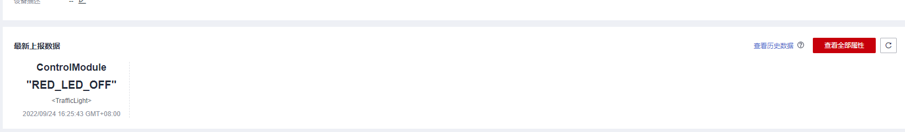

- 步骤24：在命令栏选择同步命令下发，选择创建的命令，然后根据代码设置的下发参数，发送对应指令，可以看到小车红色LED亮灭。

    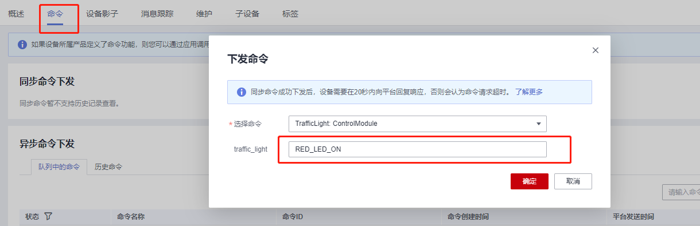
### 5.6.5 实验结果

* 1.数据上报云端：打开串口工具，使用串口工具连接好小车的串口，按一下开发板的RESET按键复位开发板，根据按不同按键控制红色灯亮灭，实时上报数据，同时可以从串口工具看到：

    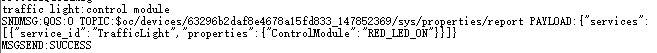

* 2.云端下发指令给小车：打开串口工具，使用串口工具连接好小车的串口，按一下开发板的RESET按键复位开发板，根据下发不同指令实现红色灯亮灭，并将最新数据上报到云端，同时可以从串口工具看到：

    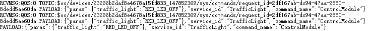

### 5.6.6 扩展实验

* 1.通过华为云实现小车实时上报电量信息，陀螺仪数据。

    提示：参考单I2C轮询实验。

# 附录

## 6.1 T1 IoT一体化开发套件的组装完整图

###                                  

## 6.2 IOT一体化 IO口功能关系表

| pin name | 功能1                                                       | 硬件配置说明                        | 功能2           | 硬件配置说明               | 功能3         | 硬件配置说明      |
| :------: | ----------------------------------------------------------- | :---------------------------------- | --------------- | -------------------------- | ------------- | ----------------- |
|  GPIO 0  | 串口通信UART1_TX                                            | 串口C44，需J7跳帽跳至GPIO 0 - TX    | 左侧编码器A相   | 需J7跳帽跳至GPIO 0 - C2A   | /             | /                 |
|  GPIO 1  | 串口通信UART1_RX                                            | 串口C44，需J8跳帽跳至GPIO 1 - RX    | 右侧编码器A相   | 需J8跳帽跳至GPIO 1 - C2B   | /             | /                 |
|  GPIO 2  | 舵机                                                        | GPIO模拟PWM，调节占空比舵机转动     | /               | /                          | /             | /                 |
|  GPIO 3  | UART0_LOG_TX                                                | 烧录调试串口，空闲为高              | /               | /                          | /             | /                 |
|  GPIO 4  | UART0_LOG_RX                                                | 烧录调试串口，空闲为高              | /               | /                          | /             | /                 |
|  GPIO 5  | 左侧电机调速B相                                             | 置1前进                             | 黄色交通灯      | 置1亮，置0灭               | /             | /                 |
|  GPIO 6  | 左侧电机调速A相                                             | 置1后退                             | /               | /                          | /             | /                 |
|  GPIO 7  | 超声波TRIG                                                  | 置1时输出TRIG高电平，J6跳帽跳至TRIG | 右红外管ADC测距 | 需J13跳线帽跳至GPIO 7-RIN  | 右侧编码器B相 | 需J6跳线帽跳至C1A |
|  GPIO 8  | 超声波ECHO                                                  | 接收超声波发送返回数据              | /               | /                          | /             | /                 |
|  GPIO 9  | 右侧电机调速B相                                             | 置1前进                             | 红色交通灯      | 置1亮，置0灭               | /             | /                 |
| GPIO 10  | 右侧电机调速A相                                             | 置1后退                             | 绿色交通灯      | 置1亮，置0灭               | /             | /                 |
| GPIO 12  | 蜂鸣器鸣响                                                  | 置1响,J5跳至GPIO12-PWM3             | 左红外管ADC测距 | 需J12跳线帽跳至GPIO 12-LIN | 左侧编码器B相 | 需J5跳帽跳至C2B   |
| GPIO 13  | OLED、PCA9555、CW2015CTCC、LSM6DSMTR、FM11NT081DI、INS5699S | I2C0_SDA，I2C数据线                 | /               | /                          | /             | /                 |
| GPIO 14  | OLED、PCA9555、CW2015CTCC、LSM6DSMTR、FM11NT081DI、INS5699S | I2C_SCL，I2C时钟线                  | /               | /                          | /             | /                 |

## 6.3 Hi3861V100 扩展IO口功能表

| name        | 配置说明                         | 备注                 |
| ----------- | -------------------------------- | -------------------- |
| IR_L        | 左红外管测距接收                 |                      |
| IR_R        | 右红外管测距接收                 |                      |
| FUNC0_KEY   | 按键S3                           |                      |
| FUNC1_KEY   | 按键S2                           |                      |
| FUNC2_KEY   | 按键S1                           |                      |
| INT_RTC     | RTC中断输入，默认高，低有效      | 无特殊场景可不用配置 |
| INT_NFC     | NFC中断输入，默认高，低有效      | 无特殊场景可不用配置 |
| INT_CW2015  | 电池电量中断输入，默认高，低有效 | 无特殊场景可不用配置 |
| OUT0R_RED   | 右车红灯，置1亮                  |                      |
| OUT1R_GREEN | 右车绿灯，置1亮                  |                      |
| OUT2R_BLUE  | 右车蓝灯，置1亮                  |                      |
| OUT3L_RED   | 左车红灯，置1亮                  |                      |
| OUT4L_GREEN | 左车绿灯，置1亮                  |                      |
| OUT5L_BLUE  | 左车蓝灯，置1亮                  |                      |
| CS_NFC      | NFC_CS脚，默认低                 |                      |
| OUT7_EXTIO  | 空闲，外接扩展GPIO引出           | 无特殊场景可不用配置 |

## 6.4 Hi3861V100 IO口复用关系表

| pin name | F.0          | F.1       | F.2          | F.3  | F.4      | F.5         | F.6         | F.7  | F.8      |
| -------- | ------------ | --------- | ------------ | ---- | -------- | ----------- | ----------- | ---- | -------- |
| GPIO 0   | GPIO 0       | UART1_TXD | SPI1_CLK     | PWM3 | I2C1_SDA | RTC_OSC_32K | RTC32K_XOUT | /    | /        |
| GPIO 1   | GPIO 1       | UART1_RXD | SPI1_RXD     | PWM4 | I2C1_SCL | /           | RTC32K_XINT | /    | /        |
| GPIO 2   | GPIO 2       | UART1_RTS | SPI1_TXD     | PWM2 | /        | SSI_CLK     | /           | /    | /        |
| GPIO 3   | UART0_LOG_TX | UART1_CTS | SPI1_CS1     | PWM5 | I2C1_SDA | SSI_DATA    | GPIO 3      | /    | /        |
| GPIO 4   | UART0_LOG_RX | /         | /            | PWM1 | I2C1_SCL | /           | GPIO 4      | ADC1 | /        |
| GPIO 5   | UART1_RXD    | GPIO 5    | I2S0_MCK     | PWM2 | /        | BT_STATUS   | SPI0_CS1    | ADC2 | /        |
| GPIO 6   | UART1_TXD    | GPIO 6    | I2S0_TX      | PWM3 | /        | COEX_SWITH  | SPI0_CLK    | /    | /        |
| GPIO 7   | UART1_CTS    | GPIO 7    | I2S0_CLK     | PWM0 | /        | BT_ACTIVE   | SPI0_RXD    | ADC3 | /        |
| GPIO 8   | UART1-RTS    | GPIO 8    | I2S0_WS      | PWM1 | /        | WLAN_ACTIVE | SPIO_TXD    | /    | /        |
| GPIO 9   | GPIO 9       | UART2_RTS | SPI0_TXD     | PWM0 | I2C0_SCL | I2S0_MCK    | SDIO_D2     | ADC4 | /        |
| GPIO 10  | GPIO 10      | UATR2_CTS | SPI0_CLK     | PWM1 | I2C0_SDA | I2S0_TX     | SDIO_D3     | /    | /        |
| GPIO 11  | GPIO 11      | UART2_TXD | SPI0_RXD     | PWM2 | /        | I2S0_RX     | SDIO_CMD    | ADC5 | /        |
| GPIO 12  | GPIO 12      | UART2_RXD | SPI0_CS1     | PWM3 | /        | I2S0_CLK    | SDIO_CLK    | ADC0 | /        |
| GPIO 13  | GPIO 13      | UART2_RTS | UART0_LOG_TX | PWM4 | I2C0_SDA | I2S0_WS     | SDIO_D0     | ADC6 | SSI_DATA |
| GPIO 14  | GPIO 14      | UART2_CTS | UART0_LOG_RX | PWM5 | I2C0_SCL | /           | SDIO_D1     | /    | SSI_CLK  |


## 6.5 理论参考
物联网技术及应用理论课PPT（点击该链接，注册华为账号登录后，点击学习，即可看到PPT）:https://developer.huawei.com/consumer/cn/training/course/mooc/C101641968823265204?refresh=1669428623989 

物联网技术及应用理论课视频(点击该链接，注册华为账号登录后，点击课程目录，即可看到视频)：https://developer.huawei.com/consumer/cn/training/course/introduction/C101641968823265204