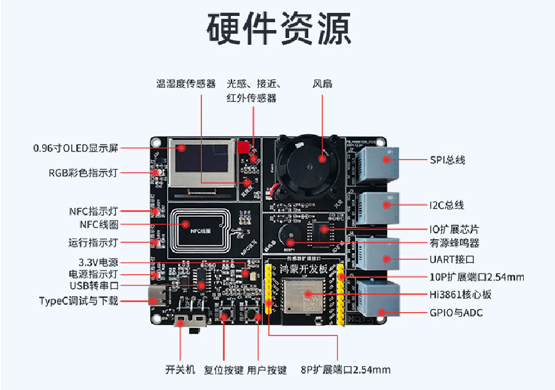
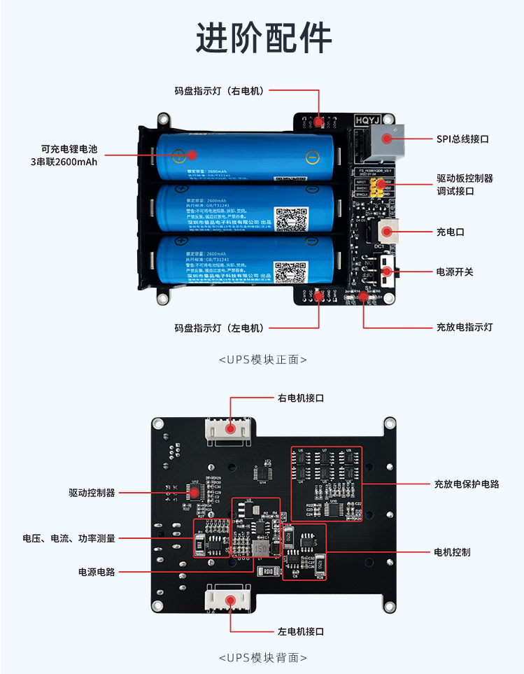

# 一、华清远见FS-Hi3861开发板介绍

华清远见FS-Hi3861开发套件，支持OpenHarmony系统。Hi3861芯片内置WiFi功能，开发板板载资料丰富，包括传感器、执行器、NFC、显示屏等等。还有丰富的扩展模块，可学习鸿蒙操作系统的各类实验，包括系统试验、传感器实验、网络实验、华为云实验。并且有多种物联网实战应用项目，可以帮助学员系统性学习鸿蒙设备开发及物联网开发。

点击进入淘宝官方网站链接进行购买：[ 淘宝官方网站 ](https://item.taobao.com/item.htm?id=669997023604&amp;ali_refid=a3_430582_1006:1336420189:N:0zNAf4A%2FPyF2hM5tb8SJpA%3D%3D:81c63a1bf9858746d12fb78e66cd24e7&amp;ali_trackid=1_81c63a1bf9858746d12fb78e66cd24e7&amp;spm=a21n57.1.0.0#detail )

华清远见Hi3861鸿蒙开发板全套资料，包括教程、源码、项目、视频课程等：

[ http://wiki.farsightdev.com/index.php?title=华清远见Hi3861鸿蒙开发板 ](http://wiki.farsightdev.com/index.php?title=华清远见Hi3861鸿蒙开发板)

# 二、硬件资源介绍

## 1.1 开发板硬件资源

| 硬件资源   | 资源描述                                                     |
| ---------- | ------------------------------------------------------------ |
| 主控模组   | Hi3861芯片集成高性能32bit微处理器; 支持20MHz标准带宽和5MHz/10MHz窄带宽，提供最大72.2Mbit/s物理层速率; 支持OpenHarmony系统和第三方组件。 |
| 电源输入   | Type-C供电接口(支持DC-5V)，RJ12接口具备DC-5V输出功能。       |
| 显示组件   | I2C总线接口，0.96寸OLED显示屏，分辨率为128*64，带金属保护罩。 |
| NFC通信    | 符合NFC forum type-2 tag标准，64字节SRAM易失性存储器。       |
| I2C端口    | 1路I2C总线，通过RJ12与排针引出。                             |
| SPI端口    | 1路SPI总线，通过RJ12与排针引出。                             |
| UART端口   | 1路UART总线，通过RJ12与排针引出。                            |
| ADC/IO端口 | 2路ADC，2路IO接口，通过RJ12与排针引出。                      |
| 传感器资源 | 1个空气温湿度传感器+（光强、红外、接近）三和一传感器AP3216C  |
| 指示灯     | 1个电源指示灯、1个运行指示灯、1个NFC指示灯、1路RGB彩灯       |
| 控制设备   | 1个有源蜂鸣器，1个风扇                                       |
| 输入按钮   | 1个系统复位按键，1个用户自定义按键                           |
| 程序下载   | 通过USB Type-C接口，板载USB转UART电路                        |
| 板子尺寸   | 100mm*80mm                                                   |

## 1.2 进阶配件 UPS模块（可选配）

进阶套件的产品特点如下所示：

- 通过UART总线通信方式获取数据。
- 实时测量电压、电流、功率等电池电量参数，用于实时监测模块工作状态。
- 板载锂电池充放电指示灯，锂电池防护电路具有防过充、放过放、放过流和短路保护功能。
- 板载2路大电流全桥直流电机驱动器，具有电流保护、电机引脚接地短路保护、带时延的过热关机、VBB欠压监视以及交叉电流保护等。
- 板载电机运转指示灯与编码器读取电路。
- 板载3节18650锂电池，2600mAh可保持主控长时间待机。
- 板载5V稳压器，可达2.5A连续输出电流。
- 板载3.3V线性稳压器，为底板数字电路提供稳定电源。

# 二、快速上手（十分钟上手）

请点击链接查看[《华清远见FS_Hi3861新手入门手册.md》](https://gitee.com/HiSpark/hi3861_hdu_iot_application/blob/master/src/vendor/hqyj/fs_hi3861/doc/%E5%8D%8E%E6%B8%85%E8%BF%9C%E8%A7%81%20FS_Hi3861%E6%96%B0%E6%89%8B%E5%85%A5%E9%97%A8%E6%89%8B%E5%86%8C.md)。

# 三、华清远见FS-Hi3861开发板 案例开发

请点击链接查看[《HarmonyOS开发板实验指导书 v2.1.pdf》](https://gitee.com/HiSpark/hi3861_hdu_iot_application/blob/master/src/vendor/hqyj/fs_hi3861/doc/HarmonyOS%E5%BC%80%E5%8F%91%E6%9D%BF%E5%AE%9E%E9%AA%8C%E6%8C%87%E5%AF%BC%E4%B9%A6%20v2.1.pdf)。

我们提供了30多个实验内容，其中包含内核实验、基础外设实验、网络实验、云实验和综合项目，具体内容如下所示：

| 编号 | 类别   | 例程路径       | 说明                                                         |
| ---- | ------ | ---------------- | ------------------------------------------------------------ |
| 1   | 内核   | [demo/kernel_01_task/kernel_task_example](https://gitee.com/HiSpark/hi3861_hdu_iot_application/tree/master/src/vendor/hqyj/fs_hi3861/demo/kernel_01_task) |  任务实验  |
| 2   | 内核   | [demo/kernel_02_timer/kernel_timer_example](https://gitee.com/HiSpark/hi3861_hdu_iot_application/tree/master/src/vendor/hqyj/fs_hi3861/demo/kernel_02_timer) |  定时器实验                                                 |
| 3   | 内核   | [demo/kernel_03_event/kernel_event_example](https://gitee.com/HiSpark/hi3861_hdu_iot_application/tree/master/src/vendor/hqyj/fs_hi3861/demo/kernel_03_event) | 事件实验              |
| 4   | 内核   | [demo/kernel_04_mutex/kernel_mutex_example](https://gitee.com/HiSpark/hi3861_hdu_iot_application/tree/master/src/vendor/hqyj/fs_hi3861/demo/kernel_04_mutex) | 互斥锁实验 |
| 5   | 内核   | [demo/kernel_05_mutex_semaphore/kernel_mutex_semaphore_example](https://gitee.com/HiSpark/hi3861_hdu_iot_application/tree/master/src/vendor/hqyj/fs_hi3861/demo/kernel_05_mutex_semaphore) | 互斥型信号量实验      |
| 6   | 内核   | [demo/kernel_06_sync_semaphore/kernel_sync_semaphore_example](https://gitee.com/HiSpark/hi3861_hdu_iot_application/tree/master/src/vendor/hqyj/fs_hi3861/demo/kernel_06_sync_semaphore) | 同步型信号量实验 |
| 7  | 内核 | [demo/kernel_07_count_semaphore/kernel_count_semaphore_example](https://gitee.com/HiSpark/hi3861_hdu_iot_application/tree/master/src/vendor/hqyj/fs_hi3861/demo/kernel_07_count_semaphore) | 计数型信号量实验 |
| 8   | 内核   | [demo/kernel_08_message_queue/kernel_message_queue_example](https://gitee.com/HiSpark/hi3861_hdu_iot_application/tree/master/src/vendor/hqyj/fs_hi3861/demo/kernel_08_message_queue) | 消息队列实验          |
| 9 | 基础   | [demo/base_01_key/base_key_example](https://gitee.com/HiSpark/hi3861_hdu_iot_application/tree/master/src/vendor/hqyj/fs_hi3861/demo/base_01_key) | KEY按键实验           |
| 10 | 基础   | [ demo/base_02_i2c_pcf8574_fan/base_fan_example](https://gitee.com/HiSpark/hi3861_hdu_iot_application/tree/master/src/vendor/hqyj/fs_hi3861/demo/base_02_i2c_pcf8574_fan) | 驱动风扇实验 |
| 11 | 基础   | [demo/base_03_i2c_pcf8574_buzzer/base_buzzer_example](https://gitee.com/HiSpark/hi3861_hdu_iot_application/tree/master/src/vendor/hqyj/fs_hi3861/demo/base_03_i2c_pcf8574_buzzer) | 驱动蜂鸣器实验        |
| 12 | 基础   | [demo/base_04_i2c_pcf8574_led/base_led_example](https://gitee.com/HiSpark/hi3861_hdu_iot_application/tree/master/src/vendor/hqyj/fs_hi3861/demo/base_04_i2c_pcf8574_led) | 驱动LED灯实验         |
| 13   | 基础   | [demo/base_05_i2c_aw2013/base_aw2013_example](https://gitee.com/HiSpark/hi3861_hdu_iot_application/tree/master/src/vendor/hqyj/fs_hi3861/demo/base_05_i2c_aw2013) | RGB灯实验             |
| 14   | 基础   | [demo/base_06_i2c_sht20/base_sht20_example](https://gitee.com/HiSpark/hi3861_hdu_iot_application/tree/master/src/vendor/hqyj/fs_hi3861/demo/base_06_i2c_sht20) | 温湿度传感器实验      |
| 15   | 基础   | [demo/base_07_i2c_ap3216c/base_ap3216c_example](https://gitee.com/HiSpark/hi3861_hdu_iot_application/tree/master/src/vendor/hqyj/fs_hi3861/demo/base_07_i2c_ap3216c) | 三合一传感器实验      |
| 16   | 基础   | [demo/base_08_i2c_ssd1306/base_ssd1306_example](https://gitee.com/HiSpark/hi3861_hdu_iot_application/tree/master/src/vendor/hqyj/fs_hi3861/demo/base_08_i2c_ssd1306) | OLED显示屏实验        |
| 17   | 基础   | [demo/base_09_i2c_nfc/base_nfc_example](https://gitee.com/HiSpark/hi3861_hdu_iot_application/tree/master/src/vendor/hqyj/fs_hi3861/demo/base_09_i2c_nfc) | NFC实验               |
| 18   | 网络   | [demo/network_01_wifi_ap/network_wifi_ap_example](https://gitee.com/HiSpark/hi3861_hdu_iot_application/tree/master/src/vendor/hqyj/fs_hi3861/demo/network_01_wifi_ap) | 建立网络实验          |
| 19   | 网络   | [demo/network_02_wifi_sta/network_wifi_sta_example](https://gitee.com/HiSpark/hi3861_hdu_iot_application/tree/master/src/vendor/hqyj/fs_hi3861/demo/network_02_wifi_sta) | 连接网络实验          |
| 20   | 网络   | [demo/network_03_wifi_udp/network_wifi_udp_example](https://gitee.com/HiSpark/hi3861_hdu_iot_application/tree/master/src/vendor/hqyj/fs_hi3861/demo/network_03_wifi_udp) | UDP通信实验           |
| 21   | 网络   | [demo/network_04_wifi_tcp/network_wifi_tcp_example](https://gitee.com/HiSpark/hi3861_hdu_iot_application/tree/master/src/vendor/hqyj/fs_hi3861/demo/network_04_wifi_tcp) | TCP通信实验           |
| 22   | 网络   | [demo/network_05_wifi_mqtt/network_wifi_mqtt_example](https://gitee.com/HiSpark/hi3861_hdu_iot_application/tree/master/src/vendor/hqyj/fs_hi3861/demo/network_05_wifi_mqtt) | MQTT通信实验          |
| 23   | 网络   | [demo/network_06_wifi_nfc_sta/network_wifi_nfc_example](https://gitee.com/HiSpark/hi3861_hdu_iot_application/tree/master/src/vendor/hqyj/fs_hi3861/demo/network_06_wifi_nfc_sta) | NFC配网实验           |
| 24   | 华为云 | [demo/cloud_01_HuaWei_IoTDA/cloud_huawei_iotda_example](https://gitee.com/HiSpark/hi3861_hdu_iot_application/tree/master/src/vendor/hqyj/fs_hi3861/demo/cloud_01_HuaWei_IoTDA) | 华为IoTDA设备接入实验 |
| 25   | 项目   | [demo/test_board/test_board_example](https://gitee.com/HiSpark/hi3861_hdu_iot_application/tree/master/src/vendor/hqyj/fs_hi3861/demo/test_board) | 开发板综合测试        |
| 26   | 项目   | [demo/smartTemp/smartTemp_demo](https://gitee.com/HiSpark/hi3861_hdu_iot_application/tree/master/src/vendor/hqyj/fs_hi3861/demo/smartTemp) | 智能温度计            |
| 27   | 项目   | [ demo/smartDistance/smartDistance_demo](https://gitee.com/HiSpark/hi3861_hdu_iot_application/tree/master/src/vendor/hqyj/fs_hi3861/demo/smartDistance) | 智能测距仪            |
| 28   | 项目   | [demo/ReversingRadar/ReversingRadar_demo](https://gitee.com/HiSpark/hi3861_hdu_iot_application/tree/master/src/vendor/hqyj/fs_hi3861/demo/ReversingRadar) | 倒车雷达              |
| 29   | 项目   | [demo/smartLamp/smartLamp_demo](https://gitee.com/HiSpark/hi3861_hdu_iot_application/tree/master/src/vendor/hqyj/fs_hi3861/demo/smartLamp) | 智能照明灯            |
|30|项目|[demo/smartFarm/smartFarm_demo](https://gitee.com/HiSpark/hi3861_hdu_iot_application/tree/master/src/vendor/hqyj/fs_hi3861/demo/smartFarm)|智慧农业|
|31|项目|[demo/smartCar_uart_udp/smartCar_demo](https://gitee.com/HiSpark/hi3861_hdu_iot_application/tree/master/src/vendor/hqyj/fs_hi3861/demo/smartCar_uart_udp)|智能小车|
|32|项目|[demo/smartSecurityDefense/smartSecurityDefense_demo](https://gitee.com/HiSpark/hi3861_hdu_iot_application/tree/master/src/vendor/hqyj/fs_hi3861/demo/smartSecurityDefense)|智慧安防报警|

