# 一、开发环境搭建

## 1.1 工具软件介绍

HUAWEI DevEco Device Tool（以下简称DevEco Device Tool）是OpenHarmony面向智能设备开发者提供的一站式集成开发环境，支持OpenHarmony的组件按需定制，支持代码编辑、编译、烧录和调试等功能，支持C/C++语言，以插件的形式部署在Visual Studio Code上。

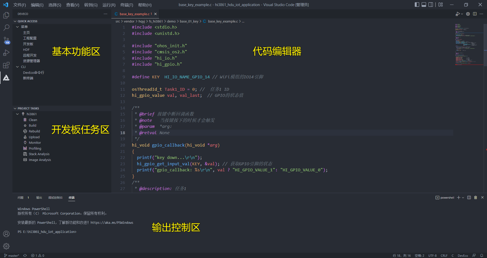

## 1.2 DecEco Device Tool下载和安装

1. 在官方网站上下载最新版本的工具(devicetool-windows-tool-xxxxx.zip)，下载网址：https://device.harmonyos.com/cn/develop/ide#download

   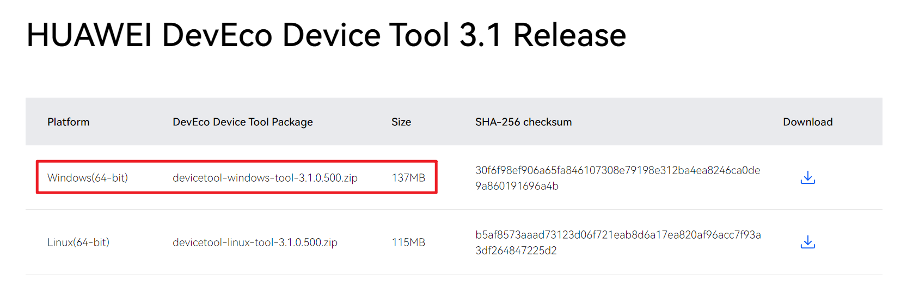

2. 解压DevEco Device Tool压缩包，双击安装包程序，点击"下一步"进行安装（如果之前有安装过，会弹出先卸载之前版本在安装，请按照要求先卸载）；

   

3. 设置DevEco Device Tool的安装路径，请注意安路径不能包含中文字符，同时建议不要安装到C盘目录，点击"下一步"。

   

4. 根据安装向导提示，安装依赖软件python以及vscode，显示OK后，点击安装。

   

5. 等待DevEco Device Tool安装向导自动安装DevEco Device Tool插件，直至安装完成，点击"完成",关闭DevEco Device Tool安装向导。

   

6. 打开Visual Studio Code，进入DevEco Decive Tool工具界面。

   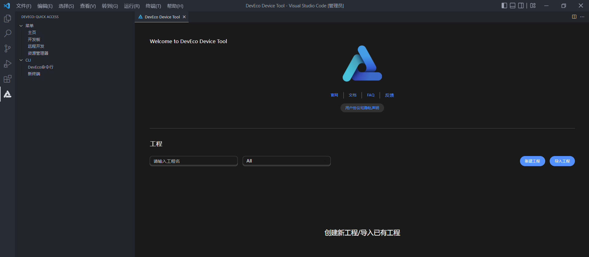

7. 下载简体中文语言包，用户可以在VSCode工具商店安装"chinese(Simplified)(简体中文)"插件，将VSCode设置为中文模式。

   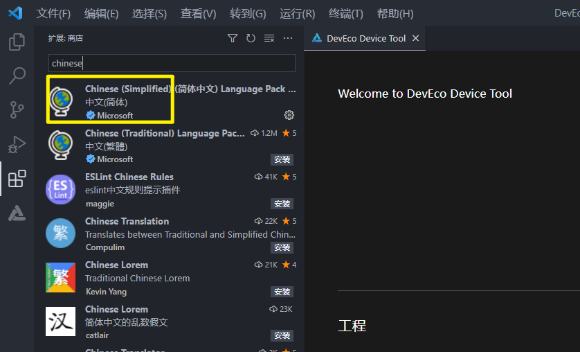

## 1.3 SDK下载

下载Hi3861 Openharmony SDK下载网址：https://gitee.com/HiSpark/hi3861_hdu_iot_application

<font color='RedOrange'>**注意：由于windows自身限制，路径不能超过260个字符，在git下载和解压Hi3861 SDK代码时尽量放在D盘或者其他盘根目录下，防止导致的编译错误问题。**</font>

下载方式有两种：

- 方式一：直接在web页面上下载zip压缩包。

  

- 方式二：如果用户已经安装git工具（git工具安装和使用请自行百度），可以通过git clone命令下载，命令如下：

  ```bash
  git clone https://gitee.com/HiSpark/hi3861_hdu_iot_application.git
  ```

  

## 1.4 开发工具下载

* 开发工具下载网址：https://hispark.obs.cn-east-3.myhuaweicloud.com/DevTools_Hi3861V100_v1.0.zip

  

* 下载完成后解压，解压完成后的文件目录结构如下所示：

  

## 1.5 导入工程

1. 打开VSCode，打开DevEco Device Tool主页，点击“导入工程”。

   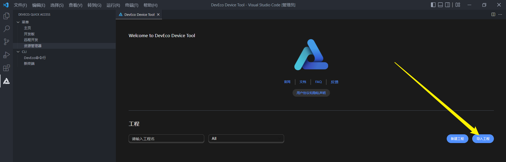

2. 在导入工程弹窗中选择Hi3861 SDK目录，点击“导入”。（如果采用zip包下载，SDK名称为hi3861_hdu_iot_application-master，如果采用git下载SDK名称为hi3861_hdu_iot_application，此处以采用git下载为例）

   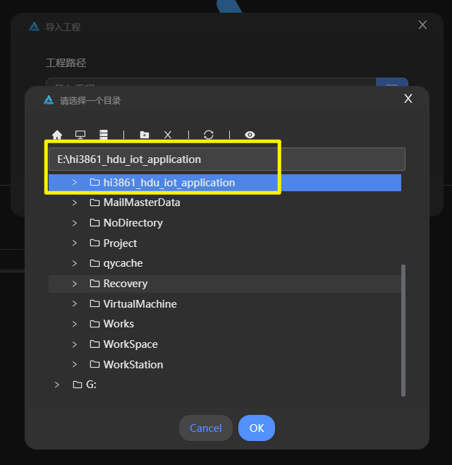

3. 在后续导入工程弹窗，SOC栏选择Hi3861，开发板栏选择hi3861，框架栏选择hb，之后点击“导入”，等待导入成功即可。
	
	 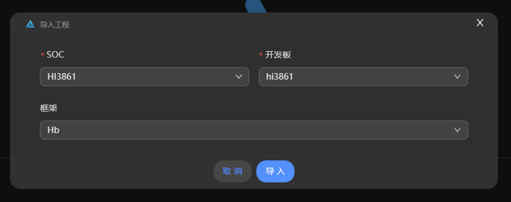
	
4. 代码导入成功后，即工程创建成功，之后可使用该IDE 实现代码开发、一键编译、一键烧写等功能。

    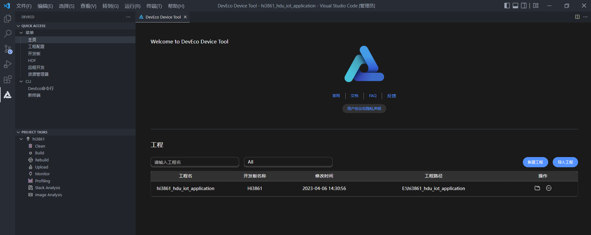

5. 代码导入成功后，后续可在DevEco Device Tool工具主页直接打开已导入成功的工程。

    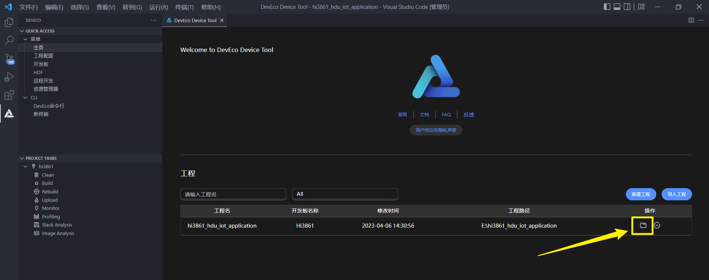

## 1.6 配置开发工具

1. 配置开发工具路径，点击左侧的“工程配置”，选中“请选择自定义工具包”。

   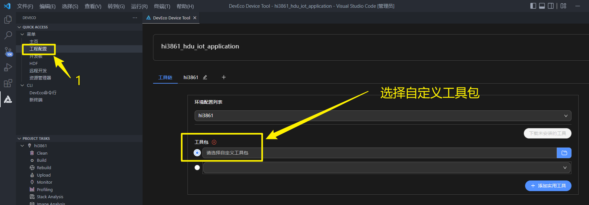

2. 然后在右侧窗口中找到“hi3861”，找到“compiler_bin_path”，选择到之前下载的开发工具。

   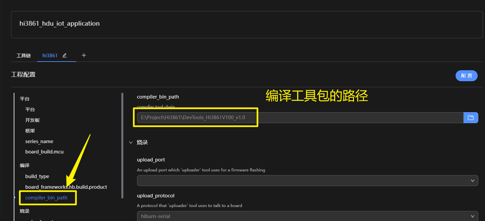

# 二、配置产品

1. 配置完成之后，点击左侧窗口中的“DevEco命令行”。

   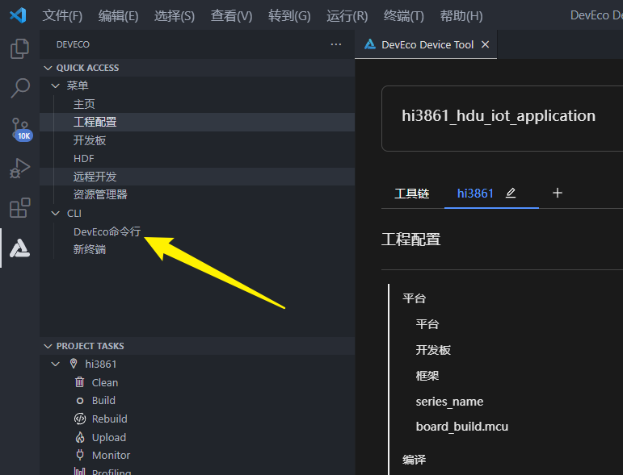

2. 此时会弹出一个终端窗口。

   

3. 在终端窗口中输入命令：

   ```bash
   cd src
   hb set
   ```

   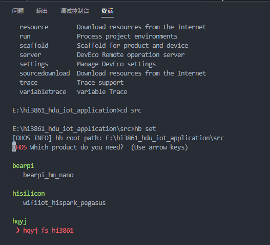

4. 使用上下左右方向键选择“hqyj_fs_hi3861”开发板，然后敲下回车按键。

   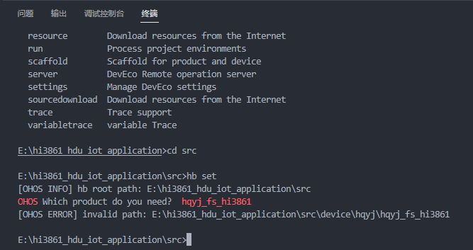

5. 在src/applications/sample/wifi-iot/BUILD.gn文件中，修改features，如下所示：

   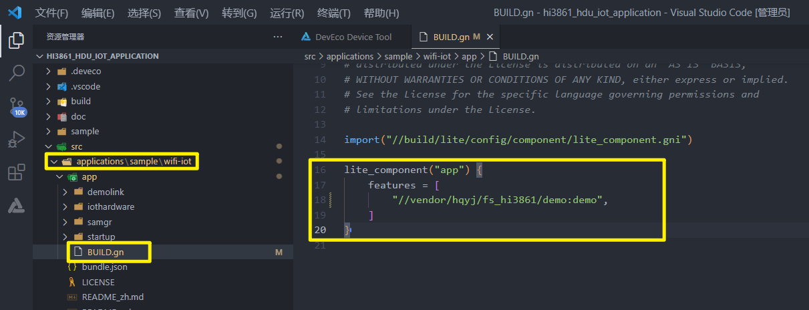

   ```c
   import("//build/lite/config/component/lite_component.gni")
   
   lite_component("app") {
       features = [
           "//vendor/hqyj/fs_hi3861/demo:demo",
       ]
   }
   ```
   
6. 修改 vendor/hqyj/fs_hi3861/demo/BUILD.gn，根据需要编译对应的示例程序：

   ```c
   # Copyright (c) 2020, HiHope Community.
   # Licensed under the Apache License, Version 2.0 (the "License");
   # you may not use this file except in compliance with the License.
   # You may obtain a copy of the License at
   #
   #     http://www.apache.org/licenses/LICENSE-2.0
   #
   # Unless required by applicable law or agreed to in writing, software
   # distributed under the License is distributed on an "AS IS" BASIS,
   # WITHOUT WARRANTIES OR CONDITIONS OF ANY KIND, either express or implied.
   # See the License for the specific language governing permissions and
   # limitations under the License.
   
   import("//build/lite/config/component/lite_component.gni")
   
   lite_component("demo") {
     features = [
       "base_01_key:base_key_example",
       # "base_02_i2c_pcf8574_fan:base_fan_example",
       # "base_03_i2c_pcf8574_buzzer:base_buzzer_example",
       # "base_04_i2c_pcf8574_led:base_led_example",
       # "base_05_i2c_aw2013:base_aw2013_example",
       # "base_06_i2c_sht20:base_sht20_example",
       # "base_07_i2c_ap3216c:base_ap3216c_example",
       # "base_08_i2c_ssd1306:base_ssd1306_example",
       # "base_09_i2c_nfc:base_nfc_example",
       # "kernel_01_task:kernel_task_example",
       # "kernel_02_timer:kernel_timer_example",
       # "kernel_03_event:kernel_event_example",
       # "kernel_04_mutex:kernel_mutex_example",
       # "kernel_05_mutex_semaphore:kernel_mutex_semaphore_example",
       # "kernel_06_sync_semaphore:kernel_sync_semaphore_example",
       # "kernel_07_count_semaphore:kernel_count_semaphore_example",
       # "kernel_08_message_queue:kernel_message_queue_example",
       # "network_01_wifi_ap:network_wifi_ap_example",
       # "network_02_wifi_sta:network_wifi_sta_example",
       # "network_03_wifi_udp:network_wifi_udp_example",
       # "network_04_wifi_tcp:network_wifi_tcp_example",
       # "network_05_wifi_mqtt:network_wifi_mqtt_example",
       # "network_06_wifi_nfc_sta:network_wifi_nfc_example",
       # "cloud_01_HuaWei_IoTDA:cloud_huawei_iotda_example",
       # "test_board:test_board_example",
       # "smartTemp:smartTemp_demo",
       # "smartDistance:smartDistance_demo",
       # "ReversingRadar:ReversingRadar_demo",
       # "smartLamp:smartLamp_demo",
       # "smartFarm:smartFarm_demo"
       # "smartCar_uart_udp:smartCar_demo",
   
       # "smartSecurityDefense:smartSecurityDefense_demo"
     ]
   }
   ```

   
# 三、编译工程
1. 配置完成后，点击左侧“Rebuild”，开始编译。

   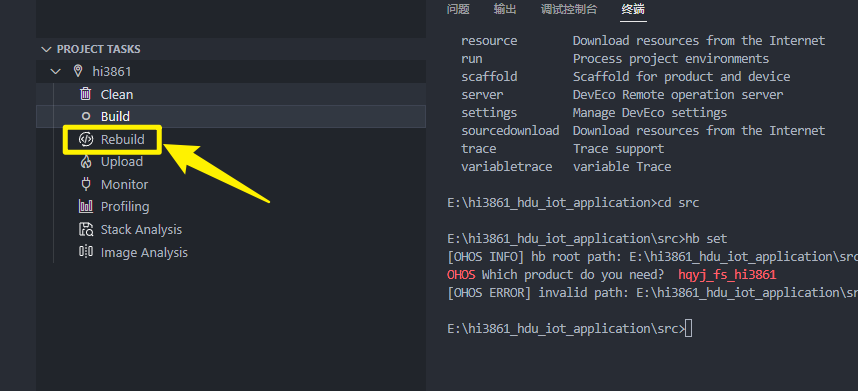

2. 初次编译会解压编译工具，时间较长。等待编译完成即可。

   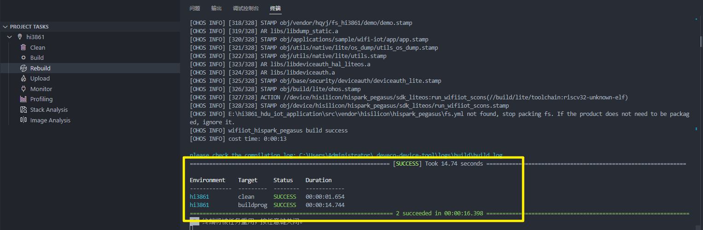

# 四、代码烧录

## 4.1 串口驱动安装

1. 先使用配套的Type-C数据线，将开发板与电脑的USB口进行直连。

2. 安装CH340G驱动，打开DevTools_Hi3861V100_v1.0/usb_serial_driver文件夹。

   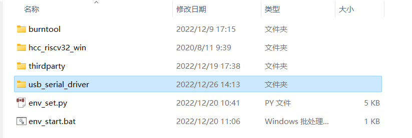

3. 双击CH341SER.EXE驱动，进入安装界面，点击安装按钮即可，驱动安装成功后，再点击确定按钮。

   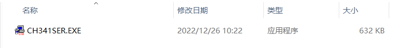

4. 安装驱动成功。

   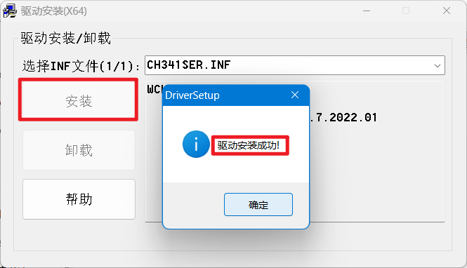

5. 打开Windows的设备管理器，查看串口设备，若未出现CH340串口设备，请检查驱动是否安装正常。

   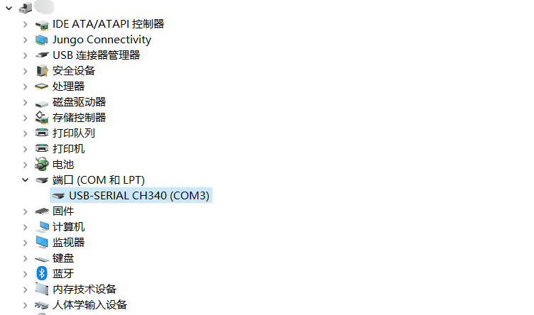

## 4.2 串口烧录

1. 当前DevEco Device Tool工具支持Hi3861单板一键烧录功能。需要连接开发板，配置开发板对应的串口，在编译结束后，进行烧录。点击左侧“工程配置”，找到“upload_port”选项，选择开发板对应的烧录串口（<font color='RedOrange'>**注意：如果正在使用Monitor功能，请先关闭Monitor，才能正常烧，否则串口占用无法烧录成功**</font>）。

   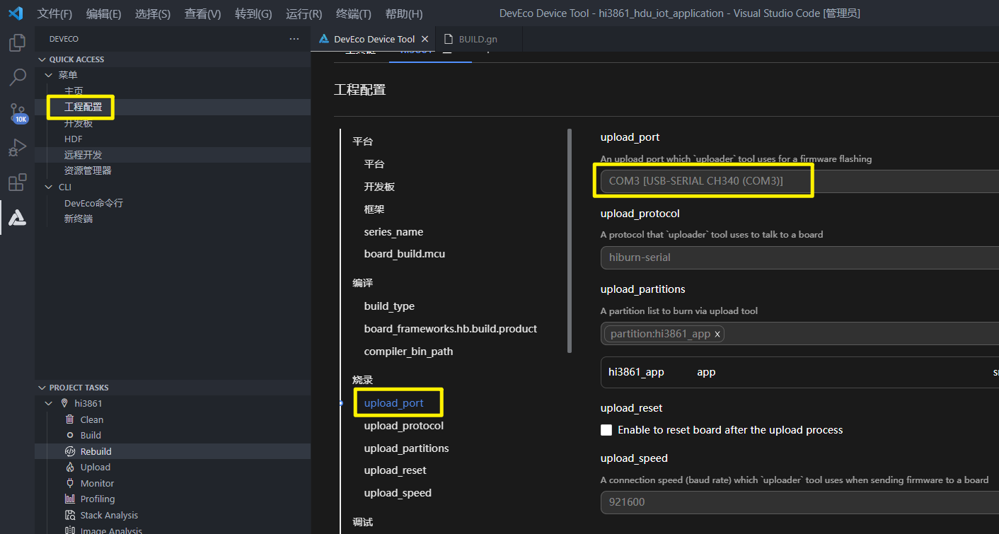

2. 点击左下角“upload”按键，等待提示（出现Connecting，please reset device...），手动进行开发板复位（按下开发板reset键）。

   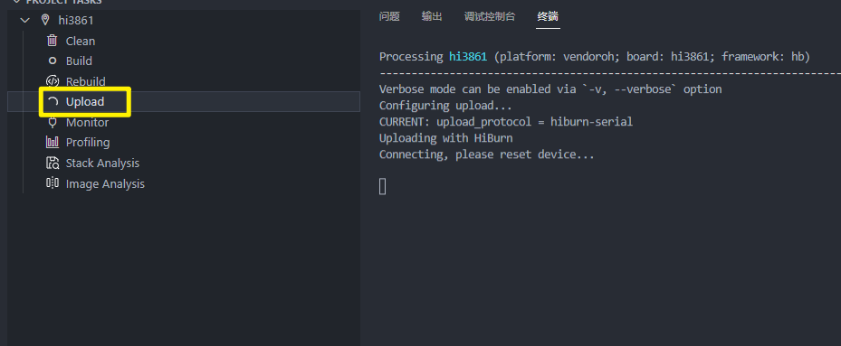

3. 等待烧录完成，大约30s左右，烧录成功。

   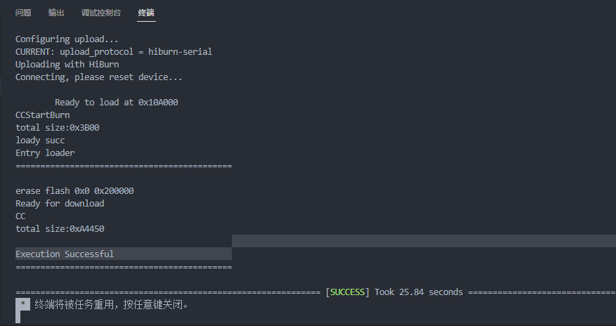

## 4.2 Monitor 串口打印

1. 烧录完成后，可以通过Monitor界面查看串口打印，配置Monitor串口，如下图所示。（<font color='RedOrange'>**注意：如果正在使用Monitor功能，请先关闭Monitor，才能正常烧录，否则串口占用无法烧录成功**</font>）

   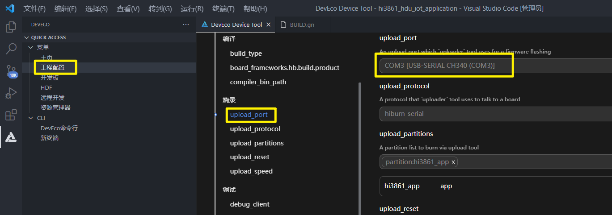

2. 配置完Monitor串口后，直接点击monitor按钮，复位开发板，查看开发板端的打印信息。

   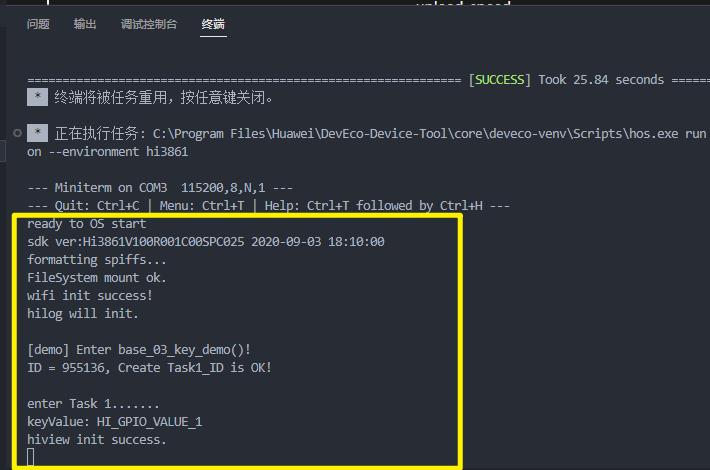

